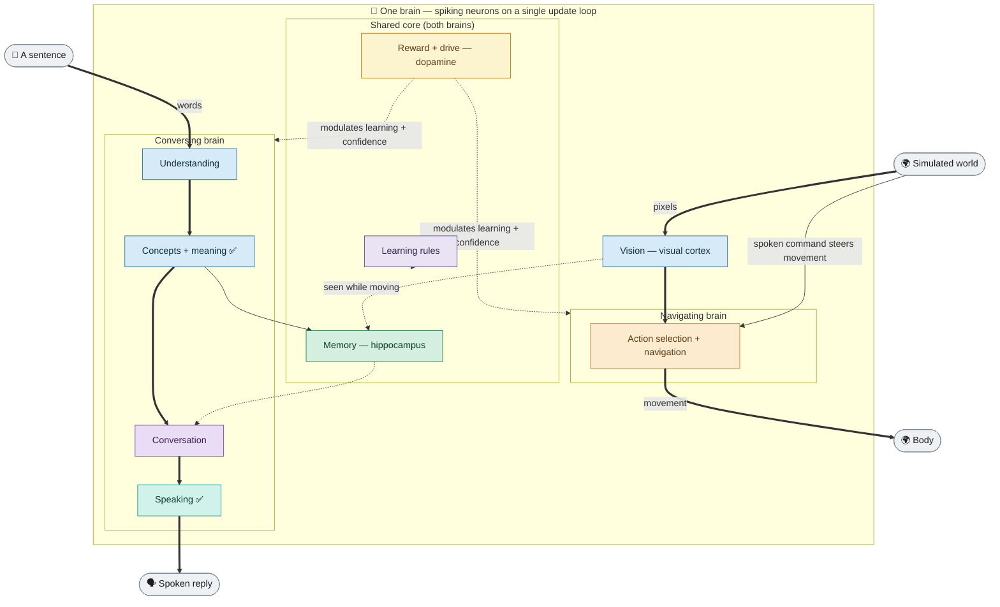

# Neural Simulator

**A GPU-accelerated simulator for biologically realistic spiking neural
networks — with a real-time 3D view of every neuron firing.**

It learns the way brains do: individual neurons fire in real time,
a dopamine-like reward signal reinforces successful actions, and connections
strengthen or weaken based on millisecond-precise spike timing. The core
runs on local biological rules — *not* backpropagation through a static
graph, no supervised labels, no symbolic optimizer.

The north-star: a *single* simulated brain that not only navigates a world
but learns to **converse genuinely** — reasoning to its own conclusions,
building an emotionally-colored model of the world, and developing a working
sense of what it does and doesn't know — with **every cognitive step done by
spiking neurons** rather than ordinary code. It is meant to be raised the way a
child is: first with a patient AI teacher, later through real interaction, with
that teacher gradually replaced by the brain's own circuitry. This is a
long-horizon research bet, pursued honestly — the project *builds and measures*
the functional hallmarks of attention, emotion, and self-awareness on the
spiking substrate, and is careful never to claim the brain actually *feels*
anything. Where the biology genuinely can't do something on this substrate, that
limit is measured and reported rather than papered over.

[](LICENSE)

%20%2F%20NumPy%20(CPU)-orange.svg)


*The simulated brain — one engine, two configurations (a **navigating** and a **conversing** brain) that share it, plus one memory and one dopamine core, joined by validated synaptic links:*



**Full flowcharts (GitHub-rendered, plain-language, kept current):**
[overview](docs/diagrams/brain_architecture_current.md) ·
[detailed diagrams — every region &amp; pathway](docs/diagrams/brain_architecture_detailed.md) ·
[development roadmap](ROADMAP.md)
&nbsp;·&nbsp; *(the earlier hand-drawn per-synapse [SVGs](docs/diagrams/brain_master.svg) are an archived 2026-06 snapshot, superseded by the detailed diagrams)*

**Jump to:** [What it is](#what-it-is) ·
[Roadmap](#️-roadmap--the-full-development-path) ·
[Key features](#key-features) ·
[Quick start](#quick-start) ·
[Architecture](#architecture) ·
[Project status](#project-status--research-direction) ·
[Glossary](#glossary) ·
[Docs](#documentation--further-reading)

---

## 🗺️ Roadmap — the full development path

**[`ROADMAP.md`](ROADMAP.md) is the plain-language source of truth for progress toward the goal** — a single simulated spiking brain that learns to converse genuinely and develops toward emotion and self-awareness, built the honest way: learning from experience, with no permanent external AI model doing the thinking. It's written to be read without knowing the codebase, and lays out the whole developmental path stage by stage — each mapped to the brain region/function it reproduces (with textbook and paper citations), a status, what's done, what's open, and the next step — plus the temporary stand-ins still to be replaced, the honest remaining walls, and a no-hype assessment of the distance left.
A deeper, engineer-level working plan (every faculty, each remaining wall, and the specific biological mechanism meant to get past it) lives in [`docs/plans/2026-07-23-MASTER-DEVELOPMENT-ROADMAP.md`](docs/plans/2026-07-23-MASTER-DEVELOPMENT-ROADMAP.md).

At a glance (see [`ROADMAP.md`](ROADMAP.md) for the plain-language detail and citations):

| Stage | Brain function it reproduces | Status |
|---|---|---|
| Perception | Retina → visual cortex edge detectors; what/where streams | 🟨 Partial |
| Attention & orienting | Superior colliculus "look here" map; arousal | 🟩 Done (orienting) |
| Action selection | Basal-ganglia go/no-go loops; evidence → commitment burst | 🟩 Done |
| Reward & value | Dopamine "actual minus expected" signal; one shared drive | 🟩 Done · 🟨 value critic |
| **Navigation & spatial cognition** | Place cells + goal-directed movement from perception alone | 🟩 **Done** (flagship behavior) |
| Memory | Hippocampal loop; memory tags; sleep replay (replaces backprop) | 🟩 Done · 🟧 deep consolidation |
| Concept formation | Concept hub; categories discovered from experience | ✅ **Emergent** |
| Comprehension | Dual-stream language; word-order → roles, learned, in spikes | ✅ **Emergent** · 🟧 deep nesting |
| Semantic reasoning | Inference (inheritance, transitivity) emerges from shared codes | ✅ **Emergent** |
| Production | Broca's area; self-taught grammar; every word spoken in spikes | ✅ **Emergent** · 🟧 open prose |
| Conversation | Working memory of who's-being-discussed; "I don't know" guard | ✅ **Emergent** · 🧩 fluent chat |
| Working memory & recursion | Persistent-activity slots; graded fading memory | 🟩 Done · 🟧 nesting depth |
| Artificial life | Develop over time; one merged brain; one drive; persistence | 🟩 Done (pieces) · 🟨 unified |
| Emotion & affect | Concepts learn an emotional "coloring"; mood/arousal neuromodulators | 🟨 First results |
| Self-model & metacognition | Reads + reports its own attention, confidence, and authorship | 🟨 First results |
| Curiosity | Turns "I don't know" into asking a teacher and learning | 🟨 First results |

Legend: ✅ emergent (learned from experience) · 🟩 done (with one hand-designed part) · 🟨 partial / first results · 🟧 a mapped limit · 🧩 temporary stand-in · ⬜ open. **The honest distance ahead:** open-ended fluent speech without the small conventional-AI crutch (its first home-grown rung has landed as a research result — an emergent, on-brain, no-backpropagation next-word model); a deeper learning rule to lift the remaining ceilings; and the newest chapter — genuine reasoning, an emotionally-colored world-model, a working self-model, and curiosity — now begun with first validated results (see below). A real, bounded, multi-month distance — not a demo away, and not blocked.
The roadmap also covers the body, supporting systems (cerebellum, sleep), the 3D viewer and interactive consoles, and future directions.

---

## What it is

This is a research platform for building brains out of simulated neurons.
Networks are made of biologically realistic model neurons that communicate
with discrete electrical pulses ("spikes") over time, the way real neurons
do — not the continuous numbers used in mainstream machine learning. The
computation runs in parallel on an NVIDIA graphics card (via CUDA and the
CuPy array library), or on an ordinary CPU when no GPU is available. An
optional real-time 3D view shows every neuron firing and every synapse
pulsing as the network learns.

The project asks a single question: **how much of intelligence emerges from
biological rules alone?** Instead of gradient descent — the powerful but
biologically implausible optimizer behind modern AI — it uses only local
learning rules that real brains plausibly use: "neurons that fire together
wire together" (Hebb 1949), refined by dopamine-driven reward (Schultz
1998). It is a working platform *and* an active research program: the
simulation engine, brain-region framework, and navigation agent are mature
and demonstrated, while a small neuron-built conversational agent is a
growing capability with validated core behaviors.

It is **not** a large language model and does not try to match one for raw
fluency. Its aim is different, and in some ways harder: a brain that reasons to
its own conclusions, colors what it knows with emotion, and develops a working
sense of what it does and doesn't know — a memory-and-reasoning system that is
continual (it keeps learning without forgetting), trustworthy (it can tell when
it doesn't know something, and is learning to get *curious* about it rather than
bluff), and self-contained (after training it runs entirely on local hardware
with no external model). The longer-range wager is the *emergentist* one — that
mind emerges from emulating a brain completely and faithfully enough — so the
work is measured by the faithfulness of the biology, and every claim about
"self-awareness" or "emotion" here means a *measured functional correlate*,
never an assertion that the brain has inner experience.

**Who might find it useful:**

| If you are a… | You'll care that… |
|---|---|
| **Software developer** | It's a scriptable Python engine: dozens of composable brain-region profiles, sparse GPU kernels, a YAML-driven experiment runner, a web dashboard, and a NumPy fallback that runs with no GPU at all. |
| **Computational neuroscientist** | Neurons use published models (Izhikevich, Hodgkin–Huxley, adaptive exponential integrate-and-fire); learning reproduces measured timing curves (Bi & Poo 1998); regions, pathways, and neuromodulators are declared as data, not hand-wired — and results are validated across multiple random seeds with controls against accidental success. |
| **Biologist** | Mechanisms are grounded in *Principles of Neural Science* (Kandel, 6th ed.) plus a dozen specialty texts, explained in plain language — see [`docs/biology.md`](docs/biology.md). |
| **Curious reader** | You can watch a virtual brain learn to navigate and to remember words, in 3D, in real time — and see exactly how far "biology alone" gets you. |

---

## Key features

- **Large-scale spiking simulation.** Networks from a few thousand to over a
  hundred thousand neurons, organized into named brain regions (visual
  cortex, basal ganglia, thalamus, motor cortex, prefrontal cortex,
  hippocampus, language areas) wired together by biologically motivated
  pathways. Neurons use published models — Izhikevich, Hodgkin–Huxley,
  adaptive exponential integrate-and-fire — and runs are seed-controlled and
  reproducible.

- **A vision-based navigation agent.** One brain drives a simulated animal
  through a 2-D gridworld toward a goal — including moving goals — through a
  biologically-structured basal-ganglia action-selection circuit
  (direct/indirect pathways, dopamine), a spiking visual cortex (Gabor/V1-style
  edge filters), and a spiking decision step: an evidence accumulator that
  races to an all-or-none commit "burst." That spiking decision is now the
  default; an older hand-coded pick-the-max step is kept only as an optional
  comparison baseline. The steps between seeing and acting run in neurons by
  default. Performance is characterized across grid sizes and multiple random
  seeds.

- **A grounded conversation, on the spiking brain.** It parses a short
  sentence into who-did-what-to-whom roles (working for both active and passive
  phrasings), stores facts, answers who/what and yes/no questions (including
  negation), does simple multi-step reasoning (chaining stored facts), and
  tracks referents across turns so a later "it" resolves to the earlier
  subject. Core question-answering is validated at a few-hundred-concept
  vocabulary across multiple random seeds; richer abilities are exploratory and
  documented as current limits.

- **It knows what it doesn't know.** Asked about something it was never
  taught, it answers "I don't know" rather than fabricating a plausible-but-
  wrong reply — a trust property mainstream language models notably lack. This
  is measured: there is a clear confidence gap between what it knows and what
  it does not, and (below) the fluent-speech generator is never invoked when
  the brain chooses to abstain. In the newest work, that same
  knows-what-it-doesn't-know signal is being turned into *curiosity* — asking
  and learning instead of only declining (see the toward-conversation results
  below).

- **A trustworthy, continual memory.** Teach it word–concept facts and it
  recalls them on cue while — the genuinely hard part — keeping old memories
  intact as it learns new ones (avoiding *catastrophic forgetting*, the usual
  failure mode of continually trained neural networks). Validated holding a
  few hundred distinct concepts.

- **Learning meaning and categories from experience** (unsupervised,
  research-stage). By "listening" to a stream of text, the brain learns
  word-meaning representations — which words tend to occur in similar
  contexts. By observing co-occurrences, or by *seeing* objects through its
  visual front end, it discovers categories and simple taxonomies on its own
  (that several things are a kind of "bird"), then *inherits* properties across
  them — a never-taught robin "can fly" because a bird can — with exceptions (a
  penguin walks). Shown a novel object through its simulated eyes, it can place
  the never-seen shape in a known category and answer about it. You can then
  converse with it about what it discovered.

- **Toward genuine conversation — emotion, self-model, and curiosity**
  (newest, early-stage). Three first results, each checked across several random
  seeds, open the project's next chapter — a brain that doesn't just recall
  facts but reasons, feels, and knows what it's missing:
  - *Emotional coloring.* Concepts acquire an emotional tone — roughly, how
    positive or negative they are — on their own, from the company a word keeps
    in the text it hears, with no hand-labeling; the result matches human
    ratings closely even on words it was never explicitly told about.
  - *A glimmer of self-awareness.* A small self-model region reads and reports
    the brain's own internal state in spikes — what it is attending to, how
    confident it is, and whether a thought was its own or something it heard.
    Cut its access to the real internal state and those reports collapse,
    confirming it reads a genuine internal signal rather than inventing one.
    (This is a functional stepping-stone, measured as such — not a claim of
    inner experience.)
  - *Curiosity instead of a shrug.* The same uncertainty that today makes it
    say "I don't know" can instead drive it to *ask* and *learn* — and it
    declines to keep asking about things that can't be learned (random noise),
    so curiosity doesn't turn into chasing nonsense.

- **Fluent speech, in two layers.** (a) A small, locally-trained language
  generator — tens of millions of parameters, far smaller than a typical large
  language model — supplies fluent English *phrasing only*; the brain decides
  *what* is true and whether to answer, and the generator is never called when
  the brain abstains, so the no-fabrication safeguard holds by construction.
  The project trains this generator itself — currently a family at three sizes
  (roughly 83, 162, and 267 million parameters), on local and rented cloud GPUs,
  to test how much a bigger model learns from the same text. Crucially, a
  trained 83-million-parameter model has been re-run *as spiking neurons* and
  produces output identical to the standard (non-spiking) version, exactly,
  across several random seeds — evidence that even the phrasing layer can be
  faithfully moved onto the brain's own substrate. (An earlier apparent failure
  of that test turned out to be a bug in the test harness, not a limit of the
  neurons; once fixed, the match was exact.) This generator is a deliberate,
  temporary scaffold. (b) Increasingly the brain's *own spiking circuitry*
  produces the words and their order for a bounded set of sentence forms —
  modelled on the human speech-production region (Broca's area) — learning the
  sentence structure from a text stream rather than having it hand-written.

- **Development over simulated time.** The brain can live a simulated life:
  forage under a hunger drive, perceive and remember the objects it
  encounters, and grow its vocabulary and factual knowledge day over day
  *without catastrophically forgetting* older knowledge — then *persist across
  restarts* (save and resume). You can load the brain at a given "day" and talk
  to it about what it has lived.

- **One brain, one shared core.** Navigation, the conversational parser, a
  planning/working-memory region (modelling prefrontal cortex), the
  concept-binding system, a hippocampus-style memory, and a shared dopamine
  reward/drive core all run as one network on one update loop, joined by
  validated cross-region synaptic links. A spoken command can steer movement;
  an object seen while moving can be recalled and talked about later; a hungry
  brain's raised dopamine tightens both its actions and its conversational
  confidence.

- **Learning and plasticity mechanisms** drawn from the neuroscience
  literature: spike-timing-dependent plasticity, short-term plasticity,
  homeostatic regulation, reward-modulated learning, memory consolidation via
  simulated-sleep replay, and short-term working memory.

- **Real-time 3D visualization** of every neuron firing and synapse pulsing,
  with interactive camera control.

- **Runs with or without a GPU.** The GPU path (CuPy/CUDA) is the speed path;
  a NumPy path runs the same code on any CPU — slower, but numerically
  equivalent.

### One honest caveat up front

The newest work — conversation and language built from neurons — is genuinely
early. The brain's *own* spiking network is being trained to produce language,
and its foundation is validated (it provably learns real text structure rather
than noise), but it is **not yet fluent** and is far from a large language
model. The small language generator that supplies phrasing today is a local,
temporary scaffold sitting *behind* the brain's decisions — it never fabricates
on its own, because it is only called once the brain has already decided what
is true and chosen to answer. Any larger external model was only ever a
training-time teacher; nothing in the cloud is in the runtime loop.

---

## Quick start

### Install and launch the GUI

```bash
git clone https://github.com/danthi123/neural-simulator
cd neural-simulator
pip install -r requirements.txt   # CuPy + DearPyGUI + PyOpenGL + h5py + scipy + ...
pip install -r requirements-dev.txt   # OPTIONAL: pytest etc, only if you want to run the test suite
python neural-simulator.py        # GUI with live 3D visualization
```

Full setup, prerequisites, and troubleshooting are in
[QUICKSTART.md](QUICKSTART.md).

### No NVIDIA GPU? Run on the CPU

Set one environment variable and the engine swaps its GPU array library
(CuPy) for NumPy with no code change. It is slower, but every demo below
works:

```bash
SIM_BACKEND=numpy python -m research.runners.chat_demo --seed 43
```

### Talk to it

Type a direction word and watch the matching group of movement neurons
(a "motor pool") light up (four-word vocabulary, ~6 min to train on one
seed):

```bash
python -m research.runners.chat_demo --seed 43 --train-events 200
```

With synonyms — both `north` and `up` activate the same motor pool
(eight-word vocabulary, ~10 min):

```bash
python -m research.runners.chat_synonym_demo --seed 42 --train-events 400
```

An interactive shell that saves its trained brain so you reload instantly
next time:

```bash
# First time: train, then save (~6–20 min depending on vocabulary)
python -m research.runners.chat_repl --mode tier1 --seed 43 \
    --save-bridge simulation_checkpoints_h5/repl_tier1.simstate.h5

# Later sessions: load the saved brain (~30 sec) and start chatting
python -m research.runners.chat_repl --mode tier1 --seed 43 \
    --load-bridge simulation_checkpoints_h5/repl_tier1.simstate.h5
```

A trained, larger-vocabulary brain holds a short conversation grounded in
its own memory:

```
> remember the dog is big
  OK, I'll remember dog is big.
> is the dog big?
  Yes, dog is big.
> is the apple small?
  I don't know. I haven't been told.
> who ate the apple?
  Dog did.
```

See [`docs/CHAT-DEMO-GUIDE.md`](docs/CHAT-DEMO-GUIDE.md) for every
conversational demo.

### Watch it navigate

Run the biologically-structured navigation agent headless on a moving-goal
task (16×16 grid):

```bash
python -m research.runners.g11_bg_runner --moving-goal --goal-schedule multi --deterministic \
    --enable-msn-lateral-inhibition --enable-d1-d2-asymmetry --enable-striatal-pv-fsi \
    --enable-cluster-a-closed-loop --enable-cluster-e-topography \
    --enable-dlpfc-wm --enable-pfc-nmda \
    --enable-visual-cortex --visual-cortex-action-warmup-steps 600 \
    --grid-size 16 --seed 42 --n-steps 1800
```

It prints live progress (`step 800/1800  pos=(6,1)  goal=(1,6)
recent_dist=2.6 …`) and writes a per-run JSON summary.

### Run the tests

```bash
pytest tests/ -v
```

### Run a benchmark or validation suite

```bash
python benchmark.py --quick                      # GPU throughput
python run_benchmarks.py --benchmark stdp-timing # biological validation (Bi & Poo STDP)
```

### File formats

| Format | Extension | Purpose |
|---|---|---|
| Profiles | `.json` | Human-readable simulation configuration |
| Checkpoints | `.simstate.h5` | Compressed (HDF5) full simulation state |
| Recordings | `.simrec.h5` | Compressed (HDF5) frame-by-frame data |

---

## Architecture

Two threads keep the interface responsive while the brain computes:

```
Main thread                         Simulation thread
───────────                         ─────────────────
DearPyGUI event loop      ◄──────►  GPU neural dynamics (CuPy/CUDA)
OpenGL 3D rendering    lock-free     spike + plasticity kernels
camera / interaction     queues      recording / checkpointing
```

The engine lives in the `sim/` package (43 modules, ~22K lines of engine
code). The central object is the **`SimulationBridge`**, which owns all neuron
and synapse state as GPU arrays and advances the network one millisecond-scale
step at a time:
synaptic currents → background noise → neuron-model update → plasticity →
visualization → recording.

| Package | What's in it |
|---|---|
| `sim/` | The engine: the bridge, neuron/plasticity GPU kernels, brain-region framework, neuromodulators, connectivity, checkpointing |
| `viz/` | OpenGL 3D renderer, camera, neuron picker, overlays |
| `ui/` | DearPyGUI control panels and the configuration round-trip |
| `experiment/` | Stimulus injection, neuron-group management, readout/analysis, training protocols |
| `research/runners/` | Over a thousand headless experiment scripts (navigation, conversation, consolidation, and more) |
| `webapp/` | Web dashboard for launching runs and watching them live |

Networks are stored as sparse connection matrices, so memory grows with the
number of *actual synapses*, not with neurons-squared. Brain regions and the
pathways between them are *declared* as data and wired automatically — adding
a region does not mean hand-editing the engine.

For the visual big picture, see the architecture diagrams under
[`docs/diagrams/`](docs/diagrams/README.md). For the deep technical view of
the modeled biology, see [`docs/biology.md`](docs/biology.md).

### Performance envelope

Measured on a single NVIDIA RTX 3090 (24 GB):

| Network size | Backend | Notes |
|---|---|---|
| 1K–10K neurons | CuPy or NumPy | Runs on a laptop CPU in NumPy mode; comfortable on any CUDA GPU |
| 10K–100K neurons | CuPy (CUDA) | The everyday research range; fits in 8–24 GB depending on connectivity |
| 100K+ neurons | CuPy (CUDA) | Needs ~20 GB+ VRAM; use sparse connectivity and the memory-pool limit |

The GPU path is roughly 4–50× faster than the CPU path depending on the
workload, but the two are numerically equivalent. The simulation time step is
0.5 ms for the fast neuron models, automatically tightened to 0.05 ms for
full Hodgkin–Huxley biophysics.

---

## Project status & research direction

This is an **active research project.** The parts that are mature and
demonstrated:

- **The simulation engine, region framework, plasticity rules, and
  visualization** — the working platform.
- **Vision-based navigation** — a biologically-structured basal-ganglia
  circuit, a spiking visual cortex, and a spiking decision step drive an agent
  to a goal (including moving goals), characterized across grid sizes and
  multiple random seeds. The steps between seeing and acting run in neurons by
  default: orienting toward the goal, a self-organizing position code, a neural
  reward/value/dopamine system, and the move decision itself — which emerges
  from a race between competing action circuits rather than an off-brain "pick
  the best option" step.
- **A continual, trustworthy memory** — teach it word–concept facts; it
  recalls them, keeps old memories intact while learning new ones, and
  declines to answer about anything it was never taught. Validated at a
  few-hundred-concept scale across multiple random seeds.

And, demonstrated in pieces and still research-stage:

- **Learning meaning and categories from experience, and development over
  simulated time** — the brain learns word meanings by listening to text,
  discovers categories and simple taxonomies on its own (inheriting properties,
  with exceptions), and can forage a simulated life, remember what it
  encounters, grow its knowledge day over day without forgetting, and persist
  across restarts.

The active frontier — and the project's north-star — is a brain that
**converses genuinely**: reasons to its own conclusions, carries an
emotionally-colored model of the world, develops a working sense of self, and —
instead of only refusing when unsure — grows curious and seeks to learn. It is
meant to be raised developmentally, first with a patient AI teacher and later
through real interaction, with that teacher (a temporary scaffold) gradually
replaced by the brain's own circuitry. The bet behind this direction is the
*emergentist* one — that mind emerges from emulating a brain completely and
faithfully enough — so progress is measured by the completeness and faithfulness
of the biology, not by a benchmark score. The disciplined posture is to **build
and measure the functional hallmarks** of attention, self-modeling, confidence,
and emotion, and to keep every self-report honest ("my familiarity monitor reads
this as new, so I'm unsure") — never an unlicensed claim of inner experience.

Much of the conversational pipeline already runs as spiking neurons within one
shared network and learns its concept representations by listening rather than
having them hand-assigned. The open research frontiers, all under active work,
are:

1. **Open-ended fluent generation** — moving beyond a bounded set of sentence
   forms toward free conversation produced by the brain's own circuitry.
2. **An emotionally-colored, predictive world-model** — learning not just facts
   but how to *feel* about them, and a model that can predict outcomes rather
   than only recall (first "emotional coloring" results in hand).
3. **A self-model and metacognition** — the brain reflecting on and reporting
   its own knowledge and uncertainty (first results in hand).
4. **Curiosity that seeks a teacher** — turning uncertainty into asking and
   learning, honestly (first results in hand).
5. **A dendrite-based biological learning rule** — how a neuron decides which
   of its inputs to strengthen, without backpropagation; the likely enabler of
   much of the above.
6. **Memory replay and imagination** — the brain internally replaying and
   recombining stored sequences, as the hippocampus does at rest, to support
   planning and imagination.
7. **Learned concept binding and resolving ambiguous references** — replacing
   hand-designed schemes for combining concepts into facts, and for picking
   which of several things a bare pronoun means, with ones the brain *learns*.

These are honest research problems — a bounded, multi-month distance, not
solved features and not blocked.

The guiding principle throughout is strict: **everything between sensing the
world and acting on it must be done by simulated neurons and synapses.** Only
the external world (the environment) and the body (turning a motor-neuron
output into a movement) may be handled by ordinary code. Anything computed by
a plain formula — a reward, a decision, a word choice — is treated as a
placeholder to be replaced by a genuine neural mechanism. When the neural
version underperforms the shortcut, that gap is recorded as an honest
scientific result rather than hidden.

### Known limitations

- **Not a large language model.** Local hardware caps language generation
  well below cloud models. The contribution is integrity (no cheating, no
  fabrication, self-contained), not fluency parity.
- **The cost of doing everything in neurons is speed.** With all the spiking
  machinery switched on at full scale, a conversation runs much slower than
  the same pipeline would with the (now-retired) ordinary-code shortcuts. The
  single-query path has already been sped up substantially; extending that to
  the rest of the fully-spiking loop is the next engineering step.
- **One deep substrate limit stays open and is named as such.** Separating a
  position cell's *intrinsic* near/far geometry from the *value* it has
  learned is something a simple point-neuron cannot fully do — it would need
  the branching input structure (dendrites) that real neurons have. This is
  the project's deepest open *neural* problem, pursued as its own research
  arc, not a hidden shortcut.
- **Scale.** Thousands of neurons per region versus far more in biology; far
  fewer training examples than a developing brain sees.
- **Simplifications.** Developmental synaptic pruning and cortical-layer
  formation are not modeled; learning is at the millisecond spike-timing
  scale only, without slower protein-synthesis-dependent consolidation.
- **Research software.** APIs may change; this is not peer-reviewed for any
  clinical or diagnostic use.

### How the record is kept

The project keeps a detailed, dated record. Each research session writes a
findings document — **including negative results, which are treated as real
findings** — and milestones are summarized in the changelog. Results are
reported with the random seeds and conditions used, and several promising
numbers have been **retracted** when a control later showed they did not hold
up. Those corrections are part of the record, not hidden.

- **History & milestones:** [CHANGELOG.md](CHANGELOG.md)
- **What works today, in technical detail:** [`docs/CURRENT-STATE.md`](docs/CURRENT-STATE.md)
- **The science roadmap:** [`docs/SCIENCE_ROADMAP.md`](docs/SCIENCE_ROADMAP.md)
- **Per-session findings:** `research/findings/` (chronological)

---

## How autonomous research runs

A YAML-driven runner queues parameter sweeps without one-off scripts. Each
file declares conditions (flag combinations) × seeds; runs emit a uniform
progress event and write per-run JSON.

```bash
python -m research.experiment_runner experiments/biology_sweep.yaml   # run a sweep
python -m research.result_aggregator --config biology                 # roll up + verdict line
python -m research.runners.morning_briefing --short                   # summarize an overnight run
```

---

## Project structure

```
neural-simulator/
├── README.md              ← you are here
├── QUICKSTART.md          ← full setup + troubleshooting
├── CHANGELOG.md           ← dated history & milestones
├── neural-simulator.py    ← GUI host + main entry point
├── benchmark.py           ← GPU throughput benchmark
├── run_benchmarks.py      ← biological validation suite
├── sim/                   ← engine (43 modules)
├── viz/                   ← 3D OpenGL rendering
├── ui/                    ← DearPyGUI controls
├── experiment/            ← stimulus, groups, readout, training
├── experiments/           ← YAML configs for autonomous sweeps
├── research/
│   ├── runners/           ← headless experiment scripts (navigation, chat, …)
│   └── findings/          ← chronological session findings
├── references/            ← glossary + source textbooks
├── docs/                  ← biology, current state, roadmap, guides, diagrams
├── webapp/                ← web dashboard
├── simulation_profiles/   ← 47 brain-region JSON profiles
└── tests/                 ← pytest suite (472 files)
```

---

## Glossary

A few terms recur in this project's documentation. In plain language:

| Term | What it means |
|---|---|
| **Spike / firing** | A neuron's brief electrical pulse — the basic unit of activity. The brain "computes" by which neurons spike, and when. |
| **Plasticity** | How connections (synapses) change strength as the network learns. Here it is local and timing-based, not gradient descent. |
| **Spike-timing-dependent plasticity (STDP)** | The main learning rule: a connection strengthens when the sending neuron fires just *before* the receiver, and weakens when the order reverses. |
| **Catastrophic forgetting** | The usual failure mode where a network learning something new overwrites what it already knew. Avoiding it is a core goal here. |
| **Refusal to fabricate** | The system's measured refusal to answer ("I don't know") when asked about something it was never taught, instead of inventing a wrong answer. |
| **Composition / binding** | Combining separate concepts into a structured fact ("the dog ate the apple" = who-did-what), and later pulling them back apart — computed in spikes. |
| **Word-meaning layer** | The part of the system that stores concepts. It learns codes that carry *meaning-similarity* by listening to text in context — words used alike get similar codes. |
| **Category discovery & inheritance** | The brain grouping the things it experiences into categories on its own (unsupervised), then reusing a category's properties for its members — a robin "can fly" because a bird can — with exceptions. |
| **Speech production (Broca's area)** | The brain's own spiking circuitry choosing words and their order. A small local text generator supplies fluent phrasing today as a temporary scaffold; increasingly the neurons do it themselves for a bounded set of sentence forms. |
| **Development & persistence** | The brain living over simulated days — foraging, remembering, and growing its knowledge without forgetting — and saving/resuming that state across sessions (a "lineage"). |
| **One brain** | Navigation, conversation, memory, and a shared dopamine core running as a single network on one update loop, joined by real synaptic links — not separate programs. |
| **Affective coloring (valence)** | An emotional tone — roughly how positive or negative a concept is — that the brain learns on its own from the company a word keeps in text, rather than from hand-labels. |
| **Self-model / metacognition** | A small region that reads and reports the brain's *own* internal state (what it's attending to, how confident it is, whether a thought was its own) — a measured functional stepping-stone toward self-awareness, not a claim of inner experience. |
| **Curiosity / learning progress** | Turning uncertainty into a drive to ask and learn — rewarding *actual learning progress*, so the brain seeks out what it can learn and ignores unlearnable noise. |
| **Emergentist bet** | The project's long-range wager that mind emerges from emulating a brain completely and faithfully enough; it motivates measuring functional correlates exhaustively while never asserting the brain actually *feels*. |
| **Multi-seed** | A result re-run with several different random starting seeds, so it isn't a one-off fluke. Claims here are reported with the seeds used. |
| **Findings document** | A dated write-up of one research session's result — including negative ones — kept under `research/findings/`. |

---

## Documentation & further reading

- [QUICKSTART.md](QUICKSTART.md) — install, prerequisites, first run
- [ROADMAP.md](ROADMAP.md) — the plain-language development path, stage by stage
- [`docs/plans/2026-07-23-MASTER-DEVELOPMENT-ROADMAP.md`](docs/plans/2026-07-23-MASTER-DEVELOPMENT-ROADMAP.md) — the detailed working plan: every faculty, each remaining wall, and the biological mechanism meant to get past it
- [`docs/biology.md`](docs/biology.md) — the modeled biology, in plain language
- [`docs/CURRENT-STATE.md`](docs/CURRENT-STATE.md) — what works today, technically
- [`docs/CHAT-DEMO-GUIDE.md`](docs/CHAT-DEMO-GUIDE.md) — every conversational demo
- [`docs/SCIENCE_ROADMAP.md`](docs/SCIENCE_ROADMAP.md) — where it's going
- [`docs/diagrams/README.md`](docs/diagrams/README.md) — how to read & regenerate the architecture diagrams
- [CONTRIBUTING.md](CONTRIBUTING.md) — how to contribute
- [CHANGELOG.md](CHANGELOG.md) — dated history

---

## Contributing

Contributions are welcome — bug fixes, new brain-region profiles,
biological-validation tests, and documentation especially. Please read
[CONTRIBUTING.md](CONTRIBUTING.md) and run the test suite first:

```bash
pytest tests/ -v
```

---

## How to cite

If you use this simulator in research, please cite the repository:

```bibtex
@software{neural_simulator,
  title  = {Neural Simulator: a GPU-accelerated biologically realistic
            spiking neural network simulator with real-time 3D visualization},
  author = {Thiberge, Daniel},
  year   = {2026},
  url    = {https://github.com/danthi123/neural-simulator}
}
```

---

## License

MIT — see [LICENSE](LICENSE).

## Mirrors

- GitHub: https://github.com/danthi123/neural-simulator
- Gitea: https://git.dant123.com/dant123/neural-simulator
