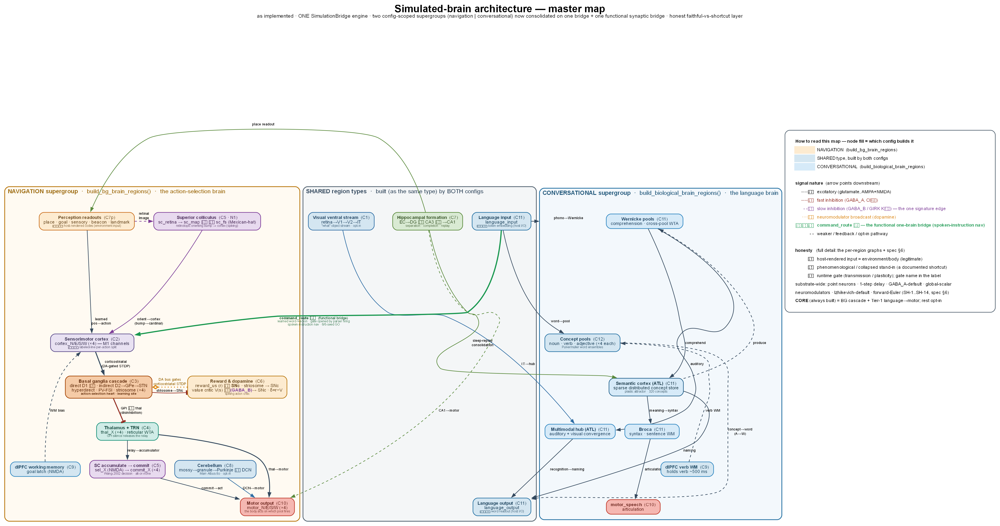

# Neural Simulator

**A GPU-accelerated simulator for biologically realistic spiking neural
networks — with a real-time 3D view of every neuron firing.**

It learns the way brains do: individual neurons fire in real time,
dopamine-like reward reinforces successful actions, and connections
strengthen or weaken from millisecond-precise spike timing. The core
runs on local biological rules — *not* backpropagation through a static
graph, no supervised labels, no symbolic optimizer.

[](LICENSE)

%20%2F%20NumPy%20(CPU)-orange.svg)


<p align="center">
  
</p>

<p align="center">
  <em>The whole simulated brain, as actually implemented — one engine, two configurations
  (navigation · conversation) sharing it and joined by one validated synaptic bridge
  (the parser-gated <code>command_route</code>), with an honest faithful-vs-shortcut layer.</em><br>
  <strong>Full detail (zoomable):</strong>
  <a href="docs/diagrams/brain_master.svg">master map</a> ·
  <a href="docs/diagrams/brain_navigation.svg">navigation brain — every region &amp; pathway</a> ·
  <a href="docs/diagrams/brain_conversational.svg">conversational brain — every region &amp; pathway</a> ·
  <a href="docs/diagrams/README.md">how to read &amp; regenerate</a>
</p>

**Jump to:** [Quick start](#try-it-in-60-seconds) ·
[Who it's for](#who-its-for) · [What it does today](#what-it-does-today) ·
[The biology](#what-real-biology-looks-like-inside) ·
[Architecture](#architecture) ·
[Performance & hardware](#performance--hardware) ·
[Status & limits](#whats-known-to-work-what-isnt) ·
[Docs](#documentation--further-reading)

---

## Who it's for

| If you are a… | You'll care that… |
|---|---|
| **Software developer** | It's a scriptable Python engine: 50+ brain regions, sparse GPU kernels, a YAML-driven experiment runner, a FastAPI dashboard, and a NumPy fallback that runs with no GPU at all. |
| **Computational neuroscientist** | Neurons are real models (Izhikevich, Hodgkin–Huxley, AdEx); plasticity reproduces published timing curves (Bi & Poo 1998); regions, pathways, and neuromodulators are declared, not hand-wired — and every result is multi-seed with anti-cheat controls. |
| **Biologist** | Mechanisms are grounded in *Principles of Neural Science* (Kandel, 6th ed.) plus a dozen specialty texts, in plain language — see [the biology](#what-real-biology-looks-like-inside). |
| **Curious reader** | You can watch a virtual brain learn to navigate and to remember words, in 3D, in real time — and see exactly how far "biology alone" gets you. |

---

## What it does today

**A trustworthy continual memory.** You can teach it word–concept facts
("apple is big", "the dog ate the apple"); it recalls them on cue and —
the genuinely hard part — keeps old memories intact while learning new
ones (this is called avoiding *catastrophic forgetting*, the usual
failure mode of neural networks that keep learning). It holds roughly
**320 distinct concepts** across a five-part model cortex, validated
across many random seeds. The scientific basis: words stored as
distributed cell assemblies spanning the cortex (Pulvermüller 2001),
recalled as sparse scattered patterns (Kanerva 1988), each memory a
re-triggerable tagged ensemble of neurons (Liu/Tonegawa 2012), and
protected from being overwritten by a hippocampus→cortex transfer with
replay during simulated sleep (complementary learning systems — McClelland,
McNaughton & O'Reilly 1995).

**It combines concepts into facts — in spikes.** Beyond storing single
words, it binds them into structured facts ("who did what to whom",
attributes, and even nested clauses like "the dog sees the cat chase the
ball") and answers questions about them — *who* ran, *what* is big, yes/no
including negation. The binding and unbinding are computed by spiking
neurons, not a lookup table.

**It refuses to make things up.** Asked about something it was never
taught, it answers "I don't know" rather than confidently fabricating a
wrong one — a trust property today's large language models notably lack.
This is measured: there is a clean confidence gap between what it knows
and what it does not.

**It navigates from vision.** The original capability: it finds a goal on
a gridworld using only simulated retinal input — no direct coordinates and
no hand-coded distance signal — reaching the goal far above chance (about
38% of the time on a 16×16 grid in the validated configuration). The
action-selection circuitry (basal ganglia → thalamus → motor cortex) is
being progressively rebuilt so the decision is made *in spikes* rather
than by any off-brain shortcut.

**It is learning to speak in its own words (early stage).** The system's
*own* spiking network is being trained to generate language from a local
text corpus, using a spike-compatible form of gradient learning
(surrogate-gradient backprop-through-time — Neftci, Mostafa & Zenke 2019).
The foundation is validated — it provably learns *real* text structure,
not noise — but it is **not yet fluent**, and honestly far from a large
language model. A separate model may be used only as a training-time
teacher (knowledge distillation — Hinton, Vinyals & Dean 2015); **after
training the system runs entirely on its own, fully local** — no external
model and no hand-written reply templates in use.

**It visualizes its own brain.** A live 3D view of every neuron firing and
synapse pulsing, with interactive camera control — watch it learn in real
time.

---

## Try it in 60 seconds

```bash
git clone https://github.com/danthi123/neural-simulator
cd neural-simulator
pip install -r requirements.txt   # CuPy + DearPyGUI + PyOpenGL + h5py + ...
python neural-simulator.py        # GUI with live 3D visualization
```

**No NVIDIA GPU? Run anything on the CPU** by setting one environment
variable — the engine swaps its GPU array library (CuPy) for NumPy with no
code change. It is slower, but every demo below works:

```bash
SIM_BACKEND=numpy python -m research.runners.chat_demo --seed 43
```

### Talk to it

Type a direction word and watch the matching motor pool light up
(four-word vocabulary, ~6 min to train on one seed):

```bash
python -m research.runners.chat_demo --seed 43 --train-events 200
```

With synonyms — both `north` and `up` activate the same motor pool
(eight-word vocabulary, ~10 min):

```bash
python -m research.runners.chat_synonym_demo --seed 42 --train-events 400
```

Interactive shell that saves its trained brain so you reload instantly
next time:

```bash
# First time: train, then save (~6–20 min depending on vocabulary)
python -m research.runners.chat_repl --mode tier1 --seed 43 \
    --save-bridge simulation_checkpoints_h5/repl_tier1.simstate.h5

# Later sessions: load the saved brain (~30 sec) and start chatting
python -m research.runners.chat_repl --mode tier1 --seed 43 \
    --load-bridge simulation_checkpoints_h5/repl_tier1.simstate.h5
```

A trained, larger-vocabulary brain holds a short conversation grounded in
its own memory:

```
> remember the dog is big
  OK, I'll remember dog is big.
> is the dog big?
  Yes, dog is big.
> is the apple small?
  I don't know. I haven't been told.
> who ate the apple?
  Dog did.
```

See [`docs/CHAT-DEMO-GUIDE.md`](docs/CHAT-DEMO-GUIDE.md) for every
conversational demo.

### Watch it navigate

Run the navigation flagship headless (vision-only, 16×16 grid):

```bash
python -m research.runners.g11_bg_runner --moving-goal --goal-schedule multi --deterministic \
    --enable-msn-lateral-inhibition --enable-d1-d2-asymmetry --enable-striatal-pv-fsi \
    --enable-cluster-a-closed-loop --enable-cluster-e-topography \
    --enable-dlpfc-wm --enable-pfc-nmda \
    --enable-visual-cortex --visual-cortex-action-warmup-steps 600 \
    --grid-size 16 --seed 42 --n-steps 1800
```

It prints live progress (`step 800/1800  pos=(6,1)  goal=(1,6)
recent_dist=2.6 …`) and writes a per-run JSON summary. Full setup,
prerequisites, and troubleshooting are in [QUICKSTART.md](QUICKSTART.md).

---

## Why this matters

Modern AI is built on gradient descent — a powerful but biologically
implausible optimizer. Real brains have no equivalent of backpropagation
through a frozen computational graph. They learn from local rules:
"neurons that fire together, wire together" (Hebb 1949), refined by
dopamine reward (Schultz 1998).

This project tests how far you can get with **only those biological
rules, entirely locally.** The answer so far: navigation works; a
biologically grounded **memory** works genuinely well — continual (it does
not forget) and trustworthy (it abstains instead of fabricating);
open-ended **language generation** is an active, honestly hard frontier
(foundation proven, fluency not). The system has clear limits, and mapping
those limits — with anti-cheat controls and forthright retractions when a
result does not hold up — is itself part of the contribution.

---

## What the brain can do

| Capability | How it works | Status |
|---|---|---|
| **See** | Retina → V1 (edge detectors) → V2 → IT (object recognition) | ✅ Working |
| **Decide** | Basal ganglia let competing options race; the winner is selected, losers silenced | ✅ Working |
| **Move** | Motor-cortex pools fire; the agent moves on the grid | ✅ Working |
| **Learn from reward** | Dopamine modulates spike-timing plasticity | ✅ Working |
| **Hold a goal in mind** | Prefrontal working memory keeps firing after input stops (NMDA bistability) | ✅ Working |
| **Remember word–concept facts** | Distributed cortical word-ensembles; sparse scattered recall; tagged engram ensembles | ✅ Working — ~320 concepts, multi-seed |
| **Not forget while learning more** | Hippocampus→cortex transfer with sleep replay (McClelland 1995) | ✅ Working — no catastrophic forgetting |
| **Know what it doesn't know** | A recall-confidence threshold; it abstains below it | ✅ Working — refuses to confabulate |
| **Speak in its own words** | Its own spiking net, trained by surrogate-gradient learning on local text | ⚠️ Early — foundation proven, not yet fluent |

---

## What real biology looks like inside

The simulator implements hundreds of mechanisms drawn from Kandel et al.,
*Principles of Neural Science* (6th ed., 2021) plus a dozen specialty
texts. The canonical term list lives in
[`references/glossary.md`](references/glossary.md); the plain-language tour
is in [`docs/biology.md`](docs/biology.md). A few highlights:

**The retina** — a 32×32 grid of light-sensitive cells, each firing more
when light hits its receptive field. Just like real retinal ganglion cells
(Hubel & Wiesel 1962).

**Visual cortex (V1)** — neurons tuned to oriented edges (using *Gabor*
receptive fields — a math description of edge detectors). They pick out
horizontal, vertical, and diagonal lines, the same wiring real V1 develops
in the first weeks of life.

**Basal ganglia** — the brain's "action selector." Several options compete;
the strongest wins; the losing pathways are silenced. Damage here causes
Parkinson's (too little selection) or Tourette's (too much).

**Working memory (prefrontal cortex)** — neurons that keep firing *after*
their input stops, holding a goal in mind. Real prefrontal cortex does this
through NMDA receptors that create a self-sustaining "on" state
("bistability") — the same property this model implements (Wang 2002).

**Plasticity** — connections strengthen when two neurons fire together
within about 20 ms (long-term potentiation), and weaken when the timing is
reversed (long-term depression). It is reward-modulated: only the right
pairings get reinforced (Schultz 1998 dopamine reward-prediction). The
model reproduces the published Bi & Poo (1998) timing curves.

**Hippocampus** — a pattern separator (dentate gyrus), a pattern completer
(CA3), and a memory readout (CA1). Damage means no new memories — the
classic patient "H.M."

**No symbolic shortcuts.** There is no `agent.pick_best_action()`. The
action emerges from spike rates in motor pools, the way real motor commands
emerge from primary-motor-cortex firing.

For the deep technical view, see [`docs/biology.md`](docs/biology.md).

---

## Architecture

Two threads keep the interface responsive while the brain computes:

```
Main thread                         Simulation thread
───────────                         ─────────────────
DearPyGUI event loop      ◄──────►  GPU neural dynamics (CuPy/CUDA)
OpenGL 3D rendering    lock-free     spike + plasticity kernels
camera / interaction     queues      recording / checkpointing
```

The engine lives in `sim/` (42 modules). The central object is the
**`SimulationBridge`**, which owns all neuron and synapse state as GPU
arrays and advances the network one millisecond-scale step at a time:
synaptic currents → background noise → neuron model update → plasticity →
visualization → recording.

| Package | What's in it |
|---|---|
| `sim/` | The engine: the bridge, neuron/plasticity GPU kernels, brain-region framework, neuromodulators, connectivity, checkpointing |
| `viz/` | OpenGL 3D renderer, camera, neuron picker, overlays |
| `ui/` | DearPyGUI control panels and the configuration round-trip |
| `experiment/` | Stimulus injection, neuron-group management, readout/analysis, training protocols |
| `research/runners/` | Headless experiment scripts (navigation, conversation, consolidation, …) |
| `webapp/` | FastAPI dashboard for launching runs and watching them live |

Networks are stored as sparse connection matrices, so memory grows with
the number of *actual synapses*, not with neurons-squared. Brain regions
and the pathways between them are *declared* as data, then wired
automatically — adding a region does not mean hand-editing the engine.

---

## Performance & hardware

The realistic operating envelope on a single GPU (measured on an
NVIDIA RTX 3090, 24 GB):

| Network size | Backend | Notes |
|---|---|---|
| 1K–10K neurons | CuPy or NumPy | Runs on a laptop CPU in NumPy mode; comfortable on any CUDA GPU |
| 10K–100K neurons | CuPy (CUDA) | The everyday research range; fits in 8–24 GB depending on connectivity |
| 100K+ neurons | CuPy (CUDA) | Needs ~20 GB+ VRAM; use sparse connectivity and the memory-pool limit |

- **GPU vs. CPU.** CuPy (CUDA) is the speed path; NumPy is the portability
  path for laptops, CI, and machines with no GPU — roughly 4–50× slower
  depending on the workload, but numerically equivalent.
- **Memory.** Connectivity is sparse (compressed-row format), so VRAM
  tracks real connections. `GPUConfig.memory_pool_limit_fraction` (default
  0.8) caps the CuPy memory pool.
- **Time step.** 0.5 ms for the fast neuron models (Izhikevich, AdEx),
  automatically tightened to 0.05 ms for full Hodgkin–Huxley biophysics.
- **Throughput.** The engine is ~7–8× faster than the project's original
  single-file implementation; a six-seed minimal-architecture sweep
  finishes in ~45–55 minutes on an RTX 3090.

---

## What's known to work, what isn't

### Working (validated, multi-seed where stated)

- **Continual memory** — ~320 concepts across a five-part cortex; new
  learning does not erase old memories.
- **Trustworthy recall** — abstains ("I don't know") instead of
  confabulating on untaught queries, with a measured confidence gap.
- **Compositional facts** — binds concepts into who-did-what facts,
  attributes, and nested clauses, and answers who/what/yes-no questions
  (including negation), computed in spiking neurons.
- **Navigation** — reaches a goal from simulated vision only, no
  coordinate or distance shortcuts.
- **Own-network text learning (foundation)** — the system's own spiking
  net provably learns real local text structure (it beats a
  shuffled-text control), fully local.
- **Infrastructure** — 50+ brain regions; real-time 3D visualization;
  full reproducibility (every random-number source seeded; a deterministic
  mode); checkpoint save/restore.

### Early / modest

- **Language fluency** — the generator's foundation is proven, but its
  output is far below a large language model; fluency is the active
  frontier.
- **Working memory over long delays** — prefrontal working memory holds a
  goal for seconds, not minutes.

### Honest limitations

- **Not LLM-fluent.** The real contribution is a *continual, trustworthy,
  fully local* memory — not open-ended fluent prose. Local hardware caps
  generation well below cloud models; the point is integrity (no cheating,
  no fabrication, self-contained), not parity.
- **Scale.** Thousands of neurons per region versus 10⁴–10⁶ in biology;
  far fewer training examples than a developing brain sees.
- **Static structure.** Developmental synaptic pruning and cortical-layer
  formation are not modeled.
- **Single time scale.** Millisecond spike-timing plasticity only; no
  protein-synthesis-dependent late-phase consolidation.
- **Research software.** APIs may change; this is not peer-reviewed for any
  clinical or diagnostic use.

---

## Current status

This is an **active research project.** The validated core today is the
biologically grounded **memory** (continual, trustworthy, ~320 concepts,
multi-seed) and **navigation** from vision; **language generation** is an
honestly hard frontier with a proven foundation but no fluency yet. Recent
work has focused on making every remaining shortcut more biologically
faithful — for example, rebuilding the navigation action-selection
pathway so the decision is genuinely made in spikes.

Navigation is now **fully biology-based** — every step between seeing
and acting is done by simulated neurons (a spiking superior colliculus
for orienting toward the goal, a neural reward signal, and a spiking
basal-ganglia decision and dopamine system), with no hand-coded
shortcut in between. The current work **puts the navigation brain and
the conversational brain on a single network** — each as its own group
of neurons. The conversational behaviour works unchanged on the shared
network (including its refusal to make up answers it doesn't know), and
the navigation runs on it while the conversational neurons stay exactly
unchanged during navigation's live learning. See
[`docs/ARCHITECTURE_nav_conv_merge.md`](docs/ARCHITECTURE_nav_conv_merge.md).

The project keeps a detailed, dated record. Each research session writes a
findings document (including negative results — they are real findings),
and milestones are summarized in the changelog.

- **History & milestones:** [CHANGELOG.md](CHANGELOG.md)
- **What works today, in technical detail:** [`docs/CURRENT-STATE.md`](docs/CURRENT-STATE.md)
- **The science roadmap:** [`docs/SCIENCE_ROADMAP.md`](docs/SCIENCE_ROADMAP.md)
- **Per-session findings:** `research/findings/` (chronological)

A note on method: results are reported with the random seeds and
conditions used, and several promising numbers have been **retracted** when
an anti-cheat control later failed. Those corrections are part of the
record, not hidden — honest negatives under strict biology are the point.

---

## How autonomous research runs

A YAML-driven runner queues overnight parameter sweeps without one-off
scripts. Each file declares conditions (flag combinations) × seeds; runs
emit a uniform progress event and write per-run JSON.

```bash
python -m research.experiment_runner experiments/biology_sweep.yaml   # run a sweep
python -m research.result_aggregator biology_sweep                    # roll up + verdict line
python -m research.runners.morning_briefing --short                   # summarize an overnight run
```

---

## Project structure

```
neural-simulator/
├── README.md              ← you are here
├── QUICKSTART.md          ← full setup + troubleshooting
├── CHANGELOG.md           ← dated history & milestones
├── neural-simulator.py    ← GUI host + main entry point
├── benchmark.py           ← GPU throughput benchmark
├── run_benchmarks.py      ← biological validation suite
├── sim/                   ← engine (42 modules)
├── viz/                   ← 3D OpenGL rendering
├── ui/                    ← DearPyGUI controls
├── experiment/            ← stimulus, groups, readout, training
├── experiments/           ← YAML configs for autonomous sweeps
├── research/
│   ├── runners/           ← experiment scripts (navigation, chat, …)
│   └── findings/          ← chronological session findings
├── references/            ← glossary + source textbooks
├── docs/                  ← biology, current state, roadmap, guides
├── webapp/                ← FastAPI dashboard
├── simulation_profiles/   ← 47 brain-region JSON profiles
└── tests/                 ← pytest suite (279 files)
```

---

## Documentation & further reading

- [QUICKSTART.md](QUICKSTART.md) — install, prerequisites, first run
- [`docs/biology.md`](docs/biology.md) — the modeled biology, plain language
- [`docs/CURRENT-STATE.md`](docs/CURRENT-STATE.md) — what works today, technically
- [`docs/CHAT-DEMO-GUIDE.md`](docs/CHAT-DEMO-GUIDE.md) — every conversational demo
- [`docs/SCIENCE_ROADMAP.md`](docs/SCIENCE_ROADMAP.md) — where it's going
- [CONTRIBUTING.md](CONTRIBUTING.md) — how to contribute
- [CHANGELOG.md](CHANGELOG.md) — dated history
- `CLAUDE.md` — developer/architecture guide

---

## Contributing

Contributions are welcome — bug fixes, new brain-region profiles,
biological-validation tests, and documentation especially. Please read
[CONTRIBUTING.md](CONTRIBUTING.md) and run the test suite first:

```bash
pytest tests/ -v
```

---

## How to cite

If you use this simulator in research, please cite the repository:

```bibtex
@software{neural_simulator,
  title  = {Neural Simulator: a GPU-accelerated biologically realistic
            spiking neural network simulator with real-time 3D visualization},
  author = {Thiberge, Daniel},
  year   = {2026},
  url    = {https://github.com/danthi123/neural-simulator}
}
```

---

## How this differs from typical AI

| Typical AI (e.g., LLMs) | This project |
|---|---|
| Gradient descent over millions of parameters | Spike-timing plasticity at each synapse |
| Trained once, then frozen | Always learning from interaction |
| Symbolic tokens in and out | Continuous neural activity |
| Massive corpora, no body | An embodied agent in a world |
| Capabilities far exceed biology | Capabilities bounded by biological faithfulness |

We are not trying to compete with GPT. We are trying to understand **how
much of intelligence emerges from biology alone.**

---

## License

MIT — see [LICENSE](LICENSE).

## Mirrors

- GitHub: https://github.com/danthi123/neural-simulator
- Gitea: https://git.dant123.com/dant123/neural-simulator
