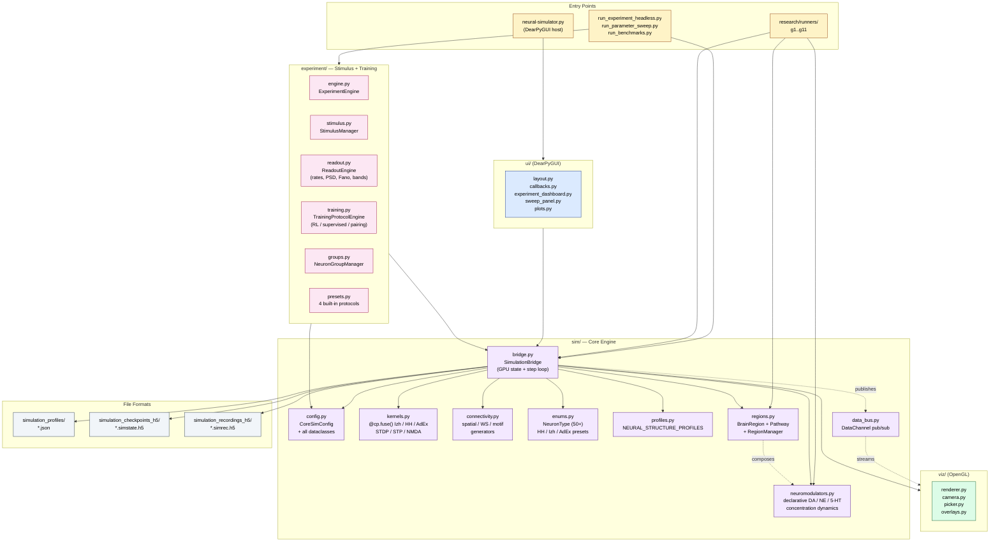
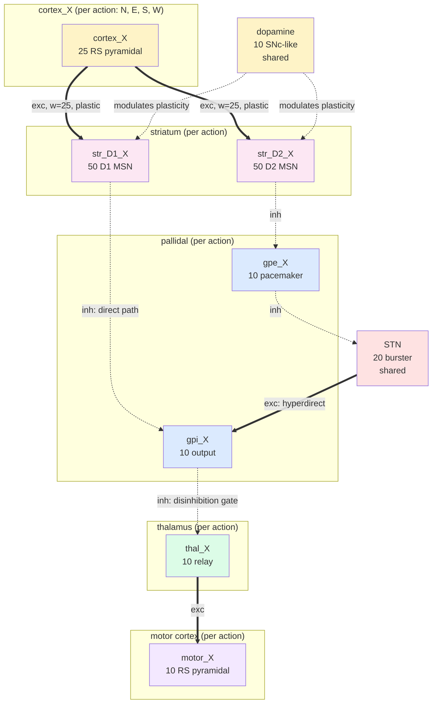

# GPU-Accelerated Neural Network Simulator

A high-performance spiking neural network simulator with real-time 3D OpenGL visualization, built on NVIDIA CUDA / CuPy. Simulates large-scale networks (10K–100K+ neurons) with biologically-grounded models (Izhikevich 2007, Hodgkin–Huxley, AdEx), full plasticity stack (STDP, STP, Hebbian, structural, homeostasis, NMDA), declarative brain-region + neuromodulator frameworks, and a programmable experiment system. Drives a research-gate progression (G1 → G11) where each gate produces a versioned finding.


> **Project status (2026-04-28):** Active research codebase. Recent milestones:
> - **Phase A preset audit** — 30 working biological presets across HH+Izh+AdEx with per-gate Q10 fix
> - **Phase B basal-ganglia action selection** — silent-motor trap resolved, phase 1 finalQ 1.76 vs G9 baseline 6.74
> - **Phase C plastic-input-layer arc** — per-pathway plasticity gating + real curriculum learning, hippocampus + sensory layer + PFC working memory all composing (4.41 sum, p=0.018, 25% over baseline)
> - **Item 1 (perception arc complete)** — agent navigates from PERCEIVED beacon + landmark information with a cue-following reflex; **NO direct (gx, gy) AND NO direct (x, y) coordinate access anywhere** (4.56 sum, p=0.00819, 22.4% over baseline)
> - **🎉 NEW BEST (overnight 2026-04-27/28): 4 of 5 cheats closed** — adds sensed reward (intensity gradient instead of distance) on top of the perception arc. **Biology-grounded version (4.08, p=0.00045, 30.6% over baseline) BEATS cheats-allowed (4.41).** 6/6 seeds. See [the milestone finding](research/findings/2026-04-27-NEW-BEST-4cheats-closed.md).
>
> **New here?** Start with [QUICKSTART.md](QUICKSTART.md) — running in 60 seconds.
> Detailed session findings in [`research/findings/`](research/findings/) ([INDEX](research/findings/INDEX.md)).
> Multi-week perception arc plan: [`docs/plans/2026-04-27-perception-arc-plan.md`](docs/plans/2026-04-27-perception-arc-plan.md).

---

## Table of Contents

- [System Architecture](#system-architecture)
- [Features](#features)
- [Requirements](#requirements)
- [Installation](#installation)
- [Quick Start](#quick-start)
- [Usage Modes](#usage-modes)
- [Research Runners](#research-runners)
- [Programmable API](#programmable-api)
- [File Formats](#file-formats)
- [Performance](#performance)
- [Testing](#testing)
- [Documentation Map](#documentation-map)
- [Contributing](#contributing)

---

## System Architecture

The simulator is split into focused packages. `neural-simulator.py` is now just the GUI host (~2K lines); the engine lives in `sim/`.



### Per-step pipeline (in `SimulationBridge._run_one_simulation_step`)

```mermaid
flowchart LR
    A[1. STP decay/recovery<br/>per-type if enabled]
    B[2. Synaptic conductance<br/>E_inh = -75mV<br/>0.7x propagation scale]
    C[3. Experiment stimulus<br/>injection<br/>if engine running]
    D[4. OU background noise]
    E[5. Neuron dynamics<br/>Izh / HH / AdEx<br/>fused kernels]
    F1[6. Hebbian LTP/LTD<br/>activity-dependent]
    F2[7. STDP weight update<br/>respects plastic mask<br/>+ plasticity gates]
    F3[8. Reward modulation<br/>eligibility × DA<br/>three-factor]
    F4[9. Neuromodulator step<br/>concentration update<br/>+ gain/rate/drive effects]
    F5[10. Structural plasticity<br/>activity-biased<br/>synapse formation]
    F6[11. Homeostasis<br/>EMA threshold adapt]
    H[12. Recording<br/>HDF5 if active]
    I[Visualization<br/>via DataChannel]

    A --> B --> C --> D --> E
    E --> F1 --> F2 --> F3 --> F4 --> F5 --> F6
    F6 --> H
    F6 -.publishes.-> I
```



### Phase B — Basal-Ganglia Action Selection (resolved 2026-04-25)

Per-action BG cascade replacing the older shared-reservoir + argmax readout that had a structural silent-motor trap. Built declaratively via the brain-region framework in `research/runners/g11_bg_runner.py`:



When `cortex_N` drives, `str_D1_N` fires → `gpi_N` is silenced → `thal_N` is released → `motor_N` fires. Other actions' GPi remain tonically firing and keep their thalami suppressed. **Selection emerges from independent disinhibition gates, not a shared argmax.**

---

## Features

### GPU-accelerated simulation
- All neural dynamics run on GPU via fused CuPy kernels (`@cp.fuse()`)
- Scales to 10K–100K+ neurons with millions of synaptic connections
- Real-time 60 FPS visualization with parallel simulation thread
- CUDA-OpenGL interop for zero-copy GPU→display transfers
- Smart memory pool management with adaptive cleanup

### Neuron models
- **Izhikevich 2007** (9-parameter): wide cortical/subcortical phenotype library, fast on GPU. Per-neuron parameter heterogeneity supported.
- **Hodgkin–Huxley** (multi-current): full biophysics with per-gate Q10 temperature scaling. Optional extended currents — M-current (KCNQ), CaT (low-threshold burst), I_h, NaP. 22+ region-specific presets (cortex, hippocampus, thalamus, BG, cerebellum, spinal cord, dopamine, olivary, PFC).
- **Adaptive Exponential (AdEx)**: 7 phenotypes (RS, FS, IB, CH, LTS, MSN, DA). 10–20× faster than full HH while preserving spike adaptation.
- **Per-region neuron type override**: declarative — assign each `BrainRegion` its own `izh_neuron_type` / `hh_neuron_type` / `adex_neuron_type` independent of the global default.

### Plasticity (full stack)
- **STDP**: classical Bi & Poo asymmetric window, soft-bound, GPU-accelerated. Validated against analytical kernel to 3e-8 max error.
- **Reward-modulated STDP** (three-factor learning): eligibility traces × dopamine signal. Used for RL.
- **Short-term plasticity** (Tsodyks–Markram): per-connection-type if `enable_per_type_stp=True` (E→E, E→I, I→E, I→I).
- **Hebbian**: activity-dependent long-term updates.
- **Structural plasticity**: activity-biased synapse formation (Cline & Haas 2008 style) + weak-synapse pruning.
- **Homeostasis**: EMA-based threshold adaptation, biological timescales (tau ~5s).
- **NMDA receptors**: voltage-dependent Mg²⁺ block, separate rise/decay.
- **Per-synapse plastic mask**: research runners can freeze specific pathways while training others.

### Biological realism (on by default)
- Per-neuron parameter heterogeneity (CV ~0.3–0.4, lognormal/Gaussian)
- Ornstein–Uhlenbeck background current (synaptic bombardment)
- Multiplicative conductance noise for HH (5% relative)
- Realistic E_inh = −75 mV (Cl⁻ Nernst at 37°C) with compensating 0.7× propagation scale

### Network architecture
- **Spatial 3D connectivity** with distance-dependent probability and trait bias
- **Watts–Strogatz** small-world topology
- **Connectivity motifs** (region-specific patterns)
- **Neural Structure Profiles**: 16 brain-region templates × 3 model variants (HH/Izh/AdEx) = 47 JSON profiles in `simulation_profiles/`

### Brain-region framework (opt-in, `enable_brain_region_framework=True`)
Declarative multi-region simulation. Each `BrainRegion` owns a contiguous neuron slice with its own internal connectivity. Cross-region pathways are declared (`from_region → to_region` with density, weight, plasticity flag). Supports neuromodulator gating per pathway. Enables PFC/Striatum/Thalamus/Motor on a single bridge without manual index bookkeeping.

### Neuromodulator subsystem (opt-in, `enable_neuromodulator_subsystem=True`)
Declarative concentration dynamics for dopamine / NE / 5-HT / etc. Each `NeuromodulatorConfig` declares baseline, decay tau, production rules (`from_reward`, `from_error_persistence`, `manual`), and receptor effects (`synaptic_gain`, `plasticity_rate`, `excitability_drive`). Supports per-trait and per-group scope.

### Experiment system
Programmable stimulus + training infrastructure. 7 stimulus pattern types (CONSTANT, PULSE_TRAIN, SINUSOIDAL, RAMP, POISSON_SPIKE_TRAIN, GAUSSIAN_NOISE, CUSTOM_WAVEFORM). 4 training modes (ASSOCIATIVE_PAIRING, REINFORCEMENT_LEARNING, SUPERVISED_TARGET, RESERVOIR_READOUT). Multi-phase orchestration. Built-in presets: stimulus-response, Pavlovian, R-STDP, frequency response.

### Visualization & UI
- Real-time 3D OpenGL with hardware-accelerated rendering
- Interactive orbit/pan/zoom camera
- Activity-color-coded neurons + synaptic pulse animation
- DearPyGUI control panel with all parameters
- Profile dropdown auto-populated from `simulation_profiles/`
- Live system logs panel with search + export
- Built-in benchmarking with stop/start controls

### Recording, playback, checkpointing
- HDF5 with LZ4 compression (default), GZIP, or none
- GPU-buffered recording (zero-copy, fast) or streaming (low memory)
- Frame-accurate playback with scrubbing
- Full state checkpointing including plasticity variables

---

## Requirements

| Component | Minimum | Recommended |
|-----------|---------|-------------|
| Python    | 3.8+    | 3.10+       |
| CUDA      | 11.x    | 12.x        |
| GPU       | Pascal (CC 6.0+) | Ampere/Ada (CC 8.0+) |
| VRAM      | 4 GB (1K–10K neurons) | 16 GB+ (50K–100K+) |
| RAM       | 8 GB    | 16 GB+      |
| Display   | OpenGL 3.3+ | OpenGL 4.0+ |

### Python dependencies

```
cupy-cuda12x >= 12.0    # or cupy-cuda11x for CUDA 11
numpy >= 1.21
h5py >= 3.7
hdf5plugin              # for LZ4 recording compression
dearpygui >= 1.9
PyOpenGL >= 3.1.6
PyOpenGL-accelerate >= 3.1.6
```

---

## Installation

```bash
# 1. Install CUDA Toolkit (https://developer.nvidia.com/cuda-downloads)

# 2. Install CuPy matching your CUDA version
pip install cupy-cuda12x   # for CUDA 12.x
# or: pip install cupy-cuda11x

# 3. Install other dependencies
pip install -r requirements.txt

# 4. Clone and run
git clone https://github.com/danthi123/neural-simulator.git
cd neural-simulator
python neural-simulator.py
```

---

## Quick Start

> **For a complete 60-second walkthrough see [QUICKSTART.md](QUICKSTART.md).**

### GUI mode

```bash
python neural-simulator.py
```

1. Pick a profile from the **Neural Structure Profile** dropdown (e.g. `cortex_l23_rs_fs_izh.json`)
2. Click **Apply Changes & Reset Sim**
3. Click **Start**
4. Navigate the 3D view: left-drag rotate, right-drag pan, scroll zoom

### Headless mode

```bash
# Auto-tune external drive scales for all model/profile/preset combinations
python neural-simulator.py --auto-tune          # full sweep (~30 min)
python neural-simulator.py --auto-tune --quick  # subset (~5 min)

# Run a built-in experiment preset headlessly
python run_experiment_headless.py --preset rl --seed 42

# Sweep a parameter
python run_parameter_sweep.py -e associative --sweep "stdp_a_plus=0.004,0.012,0.024"

# Biological validation suite
python run_benchmarks.py --benchmark stdp-timing
python run_benchmarks.py --benchmark gamma-oscillations
```

### Research-gate runner (G11 BG cascade)

```bash
# Static cascade probe (validates the architecture)
python -m research.runners.g11_bg_runner --probe-action W

# Flagship biology-grounded research run (1800 steps, ~16 min, 30.6% over baseline)
python -m research.runners.g11_bg_runner --moving-goal \
    --hippocampus --learned-perception --pfc \
    --beacon-perception --beacon-replaces-goal \
    --cue-reflex --cue-reflex-replaces-heuristic \
    --landmarks --landmarks-replace-place \
    --sensed-reward \
    --adaptive-da --adaptive-da-ema-decay-negative 0.7 \
    --curriculum --curriculum-warmup-steps 600 \
    --seed 42 --n-steps 1800
```

---

## Usage Modes

| Mode | Entry point | Use case |
|------|-------------|----------|
| **GUI** | `python neural-simulator.py` | Interactive exploration, parameter tuning, visualization |
| **Auto-tune** | `python neural-simulator.py --auto-tune [--quick]` | One-time setup of external drive scales per model/profile combo |
| **Experiment headless** | `python run_experiment_headless.py --preset {rl,associative,stim,freq}` | Reproducible experiment runs without GUI overhead |
| **Parameter sweep** | `python run_parameter_sweep.py -e <preset> --sweep "key=v1,v2,v3"` | Grid/zip sweeps with auto t-test + Cohen's d output |
| **Bio benchmarks** | `python run_benchmarks.py --benchmark <name>` | STDP timing, E/I balance, STP PPR, gamma, homeostasis |
| **Research runner** | `python -m research.runners.gN_runner [args]` | Specific gate experiments — see [Research Runners](#research-runners) |
| **Performance bench** | `python benchmark.py --output results.json [--quick]` | GPU throughput / step time / memory across network sizes |
| **Viz benchmark** | `python viz_benchmark.py --output ...` | Find max neurons for real-time rendering on your GPU |

---

## Research Runners

Headless runners for the research-gate progression (G1 → G11). Each writes raw data to `research/findings/raw/gN/` and a markdown finding to `research/findings/YYYY-MM-DD-gN.md`.

| Gate | Runner | Purpose | Status |
|------|--------|---------|--------|
| G1   | `g1_runner.py`, `g1_v2_runner.py`, `g1_v3_runner.py` | Encoder-decoder roundtrip on tiny patterns | **GO** (v3, 71.3% test acc, 3 seeds) |
| G2   | `g2_runner.py` | STDP local learning improvement | NO-GO (no epoch-over-epoch gain) |
| G3   | `g3_runner.py` | Persistence / checkpointing | **GO** |
| G5   | `g5_runner.py`, `g5_v2_runner.py`, `g5_v3_runner.py` | Sensorimotor signed perceptron | **GO** (v3 with LR decay, 3/3 seeds pass) |
| G6   | `g6_runner.py` | 2D gridworld | PARTIAL — gate metric needs redesign |
| G8   | `g8_runner.py` | Session 8 work | — |
| G9   | `g9_runner.py` | Moving-goal RL with motor exploration | NO-GO at runner side (silent-motor trap) |
| **G11** | **`g11_bg_runner.py`** | **BG cascade + perception arc + sensed reward + curriculum** | **GO 2026-04-27/28** — flagship — see below |

### G11 status (2026-04-27/28)

`g11_bg_runner.py` has grown into the project's flagship runner. It supports
many opt-in flags for biology-grounded learning experiments:

```bash
# 🎉 Current best — 4 of 5 cheats closed, biology-grounded BEATS cheats-allowed
# (p=0.00045, 30.6% over baseline; 6/6 seeds):
python -m research.runners.g11_bg_runner --moving-goal \
    --hippocampus --learned-perception --pfc \
    --beacon-perception --beacon-replaces-goal \
    --cue-reflex --cue-reflex-replaces-heuristic \
    --landmarks --landmarks-replace-place \
    --sensed-reward \
    --adaptive-da --adaptive-da-ema-decay-negative 0.7 \
    --curriculum --curriculum-warmup-steps 600 --seed N --n-steps 1800
# → sum 4.08 (6-seed)

# Best with cheats kept on (engineering shortcut, p=0.018, 25% over baseline):
python -m research.runners.g11_bg_runner --moving-goal \
    --hippocampus --learned-perception --pfc \
    --adaptive-da --adaptive-da-ema-decay-negative 0.7 \
    --curriculum --curriculum-warmup-steps 600 --seed N --n-steps 1800
# → sum 4.41 (6-seed)
```

Available capabilities (all opt-in):
- **Hippocampus** (`--hippocampus`) — place + goal cells with sparse Gaussian tuning
- **Sensory layer** (`--learned-perception`) — 49 (dx, dy)-tuned cells learning position→action
- **PFC working memory** (`--pfc`) — recurrent prefrontal region for persistent activity
- **Beacon perception** (`--beacon-perception` `--beacon-replaces-goal`) — 8 directional sensors detecting beacon, replaces direct goal coords
- **Cue-following reflex** (`--cue-reflex` `--cue-reflex-replaces-heuristic`) — innate sensorimotor wiring (replaces heuristic)
- **Landmark sensors** (`--landmarks` `--landmarks-replace-place`) — fixed-position landmark for place cell self-organization
- **Sensed reward** (`--sensed-reward`) — beacon-intensity gradient instead of ground-truth distance
- **BG cross-projections** (`--bg-cross-projections`) — opt-in but NEGATIVE — breaks phase-1 readaptation. Kept for future experiments.
- **Curriculum learning** (`--curriculum`) — staged plasticity via per-pathway gates
- **Sleep replay** (`--sleep-replay-after-step N`) — NREM trajectory + REM random
- **Cortex WTA, motor WTA, adaptive DA, surprise LR boost** — various modulation mechanisms

See [`research/runners/TROUBLESHOOTING.md`](research/runners/TROUBLESHOOTING.md) for
gotchas and `--help` for the full flag list.

Negative results are real findings and stored in [`research/findings/`](research/findings/) alongside positives. Browse the directory for the full session-by-session arc.

---

## Programmable API

The engine exports its key classes via `sim/__init__.py`:

```python
from sim import (
    SimulationBridge, CoreSimConfig, VisualizationConfig,
    RuntimeState, GPUConfig, NeuronModel, NeuronType,
)

cfg = CoreSimConfig(
    num_neurons=10_000,
    neuron_model_type=NeuronModel.IZHIKEVICH.name,
    neural_profile_name="CORTEX_L23_RS_FS",
    enable_stdp=True,
    enable_reward_modulation=True,
    seed=42,
)
gpu_cfg = GPUConfig(enable_profiling=True)

bridge = SimulationBridge(
    core_config=cfg,
    viz_config=VisualizationConfig(),
    runtime_state=RuntimeState(),
    gpu_config=gpu_cfg,
)
bridge._initialize_simulation_data(called_from_playback_init=False)

for _ in range(1000):
    bridge._run_one_simulation_step()
    bridge.runtime_state.current_time_step += 1

print(bridge.get_profiling_stats())
bridge.export_profiling_report("profile.json")
```

### Brain-region + neuromodulator example

```python
from sim.regions import BrainRegion, RegionPathway

regions = [
    BrainRegion(name="cortex", n_neurons=200, exc_fraction=0.8,
                internal_density=0.1, exc_weight_mean=2.0, inh_weight_mean=4.0),
    BrainRegion(name="striatum", n_neurons=100, exc_fraction=0.05,
                izh_neuron_type="IZH2007_STRIATAL_MSN"),
]
pathways = [
    RegionPathway(from_region="cortex", to_region="striatum",
                  density=0.5, weight_mean=2.5, plastic=True),
]

cfg = CoreSimConfig()
cfg.enable_brain_region_framework = True
cfg.brain_regions = regions
cfg.region_pathways = pathways
cfg.num_traits = 1  # let regions own their own neuron-type assignment
# ... continue as above
```

See [`research/runners/g11_bg_runner.py`](research/runners/g11_bg_runner.py) for a full multi-region BG cascade build.

---

## File Formats

| Extension | Purpose | Directory |
|-----------|---------|-----------|
| `.json` | Simulation profile (configuration) | `simulation_profiles/` |
| `.simstate.h5` | Full state checkpoint (HDF5) | `simulation_checkpoints_h5/` |
| `.simrec.h5` | Frame-by-frame recording (HDF5, LZ4) | `simulation_recordings_h5/` |

Profile naming convention: `{region}_{model}.json` where `{model}` ∈ {`hh`, `adex`, `izh`}. Plus a `quick_demo_cortex.json` for first-time users.

---

## Performance

| Network size | VRAM | Step time (Izh dt=1ms) | Notes |
|--------------|------|------------------------|-------|
| 1K           | ~0.5 GB | <0.1 ms | Real-time interactive |
| 10K          | ~2 GB   | ~6 ms   | Smooth, recommended |
| 50K          | ~8 GB   | ~20 ms  | High-end GPU |
| 100K+        | ~20 GB+ | ~60 ms  | Research-scale |

**Tuning knobs:**
- `GPUConfig.memory_pool_limit_fraction` (default 0.8)
- `GPUConfig.render_vbo_update_skip` (default 2 — VBO every 2nd frame)
- `recording_compression="lz4"` (default, fast) vs `"gzip"` (smaller files)
- For HH at 0.05 ms dt: ~20× slower than Izh; use AdEx for biophysics-lite

**Profiling:**

```python
gpu_cfg = GPUConfig(enable_profiling=True, profiling_detailed=True)
# ... run sim ...
stats = bridge.get_profiling_stats()
print(f"Step time: mean={stats['step_total']['mean']*1000:.2f} ms, "
      f"p95={stats['step_total']['p95']*1000:.2f} ms")
bridge.export_profiling_report("profile.json")
```

---

## Testing

28 test files in `tests/`. Highlights:

```bash
# Full suite
pytest tests/ -v

# Determinism (RNG, init, step)
pytest tests/test_determinism.py -v

# CPU validation of fused kernels
pytest tests/test_kernels_cpu.py -v

# Per-runner smoke tests
pytest tests/test_g1_runner_smoke.py -v
pytest tests/test_g11_bg_runner_flags.py -v

# Plasticity + freeze-mask correctness
pytest tests/test_plastic_mask.py -v

# Subsystem tests
pytest tests/test_experiment_system.py -v
pytest tests/test_neuromodulators.py -v
pytest tests/test_regions.py -v
pytest tests/test_data_bus.py -v
```

---

## Documentation Map

| Document | Audience | Content |
|----------|----------|---------|
| **[QUICKSTART.md](QUICKSTART.md)** | **First-timers (start here!)** | **60-second TL;DR — install + GUI + flagship research run** |
| [README.md](README.md) | All visitors | This file — overview, architecture, install, full reference |
| [USER_GUIDE.md](USER_GUIDE.md) | End users | GUI walkthrough, panel-by-panel reference, plasticity tuning |
| [CLAUDE.md](CLAUDE.md) | LLM agents working in repo | Module map, line numbers, gotchas, sub-system spec |
| [CONTRIBUTING.md](CONTRIBUTING.md) | New contributors | Dev setup, branching, code style, PR template |
| [CHANGELOG.md](CHANGELOG.md) | Everyone | Dated change history |
| [docs/SCIENCE_ROADMAP.md](docs/SCIENCE_ROADMAP.md) | Researchers | Validation pillars, gate progression, what's done vs pending |
| [docs/plans/](docs/plans/) | Implementers | Per-feature design docs, often paired with a finding |
| [research/findings/INDEX.md](research/findings/INDEX.md) | Researchers | Index of all findings with verdicts |
| [research/findings/](research/findings/) | Researchers | Session-by-session results, including negatives |
| [research/runners/TROUBLESHOOTING.md](research/runners/TROUBLESHOOTING.md) | Anyone running experiments | Gotchas accumulated across sessions (3-seed unreliability, plasticity gate semantics, etc.) |
| [docs/plans/2026-04-27-perception-arc-plan.md](docs/plans/2026-04-27-perception-arc-plan.md) | Researchers | Multi-week plan to remove all perception cheats |
| [.claude/style.md](.claude/style.md) | LLM agents | Communication style for this codebase |

---

## Contributing

See [CONTRIBUTING.md](CONTRIBUTING.md) for the full guide. High-priority areas:
- Additional plasticity rules (e.g. BCM, triplet STDP)
- Multi-GPU support
- AMD ROCm/HIP port
- Network analysis tools (graph theoretic, dynamical systems)
- SONATA / NeuroML export

---

## License

MIT. See [LICENSE](LICENSE).

---

## Citation

```bibtex
@software{neural_simulator_2026,
  title = {GPU-Accelerated Neural Network Simulator},
  author = {danthi123},
  year = {2026},
  url = {https://github.com/danthi123/neural-simulator}
}
```

## Acknowledgments

Models: Izhikevich (2007), Hodgkin & Huxley (1952), Brette & Gerstner (2005), Tsodyks & Markram (1997).
Heterogeneity: Marder & Goaillard (2006), Tripathy et al. (2013).
OU noise: Destexhe et al. (2001), Destexhe & Rudolph-Lilith (2012).
Channel noise: White et al. (2000).
BG architecture: Mink (1996), Schultz (2007), Wickens et al. (1995).
Tools: CuPy, DearPyGUI, PyOpenGL, h5py.

---

**Note:** This is a research/educational codebase. For published neuroscience studies, established frameworks like NEST, Brian2, NEURON, or GeNN may be more appropriate.
