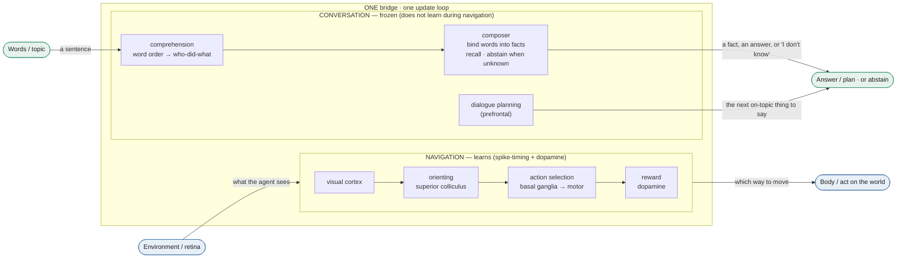
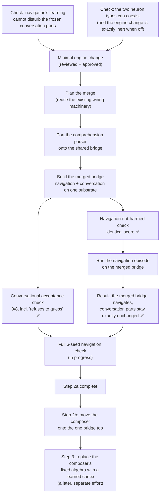

# Architecture — Navigation and Conversation on one bridge (roadmap step 2)

The navigation brain and the conversational brain run as **separate, non-overlapping groups of neurons on a
single `SimulationBridge`** — one set of GPU arrays, one update loop, one timestep. This is the "one brain"
consolidation: the same capabilities as the two separate brains, but a single substrate. Builder:
[`research/runners/nav_conv_merged_bridge.py`](../research/runners/nav_conv_merged_bridge.py).

A *bridge*, here, is one simulated network of neurons. Each function (navigating, comprehending a sentence,
recalling a fact, planning what to say) occupies its own contiguous block of neuron indices on the shared
bridge.

## The merged bridge

**Why the two halves don't interfere.** Navigation learns continuously while the agent moves (it adjusts
synapse strengths from reward and spike timing). The conversational neurons must NOT be changed by that
learning — otherwise comprehension and memory would slowly degrade every time the agent navigated. So the
conversational synapses are **held fixed**: their per-synapse learning rate is set to zero. We verified that
this fully protects them — after a long navigation burst that actively rewires the navigation half, the
conversational synapses are exactly unchanged, while the navigation synapses do change (proving the learning
was live, not switched off). The one subtlety: a global "keep weights in range" step is applied to all
synapses regardless of the learning rate, so the conversational synapses' fixed values must sit inside the
allowed range — we ensure that by widening the range above the largest conversational weight.

**Two neuron types on one bridge.** Navigation, comprehension, and dialogue planning use the standard spiking
neuron model. The composer (the part that binds words into facts) uses a different model — a phase-based
neuron whose state would collide with the standard model's if they shared the same internal variables. They
can't be advanced together in the same step. The fix exploits a property of the composer: it does each
bind/recall operation from scratch (it re-initializes each time) and stores its memory in a separate set of
synapses, so its working state never needs to survive a navigation step. So a small, additive engine change
lets the composer's operations touch only its own block of neurons, leaving navigation untouched — and with
the feature off, the engine is unchanged bit-for-bit (so nothing else in the project is affected). This
change was reviewed and approved before being relied upon.

## How the work was built (each step verified before the next)

## Status (2026-06-10)

- Conversation on the merged bridge: ✅ the full conversational behaviour passes unchanged — comprehension,
  fact memory, question answering, negation, embedded clauses, dialogue planning, generation, and the
  "refuses to make up an answer it doesn't know" guarantee.
- Navigation on the merged bridge: ✅ a single-seed run shows the merged bridge navigates while the
  conversational neurons stay exactly unchanged during the live navigation learning. The full six-seed run
  (confirming the navigation score is statistically unchanged) is the final check, currently running.
- Moving the composer onto the one bridge as well (step 2b): unblocked by the approved engine change.

## Key files

- Builder + the merge logic: `research/runners/nav_conv_merged_bridge.py`
- Six-seed navigation check: `research/runners/_nav_gate_merged_run.py`
- The engine change (off by default, bit-for-bit identical when off): the masked phase-neuron operations in
  `sim/bridge.py`
- Designs: `docs/plans/2026-06-10-nav-conv-single-instance-unification-design.md`,
  `docs/plans/2026-06-10-nav-conv-merge-implementation-design.md`,
  `docs/plans/2026-06-10-nav-episode-integration-design.md`,
  `docs/plans/2026-06-10-step2b-rf-coresident-implementation.md`
- Tests: `tests/test_nav_conv_merged_agent.py`, `tests/test_rf_neuron_mask_coexistence.py`

---

## Technical details (for developers)

The plain-language descriptions above map to these specifics. *Bridge* = `sim.bridge.SimulationBridge`;
*frozen* = the per-synapse plasticity gate `cp_plasticity_rate_gain` held at 0.0; the standard neuron model is
Izhikevich; the composer's phase-based model is resonate-and-fire (its complex state `re + i·im` reuses the
`v`/`u` arrays, which is the collision). The composer's memory lives in complex synapse matrices
(`cp_rf_w_re` / `cp_rf_w_im`), disjoint from the real-valued `cp_connections`. The binding scheme is FHRR
(Fourier Holographic Reduced Representations — a vector-symbolic algebra).

- **Plasticity isolation:** the gate zeroes the four weight-UPDATE paths (Hebbian potentiation/decay, STDP
  delta, the reward eligibility→weight conversion). The one ungated path is the global weight CLIP
  (`bridge.py:6200` Hebbian, `:6505` reward) — mitigated by `stdp_w_max` + `hebbian_max_weight` above the
  frozen conversational weight (~300); the composer's complex weights are clip-immune.
- **Neuron-model coexistence:** the additive engine change is an optional `neuron_mask` on `rf_kick` +
  `_rf_advance_one` (masks all `v`/`u` writes to the resonate-and-fire slice); default `None` = whole bridge =
  byte-identical (the 18 conversational tests pass verbatim).
- **The merge:** the brain-region framework lowers to `inject_explicit_wiring`
  (`bridge.py:1514-1526`), so the parser + dlPFC are appended as framework regions. The navigation-episode
  integration is a hybrid `run_moving_goal_episode` with four additive no-op-default parameters + an
  index-based finalization hook that runs after the V1/superior-colliculus post-init
  `set_pathway_weights(add_missing=True)` rebuild (which re-sorts the connection matrix, stales the gate-index
  maps, and whose Hebbian decay would erode the fixed perception weights — the hook freezes by index, not gate
  name, and gain-masks the parser training pass).
- **Acceptance:** `tests/test_nav_conv_merged_agent.py` (8/8 incl. the three `is None` abstention
  assertions); the navigation gate compares the merged-vs-standalone `sum_finalQ` across 6 seeds.
