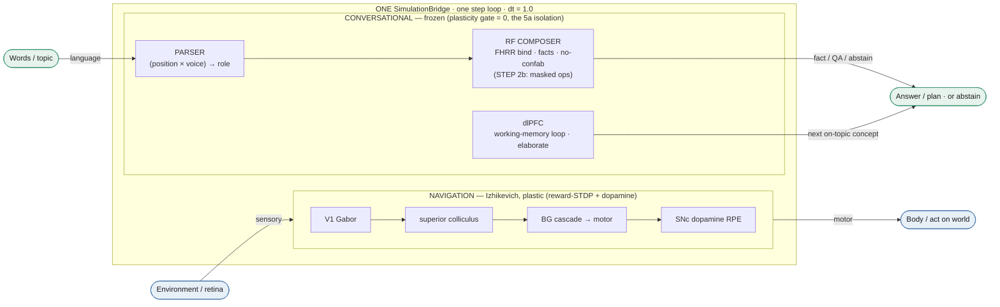
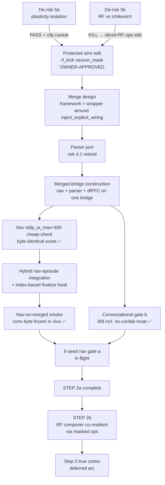

# Architecture — Navigation + Conversational on one bridge (roadmap step 2)

The navigation brain and the conversational brain run as **disjoint neuron-index slices on ONE
`sim.bridge.SimulationBridge`** — one set of GPU state arrays, one per-step update loop, one timestep
(dt = 1.0). This is the "one brain" consolidation: capability-equivalent to the two separate brains, but a
single substrate. Builder: [`research/runners/nav_conv_merged_bridge.py`](../research/runners/nav_conv_merged_bridge.py).

## The merged bridge

**Plasticity isolation (the load-bearing property).** Navigation runs reward-modulated STDP + a global
dopamine neuromodulator; the parser is trained by Hebbian co-firing. On the shared bridge these are global
config flags, so the conversational populations are **frozen with a per-synapse plasticity gate held at 0.0**
(de-risk 5a proved this isolates weight UPDATES). The one residual is the ungated global weight *clip* — a
frozen weight outside the active rule's clip bounds gets clipped — mitigated by raising `stdp_w_max` +
`hebbian_max_weight` above the frozen conversational weight (~300). The RF composer's binding weights are
complex (`cp_rf_w_re`/`cp_rf_w_im`), array-disjoint from the real-valued `cp_connections`, so they are immune.

**Neuron-model coexistence.** Navigation + parser + dlPFC are Izhikevich. The RF composer is
resonate-and-fire (a complex phasor whose state reuses the `v`/`u` arrays). They cannot share `v`/`u` in one
step dispatch (de-risk 5b: one Izhikevich step destroys a phasor), but the composer is stateless per
operation and stores memory in complex synapses, so the **minimal protected `sim/` edit slices the RF ops**
(`rf_kick(..., neuron_mask=)` + `_rf_advance_one`) to the RF slice — default-off byte-identical, owner-approved.

## The build arc (de-risk → edit → merge → gates)

## Status (2026-06-10)

- STEP 2a conversational half: ✅ gate (b) green on the merged bridge (no-confab moat intact).
- STEP 2a navigation half: ✅ single-seed smoke (merged bridge navigates, conversational populations
  byte-frozen in vivo); the full 6-seed gate (a) is the final statistical rigor (in flight).
- STEP 2b (RF co-resident): unblocked by the owner-approved masked-RF-ops edit.

## Key files

- Builder + hook: `research/runners/nav_conv_merged_bridge.py`
- 6-seed gate driver: `research/runners/_nav_gate_merged_run.py`
- The protected edit (default-off byte-identical): `sim/bridge.py` `rf_kick` / `_rf_advance_one`
- Designs: `docs/plans/2026-06-10-nav-conv-single-instance-unification-design.md`,
  `docs/plans/2026-06-10-nav-conv-merge-implementation-design.md`,
  `docs/plans/2026-06-10-nav-episode-integration-design.md`
- Tests: `tests/test_nav_conv_merged_agent.py`, `tests/test_rf_neuron_mask_coexistence.py`
