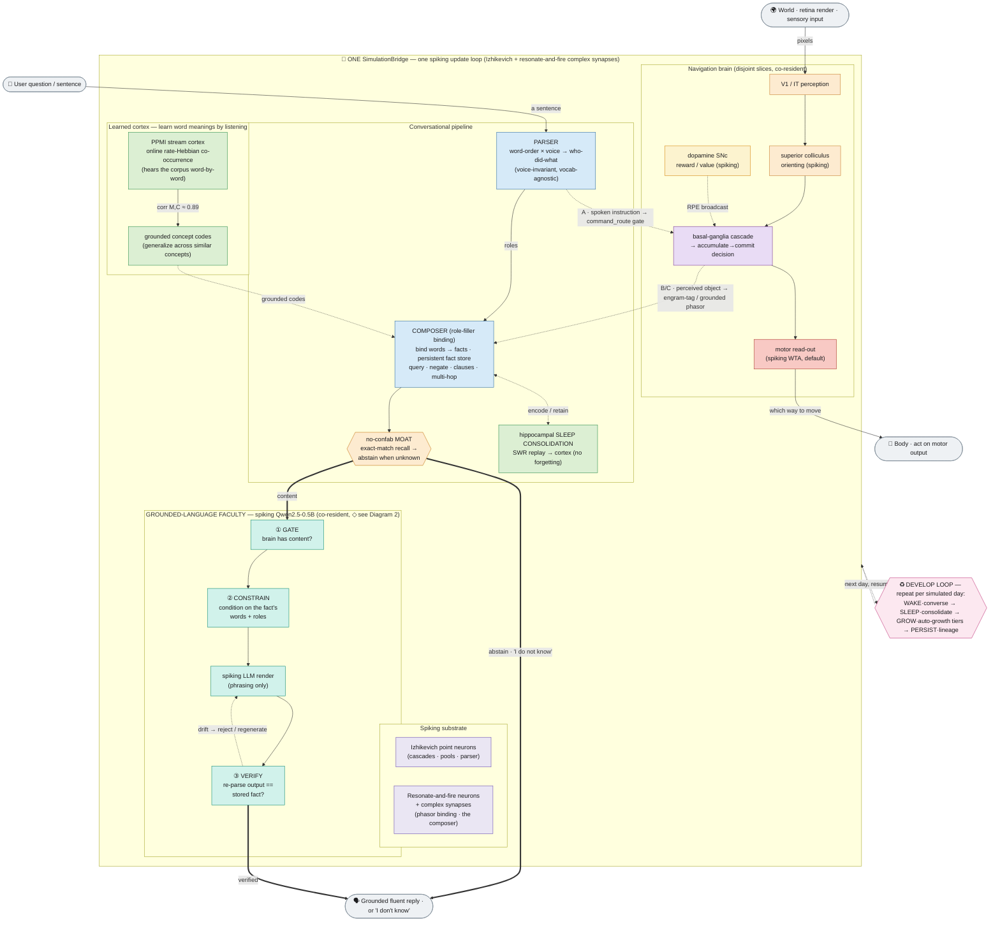
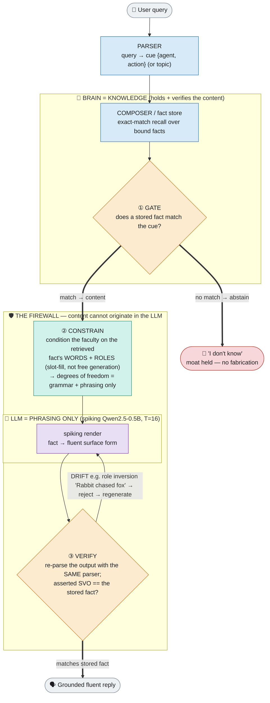
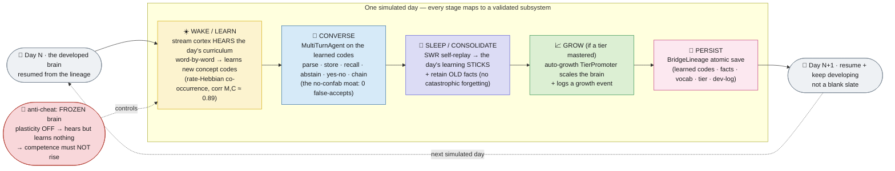

# Brain architecture — current state (2026-06-23)

Maintainable, **as-implemented** Mermaid flowcharts of the whole simulated
brain, kept in step with `research/findings/AUTONOMOUS_STATE.md` and the
2026-06-23 findings. These render directly on GitHub.

The whole-brain pipeline, top to bottom:

> **spiking substrate** (`SimulationBridge`: Izhikevich + resonate-and-fire
> complex-synapse neurons) → **conversational pipeline** (parser → composer
> role-filler binding → the no-confab **moat** → hippocampal **sleep
> consolidation**) → the **learned cortex** (PPMI stream cortex: learn word
> meanings from listening) → the **grounded-language faculty** (a
> spiking-Qwen LLM gated by the brain's knowledge: **gate → constrain →
> verify** — brain = knowledge, LLM = phrasing only, hallucination-proof by
> construction) → **bridge co-residence** (the faculty consolidated onto the
> `SimulationBridge`) → the artificial-life **develop loop** (day → converse
> → consolidate(sleep) → grow(auto-growth tiers) → persist(lineage) → next
> day).

These three Mermaid diagrams are the **current-state, whole-stack** view.
The two exhaustive region/pathway detail graphs (every region, every distinct
synapse, the honesty legend) remain the hand-authored SVGs in this folder —
they are scoped to a single builder each and are the source of truth for the
region inventory:

| Detail graph | Scope | Files |
|---|---|---|
| **Navigation brain** | every region + pathway of `build_bg_brain_regions()` — BG action-selection cascade, spiking superior-colliculus orienting, spiking actor-critic, thalamus/TRN, the accumulate→commit spiking decision (now the default read-out), cerebellum, hippocampus, dlPFC | [`brain_navigation.svg`](brain_navigation.svg) · [`.png`](brain_navigation.png) |
| **Conversational brain** | the production `OneBrainComposer` pipeline + the `build_biological_brain_regions()` region inventory (language I/O, Wernicke/semantic/Broca, concept pools, multimodal hub, hippocampal consolidation, dlPFC verb WM) | [`brain_conversational.svg`](brain_conversational.svg) · [`.png`](brain_conversational.png) |
| **Master map (SVG)** | the earlier hero overview: one brain (nav + conversation as disjoint slices) + the 3 validated cross-brain routes + the co-resident generalization stack + the honesty legend | [`brain_master.svg`](brain_master.svg) · [`.png`](brain_master.png) |

> The SVG master map predates the grounded-language faculty, bridge
> co-residence, and the develop loop (the 2026-06-23 arc). **Diagram 1 below
> is the current master map** — it adds those three layers on top of the
> consolidated one brain. See "Honesty & scope" at the bottom for the
> brain-based-only standard the markers encode.

---

## 1. Master architecture map — the whole brain

The full stack: the shared **spiking substrate** carries the **conversational
pipeline** and the **navigation** brain as disjoint neuron slices on one
update loop; the **learned cortex** supplies grounded concept codes; the
**grounded-language faculty** turns retrieved facts into fluent prose under a
firewall; and the **develop loop** runs the whole thing forward over simulated
days. Solid arrows = the live signal path; the faculty's firewall edges are
highlighted.

**How to read it.** The brain holds the **knowledge** (learned cortex +
composer + moat); the faculty supplies **phrasing only**. The conversational
answer leaves the moat one of two ways: **content** (a stored fact exists → it
flows into the faculty's gate→constrain→verify firewall and emerges as a
verified fluent reply) or **abstain** (no fact matches → the reply is "I don't
know", the moat never breached). Navigation is a co-resident, disjoint-slice
brain on the same bridge, joined to the conversation by three validated
cross-brain routes (drawn in full on the master SVG). The whole bridge is run
forward over simulated days by the develop loop.

---

## 2. The grounded-language faculty — gate → constrain → verify

The owner's decoupling, realized: **the brain supplies and verifies the
CONTENT; the spiking LLM supplies only the fluent SURFACE FORM.** Three
enforcement layers (cheapest first) make the faculty hallucination-proof *by
construction* — a fluent-but-false render is re-parsed and rejected before it
can reach the user. Validated end-to-end with the **real spiking Qwen2.5-0.5B**
in the loop: grounded → fluent-correct, untaught → abstain, adversarial drift →
caught.

**The three layers.**
- **① Gate** (the moat) — the composer / familiarity gate decides *whether
  there is content to speak*. No stored fact matches the cue → the faculty is
  given **nothing to render** → the reply is "I don't know". Recall 1.0 +
  **0 false-accepts** at ~67 facts / 138-word vocab across 3 seeds.
- **② Constrain** (the hallucination-reducer) — the faculty is conditioned on
  the retrieved fact's **words and roles** (slot-filling / constrained
  decoding), so its only freedom is grammar and phrasing — *not* facts.
- **③ Verify** (the moat-preserver) — the faculty's output is **re-parsed by
  the same parser** and its asserted subject-verb-object checked against the
  stored fact. Any drift is rejected and regenerated. The proof: the real 0.5B
  LLM *did* try to hallucinate (it inverted a role, "Rabbit chased fox"), and
  **verify caught it** — the conservative failure direction is over-abstention,
  never confabulation.

> Mapping to grounded-generation SOTA: the brain's structured store **is** the
> knowledge graph; the composer's abstention **is** the calibrated-confidence
> gate — a *stronger* guarantee than soft retrieval (exact binding-match vs
> cosine similarity).

**Bridge co-residence.** The faculty is not a bolted-on service: the full
24-layer spiking Qwen2.5-0.5B (494M) runs **on the live `SimulationBridge` RF
substrate** — 14 GB resident (fits < 24 GB → local), bit-exact to the
off-bridge spiking forward, coherent generation. The "one brain" north star for
language: the fluent faculty is co-resident on the brain's own substrate.
(Honest scope: a feasibility demonstration — it runs but is slow; the perf
lever is the usability follow-on, and full functional integration on one bridge
is the deeper step.)

---

## 3. The artificial-life develop loop — the brain DEVELOPS over simulated days

The whole brain is run forward over simulated time. Each "day" the brain
**hears** a developmentally-graded curriculum and **learns** concept codes
(real stream-cortex Hebbian learning), **converses** on the codes it learned,
**consolidates** them in sleep so they stick (no catastrophic forgetting),
**grows** as it masters a tier, and **persists** so the next day resumes the
same brain. Validated at GPU scale, 1 seed: over 4 days vocab 6→24, facts
2→11, recall 1.0, retention 1.0, moat 0-false-accept; persists + resumes across
days; the frozen-brain anti-cheat holds (plasticity-off learns nothing).

**Feasibility (the north-star number).** ~2.2 min/day at GPU smoke scale → a
compressed "week" ≈ 16 min, a "month" ≈ 1 hr, a "year" ≈ ~13.5 hr (an
overnight **local** run, no VRAM wall). Simulating weeks/months/years of
development is a tractable, local problem.

**Honest scope.** 1-seed; small smoke vocab (24); consolidation = the validated
self-replay stand-in (full SWR on the conversational bridge deferred); growth =
the TierPromoter *decision* + lineage growth-event (the heavy arch rebuild +
weight-transfer is the GPU follow-on). "Development" here is vocab/facts
accumulation + retention, not yet open-ended conversational sophistication.

---

## Honesty & scope (the brain-based-only standard)

These diagrams are accurate **to the degree the biology is implemented in this
simulator**, not to the degree real brains are organized — an honest map of the
code, including its reductions.

**The brain-based-only standard** (owner directive, `CLAUDE.md`): even where a
host-side computation is biologically correct, it is a **shortcut** if the
*brain* isn't doing it. Host code is legitimate only for the **environment**
(world state + sensory rendering, the 🌍 I/O nodes) and the **body** (acting on
motor output, the 🦾 node). Everything between sensation and action is meant to
be neurons and synapses.

Two current load-bearing honest residuals, drawn here:

- The **grounded-language faculty's** spiking LLM is **co-resident** on the
  bridge and bit-exact, but it is a *feasibility* demonstration — slow (the
  perf lever is pending) and not yet *functionally* interacting with the
  conversational brain on one bridge (the deeper integration step). Its
  knowledge does NOT originate in the LLM — the firewall (Diagram 2) enforces
  that the brain holds and verifies all content.
- The **develop loop's** consolidation and growth stages run validated
  *stand-ins* (self-replay retention re-test; TierPromoter decision + lineage
  event) at 1-seed smoke scale; the full SWR-on-the-conversational-bridge and
  the arch-rebuild weight-transfer are flagged GPU follow-ons.

For the exhaustive per-region / per-synapse honesty markers (collapsed `×N`
pools, host I/O boundary `⌂`, documented shortcut `⚠`, negative/boundary
pathways `✗`, the substrate-wide SH-1…SH-14 list), see the hand-authored detail
SVGs and the extraction spec
[`research/findings/2026-06-09-brain-architecture-flowchart-spec.md`](../../research/findings/2026-06-09-brain-architecture-flowchart-spec.md).

## Provenance

These Mermaid diagrams are composed from the 2026-06-23 findings (read directly):

- `research/findings/2026-06-23-grounded-lang-INTEGRATION-GO.md` — the
  gate→constrain→verify capstone (real spiking Qwen renders gated facts; drift
  caught).
- `research/findings/2026-06-23-grounded-lang-SCALED-GO.md` — robust at ~67
  facts / 138-word vocab; moat 0-false-accept × 3 seeds.
- `research/findings/2026-06-22-grounded-language-faculty-scoping.md` — the
  P1 (fluency) / P2 (knowledge) / P3 (grounding) architecture + the firewall
  sketch.
- `research/findings/2026-06-23-bridge-coresidence-DEMONSTRATED.md` — the full
  24-layer spiking Qwen on the SimulationBridge, 14 GB local, bit-exact.
- `research/findings/2026-06-23-longitudinal-develop-loop-GPU-GO.md` +
  `research/runners/_longitudinal_develop_loop_gpu.py` /
  `_longitudinal_develop_loop.py` — the WAKE→SLEEP→GROW→PERSIST day cycle.
- `research/findings/AUTONOMOUS_STATE.md` — the current top-of-stack ordering.
