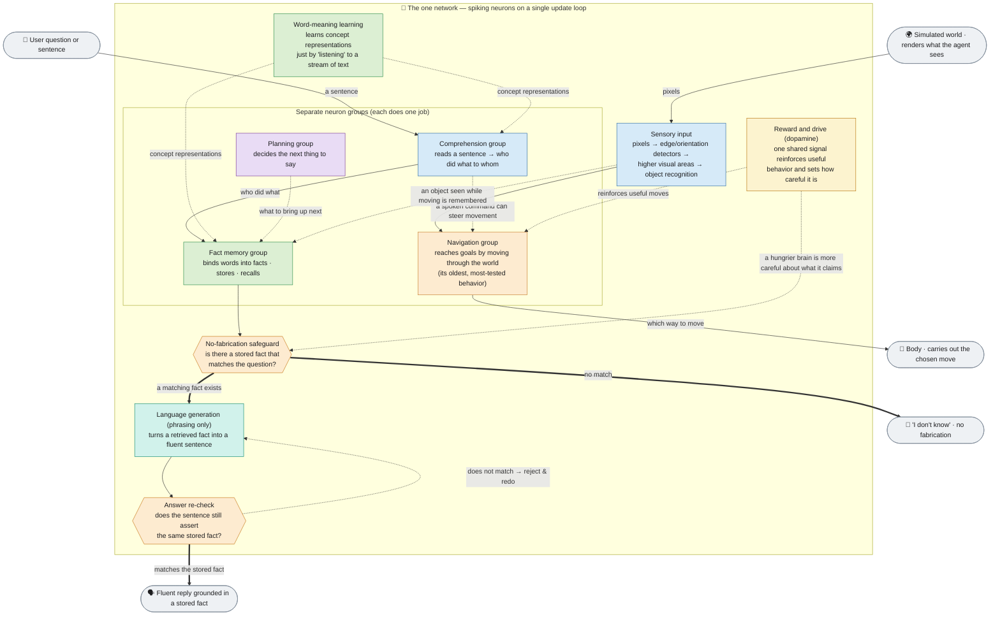
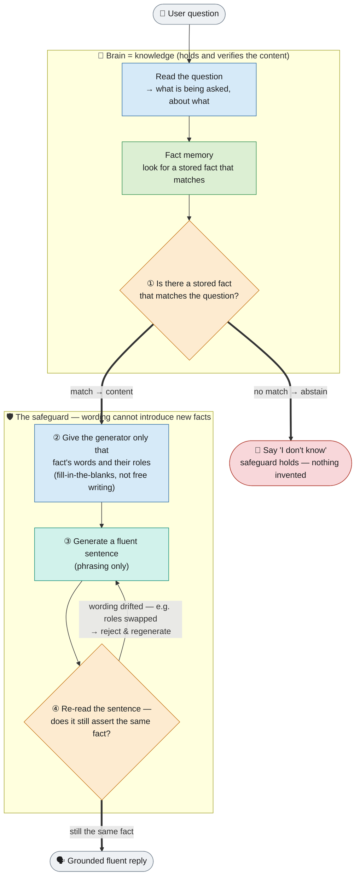
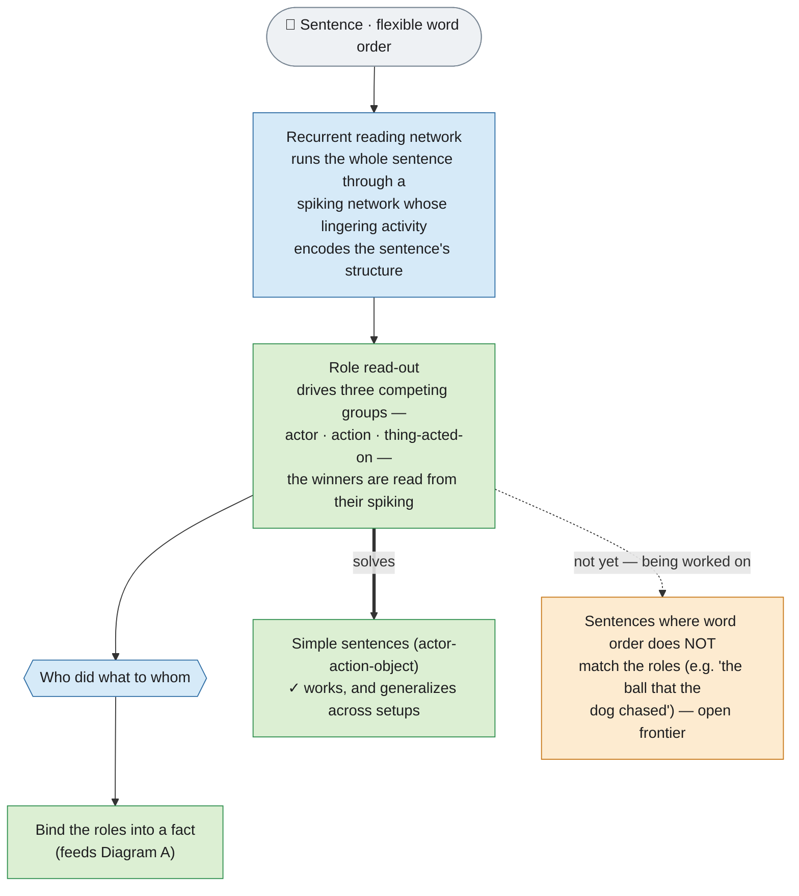
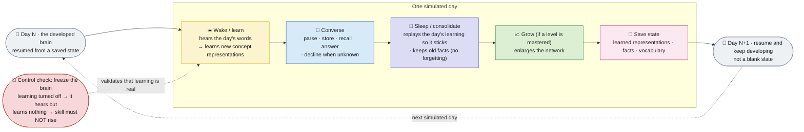

# Brain architecture — current state (reviewed 2026-07-22)

Plain-language, **as-implemented** flowcharts of the whole simulated brain.
These render directly on GitHub (Mermaid). They are written for a reader who has
never seen this codebase: every necessary technical term is defined once, in
plain words, then used.

> **For the full stage-by-stage development path** (what's done, in progress, and
> left, each mapped to the brain function it reproduces), see
> [`ROADMAP.md`](../../ROADMAP.md) — the project's source of truth. These
> flowcharts are the *signal-flow* companion to it.

**What this software is (one paragraph).** A GPU-accelerated simulator of a
network of biologically realistic neurons. "Spiking" means the neurons
communicate with discrete electrical pulses over time, the way real neurons do,
rather than the continuous numbers used in mainstream machine-learning models.
A single network runs on one update clock; different jobs (seeing, moving,
understanding language, remembering facts, planning what to say) occupy
separate, non-overlapping groups of neurons within that one network. Synapse
strengths change with experience through several standard learning rules. The
whole brain state can be saved and resumed, so it can be run forward over
simulated "days."

**The one guiding rule.** Everything between *sensing the world* and *acting on
it* is meant to be done by simulated neurons and synapses. Only the outside
**world** (what the agent sees, the environment's state) and the **body**
(turning a motor-neuron output into a movement) may be handled by ordinary
program code. Anything still computed by a plain formula — a reward, a decision,
a word choice — is treated as a temporary placeholder to be replaced by a real
neural mechanism, and where the neural version underperforms the placeholder,
that gap is reported honestly rather than hidden.

**A quick legend for the four unavoidable terms.**

| Term | Plain meaning |
|---|---|
| **The one network** | A single simulated brain of spiking neurons on one update loop; each job runs in its own neuron group inside it. |
| **Spiking neuron** | A model neuron that fires discrete pulses over time (the simulator's stand-in for a real neuron). |
| **Bind / compose a fact** | Combine several words (who / did-what / to-what) into a single stored fact the brain can later recall. |
| **No-fabrication safeguard** | The rule that the brain only states facts it actually holds; if nothing matches a question, it says "I don't know" instead of inventing an answer. |

---

## Diagram A — Whole-brain overview

Signal flows top to bottom: the world provides input, the one network does all
the cognition in separate neuron groups, and the body or the reply carries the
result back out. Solid arrows are the live signal path.

**How to read it.** The brain holds the *knowledge* (word-meaning learning +
fact memory + the safeguard); the generation step supplies *phrasing only*. A
conversational answer leaves the safeguard in one of two ways: it flows into the
generation-and-re-check path and emerges as a verified fluent reply, **or** —
if no stored fact matches — the reply is simply "I don't know." The navigation
group is a separate neuron group in the same network that reaches goals by
turning what it sees into movement — the project's oldest and most thoroughly
validated behavior, and the place where perception, action selection, reward, and
spatial memory come together into one living behavior. One shared reward-and-drive
signal (dopamine) reaches both halves — it reinforces useful moves and makes the
brain more careful about what it claims to know — and a few validated cross-links
tie the halves together: a spoken command can steer movement, and an object seen
while moving can be remembered and talked about later. All groups share one update
loop, which is what "one brain" means here.

---

## Diagram B — How the brain avoids making things up

The most distinctive design point. The brain supplies and verifies the
*content*; the language-generation step supplies only the fluent *wording*.
Three checks, cheapest first, make fabrication impossible by construction — a
fluent-but-false sentence is re-read and rejected before it can reach the user.

**The four steps.**
- **① Check first.** The fact memory decides *whether there is content to
  speak*. If no stored fact matches the question, the generator is given nothing
  to say, so the reply is "I don't know."
- **② Constrain.** The generator is handed only the matching fact's words and
  their roles, so its only freedom is grammar and phrasing — never the facts
  themselves.
- **③ Generate.** A fluent sentence is produced. This is the only step that is
  about wording rather than knowledge.
- **④ Re-check.** The generated sentence is read back by the same
  comprehension machinery and compared to the stored fact. If the wording has
  drifted (for example, if it swapped who-did-what-to-whom), it is rejected and
  regenerated. The failure direction is always the safe one — the brain may
  over-decline, but it will not fabricate.

**About the language-generation step.** There are two phrasing paths, both behind
the same "check first" safeguard, so neither can introduce a fact the brain does
not hold:
- For the brain's **own grounded answers**, a **transformer-free path** produces
  the reply directly as spiking neural activity: the grammatical structure (which
  small function words to use, the word order, which slots a sentence has) is
  *learned from example sentences* rather than hand-written, and every word —
  content *and* function words alike — is spoken as neural pulses on the shared
  network.
- For **open, casual prose** the simulator still leans on a **small, locally
  trained conventional language model** as a temporary crutch (the one remaining
  "external model" — see the roadmap's scaffold list). Its home-grown replacement
  has taken its **first real step**: an emergent, on-brain, no-backpropagation
  next-word predictor that learns from a text stream and already beats the
  standard simple baselines — so far over a small controlled vocabulary. The plan
  is to climb that ladder until the crutch is gone. The scariest-looking rung of
  that climb — learning *long-range* structure (what the transformer is uniquely
  good at) with only biological rules — was just de-risked: it turns out **not** to
  need the hard deep-recurrent-credit rewrite, but only learning the *input
  representation* on a *fixed* recurrent scaffold (which beats full backprop-through-
  time), reaching ~78% of that reference with fully-local rules and now being put on
  spikes with no engine edit (see [`ROADMAP.md`](../../ROADMAP.md) §9.1).

---

## Diagram C — Reading who-did-what from a sentence

A closer look at the comprehension group from Diagram A: how the brain works out
the grammatical roles (who is the actor, what the action is, what it is done to)
from a sentence, on the shared spiking network.

**The honest split.** The read-out that turns the reading network's activity
into role labels is now *learned by the network itself* (an earlier
formula-based stand-in has been removed). It reliably reads roles from word
*position*, which is enough for straightforward actor-action-object sentences.
Sentences whose word order does not line up with the roles — such as relative
clauses — are a precisely characterized *open frontier*, actively being worked
on, not treated as a permanent limit.

---

## Diagram D — Learning and development over simulated days

The whole brain can be run forward over simulated time. Each "day" it hears a
gradually richer stream of words, learns from them, converses using what it
learned, "sleeps" so the new learning sticks without erasing old facts, grows if
it has mastered a level, and saves itself so the next day resumes the same brain
rather than starting blank.

**Feasibility.** Simulating a "day" takes a couple of minutes at demonstration
scale, so a simulated "week" runs in minutes and a simulated "year" in an
overnight local run — no special hardware wall. Over a multi-day run the brain
has been shown to grow its vocabulary and stored facts while retaining old ones,
and to resume correctly from a saved state.

---

## Where a person watches and interacts

The diagrams above are the brain's internal signal flow. In practice a person
uses the simulator through two surfaces, both outside the neural computation:

- a **real-time 3-D viewer** that shows the network's activity as it runs, and
- a **web console** for launching runs, visualizing them, and **chatting** with
  the brain (typing a sentence, asking a question, teaching it a new fact).

These are the human's window into the system; the cognition itself all happens
inside the one network shown above.

---

## Honest status and scope

These diagrams are accurate **to the degree the biology is implemented in this
simulator**, not to the degree real brains are organized — an honest map of the
code, including its simplifications.

- **Mature and demonstrated:** the simulation engine, the region/pathway
  framework, the learning rules, the 3-D visualization, and the navigation
  agent (validated across many random seeds).
- **A genuine, growing capability — but specialized:** the conversational agent
  is built entirely from simulated neural circuits (not a bolted-on external
  chatbot). Its core behaviors — parsing short sentences, storing facts,
  answering who/what and yes/no questions, handling negation, declining to answer
  when it was never told the fact, discovering categories and *reasoning* beyond
  what it was told (a robin inherits that a bird can fly), a grammar it
  *self-organized* from example text, **tracking who is being talked about across
  a multi-turn conversation** (including who was acting *before* a topic shift)
  and resolving pronouns — are demonstrated and validated across random seeds at a
  few-hundred-concept scale. Richer abilities (objects described by two attributes
  at once, sentences where word order does not match the roles, and fully
  open-ended prose) are exploratory or honestly documented as current limits, not
  finished features.
- **Active research direction:** pushing the entire conversational pipeline to
  run as spiking neurons within the single shared network, and mapping the
  points where a simple neuron model reaches its limits — recording honest
  negative results as scientific findings rather than hiding them.

For the exhaustive per-region / per-synapse detail (every region, every distinct
pathway, and the faithful-vs-simplified markers), see the hand-authored detail
diagrams in this folder: the **navigation brain**
([`brain_navigation.svg`](brain_navigation.svg) · [`.png`](brain_navigation.png)),
the **conversational brain**
([`brain_conversational.svg`](brain_conversational.svg) · [`.png`](brain_conversational.png)),
and the **master map**
([`brain_master.svg`](brain_master.svg) · [`.png`](brain_master.png)).

> **Currency note (important).** These hand-drawn detail SVGs are a **snapshot as
> of 2026-06-22**. What they still show accurately: the region inventories, the
> navigation cascade, and the no-fabrication safeguard. What they **do not yet
> show** (all developed 2026-07): the fully self-organized grammar and
> spoken-on-spikes production, the reservoir that *learns* word-order→role
> comprehension, the multi-turn discourse register (who-now vs who-before), and
> the first rung of the emergent (transformer-free) open-generation path. For the
> current, complete picture use the Mermaid flowcharts above and
> [`ROADMAP.md`](../../ROADMAP.md); a full redraw of the exhaustive per-synapse
> SVGs is a tracked follow-up (a larger design pass).
