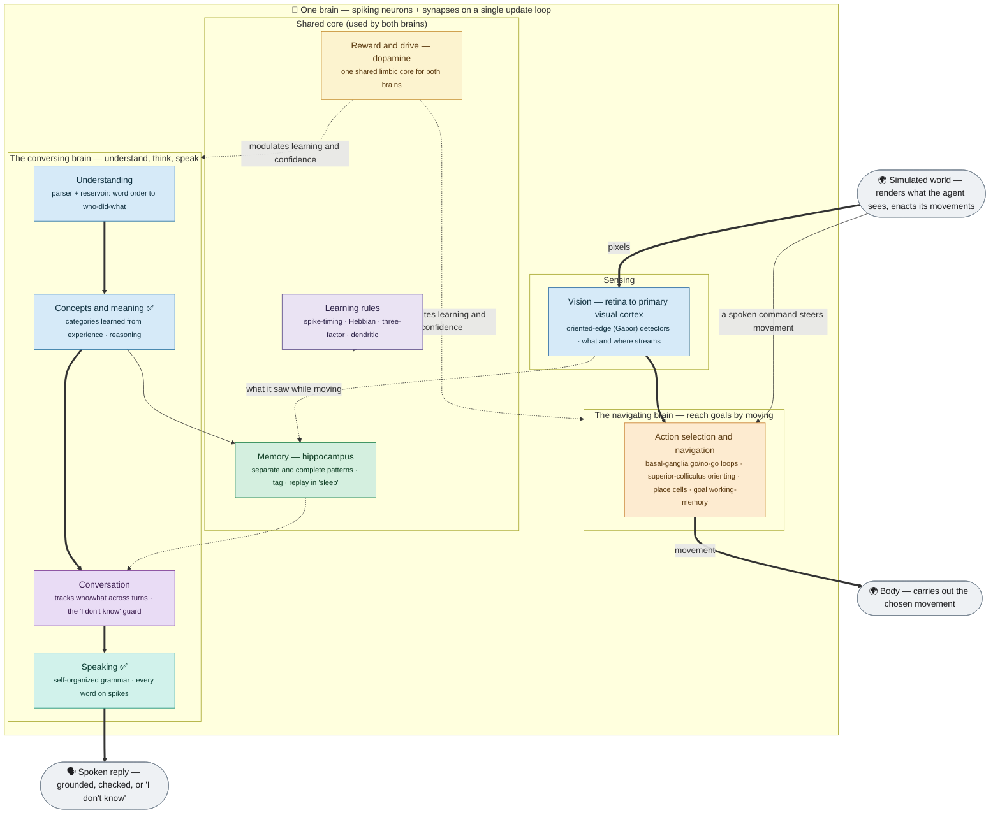
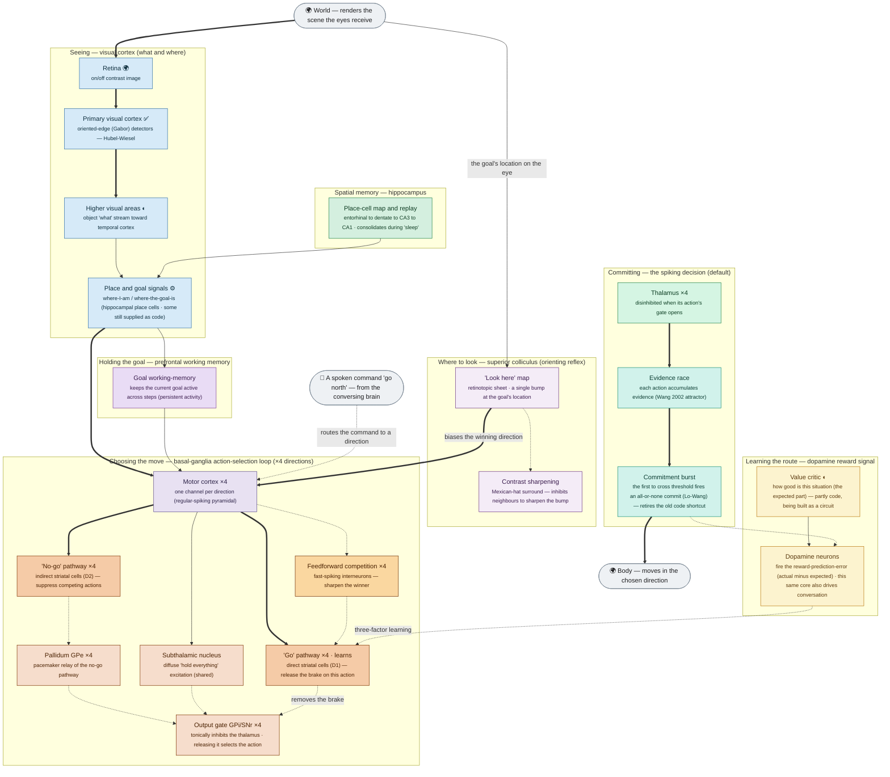
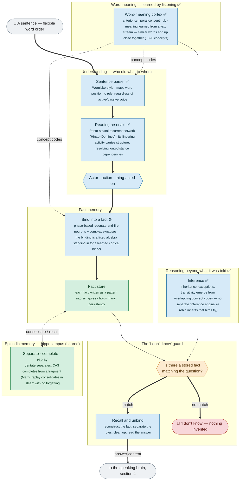
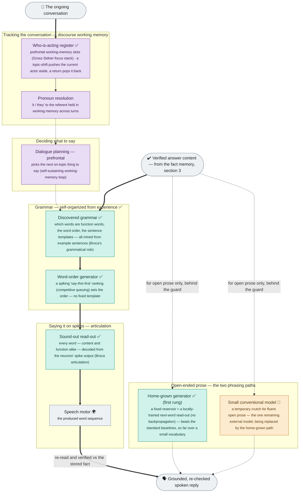
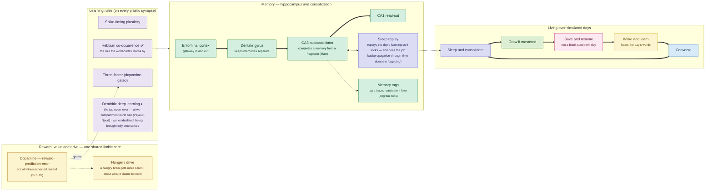

# Brain architecture — detailed diagrams (current)

Exhaustive, **as-implemented** diagrams of the whole simulated brain: every region, every distinct pathway, grouped by function, in plain language backed by the biology it reproduces. These render directly on GitHub (Mermaid) and are the maintainable, **current** replacement for the earlier hand-drawn SVGs (a 2026-06 snapshot). For the plain-language overview see [`brain_architecture_current.md`](brain_architecture_current.md); for the full stage-by-stage development path and status see [`ROADMAP.md`](../../ROADMAP.md).

**Last synced:** 2026-07-10.

### How to read every diagram

Each box is a group of neurons doing one job, labelled with its **plain function** and, in smaller text, the **brain structure it reproduces**. A small marker in the label shows what kind of thing it is:

| Marker | Meaning |
|---|---|
| *(no marker)* | a spiking neural circuit — the default |
| ✅ | **learned from experience** (the structure was discovered, not hand-designed) |
| ⚙ | a **fixed, hand-designed** mechanism — biologically defensible, but not itself learned (a stand-in to replace) |
| 🧩 | a **temporary external model** (the one crutch, to be replaced by circuitry) |
| 🌍 | the legitimate **world / body interface** (allowed non-neural code: the environment and the muscles) |
| ◐ | present in a **reduced / partial** form |

Arrow styles: a **solid** arrow is an excitatory (driving) signal; a **dotted** arrow is inhibitory or a gating/modulatory signal; a **thick** arrow is the main signal path.

---

## 1. Master map — the whole brain, one engine, two configurations

The simulator is *one* network of spiking neurons on a single update loop. From that one substrate, two configurations are assembled — a **navigating** brain and a **conversing** brain — that share the same engine, the same memory, and one dopamine/limbic core, and are joined by validated synaptic links.

---

## 2. The navigating brain — reach goals by moving, using only what it sees

The project's oldest and most-tested behaviour: an agent explores a world and reaches (or re-reaches, when it moves) a goal, choosing each step by a **spiking evidence-race** through the basal ganglia — the hand-coded winner-take-all shortcut is retired. Per-direction pools (north/east/south/west) are drawn once with a ×4 badge.

---

## 3. The conversing brain — understanding and memory

How a sentence becomes a stored, recallable fact. The brain holds and verifies the *content*; the "I don't know" guard makes fabrication impossible by construction.

---

## 4. The conversing brain — speaking and conversation

Turning a verified fact into a spoken reply, tracking who is being talked about across turns, and the two phrasing paths (both behind the guard). Every word — content *and* function words — is produced as spiking activity.

---

## 5. Shared systems — memory, reward, learning, development

Systems both brains use, and how the whole brain lives over time.

---

## What the diagrams deliberately simplify

- **Per-direction and per-concept pools are collapsed** (a "×4" or "×N" badge) — the real network has one pool per direction (north/east/south/west) and per concept.
- **A few regions are drawn once but are shared** by both configurations (the hippocampus, the dopamine core).
- The brain is **assembled per configuration** from a declarative region/pathway grammar; a given run builds a subset of what's shown (these diagrams show the fuller picture).
- Anything marked ⚙ (a fixed stand-in), 🧩 (the external crutch), or ◐ (partial) is a tracked item on the way to being replaced or completed — see [`ROADMAP.md`](../../ROADMAP.md) sections 8 and 9 for each one's replacement plan.
