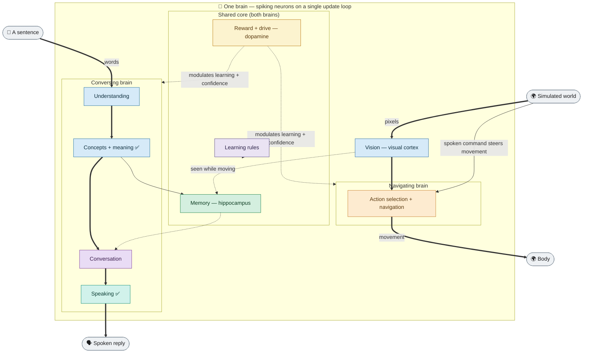
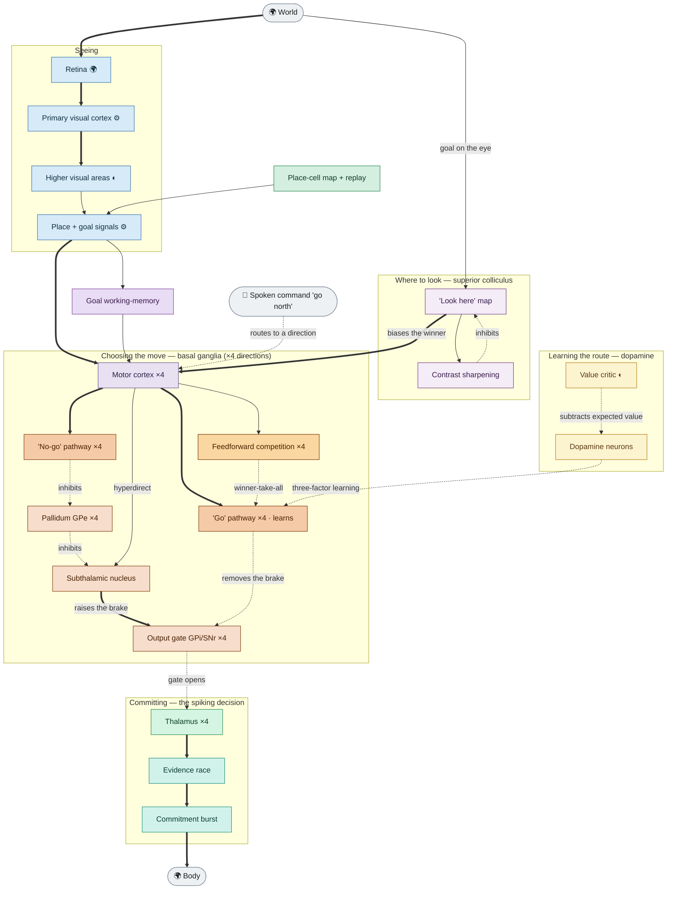
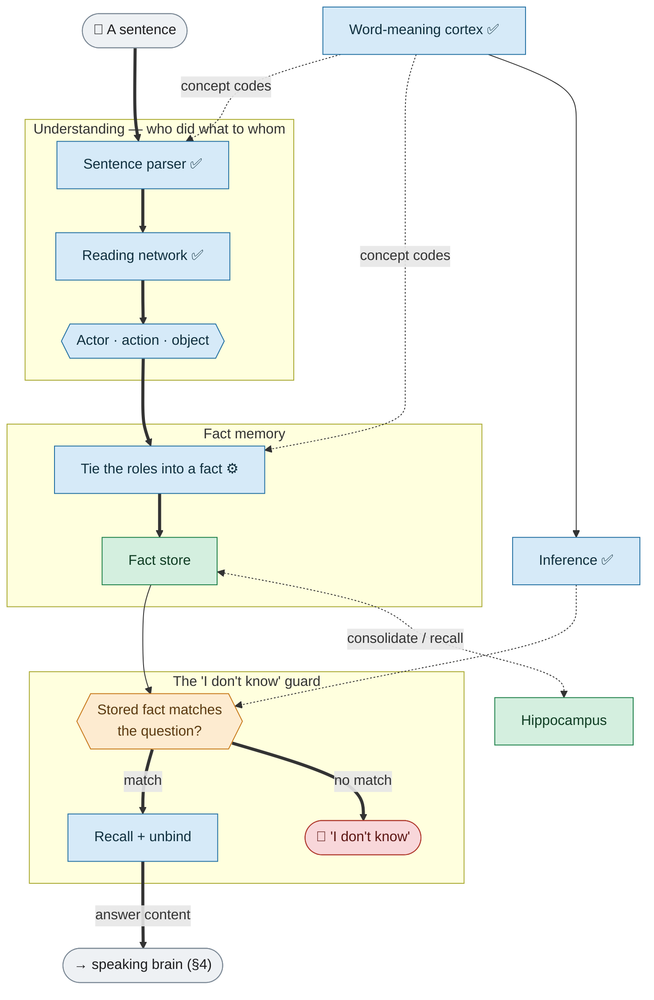
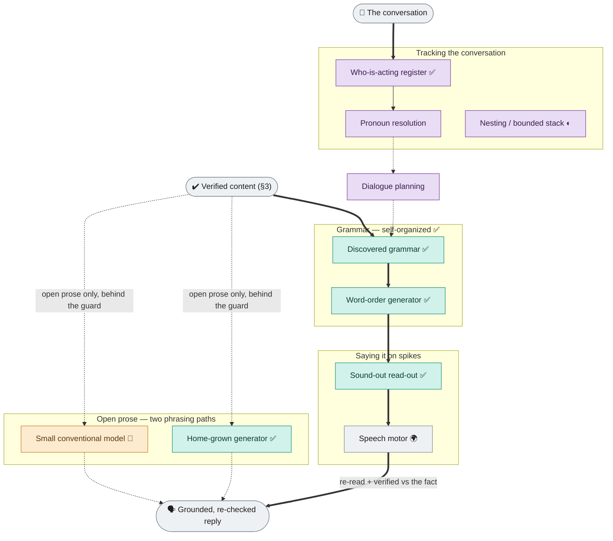
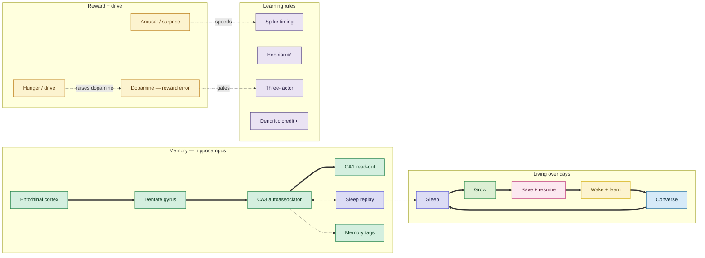

# Brain architecture — detailed diagrams (current)

Exhaustive, **as-implemented** diagrams of the whole simulated brain: every region, every distinct pathway, grouped by function, in plain language backed by the biology it reproduces. Each diagram keeps its boxes short (so they render cleanly) and is followed by a **detail table** giving each box's function, the brain structure it reproduces, and its status. These render directly on GitHub (Mermaid) and are the maintainable, **current** replacement for the earlier hand-drawn SVGs (a 2026-06 snapshot). See also the plain-language overview [`brain_architecture_current.md`](brain_architecture_current.md) and the full development [`ROADMAP.md`](../../ROADMAP.md).

**Last synced:** 2026-07-11.

### Status markers (used in every box and table)

| Marker | Meaning |
|---|---|
| *(none)* | a spiking neural circuit — the default |
| ✅ | **learned from experience** (the structure was discovered, not hand-designed) |
| ⚙ | a **fixed, hand-designed** mechanism — biologically defensible, but not itself learned (a stand-in to replace) |
| 🧩 | a **temporary external model** (the one crutch, to be replaced by circuitry) |
| 🌍 | the legitimate **world / body interface** (allowed non-neural code: the environment and the muscles) |
| ◐ | present in a **reduced / partial** form |

Arrow styles: **solid** = an excitatory (driving) signal; **dotted** = inhibitory or a gating/modulatory signal; **thick** = the main signal path. *Working memory is one shared faculty that appears in several diagrams — holding the goal (§2), the reading network's lingering activity (§3), and the discourse register (§4).*

---

## 1. Master map — the whole brain, one engine, two configurations

| Box | What it is | Status |
|---|---|---|
| Vision — visual cortex | Retina → primary visual cortex; orientation-selective edge detectors; "what" and "where" streams | ⚙/◐ |
| Action selection + navigation | The navigating brain: basal-ganglia go/no-go loops, superior-colliculus orienting, place cells, goal working-memory (detailed in §2) | 🟩 |
| Understanding | Reads a sentence into who-did-what — parser + reading network (detailed in §3) | ✅ |
| Concepts + meaning | Categories and word meaning learned from experience; reasoning beyond what it was told | ✅ |
| Speaking | Grammar self-organized from experience; every word produced on spikes (detailed in §4) | ✅ |
| Conversation | Tracks who/what across turns; the "I don't know" guard | ✅ |
| Memory — hippocampus | Separate + complete patterns, memory tags, replay in "sleep" (detailed in §5) | 🟩 |
| Reward + drive — dopamine | One shared limbic core driving both brains | 🟩 |
| Learning rules | Spike-timing, Hebbian, three-factor, dendritic (detailed in §5) | 🟩 |

---

## 2. The navigating brain — reach goals by moving, using only what it sees

The project's oldest and most-tested behaviour: an agent explores a world and reaches (or re-reaches, when it moves) a goal, choosing each step by a **spiking evidence-race** through the basal ganglia — the earlier hand-coded pick-one-winner shortcut is retired. Per-direction pools (north/east/south/west) are shown once with a ×4 badge.

| Box | What it is (brain structure · function) | Status |
|---|---|---|
| Retina | On/off contrast image of the scene — the world/body interface | 🌍 |
| Primary visual cortex | Orientation-selective edge detectors (Hubel-Wiesel simple cells, modelled as fixed Gabor filters) | ⚙ |
| Higher visual areas | Object "what" stream toward temporal cortex | ◐ |
| Place + goal signals | Where-I-am / where-the-goal-is (hippocampal place cells; still partly hand-supplied) | ⚙ |
| "Look here" map | Superior-colliculus retinotopic sheet — a single bump at the goal's location | ● |
| Contrast sharpening | Mexican-hat surround — excited by the map, inhibits it back to sharpen the bump | ● |
| Goal working-memory | Prefrontal cortex — keeps the current goal active across steps (persistent activity) | ● |
| Motor cortex ×4 | One channel per direction (regular-spiking pyramidal) | ● |
| "Go" pathway ×4 | Direct striatal cells (D1) — release the brake on this action; **the learning site** | ● learns |
| "No-go" pathway ×4 | Indirect striatal cells (D2) — suppress competing actions | ● |
| Feedforward competition ×4 | Fast-spiking interneurons — sharpen the winner | ● |
| Pallidum GPe ×4 | Relay of the no-go pathway (inhibits the subthalamic nucleus) | ● |
| Subthalamic nucleus | Glutamatergic — diffuse "hold everything" excitation onto the output gate (the shared brake) | ● |
| Output gate GPi/SNr ×4 | Tonically inhibits the thalamus; releasing it selects the action | ● |
| Thalamus ×4 | Disinhibited when its action's gate opens | ● |
| Evidence race → Commitment burst | Each action accumulates evidence (Wang 2002); the first past threshold fires an all-or-none commit (Lo-Wang) — replaces the earlier hand-designed pick-the-winner step | ● (default) |
| Dopamine neurons | Fire the reward-prediction-error (actual − expected); this same core also drives conversation | ● |
| Value critic | The "expected" part — subtracts expected value to form the error (partly code, being built as a circuit) | ◐ |
| Place-cell map + replay | Hippocampus (entorhinal → dentate → CA3 → CA1); consolidates during "sleep" | 🟩 |

---

## 3. The conversing brain — understanding and memory

How a sentence becomes a stored, recallable fact. The brain holds and verifies the *content*; the "I don't know" guard makes fabrication impossible by construction.

| Box | What it is (brain structure · function) | Status |
|---|---|---|
| Word-meaning cortex | Anterior-temporal concept hub; meaning learned from a text stream so similar words end up close together (~320 concepts; one normalization step still done in code) | ✅ |
| Sentence parser | Language-comprehension cortex (Wernicke's area) — maps word position to role, regardless of active/passive voice | ✅ |
| Reading network | A fixed recurrent network (Hinaut-Dominey) whose lingering activity carries structure; a **trained read-out** pulls out the roles, resolving long-distance dependencies | ✅ (read-out) |
| Tie the roles into a fact | Timing/phase-signalling neurons lock actor + action + object into one reusable pattern; a fixed mathematical rule stands in for a binding step the cortex would normally learn | ⚙ |
| Fact store | Each fact written as a pattern into synapses; holds many, persistently | ● |
| Inference | Inheritance, exceptions, transitivity emerge from overlapping concept codes — no separate "inference engine" (a robin inherits that birds fly) | ✅ |
| The "I don't know" guard | Checks for a matching stored fact first; recalls + unbinds it if found, else abstains — nothing is invented | ● |
| Hippocampus | Episodic store: dentate separates, CA3 completes from a fragment (Marr), replay consolidates in "sleep" with no forgetting | 🟩 |

---

## 4. The conversing brain — speaking and conversation

Turning a verified fact into a spoken reply, tracking who is being talked about across turns, and the two phrasing paths (both behind the guard). Every word — content *and* function words — is produced as spiking activity.

| Box | What it is (brain structure · function) | Status |
|---|---|---|
| Who-is-acting register | Prefrontal working-memory slots (Grosz-Sidner focus stack) — a topic shift pushes the current actor aside, a return pops it back | ✅ |
| Pronoun resolution | "It / they" → the referent held in working memory across turns | ● |
| Nesting / bounded stack | A slotted buffer (Lisman-Idiart theta-gamma) matches nested structure up to depth ~3 — the human-faithful limit | ◐ |
| Dialogue planning | Prefrontal — picks the next on-topic thing to say (self-sustaining working-memory loop) | ● |
| Discovered grammar | Which words are function words, the word order, the sentence templates — all mined from example sentences (Broca's grammatical role) | ✅ |
| Word-order generator | A spiking "say-this-first" ranking (competitive queuing) sets the order — no fixed template | ✅ |
| Sound-out read-out | Every word (content and function alike) decoded from the neurons' spike output (Broca articulation) | ✅ |
| Home-grown generator | For open prose: a fixed recurrent network + a small next-word read-out trained locally (not by the usual global method) — beats simple predictors, so far over a small vocabulary (first rung) | ✅ |
| Small conventional model | A temporary crutch for fluent open prose — the one remaining external model, being replaced by the home-grown path | 🧩 |

---

## 5. Shared systems — memory, reward, learning, development

| Box | What it is | Status |
|---|---|---|
| Hippocampal loop (entorhinal → dentate → CA3 → CA1) | Dentate separates memories, CA3 completes one from a fragment (Marr), CA1 reads out | 🟩 |
| Sleep replay | Replays the day's experience during "sleep" so it sticks — learning sequences over time without overwriting older memories | 🟩 |
| Memory tags | Tag a trace, reactivate it later (engram cells) | 🟩 |
| Dopamine — reward error | Actual − expected reward (Schultz) — gates three-factor learning | ● |
| Hunger / drive | A hungry brain raises dopamine, making it more careful about what it claims to know | ● |
| Arousal / surprise (noradrenaline) | An unexpected outcome speeds up learning | ● |
| Learning rules | Spike-timing plasticity; Hebbian co-occurrence (✅ how the word-cortex learns); three-factor (dopamine-gated); **dendritic credit assignment** (◐ the open lever for the *deep-composition* ceilings — a two-compartment burst rule, Payeur-Naud, idealized now, being brought fully onto spikes); **local input-representation learning on a fixed reservoir** (the *long-range-language* lever — a fixed random recurrent scaffold that learns only its input, beating full backprop; ~78% biology-legal, going onto spikes now with no engine edit — see [`ROADMAP.md`](../../ROADMAP.md) §9.1) | mixed |
| Living over days | Wake + learn → converse → sleep + consolidate → grow → save + resume (not a blank slate next day) | 🟩 |

---

## What the diagrams deliberately simplify

- **Per-direction and per-concept pools are collapsed** (a "×4" or "×N" badge).
- **Some regions are shared** and drawn once (the hippocampus, the dopamine core).
- The brain is **assembled per configuration** from a declarative region/pathway grammar; a given run builds a subset of what's shown.
- **Noradrenaline / serotonin / acetylcholine** are framework-supported but only partly used (◐); dopamine is fully deployed.
- **The human interfaces** — the real-time 3-D viewer, the talkable chat console, the develop-over-days launcher, the experiment system, and the biological validation suite — are the windows into the brain, not brain computations, and are described in [`ROADMAP.md`](../../ROADMAP.md) §7 rather than drawn here. The **cerebellum** is intentionally absent (cell presets only, no circuit — an open item, ROADMAP §6).
- Anything marked ⚙ (a fixed stand-in), 🧩 (the external crutch), or ◐ (partial) is a tracked item — see [`ROADMAP.md`](../../ROADMAP.md) §8–9 for each one's replacement plan.
