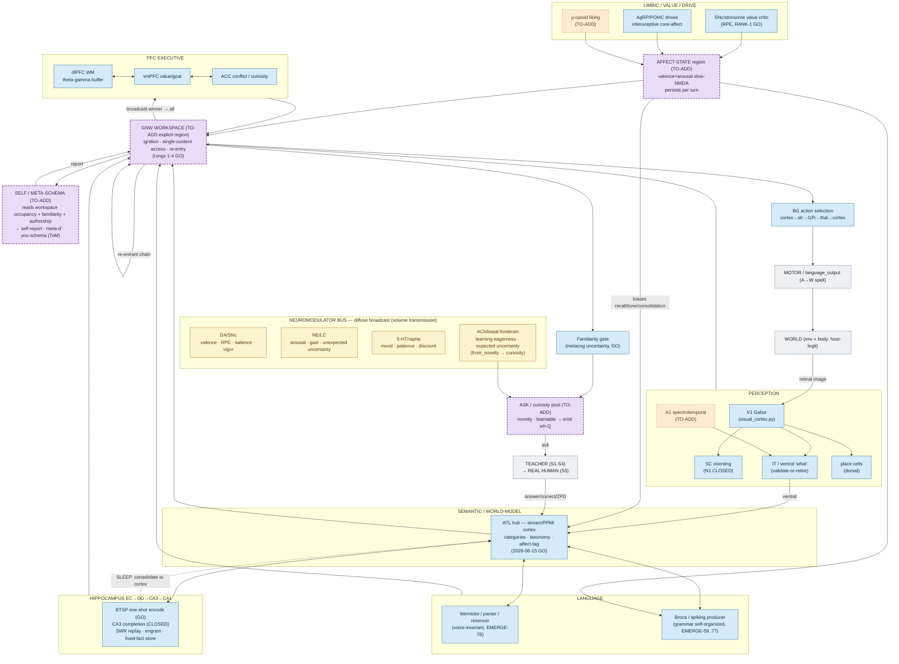

# Brain architecture — target one-brain connectivity (2026-07-23)

The **target full architecture** for the genuinely-conversing, feeling, self-aware
sim-brain: every faculty as disjoint neuron-index slices (`BrainRegion`) on ONE
`SimulationBridge`, wired by declared `RegionPathway`s, with the neuromodulator bus
as the diffuse limbic→everything broadcast. This is the diagrams-folder companion
to **§3 of the master roadmap**
([`docs/plans/2026-07-23-MASTER-DEVELOPMENT-ROADMAP.md`](../plans/2026-07-23-MASTER-DEVELOPMENT-ROADMAP.md)),
extracted here as a maintainable standalone source with a HAVE/TO-ADD legend and
per-integrator status.

> **Where this fits among the diagrams.** The two sibling docs are strictly
> *as-implemented* signal flow — [`brain_architecture_current.md`](brain_architecture_current.md)
> (plain-language overview) and [`brain_architecture_detailed.md`](brain_architecture_detailed.md)
> (exhaustive per-region). **This** doc is the *target* — it draws the same
> already-built faculties **plus the four planned integrators** (affect-state,
> self/meta-schema, ASK/curiosity pool, an explicit GNW workspace) that turn a
> battery of co-resident faculties into a single, self-aware, feeling stream of
> thought. Nodes not yet wired are marked and dashed, so the figure doubles as a
> build map.

**What already co-resides in one process.** The merged nav+conv brain proves
parser + dlPFC + RF composer + nav cascade + limbic co-reside and interact in a
single process, one backend, one update loop (EMERGE-70/71). Everything below the
world/body boundary is neurons and synapses; only the **world** (environment state,
rendering what the agent sees) and the **body** (turning a motor-pool output into a
movement) are host-legitimate.

---

## Legend

| Style | Meaning |
|---|---|
| solid box, blue/green fill | **HAVE** — an implemented spiking faculty (validated, at least in a reduced form) |
| **purple dashed box** | one of the **four to-add integrators** — the headline of the current build (affect-state · self/meta-schema · ASK/curiosity · GNW workspace) |
| orange dashed box | another **to-add / validate-or-retire** faculty (A1 audition, µ-opioid liking) |
| yellow box | the **neuromodulator bus** — diffuse volume transmission (`scope="all"` / `scope="region:X"`), not point-to-point |
| grey box | the host-legitimate **world / body / teacher** interface |
| solid arrow | a driving signal · **dotted arrow** | a modulatory / gating / consolidation signal |

**Three invariants the wiring enforces.** (1) the **GNW workspace is the single
integrator** — one coalition ignites and broadcasts at a time, which is what makes
*one* train of thought possible; (2) **limbic → everything is diffuse volume
transmission** (the yellow bus modulates all regions at once — drawn as a bus, not
as N×M point-to-point edges); (3) **hippocampus ↔ cortex is bidirectional and
time-separated** — fast WAKE encoding vs slow SLEEP consolidation (complementary
learning systems).

---

## The one-brain connectivity diagram

---

## The four to-add integrators — what each adds, and its status

These are the pieces that turn the co-resident faculty battery into a single,
self-aware, feeling stream of thought. Three of the four already have a **Phase-0
foundation validated 6-seed GO and committed (2026-07-23)**; the GNW workspace has
its ignition/access/re-entry rungs proven and needs promotion to an explicit region.

| Integrator | What it adds to the one brain | Reads from | Writes to | Status (2026-07-23) |
|---|---|---|---|---|
| **AFFECT-STATE** (purple) | A persistent valence×arousal core-affect that carries *across a conversational turn* (slow-NMDA), so mood biases recall, tone, and consolidation — the "feeling" substrate | SNc value · AgRP/POMC drive · µ-opioid liking | ATL (recall/tone bias) · Broca (tone) · workspace | Phase-0 GO — affective-concept-tagging: concepts learn valence from the learned association graph, held-out *r* 0.81 ([`DR2`](../../research/findings/2026-07-23-DR2-affective-concept-tagging-6seed-GO.md)) |
| **SELF / META-SCHEMA** (purple) | A region that reads the workspace's own occupancy + familiarity + authorship and reports it — a functional self-awareness correlate (self-report, meta-*d′*, a you-schema for ToM) | GNW workspace | workspace (report) | Phase-0 GO — self-schema region reads+reports its own attention/confidence/authorship on spikes ([`DR3`](../../research/findings/2026-07-23-DR3-self-schema-region-6seed-GO.md)) |
| **ASK / CURIOSITY POOL** (purple) | Turns the no-confab moat's *uncertainty* signal into an honest curiosity drive — asks a wh-question when novelty is high **and** learnable, and stays quiet on unlearnable noise | Familiarity gate · ACh (novelty) | Teacher (emits the question) | Phase-0 GO — curiosity-inversion: asks + learns, stops on unlearnable noise ([`DR1`](../../research/findings/2026-07-23-DR1-curiosity-inversion-6seed-GO.md)) |
| **GNW WORKSPACE** (purple) | The single global integrator: one coalition ignites, gains single-content access, and re-enters — the invariant that makes *one* train of thought possible | all faculties (SENSE · ATL · HIPPO · LANG · PFC · AFFECT) | broadcast → PFC · re-entrant → itself · BG · SELF · FAM | Rungs 1–4 GO — needs promotion from the validated mechanism to an **explicit** `BrainRegion` |

**Note on the value critic.** The SNc box's "RPE, RANK-1 GO" reflects the
2026-07-23 value-critic closure ([`value-critic-closure-RANK1-GO`](../../research/findings/2026-07-23-value-critic-closure-RANK1-GO.md)) —
the shared limbic core that feeds AFFECT-STATE.

---

## Relationship to the roadmap and the other diagrams

- **Roadmap §3** (master development roadmap) is the authoritative source of this
  figure; it also states the staged timeline that brings each to-add integrator
  online (caudo-rostral maturation gradient: sensory → association → PFC-last).
  This file is the maintained diagrams-folder mirror of that figure — keep the two
  in sync when either changes.
- **[`brain_architecture_current.md`](brain_architecture_current.md)** and
  **[`brain_architecture_detailed.md`](brain_architecture_detailed.md)** are the
  *as-implemented* companions — they draw only what is built today (no to-add
  integrators). Use those for the current signal flow; use *this* for the target.
- The hand-authored SVGs (`brain_master`, `brain_navigation`,
  `brain_conversational`) are an archived **2026-06 snapshot** and predate both the
  2026-07 language arcs and the four integrators. They are **not** regenerated here
  (this Mermaid source renders natively on GitHub; no PNG step). A full redraw of
  the exhaustive per-synapse SVGs to the target architecture is a tracked follow-up.
