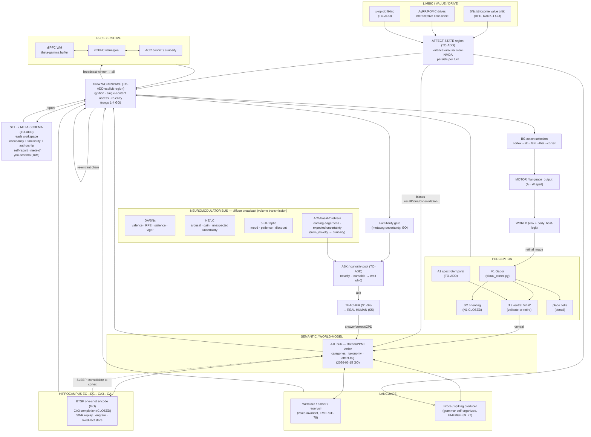

# MASTER DEVELOPMENT ROADMAP — toward a genuinely-conversing, feeling, self-aware sim-brain

**Status:** LIVING master plan. Created 2026-07-23; **last synced 2026-08-14** (2026-08-14 continuation wave — see the §0 continuation block below; prior big 2026-08-12/13 production-wiring + faculty-audit wave landed; **read §0 first** — it is the current forward truth and supersedes any older status below where they disagree). Update it as results/walls land.
**Supersedes-by-extension:** `docs/plans/2026-07-22-genuine-conversation-affective-self-aware-brain-plan.md` (that plan's F1–F6 are absorbed here as sub-faculties; this doc adds the full faculty map, the developmental staging spine, the theory-of-mind ladder the F-plan omitted, the walls ledger, and the parallelization map).
**Anchors:** `GAP_CLOSURE_MISSION.md` · `CLAUDE.md` · the master directive (`project_master_directive_relentless_biological_emergence`).
**⭐ FACULTY-MAP GAP AUDIT + PRIORITIZED BUILD PLAN (2026-08-12, a 12-agent grounded audit):** `docs/plans/2026-08-12-faculty-map-gap-audit-and-roadmap.md` — the honest reckoning (the live brain is ~ONE integrated spiking family + a bench of ~40 unwired GOs; several organ internals still host-designed) and the Tier-1/2/3 next-faculty priorities. The keystone is a NEURAL WORKSPACE BUS (GNW ignition) + re-entrant deliberation (organs talk via ignition not Python; ACT on the conflict/confidence signals we only report). Read it for the forward faculty priorities; this master doc's §§2/7/8 remain the faculty-tag / wall-ledger / parallelization detail.

---

## 0. STATE AS OF 2026-08-13 — what is live, and the ordered path (READ FIRST)

> This section is the current forward truth. It supersedes any older status below where they disagree. Companions: the
> DONE-work log in prose is [`ROADMAP.md`](../../ROADMAP.md); the forward FACULTY detail (Tier-1/2/3 + sequencing) is the
> [faculty-map gap audit](2026-08-12-faculty-map-gap-audit-and-roadmap.md); the host-shortcut worklist is
> [`docs/BURN_DOWN_LIST.md`](../BURN_DOWN_LIST.md); the machine-checked wiring truth is
> [`docs/PRODUCTION_INTEGRATION_LEDGER.yaml`](../PRODUCTION_INTEGRATION_LEDGER.yaml). This doc is the single PLAN that
> ties them to the staged path.

> **🛠️ 2026-08-14 CONTINUATION WAVE (updates §0.1/§0.2 — read this FIRST):** an 8-lane autonomous wave landed on main
> + both remotes. **ONE-SUBSTRATE (Track 1):** the COMPOSER (core moat organ) now joins production pool #1 — first opt-in
> (`562cbff5c`) then **production-DEFAULT** (`77759c2dc`, independently re-verified 1/1 + agent 6/6: byte-identical through
> the real handler, moat abstains, genuinely one pool N=47440, det 9/9) — so the shipped brain's recall RF-pipeline shares
> ONE `cp_membrane_potential_v` with surprise + world-model BY DEFAULT (residual: the config-coupled Hebbian PARSER stays
> on a private bridge — next lever named). A config-SUPERSET merge (surprise GABA_B + Wong-Wang comprehension NMDA) mapped
> its conflict to `enable_homeostasis` NOT dt (`994ed8c0e` BOUNDARY); the ALREADY-SHIPPED `BrainRegion.enable_homeostasis`
> primitive (NO sim/ edit — the boundary had conflated it with `per_region_homeostasis_isolation`) then RECONCILED
> comprehension 6/6 (AUC 1.000, byte-id, answer-preserved), leaving a mapped surprise-side residual (`944b0fc4a`; next:
> threshold-robust surprise read + restore cross-drive under role-homeo-OFF). **FLUID MOUTH (Track 2):** the input
> projection `Wv@LN(emb)` is on the substrate → the WHOLE mouth matmul chain is now signed graded-conductance reads
> (`055bfdf2d`); the read-out WEIGHTS are now LEARNED on-substrate by a local three-factor e-prop rule (qualified GO 6/6,
> `6070d79d` — retires the copied Qwen `head_w`; the learning forward used a host-linear proxy → batched-substrate-forward
> = named next lever). **FACULTY:** the self-initiated UTTERANCE loop CLOSES (`26bdae143` — a spontaneous curiosity-selected
> CA3 thought is SPOKEN, 6/6). **BREADTH (disjoint CPU lanes):** GNW Rung-2b — intrinsic SFA is NOT the workspace-eviction
> effector (`3a5db012` BOUNDARY, fatigue-to-evict==fatigue-that-kills; next = a salience-gated dis-inhibition pulse) but it
> PROVED the continuous no-reset protocol (0 `_restore_state`); Perception B1 V1 self-org operating-point re-test in
> flight. Honest reckoning UNCHANGED at the top level: the shipped brain is still ~ONE integrated spiking family + a bench
> of unwired GOs; the 3 missing properties remain FLUID mouth · ONE substrate · EMERGENT — but the composer default-flip is
> a real one-substrate step and the mouth is now substrate-plumbed with learned read-out weights.

> **🌙 2026-08-13 OVERNIGHT WAVE (updates §0.1/§0.2 below — read this first):** A 7-lane wave-3 + 3-lane wave-4 landed
> (all on main + both remotes @ `789481fc2`). **ONE-SUBSTRATE step:** the GNW N-organ ignition BUS was FLIPPED from
> shadow to the DEFAULT organ-combination on `/api/brain-chat` (`789481fc2`) — the substrate's consensus-ignition + WTA
> now AUTHORS the combination verdict, replacing host `if recalled == p`, 22/22 byte-identical across query classes,
> moat-holding, lesion-collapses-the-ANSWER, escape `BRAIN_GNW_BUS_HOST=1`. So §0.2 residual #1 ("combination is HOST
> control flow") is PARTIALLY surpassed: combination is now substrate-ignition on the default path (routing/sequencing +
> the host `gate()` code still run computed-then-overridden → `scaffold_retired: NO`; full retirement = a `gate_via_bus`
> that never computes the host combination). **WIRED:** T1-4 causal why/what-if organ (`79223e8c1`, DO-probe + forward-sim,
> moat-confirmed). **GO de-risks:** emergence — appraisal VALUE-ORIGIN self-organizes from evaluative conditioning,
> retiring DR-2's 140-word Warriner lexicon to ~10 innate signs (`5f72570c5`); affect-deepen — spiking opponent retires
> the Warriner SALIENCE GATE + 4 discrete emotions + vmPFC reappraisal (`629e94500`); mouth FS-WTA −3–5× spike budget
> (`105616524`). **BOUNDARIES (mapped, next mechanism named):** W4 pragmatic belief de-risked but the alignment metric
> needs a magnitude-preserving read; prospective-memory latch bulletproof but fire_on_cue amplitude needs a per-pool
> homeostat; compose-emergence→affect retired the Warriner seed for the valence READ (r=+0.508) but graded-STRENGTH
> underperforms; W4 detector-k SURPASSED the base-rate wall (detector reads the fractional mass) but the all-or-none
> plateau is a THRESHOLD, not a magnitude read. **CROSS-CUTTING INSIGHT — TESTED then FALSIFIED (`e503d8552`):** the
> hypothesis that ONE magnitude-preserving read-out closes both boundaries is WRONG. Applying the GO'd graded dendritic
> plateau (verified magnitude-preserving) closed NEITHER: W4 is limited by the OBJECTIVE/METRIC aggregation (the RSA
> landscape is mostly one-hot → next = an informativeness-weighted objective, Frank-Goodman 2012), while affect is
> limited by the WEIGHT SOURCE (Rescorla-Wagner saturation; the read-out is provably not the bottleneck → next = a graded
> reinforcement-strength third factor, Bayer-Glimcher 2005). Two DISTINCT residuals + levers, neither the refuted rule.
> **🌙 WAVE-7 UPDATE (2026-08-13, later same night):** **Prospective-memory arc CLOSED** (de-risk GO, `02e7dce08`):
> intention-latch + BA10 cue-monitor + an NMDA coincidence-PLATEAU amplifier → fire_on_cue 6/6, all silence 6/6 (an
> ablation showed the NMDA plateau alone does it; SFA neither necessary nor sufficient). **W4 residual REFINED again**
> (`99654d6fe`, 5/6 near-GO): reading the substrate overturned the "belief-magnitude" story — the ~2× overshoot is a
> READ-TOPOGRAPHY artifact (whole-pop landscape leaks an off-target belief-only AND-gate); reading the true-intent
> detector lands the implicature cell on 0.20 exactly (graded +0.0905, 5/6). The remaining W4 residual is ONE seed's
> detector OPERATING-POINT → **CLOSED 6/6 by [WH] (`5f19f5297`)**: a content-free per-detector homeostat (Turrigiano
> intrinsic-excitability + Carandini-Heeger divisive-norm) rescues seed-44; graded beats onehot on all 4 objectives 6/6
> (mean +0.150). **The W4 / Task-#12 pragmatic arc is de-risk-CLOSED** (detector→read-out→objective→operating-point all
> surpassed; the homeostatic-gain theme validated as the W4-SPECIFIC lever, not a shared primitive). Remaining step =
> production-wiring the belief into the speaking pipeline. **Also WAVE-8: prospective memory WIRED to production**
> (`bcd53cf36`, default-on organ #13, HOLD+RELEASE spiking; cue→action binding still host = `scaffold_retired: NO`). **Affect: valence⊥arousal EMERGES** (`4ccf4225b`,
> near-GO): from the same stream, valence = reinforcer difference, arousal = engagement sum (predicts held-out arousal
> r=+0.265, tracks intensity not sign); residual = the info-thin sum-proxy → next = a spiking-LC / bodily-state source.
> **CROSS-CUTTING (do NOT over-claim a shared fix — see the FALSIFIED note above): the recurring last-mile residual is
> HOMEOSTATIC-GAIN / divisive-normalization across heterogeneity** (the "missing companion process"), showing up in
> prospective, affect, and the W4 detector — each a distinct de-risk, not a proven single primitive.
> **🌙 ONE-SUBSTRATE MERGE — comprehensively DE-RISKED (2026-08-13, owner-directed "close the merge"):** two DISTINCT
> organs now genuinely share ONE spiking neuron pool (one `cp_` array, one step, one `cfg.seed`) with a LOAD-BEARING
> cross-organ synapse (novelty gates recall, ≥42×), and the merge is **byte-EXACT end-to-end** — INIT via a guarded
> `per_region_threshold_heterogeneity` flag (`fb27b610`) + the TRAINED/adapted read via a guarded
> `per_region_homeostasis_isolation` flag (`529c104e`, which also CORRECTED the cause: a deterministic shared-CLOCK
> homeostatic idle-drift, proven by a training-order-flip control — not FP, not pooled activity). It **SCALES**
> (`733dc5a0`): 3 organs on one pool + two DIFFERENT builders (expectation GABA_B + Wong-Wang role NMDA) coexist via a
> config superset, all cross-synapses load-bearing, init byte-exact. Both flags default-OFF → byte-identical to legacy
> (determinism suite 9/9, parent-verified). This DE-RISKS §0.2 residual #1: the organs CAN share one substrate. It is
> NOT yet integrated — production organs remain co-residency; the next step is migrating the real organ set onto the
> shared pool (+ per-organ `dt_ms`/`enable_homeostasis` scoping only if a future builder pair can't reconcile).
> **🌙 MERGE→PRODUCTION rung 1 LANDED (`0a76462e`, GO):** the D2 surprise + E2 world-model organs now run on ONE shared
> `SimulationBridge` in the production path behind a default-off `BRAIN_ONEBRAIN_MERGE` flag — reads byte-identical
> merged-vs-co-resident (max delta 0.0), both faculties alive, no regression (determinism 9/9, flag-off smoke byte-clean).
> Discovered + fixed (runner-side, no `sim/` edit) a THIRD byte-identity seam: read-time homeostatic spontaneous firing of
> silenced FS neurons footprints the co-resident during its reads → a read-isolation guard (0.69 Hz → 0.0). Co-residency
> is now RETIRABLE for this pair (opt-in; migrating the rest is the next arc).
> **🌙 MERGE→PRODUCTION rung 2 (2026-08-13, split verdict): a 3rd FACULTY joins the pool (GO), the next REGION-OWNING organ
> is a MEASURED dt BOUNDARY.** (A) rung-1 pair still byte-identical (regression guard). (B) GO 6/6: RECONSOLIDATION
> (belief revision) owns no neurons — its spiking window IS the merged surprise organ, so the faculty rides the shared pool
> byte-identically + alive. (C) BOUNDARY: COMPREHENSION (Wong-Wang role WTA, native `dt=0.5`) — graded well/ill AUC drops
> to 3/6 clearing 0.80 at the shared `dt=1.0` (vs 6/6 at 0.5); per-region `dt` can't be byte-exact (single-dt integrator).
> Mapped: each remaining own-neuron organ diverges on ONE faculty-load-bearing GLOBAL flag; the reconcilable-without-sim-edit
> set beyond rung 1 is EMPTY. Named next rung = additive default-off `per_region_parameter_heterogeneity` (unlocks the
> metacog/pragmatic/affect cluster). No `sim/` edit; smoke byte-clean; determinism 9/9.
> `2026-08-13-merge-production-rung2-BOUNDARY.md`.
> **🌙 FLUID MOUTH — PARITY WALL BROKEN (`6ba85dce`, GO 6/6):** reading the next-word winner from the CONTINUOUS signed
> synaptic-CONDUCTANCE margin (`df_e·g_e + df_i·g_i` off `cp_conductance_*`, subthreshold — not a spike count) clears the
> sparse-spike-margin wall the divisive-norm/recurrent-WTA companions couldn't. Recovers **0.921 of perfect-argmax = parity**
> (read-fid 0.55→1.18), silence 0.19→0.0, inhibitory-shadow negative weights load-bearing 6/6 (generalize to unseen seeds,
> not decorative), 0 host draws, coherent free-gen (nll ~1). Grounded in Holt-Koch 1997 (shunting subtractive near rest).
> So the mouth's next-word READ is a fully-substrate signed graded-conductance read at parity — the logit matmul + argmax +
> the sparse-margin wall all retired onto the substrate. Residual: the read is linear (~8% miss) + the hidden feature `h` /
> read-out weights remain host/BPTT (read biologized, not the whole mouth); NOT wired to production. Next = LIP ramp / learned read.
> **🌙 FLUID MOUTH — FULL state→logits pipeline SUBSTRATE END-TO-END (`699f1f5c`, GO 6/6) + the WKV state itself (`b91f896b`):**
> the read reached parity (graded-conductance, recov→~0.98 with a homeostatic set-point + population code), the output
> projection `Wo_sp@state` biologized (`37e7f520`, corr 0.984), and the **WKV recurrent STATE integrator** — the transformer/
> BPTT CORE — carried on the substrate's slow-NMDA recurrent conductance (state_corr 0.793, reproduces the host next-word +
> deep-context decisions at the host-NLL ceiling; the 2026-08-13 graded read broke July's input-pool rate-code wall). Composed
> END-TO-END (state → projection → read-out + `head_b` tonic population): **recov_argmax 0.9137, composition MULTIPLICATIVE not
> a collapse** (0.948×0.962), every anti-cheat 6/6 (0 host matmul on state/margin, lesions collapse, scramble→chance). So the
> transformer mouth's entire FORWARD PASS is biologized as spiking graded-conductance mechanisms. Remaining host: the trained
> WEIGHTS (Wv/Wo_sp/head values — learnable via the resolved 2026-08-12 e-prop rule), the `r_h` gate, LN, embedding; the read is
> argmax not a calibrated distribution (deep-NLL gap 0.2–1.75 nats). Next rung: shunt `r_h` onto the substrate, then substrate `Wv` via e-prop.
> **🌙 ONE-SUBSTRATE — 4 organs PRODUCTION-DEFAULT (2 pools):** pool #1 surprise+world-model (`ad196326`) + pool #2
> metacog+pragmatic (`bbe0addb`, via the NMDA-conductance confidence read that also de-noised metacog standalone). Both flipped
> default-ON (escape-flagged), answer-preserving 6/6, determinism 9/9. `scaffold_retired: PARTIAL`. Remaining co-resident: affect
> (structural region-name collision), comprehension (per-region `dt`), causal/curiosity (plasticity/neuromod); neither pool merged with the composer bridge.
> **🌙 LATER 2026-08-14 (autonomous, both tracks):** **MOUTH — `r_h` gate biologized** (`02db2d90`, GO): the last host
> elementwise multiply realized as spiking DIVISIVE SHUNTING-INHIBITION (Holt-Koch; gate fidelity 0.959; full pipeline
> recov 0.86) — so the whole mouth FORWARD PATH (Wv→state→Wo_sp→`r_h`→head_w→head_b) is now substrate; only LN + embedding +
> the trained WEIGHTS (e-prop-learnable) remain host. Last matmul `Wv@LN(emb)` in flight. **ONE-SUBSTRATE — the COMPOSER can
> share a substrate:** composer↔surprise merge byte-identical + moat-preserved (`f8fc74cb`), the RF-phasor recall now DRIVES
> the cross-synapse via a phase→spike transducer (`0e8336fa`, 0/6→6/6), and the composer + surprise + world-model (pool #1)
> all merge on ONE bridge byte-identical (`0abf988e`, GO 6/6, N=2248) — the deepest one-substrate rung de-risked; the
> **composer can now JOIN production pool #1 (opt-in `BRAIN_COMPOSER_MERGE`, DEFAULT-OFF)** — the RF-phasor recall +
> transducer cleanup join surprise + world-model on ONE bridge, byte-identical recall/moat/surprise/world-model through
> the REAL handler, one pool N=6064, no regression (determ 9/9), `2026-08-13-onebrain-composer-pool1-production-wire-GO`;
> DEFAULT stays OFF (core moat organ) — flip blocked on the production-default OneBrainComposer's own large bridge (not
> the RF path wired here) + fixed composer-region sizing. **SELF-INITIATION SELECTS** (`0260d152`, GO): the DMN wander visits ~3
> balanced basins, curiosity biasing which (66% attributable); next = seed→utterance routing (in flight) to close the
> self-initiated-conversation loop.

### 0.1 What is WIRED + DEFAULT-ON in production today (`/api/brain-chat`)

The default chat turn builds the genuinely-spiking `composer_kind="onebrain"` recall (resonate-and-fire on firing
neurons, not the numpy fast path) and runs a bank of co-resident spiking organ reads — each default-on, moat-safe, and
lesion-load-bearing (disable the spiking path → the answer changes). The ledger counts **12 NEW default-on spiking reads**
(B3/B4/T1-6 reuse existing reads, adding no new substrate):

- **CHOOSE** (PARTIAL) — a factual (agent,action) parse is owned by the on-brain BridgeParser; the host QuestionRouter is
  retired for factual-SVO (self/identity + noisy-anaphora residual).
- **LEARN** (YES) — an SVO assertion is acquired in-loop and recalled from the substrate (runtime code allocation).
- **GENERATE #3E** (PARTIAL) — volunteers a novel grounded proposition; SURFACE via the spiking Broca (A1a) + a
  vocab-agnostic spiking DRAW (B1/F1); plausibility likelihood + SVO template + moat still host.
- **MOAT (C1)** — claim-level entailment over the multi-fact set (free-form multi-clause prose survives; 0 leaks 6-seed).
- **D1 AFFECT** — mood colors WHAT + HOW; appraisal VALUE = DR-2 learned distributional valence (salience gate + norms host).
- **D2 SURPRISE · D4 COMPREHENSION · E1 METACOG · E2 AFFECTIVE-WORLD-MODEL · D3 CURIOSITY · D5 EPISODIC-recall-gate ·
  D6 MULTI-REFERENT-WM · D3/F2 DISCOURSE-REGISTER** — each a spiking co-resident read (honest notice / abstain / hedge /
  follow-up-question / recall-gate / ≥2-referent read-back / who-was-before), all lesion-load-bearing.
- **B3 NON-CONTRADICTION + B4 RECONSOLIDATION + T1-6 OTHER-REPAIR** — reuse the recall composer / the D2 surprise window /
  the D4 per-noun read; no new substrate.

### 0.2 The honest reckoning (non-inflated — this is the bar the plan must not flatter)

Summing the list above OVER-states the brain. Against the project's DONE bar (production-default + scaffold-retired), the
true tally is **~ONE integrated spiking faculty family + a bench of ~40 unwired GO de-risks** — the owner's own diagnosed
"~40 default-off GOs beside a host pipeline" drift, reproduced at audit scale. **`scaffold_retired: 0` across the whole
ledger: nothing yet meets the full DONE bar.** Four residuals temper even the wired core:

1. **"One brain" is CO-RESIDENCY, not one substrate.** Each organ is a Python function in `server.py` that snapshots its
   own co-resident bridge and returns; routing/sequencing/combination is HOST control flow — organs talk through Python,
   not synapses. Genuine cross-synaptic interaction is proven for exactly ONE pathway (acquisition).
2. **Spiking recall is resonate-and-fire over a HOST-DESIGNED VSA bind/unbind algebra + hand-assigned assemblies** — a
   lookup dressed as resonance (frac_fired ~1.7%, a numpy oracle underneath), not emergent structure.
3. **AFFECT appraisal cognition is host** — DR-2 learns the valence VALUE, but the salience gate + seed norms are Warriner,
   the learning is numpy not spiking, and the injection is host.
4. **METACOG/E1 is a decision-variable (balance-of-evidence) read, not a dissociable second-order monitor** (the
   dissociable comparator is seed-fragile). **The mouth is still Qwen for open ARBITRARY prose** (structured GENERATE is
   the spiking Broca).

### 0.3 The de-risked bench (GO, unwired) and the mapped boundaries

**Wireable GOs waiting (highest leverage first):** the GNW N-organ ignition BUS (T1-1, 6/6 GO, wiring design at
[`2026-08-13-gnw-norgan-bus-production-wiring.md`](2026-08-13-gnw-norgan-bus-production-wiring.md)) — the keystone; the
LEARNED CAUSAL FORWARD-MODEL grounded in the real fact-store (T1-4, 6/6 GO); the INTUITIVE WORLD-MODEL / object-permanence
rung (T1-7, VoE boundary surpassed 6/6); the autobiographical converse→sleep-replay→converse capstone (gap5, GO); E3 BTSP
lasting-trace LEARN (6/6 GO, host-capture caveat); the Phase-0 self/social GOs (DR-3 self-schema, W3 false-belief, DR-1
curiosity-selector, P0.3 affect-state). See the faculty audit for the full Tier-1/2/3 map.

**Mapped boundaries (each a verdict on a METHOD, never a closed capability):**
- **gap#4 (deep credit on spikes) is NOT the conversation blocker and has largely dissolved.** The located LIF wall was a
  per-arm learning-rate artifact; transport-free LEARNED feedback (Kolen-Pollack) reaches the 3rd hidden layer at de-risk
  level; and the last production-Izhikevich "few-spike READ" residual was carried at parity by POPULATION CODING (6/6 GO,
  runner-only, 2026-08-13). Residual = wire it. A deprioritized PARALLEL research track, never a gate on the wiring.
- **gap#5 (episodic) is mechanistically CLOSED end-to-end** (DG-select → BTSP one-shot form → dendritic dAP readout, 6/6);
  residual = emergent assembly SELECTION (E5 boundary) + merge onto one-brain + a neural reader + a learned place-field band.
- Others (source-monitoring · compositional CLS consolidation · executed-action credit · visual identity · R4 open prose)
  each carry a named biological surpass + a quantified residual in §7 — none abandoned.

### 0.4 THE ORDERED PATH — organized by the three defining properties still missing

The north-star is FLUID open-ended conversation × ONE true substrate × EMERGENT faculties, all default-on. The live brain
is functional but is a host-orchestrated pipeline of separately-validated spiking organs. The path closes exactly those
three gaps:

**PROPERTY 1 — FLUID OPEN-ENDED CONVERSATION (retire the Qwen mouth, burn-down A1).** Mapped rungs, in order: (i) the
few-spike Izhikevich READ is de-risked at parity via population coding (DONE, runner-only) → (ii) add the shared-inhibitory
FS-WTA to cut the spike budget below P=8 → (iii) route the state→logits projection through read-out neurons (retire the
host matmul) → (iv) local-credit the BPTT store → (v) WIRE it as the default surface, demoting Qwen to the CPU test-oracle.
In parallel: scale the spiking HTM-TM / WKV generator toward open prose (R4; the 267M LM is banked at val_ppl 45.66).
Owner-sanctioned: Qwen may remain the early articulation crutch WHILE the faculties are load-bearing on the experience, so
this is a long-horizon track, not a Phase-A/B blocker.

**PROPERTY 2 — ONE TRUE SUBSTRATE (replace host orchestration).** The single highest-leverage structural move: (i) WIRE the
GNW N-organ bus into production `brain_chat` so organs write SUBTHRESHOLD drive into a shared workspace and IGNITION (not a
Python `if/else` combine) selects + broadcasts the winner, with re-entry + ACC-gated deliberation + an STN veto — this both
turns the pipeline into one substrate whose own dynamics author a turn AND lets the brain ACT on the conflict/confidence
signals it currently only reports; (ii) whole-brain MERGE — move every co-resident organ bridge onto the single recall
bridge so interaction is cross-synaptic, not co-residency (closes the "rides the one-brain merge, #1" residual every wired
organ declares).

**PROPERTY 3 — EMERGENT (faculties LEARNED, not hand-wired).** Retire the host-designed STRUCTURE inside the organs (the
VSA bind/unbind algebra, the WTA topology, the appraisal lexicon + salience gate, the JOIN topology, the plausibility gate)
via on-bridge self-organization, and grow new structure with deep credit on the PRODUCTION substrate (gap#4 upstream, now
unblocked at de-risk level) driven by the developmental TEACHER-LOOP (§4: contingent correction on the brain's OWN outputs,
faded toward real humans). This is where the genuine research frontier lives; it runs in parallel and never gates the wiring.

**FACULTY FILL (Tier-2/3, per the faculty audit §3–4):** prospective memory · systems-consolidation remote/semantic store ·
directed forgetting + interference resolution · means-ends / hierarchical planning · task-switching · a SECOND (aversive)
motivational axis · intrinsic conversational reward · self-conscious/social emotions · affective empathy · joint attention ·
social norms / trust / moral reasoning · the cerebellar forward-model · interval timing · a circadian/sleep homeostat
(the brain decides WHEN to sleep) · stable value/temperament · non-associative learning (habituation/sensitization) · the
salience-network controller. Tier-3 (embodiment-gated perception/motor, prosody, interoceptive proto-self) is DEFERRED
until a body / acoustic channel exists.

**SEQUENCING (faculty audit §6).** **Phase A** — wire the already-GO bench into the default turn (cheap; burns down the
drift fastest: causal forward-model, world-model rung, autobiographical episodic loop, multi-referent write-gate). **Phase
B** — the GNW-bus structural keystone (do it AFTER A, so it broadcasts among a richer organ set). **Phase C** — the
reasoning / world-model + deep-credit + mouth-retirement research frontier: start early, run in PARALLEL, gate nothing.
All expressed developmentally (S0 proto → S5 human-ready) via the develop-loop (§4).

---

## 1. THESIS + the consciousness-completeness bet (stated honestly)

**North star (owner, settled 2026-07-23).** Build a sim-brain that **converses genuinely** — reasons to its own conclusions, has an affective world-model + emotion + self-awareness + curiosity — developed via a **temporary AI-teacher scaffold** that accelerates early growth, then **graduates to developing through real human interaction**; scaffolds are biologized away toward a **fully-biological ONE BRAIN** on a single spiking substrate, minimizing/retiring the transformer.

**The bet.** Success is defined as **genuine subjective experience / true consciousness**, pursued on the **emergentist wager**: consciousness emerges when a human brain's full capabilities + behavior are emulated *completely and faithfully enough*. Therefore the job is **completeness + faithfulness of the biological emulation** — not a benchmark score, and not a chatbot that merely sounds conscious.

**Hard rules (non-negotiable, from the owner).**
1. **DO NOT DEFER any needed functionality.** Every wall is to be **surpassed with a mechanism rooted in real biology** — no "characterized limit" as a stopping point, no permanent shortcut. A wall is a verdict on a *method*, never a license to abandon a *capability*.
2. **Speed is secondary.** It will not run at small-LLM speed. Optimize opportunistically, **never trade faithfulness for speed.** Slow-but-faithful biological mechanisms (deep dendritic credit assignment, seconds-long BTSP plateaus, sleep-replay consolidation) are explicitly **in scope**.
3. **One spiking substrate.** Everything between sensation and action is neurons/synapses on one `SimulationBridge`; host code is legitimate only for the **environment** and the **body** (and the **teacher**, which is the *social environment*, not the brain's cognition).

**The honesty boundary (a deliverable, not a caveat — carry it into every console and self-report).** The faculties below deliver, on the spiking substrate, the standard **functional correlates** of access-consciousness, self-modeling, metacognitive report, and functional affect. These establish *access* consciousness and a reportable workspace — they do **NOT** establish phenomenal "what-it-is-like" experience or felt emotion (Chalmers' hard problem; the meta-problem; arguably untestable from outside).
The disciplined posture: **build and measure every functional correlate exhaustively; design every self-report as an honest functional read-out** ("my value system tags this positively," "my familiarity monitor reads this as novel, so I'm uncertain") — **never an unlicensed claim of inner experience.** The emergentist bet is the *reason to pursue completeness*; it is not a license to *assert* the experience has arrived. That honest boundary is what distinguishes a rigorous emulation from a confabulating chatbot.

**The single load-bearing dependency (the crux the whole roadmap pivots on).** Across all seven faculty reads, one dependency recurs: a **learned predictive forward model `s,a→s′`** and *learned WM/appraisal selectivity* both bottleneck on **gap#4 — biological deep credit assignment.** As of 2026-07-23 gap#4 has **split**: one-shot episodic credit (BTSP) is **6-seed GO on-bridge**; deep multi-layer *directed* credit for accuracy is the one open wall — but the credit **rule now beats a frozen reservoir 6-seed on MNIST** (the old negative was a task artifact), and the residual is a **named op-point + learned-instructive-signal build**, not a dead end.
The **teacher-scaffold bridges gap#4** (supplies the corrective error a corpus can't) *while* the biological deep-credit rule matures in parallel — and is retired as it does. Everything else in the roadmap is HAVE, BUILDABLE-NOW, or a composition of GO pieces.

**⭐ UPDATE (2026-08-02) — gap#4 reframed on BOTH halves (owner-prompted deep-research arc).** *RATE:* the earlier "fundamental transport-free ceiling / different-paradigm question" verdict is **FALSIFIED** — a transport-free local rule (chained multi-hop feedback-alignment + the σ′ activation-derivative + graded credit) clears the depth-2 ceiling (6-seed 0.935 vs the banked 0.63), and KP-learned transport-free feedback **rescues** MNIST depth-4 (0.53→0.88, 6/6), matching WF-Act-PC. The rate half is UNBLOCKED.
*SPIKES:* the wall is now precisely **LOCATED at the read regime** — even a perfect-transport W⊤ oracle gives NO directed credit through the finite-spike σ′(v−θ) read (6-seed, both an easy task and a hard one the reservoir fails while a rate-MLP solves), so it is neither the task nor the feedback. Surpass (biology-grounded) = a **lower-CV read**: more spikes / ensemble averaging / longer temporal integration (e-prop long-sequence eligibility; DECOLLE membrane-window local readouts). Also this session: `gates/boundary_verdict_external_check` (blocks a boundary-verdict banked without reading the field — it caught the very overturn above) + an E-lane di-synaptic dual-route morphology GO candidate.
*SPIKES — ROOT CAUSE NAMED (2026-08-02, direct measurement).* The read-regime wall now has its mechanism: **feedback alignment does NOT converge on the production Izhikevich bridge** (cos(W,B⊤) rise −0.23..+0.09, 0/6 seeds) while it DOES on LIF (+0.29..+0.44, 6/6) — held identical across task, codon density, feedback direction, surrogate magnitude, and operating point (the 7-elimination chain). Non-convergence is the single upstream fact predicting BOTH the reservoir-tie on inheritance AND chance-level e-prop on representable XOR.
The credit-factor probe (6 seeds, same-cycle) then REFUTED the first-guess "credit-factor VARIANCE" cause: within-seed cos(credit,oracle) STD is TINY (0.002–0.047, SNR 0.4–40) — the per-example credit is CONSISTENT not noisy, the surrogate σ′ is exonerated (credit without σ′ is also misaligned), and W MOVES but the WRONG way (4/6 seeds anti-rotate). So the corrected residual is a **structurally mis-directed FA weight-update on the Izhikevich forward** (it anti-rotates W toward the fixed feedback B), not noise/surrogate/weak-learning — and plateau-averaging (variance reduction) does NOT address it.
Tested next mechanisms, BOTH now negative: the settle-steps (temporal-averaging) sweep is 0/12 (averaging does not help), and LEARNED feedback (Kolen-Pollack) is 0/6 (does not restore convergence either). ⚠️ I initially named "a two-compartment dendritic credit" as the remaining surpass — RETRACTED (owner-caught): dendritic/two-compartment/BDSP credit is already tested-and-NEGATIVE (`2026-07-22-gap4-real-issue-NOT-dendrites`, `2026-05-17-dendritic-credit-assignment-NEGATIVE`, `2026-08-01-...coincidence-gated-BDSP...NEGATIVE`; the frozen fixed-random feedback SIGNAL is the cause, which is exactly the non-aligning B measured here — not a fresh candidate).
The genuinely-untested directions the record names are BurstCCN's STP-demux (mechanism #2) or a dense-redundant (MNIST-like) task probe; and per the record this whole deep-credit-beats-reservoir question is a DEPRIORITIZED, thoroughly-mapped side-frontier (the emergence engine needs no deep-credit rule). Now gated by `gates/refuted_mechanism_reproposal`.
Findings: `2026-08-01-gap4-transport-free-ceiling-FALSIFIED-...`, `2026-08-02-gap4-crux-wall-LOCATED-at-the-spiking-read-regime-...`, `2026-08-02-gap4-FA-convergence-is-the-onbridge-credit-root-cause-6of6-LIF-converge-0of6-izhikevich.md`.

**⭐ UPDATE (2026-08-11 PM) — the located spiking wall is (on the LIF surrogate) a per-arm LEARNING-RATE ARTIFACT.** The gap#4 ALL-IN assault's wave-1 (Q1 Forward-Forward + Q4 DECOLLE local rules) was verified (workflow `wrufiei6u`) and the "first cracks in the wall" framing I reported was CORRECTED: (a) the enter-the-regime result is REAL (local transport-free rules leave majority-class + beat the OPTIMAL frozen reservoir at N=3,4), but (b) NOT unique — a fair per-arm-lr re-run of the chained transport-free FA/KP shows THEY too enter, so (c) the 2026-08-02 "chained FA/KP collapse to majority-class at N≥3" wall on the LIF surrogate is a **per-arm-lr divergence, not biology**.
6-seed: fair lr 0.005–0.02 enters 6/6 both arms both depths, beats the optimal reservoir by ~+0.23; the shared lr=0.05 sits at the majority-class floor.
None of this establishes DEEP credit — XOR is depth-2-obligatory (Q5: obligatory-depth-3 unconstructible as a generalisation gate), so entering ≠ credit-through-depth. **Wave-2 redirect:** (#2) a Telgarsky sawtooth FIT-obligatory instrument (train-fit capacity gate, orthogonal to the finite-spike read that defeated Q5) — the first REAL deep-credit test; (#3) the PRODUCTION Izhikevich substrate, where FA converges 0/6 (`2026-08-02-...0of6-izhikevich`) — but that 0/6 was ALSO at a shared lr and needs the same fairness re-check before it's trusted as a real wall. Findings: `2026-08-11-gap4-the-LIF-chained-FAKP-wall-is-a-per-arm-lr-artifact-6seed`, `2026-08-11-gap4-wave1-verification-corrected-the-FA-KP-wall-is-partly-an-lr-artifact`.

**⭐ UPDATE (2026-08-11) — the ROLE-GATE x gap#4 "convergent unblock" sub-arc (variable-binding working-memory write-gate × deep credit).** On a same-pool POSITIONAL agreement stream the credit assignment WAS the role residual: gap#4 deep credit with an ALIGNED=Rᵀ TRANSPORT ceiling reaches syntactic role RELIABLY 6/6, where plain REINFORCE is high-variance and a host position-oracle fails. The TRANSPORT-FREE (brain-based) realisation is the OPEN residual.
Two levers now banked against it: **LEVER 1** (readout-regularization) = HONEST-NEGATIVE (variance not from a fast readout); **LEVER 2** (add a HIDDEN LAYER + chained multi-hop FA + σ′, the proven 2026-08-01 ingredients) = **6-seed HONEST-NEGATIVE, precisely isolated** (`2026-08-11-rolegate-hidden-layer-chained-FA-sigmaprime-transport-free-reliability-NEGATIVE-ceiling-clears-6seed`).
Depth is NOT the residual (the 2-layer ALIGNED ceiling reaches role 1.000 [min 1.000] on all 6 seeds/all L); σ′ is load-bearing and present; feedback ALIGNMENT is fully recoverable transport-free (co-adapting KP re-aligns cos hopA +0.96 / hopB +0.99) — YET KP still collapses on some seeds (min 0.133). So the residual is **RELIABILITY, the memorise-phase basin** (Refinetti 2021 align-then-memorise, arXiv:2011.12428): alignment is necessary-not-sufficient.
NEXT (external-record-guided, not a blind 3rd lever): a **competitive/normalising forward stabilizer** (k-WTA / lateral inhibition that structurally forbids the fire-everything basin) trained WITH the transport-free rule; the collapse is INTO fire-everything, exactly the companion process this de-risk proxied with only a scalar homeostatic nudge.

**Legend used throughout.** **HAVE** (validated in-repo, cited) · **BUILDABLE-NOW** (compose GO pieces, ≤1 new region, little/no `sim/` edit) · **FRONTIER** (real research, biology known, substrate in hand, mechanism named) · **OPEN** (genuinely open science — build/measure functional correlates only, never claim the experience).

---

## 2. THE COMPLETE FACULTY MAP

Each faculty: **biology → HAVE/MISSING (cited) → the wall + the named biological surpass → developmental stage + dependencies.** Nothing is deferred; every wall carries its surpass mechanism.

### 2.1 PERCEPTION / SENSORY FRONT END

| Faculty | Tag | Biology | HAVE (cite) | MISSING | WALL → biological SURPASS |
|---|---|---|---|---|---|
| **Retina + V1 (Gabor)** | HAVE | Hubel-Wiesel oriented RFs; Olshausen-Field sparse coding | `sim/visual_cortex.py` (retina, `build_v1_simple_weights`, phase-pool complex cells); `tests/test_visual_cortex.py` | V1 is a *rate reference* in validated uses; Gabor formula host-designed | structure host-designed → **retinal-wave developmental self-org** (L.05) via on-bridge rate-Hebbian + homeostasis on the already-`plastic=True` `retina→v1` pathway; ceiling = SAILnet spiking-Gabor emergence. B1 GO in numpy (`2026-06-21-B1-v1-gabor-selforg-derisk.md`, OSI 1.0, RSA-to-host 0.988); on-bridge lift undone |
| **Dorsal "where" / SC orienting** | HAVE | retinotopic saliency map, Mexican-hat WTA, reflexive orienting | spiking SC `sc_retina→sc_map` **N1 CLOSED 6-seed** (`2026-06-10-N1-spiking-superior-colliculus-CLOSED.md`, 12% > host reflex, scrambled-retinotopy anti-cheat 2.4×) | — | (none — most-complete perception path) |
| **Ventral "what" (V2/IT)** | FRONTIER | untangling toward position-invariant identity (DiCarlo; Tanaka IT columns) | `cortex_it`/`cortex_v2` STDP regions exist + feed value-critic + grounding; validated grounding via V1→pooler codon (EMERGE-34/36/53) | V2/IT possibly **inert/unvalidated** (`2026-07-23-perception-closure-scoping.md` #3); no learned invariance | **Földiák trace / temporal-continuity rule** (the rule that closed EMERGE-50) + competitive pooling; validate with DiCarlo position-invariance test; else retire STDP V2/IT and standardize on the validated V1→pooler codon |
| **Rich object recognition** | FRONTIER | HMAX S/C hierarchy; natural-image invariance | pooler codon separates well-posed categories | no clutter/occlusion/multi-object/natural-image | **natural-image-patch training of V1→V2→IT with trace-rule + sparse coding** — requires on-bridge STDP feature-learning at scale (the piece never validated); slow-but-faithful, in scope |
| **Audition (A1) + other modalities** | FRONTIER (construction present) | cochlea→A1 tonotopic **spectrotemporal RFs** (the auditory Gabor analog); S1 somatotopy; insula interoception | A streaming gammatone/hair-cell approximation emits tonotopic auditory-nerve spikes; channel-aligned auditory-nerve, excitatory A1, and inhibitory A1 regions/pathways initialize on the shared bridge (`2026-08-04-auditory-cochlea-tonotopic-a1-frontend-v1-CONSTRUCTION.md`) | A1 responses are uncalibrated; cochlear nucleus, superior olive, inferior colliculus, and medial geniculate are absent; no speech perception or learned auditory objects | First calibrate shared-bridge tone place, silence, level, timing, auditory-nerve lesion, and inhibitory sharpening over real room audio; then add ascending stages and learn spectrotemporal auditory objects before cross-modal ATL convergence |

### 2.2 ATTENTION

| Faculty | Tag | Biology | HAVE (cite) | MISSING | WALL → SURPASS |
|---|---|---|---|---|---|
| **Bottom-up salience/orienting** | HAVE | SC/pulvinar exogenous capture | SC WTA (N1); **DA salience gate** (`2026-06-18-DA-salience-gate-production-wireup-GO.md`, attention-as-neuromodulatory-gain) | — | — |
| **Selective (biased competition)** | HAVE (spiking) | Desimone-Duncan lateral inhibition; Reynolds-Heeger normalization | spiking Wong-Wang `sel_X` biased-competition read (`2026-06-19-multireferent-biased-competition-derisk.md`, GO; wired into `MultiTurnAgent`); advantage grows with correlation | — | — |
| **Attentional routing (thalamic)** | HAVE (primitive) | Logiaco-Abbott-Escola thalamocortical gating; Crick TRN searchlight | `transmission_gate` / `set_transmission_gate` (`sim/regions.py`; `2026-06-03-thalamocortical-gating-solves-compose-binding-SHIPPED.md`) | learned TRN *controller* | **TRN inhibitory region gating relays, learned/controlled by frontoparietal + salience** (Wimmer 2015); substrate present, learned-control loop is the research |
| **Access / global broadcast (GNW)** | **HAVE (workspace region + deliberation GO)** | Dehaene ignition/broadcast | 4 rungs **now consolidated into one persistent GNW workspace region + deliberation loop, 6-seed GO** (`2026-07-24-P1.2-GNW-workspace-deliberation-6seed-GO-adversarially-verified.md`, commits d699cd06 + b30981b5); **affect-directed deliberation** wires the REAL spiking P0.3 affect state into the workspace (biases WHICH conclusion, not WHETHER), replacing the host salience scalar | Rung-2 winner phase-erratic (limit-cycle degeneracy) | → **async attractor via heterogeneity+noise**; see §2.6 |
| **Top-down spatial/feature bias** | MISSING → BUILDABLE-NOW | FEF/IPS→V1/SC bias; Moran-Desimone RF-shrink | — | frontoparietal goal-driven bias | **a frontoparietal region projecting a goal-derived bias onto `sc_map`/`cortex_it` via biased-competition + transmission-gate** (Reynolds-Heeger normalization form) |
| **Sustained attention / vigilance** | MISSING → BUILDABLE-NOW | Aston-Jones-Cohen tonic-LC-NE adaptive gain; Yu-Dayan ACh expected-uncertainty | — | tonic arousal state | **slow-decay NE-analog `NeuromodulatorConfig`** setting a global gain that drifts with engagement (the F3 arousal channel pointed at vigilance) |

### 2.3 WORKING MEMORY

| Faculty | Tag | Biology | HAVE (cite) | MISSING | WALL → SURPASS |
|---|---|---|---|---|---|
| **Maintenance (persistent activity)** | HAVE | Wang-2002 NMDA attractor | dlPFC bistable latch full 3000ms (`2026-05-26-DIRECTION-Q-NMDA-AMPA-ratio-PASS.md`, nmda_ratio≥0.6) | — | ignited state = synchronous period-3 limit cycle → **async attractor via heterogeneity + OU noise** (both plumbed) |
| **Activity-silent WM** | BUILDABLE-NOW | Mongillo facilitation-based (residual Ca²⁺) | STP machinery (`stp_tau_f`) in `CoreSimConfig` | not built as WM | config-reachable STP regime + nonspecific reactivating ping |
| **Capacity + serial order** | HAVE (7-span) | Lisman-Idiart theta-gamma multiplexing | `OrderedPositionWM` full 7-slot span at D=256 (`2026-06-17-scale-ordered-wm-to-7-slot-span.md`); spiking WM buffer + stack-match recursion d\*=3 (`2026-07-03-emerge86-*GO.md`) | — | recursion boundaries at 8-slot capacity = **the faithful bounded human ~2–3-embedding limit**, not a failure |
| **WM manipulation (gating)** | partial HAVE → BUILDABLE-NOW | PBWM BG input/output gating (O'Reilly-Frank) | D3 two-gate push/pop event register (`_d3_event_gated_copy_derisk.py`) | general update/select/reorder | **generalize the D3 two-gate to arbitrary WM slots** via BG-gated `transmission_gate` |
| **Learned WM selectivity** | FRONTIER (gap#4) | which role binds which slot, learned | — | global scalar credit can't (`2026-05-19-integrated-loop-iter3-...global-scalar-credit-cannot-carry-WM-selectivity.md`) | **dendritic two-compartment credit** (Urbanczik-Senn/burstprop; `sim/dendritic_*`) — the gap#4 keystone; teacher-bridged |

### 2.4 MEMORY SYSTEMS (episodic · semantic · consolidation · reconsolidation · forgetting · autobiographical)

The cross-cutting truth (`2026-07-17-banked-capabilities-audit-two-buckets.md`): **the memory-structure frontier and the learning-engine frontier are the same frontier** — the host-shortcut residuals (pre-assigned engrams gap#5, host bind-write gap#2) exist because there is no working local-credit rule to *grow* that structure (gap#4). Every "grow the structure" item routes through the unsupervised path (stream cortex + competitive HTM pooler + committed BDSP `fused_htm_permanence_update` + BTSP).

| Faculty | Tag | HAVE (cite) | WALL → SURPASS |
|---|---|---|---|
| **WM / episodic buffer** | HAVE | Wang latch, `SpikingLoopContextBuffer`, D3 register | WM→hippocampus hand-off host-orchestrated → **theta-gated episodic-buffer region** (Hasselmo encode/retrieve theta separation) |
| **Episodic ENCODING (DG separation, BTSP one-shot, engram tag)** | HAVE (partial) | trisynaptic loop (`2026-05-11-P1-trisynaptic-loop-validation.md`, D.12 sep 0.218, D.13 completion 0.748); engram API (`sim/bridge.py`); **BTSP one-shot on-bridge 6-seed GO** (`2026-07-18-gap4-BTSP-onbridge-behavioral-timescale-GO-6seed.md`) | assemblies **pre-assigned, not emergently selected** (gap#5 EMERGENT-DG, `2026-07-19-gap5-emergent-DG-ROOT-CAUSE`) → **per-pathway-STP mossy-detonator** (sparse facilitating high-conductance) + basket FF-inhibition + BDSP competitive selection; **neurogenesis** = periodic GC turnover (develop-loop GROWTH hook) |
| **Episodic STORAGE / retrieval (CA3 completion)** | HAVE (readout GO + EMERGENT FORMATION GO on pre-assigned assemblies; assembly SELECTION open) | **cue-specific bistable completion is a 6-seed GO on a HAND-INSTALLED attractor via TWO peer readouts:** two-compartment dendritic dAP readout (`2026-07-08-riii-onsubstrate-dendritic-dAP-completion-SURPASS-6seed.md`, 0.571 vs LINEAR 0.007) AND a somatic slow-NMDA reverberatory attractor (`2026-08-10-gap5-somatic-slow-nmda-reverberatory-attractor-bistable-specific-completion-6seed-GO.md`, `483587c0b`, 6/6 at W5000/fb60/OU-on, perm=nocue=0). ⛔ the earlier "learned CLOSED via dendritic bistability" (`2026-07-18-gap5-ca3-functional-completion-CLOSED-6seed-GO.md`) is RETRACTED (self-sustaining artifact + Wang plasticity/OU confound). NB read-time specificity (perm=0) is partly carried by the FS basket (shared with an AMPA control), not solely the recurrent element | **EMERGENT FORMATION of the attractor WEIGHTS now REACHES the operating point** (`2026-08-10-gap5-BTSP-emergently-forms-the-slow-nmda-reverberatory-attractor-6seed-GO-preassigned-assemblies.md`, `cee2ff124`): **BTSP one-shot plateau-gated** `fused_btsp_update` forms w_within emergently (6/6 GO OU-off AND OU-on at wmax5000; ≥ the hand-install under noise). LOAD-BEARING teeth: `btsp_noplateau` lesion = 0/6 (w_within≈1.5); cross_dw≈0 + nonmem_dw≈0 (potentiates ONLY within-assembly); multi-assembly specificity needs **temporally-SEPARATED encoding episodes** (DG pattern-separation — a single sequential encode LEAKS the seconds-long eligibility trace across assemblies). **REMAINING residuals:** (1) emergent assembly SELECTION (gap#5 EMERGENT-DG, `2026-07-19-gap5-emergent-DG-ROOT-CAUSE`); (2) physiological per-synapse weight (magnitude is ceiling-set; the ~5000/synapse is a connectivity-SPARSITY residual, ~8.8 within-inputs/cell → denser recurrence / larger assemblies) |
| **Familiarity / recognition (metacog uncertainty)** | HAVE | Bogacz-Brown gate = the no-confab moat (`2026-06-11-familiarity-gate-v320-GO.md`, 168/168, 0 breaches) | used as gate not report → **expose graded introspectable confidence** + couple to curiosity (novelty→drive) |
| **SWR replay + temporal context** (ORDER now GO) | HAVE (drive + **ordered traveling replay 6-seed GO**) / FRONTIER (merge+neural-reader) | `run_swr_replay_phase`, `run_concept_replay_phase`, RANK-1 reactivation GO, RANK-2 forward-chain; **ORDERED traveling replay GO** (`_gap5_ecker_recurrent_replay.py`, d6e140bf) — Ecker-2022 Gaussian-band CA3+AdEx, cue→localized Bayesian-decodable DIRECTIONAL traveling bump, DECODE_r=1.000 6/6, band-required + asymmetry-required + shuffle-null; mechanism = band + AdEx refractoriness (neg-a adapt INERT, honest correction) | the **(c) ORDER** piece is now solved by the Ecker moving-bump build (theta-gamma phase-precession NOT needed for travel); remaining: **merge onto one-brain** + a **neural reader** (Bayesian decode is a measurement instrument) + a **learned place-field band** (grow, don't hand-wire); (b) specificity — learn CA3→CA1 during encoding (Schaffer LTP); reverse replay → symmetric CA3 + reward-gated |
| **Constructive/imaginative replay (mental time travel)** | HAVE (propositional) → BUILDABLE-NOW | generative-replay proposer 17× over random (`2026-06-23-genfrontier-b2-generative-replay-derisk.md`); RANK-3 scoped (`2026-07-22-gap5-RANK3-imagination-recombinative-replay-research-gate.md`) | on-substrate spiking recombination → **compose RANK-1 bistable + RANK-2 BTSP-chain on a shared-branch-node topology** (A→B→C, X→B→Y → novel A→B→Y under rest noise); coherent scenes via FHRR bind/bundle |
| **Semantic memory (world-model cortex)** | HAVE (core) | stream/PPMI cortex on-substrate (`2026-06-15-on-bridge-hebbian-co-occurrence-learning-mechanism-GO.md`, corr 0.686, pop-read 94%); EMERGE category/taxonomy/inheritance/cancellation/transitive/grammar arcs | scale + richness → **competitive self-org pooler** (EMERGE-38..41, `fused_htm_winner_inactive_depression`) + **fronto-striatal reservoir for relational/causal structure** + more corpus/tail/morphology |
| **Systems consolidation (CLS)** — the load-bearing wall for a *lasting* world-model | HAVE (direct) / FRONTIER (compositional) | Phase 1.3 CONFIRMED (hippo-OFF retention 94%, 3/3 strict, `2026-05-08-Phase1.3-Tier2.1-strict-anti-cheat-3seed-CONFIRMED.md`); develop-loop WAKE/SLEEP/GROWTH/PERSIST; self-replay prevents forgetting (0.884 vs 0.392) | **compositional consolidation stranded in hippocampus** — **⛔ RETRACTED 2026-07-26 — the dense-CA1 re-attribution below is VOID** (it was an artifact of a 333× `comp_apical_R` miscalibration; the real CA1 code is sparse and fact-specific — see `2026-07-25-CRITICAL-apical-R-333x-miscalibration-invalidates-consolidation-operating-point.md`). Superseded source: (`2026-07-25-consolidation-boundary-REATTRIBUTED-dense-CA1-code-not-the-write.md`, ~20 probes / ~10 methods falsified): the `ca1→concept/slot` pathway EXISTS and a clean selective write WORKS — the wall is **NOT a missing pathway** (the old 05-21 "TERMINAL missing-substrate" framing is superseded). The write's selectivity is a bilinear form of the CA1 rate code with itself (Σfire²/Σfire·fire), and the **dense CA1 fire-count code caps ANY write at own/other 1.45** (< the 2.5 gate). The separable **sparse >25%-spike-count core exists (ceiling 8.0)** but is NOT operative: both write (graded eligibility) + recall (dense pattern) read the dense code. ~10 point-neuron sparsifiers falsified (feedback-FFI, sparse-commit, drive, phenotype, elig-nonlinearity). **⇒ surpass = a DENDRITIC per-cell spike-count-THRESHOLD read** gating both write + recall to the core (D2 substrate; the nonlinear READ, not decorrelation) — the single highest-value memory build, now precisely scoped; bounded write-side threshold de-risk in flight; schema-fast consolidation via familiarity-gated replay (Tse); trace-transformation via interleaved replay |
| **Synaptic consolidation (molecular fixation)** | FRONTIER (additive `sim/` edit) | none (audit item #12, `2026-06-08-sim-biological-accuracy-shortcuts-audit.md`) | single-timescale weights → **two-timescale per-synapse weight** (`w_fast` + tag-gated `w_slow` + neuromodulatory PRP) = Frey-Morris synaptic tagging & capture → **behavioral tagging** (salient events stabilize weak co-encoded memories); Fusi cascade model |
| **Reconsolidation (PE-gated labile update)** | HAVE | `update_on_mismatch` 6/6 (`2026-06-17-reconsolidation-update-derisk-GO.md`, PE-gated in-place) | on composer not episodic → **move onto CA3 assembly** (plateau = labile window); time-limited labile gate |
| **Forgetting (active/adaptive)** | FRONTIER (additive) → **N=20 crux RESOLVED 2026-08-09** | partial (`BridgeMemory.forget`, homeostasis); in-run self-replay 6-seed 0.85@N=10 / 0.742@N=20 (de-clamped) | **⭐ 2026-08-09 breadth-arc verdict (6-seed, adversarially verified):** the teacher-loop N=20 "catastrophic forgetting" was TWO things — (1) a **BOUND-TRAP**: inherited `bdsp_wmax=6` silences the reservoir → retention = chance 0.05, de-clamp recovers 0.742 (75% of the range; `2026-08-09-bound-trap-bdsp-wmax6-*`); (2) **reservoir CAPACITY** closes the residual 0.742→0.967 (`efdbea210`, capacity NOT neurogenesis-timing — matched-fixed≈grown). REFUTED/dominated: SHY (bound-trap), weight-protection (protect==scramble), pattern-separation (PARTIAL, dominated by self-replay), engram-fidelity (mean is sufficient statistic), noise-STDP/Bazhenov (0/6), budget/sparse. **⭐ SCALING RESOLVED 2026-08-09:** capacity holds to N=50 (0.913) but SLIPS at N=100 (grown 0.727, still +0.11 over fixed but ceiling gone + acquisition degrades; `2026-08-09-capacity-scaling-*SLIPS-at-N100`) ⇒ **capacity = bound-trap fix + small-N patch, NOT lifetime scaling.** Lifetime lever = CLS consolidation: bounded raw-BUFFER = NEGATIVE (tracks window F; `0c7531785`); GENERATIVE replay = PARTIAL (beats buffer 0.69 vs 0.52 but the GENERATOR ITSELF forgets + bounds storage not compute; `443351967`); **NON-FORGETTING generator RUNNING** (`w8noh4aqj`, van de Ven self-replay of own regenerations). Remaining named levers: non-forgetting generator (retention) + sparse/prioritized replay (compute; Mattar-Daw/Tse) |
| **Autobiographical / self memory** | BUILDABLE-NOW (index) / OPEN (self-abstraction) | BridgeLineage persistence; lived-fact store 6/6 (`_tier3_live_and_remember_derisk.py`); D3 who-did-what | no self-indexed structure → **self-tag on episodic engrams** (conjoin with self-model referent) + hierarchical org via taxonomy machinery + CLS interleaving over self-episodes → self-schema |

### 2.5 EMOTION / MOTIVATION / REWARD-VALUE

The reward/value + homeostatic-drive halves are essentially **DONE**; the affect-STATE / mood / arousal-neuromodulator / amygdala-tag / appraisal / epistemic-emotion halves are **MISSING but BUILDABLE-NOW** (the neuromodulator subsystem was designed to be this engine's home). The **affect-state region is the keystone new build.**

| Faculty | Tag | HAVE (cite) | WALL → SURPASS |
|---|---|---|---|
| **Reward / value / RPE (actor-critic)** | HAVE | spiking SNc RPE 6/6 (`2026-06-18-limbic-core-rpe-battery-GO.md`, GABA_B/GIRK membrane subtraction); neural reward source N5 CLOSED; TD critic (`sim/td_value_critic.py`); **value-driven CHOICE RANK-1 GO 6/6 today** (`2026-07-23-value-critic-closure-RANK1-GO.md`, untrained-critic anti-cheat) | value is cue-value only; no forward model → gap#4 (bridge with teacher) |
| **"Liking" (hedonic)** | MISSING → BUILDABLE-NOW | wanting exists (incentive-salience drift) | Berridge wanting≠liking → **µ-opioid `liking` modulator** fired by *consummation* only, read separately from predictive DA |
| **Neuromodulator affect axes (4-basis)** | MISSING → BUILDABLE-NOW | declarative subsystem (`sim/neuromodulators.py`): `from_reward`/`from_surprise`/`pause_on_reward`/`from_region_firing_signed`; DA instantiated | **no 5-HT/mood, no NE/arousal, `from_novelty` empty stub** → instantiate **`mood`(5-HT, long-tau, avg-δ = Eldar-Niv mood), `arousal`(NA, from_surprise+tonic), `learning_eagerness`(ACh, fill from_novelty)**; 5-HT sets TD discount (Doya) |
| **Amygdala valence tagging** | MISSING → BUILDABLE-NOW | tagging *engine* (DA-gated 3-factor, engram tags) | no BLA/CeA region → **opponent V+/V− populations** per code (Namburi-Tye opposite-sign; Redondo-Tonegawa re-writable tag on fixed identity); VAD-seed ~1k words + 2-hop spread over co-occurrence graph (Bestgen-Vincze); arousal→consolidation gain (McGaugh) via Route-B |
| **Core affect + standing affect-STATE region** | **QUALIFIED-GO / BOUNDARY** (P0.3, the keystone) | **6-seed on-bridge (`2026-07-24-P0.3-affect-state-region-6seed-GO.md`, commit e402a732):** slow-NMDA opponent attractor holds persistent state that causally biases recall/speak; the spiking `quench_fs` pathway clears and restarts it. A fresh two-seed recurrent-weight ladder retained persistence and clearing but selected no graded operating point (`2026-08-04-laneA-graded-affect-quench-v1-DIAGNOSTIC-RESULT.md`). | The state remains a **bistable good/bad latch, not a graded circumplex**: every tested weight had poor sign accuracy, no sign crossings, insufficient magnitude range, and excessive residual state near neutral. Replace the mechanism under a fresh preregistration; do not tune or promote the consumed diagnostic seeds. |
| **Appraisal (OCC/Scherer) + discrete emotion** | shallow BUILDABLE-NOW / deep FRONTIER | shallow worth-appraisal (`_value_salience_appraisal_derisk.py`) | no structured map → **OCC rule-checks over parsed SVO** (goal-conducive? agency? liked?) + Barrett conceptual-act discrete-emotion read-out over (V,A,context) with **learned emotion concepts**; deep learned appraisal = gap#4 (teacher evaluative-conditioning) |
| **Emotion biases cognition** | BUILDABLE-NOW (once affect region exists) | Route B/C (encoding-gain, recall-vigor); speak-worth accumulator | not driven by an affect state → **couple affect→recall-vigor (mood-congruent), affect→encoding (McGaugh), affect→salience-gate (relevance), affect→speak-rate + hedge + excitability_drive on valence-congruent pools (Bower)** |
| **Epistemic emotions + curiosity** | **GO** (DR-1, the reframe) | **6-seed (`2026-07-23-DR1-curiosity-inversion-6seed-GO.md` + `-ONBRIDGE-spiking`, commit 27edcf08):** the moat's uncertainty INVERTED into an honest curiosity drive — `corr(gap,want)+0.99`, high-gap asks, **ELP/noisy-concept veto STOPS it chasing un-learnable things** (the confab honesty test), controls collapse; on-bridge adds ONE additive default-off `from_novelty` edit | follow-ons: wire into the develop-loop teacher hook; learning-progress `g_before−g_after` reward as the standing driver (Oudeyer/Schmidhuber) |
| **Felt emotion / affective consciousness** | OPEN | homeostatic drive core; `sim/predictive_coding.py` | research direction (not deferred): **interoceptive predictive-coding loop** (Seth/Barrett anterior-insula comparator) × **brainstem-grounded generation** (Panksepp/Solms) × **workspace broadcast + self-attribution** (LeDoux-Brown) × **learned emotion concepts** (Barrett). Build + measure correlates; never claim the experience |

### 2.6 LANGUAGE + REASONING

**Language side is HAVE/BUILDABLE-NOW and emergent** (comprehension role-map, production grammar, lexicon all self-organized from corpus stream, NO `sim/` edit). **Reasoning splits sharply:** deductive + inductive + analogical inference run on the brain's own learned codes (GO); **causal, counterfactual, and free deliberation** bottleneck on the same missing organ — the learned forward model `s,a→s′` (gap#4).

**⭐ 2026-08-09 — THE VSA COMPOSER IS BEING BIOLOGIZED (spiking), the host-shortcut retirement is UNDERWAY.** Neural compositional generalization = GO (`ea77003c5`, 6/6, verified): a spiking generator recalls NEVER-TAUGHT (a,b) combinations at 1.00 by neural SUPERPOSITION (VSA **bundle**) of two primitive spiking-readout outputs; floors at chance.
**BOTH operations now on spikes.** Bundle works (above); **BIND (conjunction) NOW GO too** (`2bcf9d13`, 6-seed): a NEURAL dendritic-AND — elementwise PRODUCT / sigma-pi of two primitive spiking readouts (sum-ablation control stays at chance ⇒ the multiply is load-bearing) — RECOVERS zero-shot composition where additive superposition broke (max mixing s=1.0: additive→chance, bind→0.77-0.83, 6/6). Qualified (per-seed variance at intermediate s=0.75). Storage: compositional generator stores O(√N) primitives (`e4417698d`).
**⇒ THE VSA COMPOSER IS BIOLOGIZED (bundle + bind on spikes).** Also: world-model read-out burn-down CLOSED (`f7687e59`, 6-seed GO — drive/excitability scaling fixes under-drive, 0.18→0.82 @n_pool=1000). Arity-3 GO (`9229adaf3`, bounded — disjoint channels, ~1/√N capacity not yet stressed). **FAITHFUL spiking-dendrite bind GO (`2d45f0506`, 2026-08-10)** — the rate-PARTIAL residual is CLOSED:
`sim/dendritic_neuron.py:bac_spiking_coincidence` computes the bind as a REAL temporal Larkum-BAC coincidence (basal leaky-integrates the soma while a regenerative Ca plateau lowers the threshold; a HARD spike threshold on two sub-threshold inputs forms the AND a soft sigmoid can't) read out as SPIKE COUNTS.
The TEMPORAL witness = 1.00 on every high-s cell all 3 seeds (delay basal past the plateau → full collapse; a static `phi*phi` cannot show this), matches the host-product bind 3/3, byte-identical, additions-only.
SHARED-CHANNEL arity capacity: an adversarial-verification workflow (2026-08-10) CAUGHT a confound — the first "M*~√N capacity break" finding (`353f2e64`) was a removable readout **DC-offset artifact**, now **⛔ RETRACTED** (`docs/RETRACTED.md`). CORRECTED (`1f448d26`): with a label-free common-mode removal, shared-channel superposition composes zero-shot **1.00 through arity 6 (N=729) at d=8 and d=16, 3/3 seeds — NO capacity break in range.**
⇒ the "where bundle must hand off to bind" edge is **REOPENED, not located** (real limit is beyond M=6 at d≥8; needs a harder regime). **The composer arc is NOT map-complete.**
The four mechanism GOs (bundle/bind/faithful-spiking-bind/arity-3) survived the same verification but are all on disjoint-by-construction or idealized-matched-world setups — they show the OPERATOR CLASS works, not naturalistic capacity.

| Faculty | Tag | HAVE (cite) | WALL → SURPASS |
|---|---|---|---|
| **Comprehension (Wernicke, thematic roles)** | HAVE | voice-invariant `BridgeParser`; multi-cue Competition-Model parser (`case_aware_role_parser.py`, `attributed_parser.py`); **reservoir form→role** (`2026-07-03-emerge78-reservoir-form-to-role-GO.md`, non-local rel-clause 1.000; spiking `OnBridgeLSM` emerge80/82); wh-questions; nested clauses; D3 discourse | deep recursion (reservoir d\*=2) → **theta-gamma WM buffer+stack-match** (emerge85, d\*=3, faithful human bound); no abstain → **route parser through familiarity gate** ("didn't follow that") |
| **Production (Broca, grammar, lexicon)** | HAVE (fully emergent, on spikes) | spiking competitive-queuing serial order (EMERGE-59); **entire grammar self-organized** (function words/order/inventory EMERGE-62..65); fully spiking render content+function words one process (EMERGE-67..71); 7 constructions incl. ditransitive (EMERGE-72..77) | open prose (R4, ~4-orders scale gap) → **scale spiking HTM Temporal-Memory generator** (`fused_htm_permanence_update`) + gap#4, retire transformer; productive morphology → **learned affixation construction** (EMERGE-62c invariance cue is the hook) |
| **Mental lexicon** | HAVE (core) | PPMI concept codes; grounded Gabor/V1 codes; verb frames (`argstructure_composer.FRAME_LEXICON`); bidirectional word↔concept (v14/v16) | depth vs breadth → **multi-modal convergence (ATL hub-and-spoke)** for deep meaning; on-demand tail fast-mapping (EMERGE-76 one-shot) |
| **Deductive inference** | HAVE (emergent, spiking) | inheritance/taxonomy/cancellation (EMERGE-26/27); **transitive over EMERGENT codes 6-seed** (`2026-07-08-emerge28-...GO.md`); multi-hop `query_chain` moat/hop | caller-supplied query plan → **workspace-routed re-entrant chaining** (P1.2, GNW global broadcast) |
| **Inductive inference** | HAVE | generalization capstone (`2026-06-16-generalization-capstone-verbalize.md` 0.92); **hedged open-world completion 12-seed** (`2026-07-13-EMERGE-spreading-activation-completion-12seed-GO.md`) | nearest-neighbour not premise-integrating → **population-vector coverage** (Osherson; Rogers-McClelland convergence) |
| **Analogical inference** | HAVE (clean codes) / FRONTIER (real codes) | parallelogram on learned codes 1.000, beats retrieval baseline (`2026-07-08-analogical-transfer-parallelogram-learned-codes-GO.md`); honest NEGATIVE on entangled codes (`2026-06-27-tier2.1-analogy-NEGATIVE.md`) | needs factored relational codes → **learn explicit relation phasors `R_k`** (LISA role-filler) + richer corpus for relational geometry |
| **Causal inference** | FRONTIER (gap#4) | RPE/covariation substrate | no forward model/directed graph → **learned predictive HTM forward model** + **DA-RPE-directed edges** (Schultz — has temporal order STDP needs) + teacher-corrected interventions |
| **Counterfactual reasoning** | OPEN (gap#4) | episodic mem, affect, workspace | no re-simulation engine → **forward model + SWR offline simulation (imagination) + reality/authorship tag (source monitoring) + affective outcome eval** (Roese) |
| **Free deliberation (train-of-thought)** | BUILDABLE-NOW | 4-rung GNW; report==reasoning; `elaborate` content selection | no re-entrant loop → **feed ignited conclusion back as input** (Dehaene recurrent ignition) biased by affect (Damasio) + curiosity/metacog (directed, not random) |

### 2.7 SELF / METACOGNITION / CONSCIOUSNESS / SOCIAL COGNITION

**The unifying thesis (Fleming-Daw 2017):** self-confidence = inferring the competence of *another actor* — the same computation. Build **ONE reusable "meta-schema" region class** (small slow-NMDA population + learned read-out) instantiated three ways by *which first-order stream it reads*: own decision/workspace → **metacognition + self-model**; a simulated/observed agent → **theory-of-mind**; and the GNW is the shared stage all broadcast onto for **report**.

| Faculty | Tag | HAVE (cite) | WALL → SURPASS |
|---|---|---|---|
| **GNW ignition/broadcast/access** | **HAVE (P1.2 workspace region DONE)** | `_gnw_rung1..4` + **P1.2: one persistent GNW workspace region + deliberation loop, 6-seed GO** (`2026-07-24-P1.2-GNW-workspace-deliberation-6seed-GO-adversarially-verified.md`); affect-directed (real P0.3 affect drives directedness, b30981b5) | limit-cycle degeneracy → **heterogeneity+noise async attractor**; no eviction → **salience-weighted mutual inhibition** (Rung-2b) |
| **Higher-order representation** | FRONTIER | = the meta-schema region (satisfied as a property once S1/M2 built) | HOT-vs-GNW = a lesion dissociation (an in-silico adjudication deliverable) |
| **Self-schema (attention/agency, AST)** | **GO** (DR-3) | **6-seed on spikes (`2026-07-23-DR3-self-schema-region-6seed-GO.md`, commit d3d482ba):** the brain reads+reports its own attention/confidence/authorship — attn 0.974, conf Spearman +0.98, **self-lesion collapses**, schema ⟂ content (Graziano/Wilterson AST); adversarially verified SOLID | the reusable meta-schema region class → instantiate for M2 (meta-d′) + W3 (ToM) |
| **Narrative/autobiographical self (DMN)** | BUILDABLE-NOW / FRONTIER | BridgeLineage self-code; lived-fact store | no self-reference tag → **SELF/OTHER encoding tag + prospection via SWR self-projection**; interpreter confabulation gated by the moat |
| **Agency/authorship** | BUILDABLE-NOW | efference copy (which pool fired); producer-vs-parser source | no comparator → **1-bit source tag** (producer=self/parser=other); full comparator = FRONTIER upgrade |
| **First-order uncertainty monitor** | HAVE | familiarity gate; graded confidence bands (`2026-07-13-...12seed-GO.md`) | first-order only → M2 |
| **Second-order metacognition (meta-d′)** | FRONTIER (named, un-closed) | — (the project's own `2026-05-20` triple-convergent ceiling localized it) | single uniform threshold can't serve direct + compositional recall → **Fleming-Daw second-order monitor** reading decision-variable, trained on outcome (ERN analog); **per-regime monitors** (Miyamoto) via `plasticity_gate` routing |
| **Metacognitive control** | BUILDABLE-NOW | hedge (console), `from_novelty` stub, speak-worth gain | compose → confidence → {commit / hedge / ask} routing (couples to curiosity) |
| **Joint attention (ToM root)** | BUILDABLE-NOW | SC/orienting; AST self=social insight | other-attention-schema (S1 class turned outward) |
| **Common ground / audience design** | HAVE | `common_ground_composer.py` (`2026-06-27-tier2.4-common-ground-GO.md`, 1.000 vs 0.500 tag-blind) | host-set tag → **learned ledger** updated per grounding act (reconsolidation) |
| **Belief attribution / false belief** | **GO** (W3, flagship social build) | **6-seed (`2026-07-24-W3-false-belief-register-6seed-GO-adversarially-verified-immunity-claim-corrected.md`, commit b5804d09):** agent-keyed belief store (D3 register keyed by agent, witnessing-gated writes) predicts where the other *believes* not reality; witnessed-move→follows reality, lesion→predicts reality, self-belief stays correct (self-other dissociation); adversarially verified (immunity over-claim corrected) | recursive/2nd-order ToM (W4) is the next depth rung |
| **Recursive mentalizing + RSA implicature** | FRONTIER → OPEN at high depth | 1-bit ground (depth-0), false-belief (depth-1) | recursion depth → **bounded theta-gamma WM-buffer stack** (nested belief frames = nested clauses); RSA = iterated speaker-listener best-response; unbounded = OPEN (humans ~2-3 too) |
| **Affective ToM / empathy** | FRONTIER | affect substrate (F3) | run F3 appraisal on other-schema situation, OTHER-tagged; self-other affect ⟂ |
| **Phenomenal consciousness** | OPEN | all correlates enumerable | **build+measure every correlate** (ignition, global-availability, report, meta-d′, HOT-lesion dissociation, **PCI/perturbational complexity**, self-schema report); report the phenomenal question as a stated wager, never a result |

### 2.8 LEARNING / CREDIT / CURIOSITY ENGINE (the must-solve core)

| Faculty | Tag | HAVE (cite) | WALL → SURPASS |
|---|---|---|---|
| **Deep two-compartment dendritic credit (gap#4)** | FRONTIER (rule VALIDATED; op-point + learned-signal open) | topology faithful+committed (`sim/dendritic_neuron.py`, `dendritic_plasticity.py`, `dendritic_mlp.py`, `fused_bdsp_update`); **rule beats reservoir 6-seed on MNIST + at spiking sparsity** (`2026-07-23-gap4-faithful-bdsp-credit-beats-reservoir-6seed-GO.md`); credit-assignment sub-Q confirmed on spikes (D1 probe 0.92) | (A) op-point → **population-coded credit channel + η matched to sigmoid-baseline credit at bridge firing rate + bistable apical hold** (`2026-07-22-gap4-FAITHFUL-on-bridge-op-point.md`); (B) frozen scalar error (`dendritic_mlp.py:81`, never zeroes when correct — causes both accuracy-stall AND moat-leak) → §L2 |
| **Learned instructive signal (the true crux)** | FRONTIER (2 surpasses never built) | `enable_bdsp_microcircuit` plumbing (`config.py`, `bridge.py` `cp_bdsp_int_drive`) but cancellation runner-supplied not learned | RANK-1 = **learned self-predicting microcircuit** (Sacramento Eq.9: `Δw^PI ∝ −v_apical·rᴵ` = dendritic Vogels — apical silent when correct → fixes accuracy AND moat); RANK-2 = **learned feedback (PAL / weight-mirror / KP)** where FA degrades at depth. Nature-2026 "Vectorized instructive signals in cortical dendrites" (652:1254) confirms cortex uses exactly a per-neuron *vector* apical teaching signal — optogenetic perturbation disrupts learning |
| **Three-factor neuromodulated plasticity + reward** | HAVE | full subsystem + eligibility traces + TD critic + spiking SNc RPE + striosome critic (value-choice 6-seed GO today) | shallow single-layer → **compose DA as third factor gating BDSP burst credit** (neuromodulated deep rule) |
| **One-shot BTSP** | HAVE (kernel) / one-shot-behavior open | `fused_btsp_update` committed; on-bridge behavioral-timescale GO | one-shot place-field TASK NO-GO (mechanism-forms-no-reliable-behavior) → **pair BTSP-stored assembly with CA3 completion + gamma-WTA read** (gap4-gap5 unification) |
| **Consolidation as offline credit** | HAVE (spine) | develop-loop WAKE/SLEEP/GROWTH/PERSIST; concept/SWR replay; self-replay prevents forgetting | GROWTH tier-rebuild stubbed; replay-as-deep-credit unused → **replay episodes through the credit rule during SWR** (D3 finding: replay replaces BPTT, 109% at one-step local credit) |
| **Curiosity / intrinsic motivation** | **GO** (DR-1) | **6-seed (`2026-07-23-DR1-curiosity-inversion-6seed-GO.md`, commit 27edcf08):** moat inverted → curiosity drive, `corr(gap,want)+0.99`, ELP/noisy-concept veto (the noisy-TV cure) holds by construction; on-bridge `from_novelty` realization done | standing follow-on: learning-progress `g_before−g_after` as the reward + develop-loop teacher hook |
| **Teacher as external credit oracle (the CRUX)** | BUILDABLE-NOW (scaffold) → internalize (frontier) | offline precedent (`2026-06-23-grounded-lang-P2-GO.md`); `_p2_teacher_to_brain_derisk.py`, `distill_teacher.py`, develop-loop hook | corpus lacks error + ordering → **teacher supplies ZPD ordering + correction on brain's own outputs + answers to curiosity Qs + soft targets**; internalize as the L2 microcircuit learns to self-generate the clean error; **run both, fade teacher as substrate matures** |

---

## 3. THE ARCHITECTURE — one brain, one substrate

Everything between sensation and action is disjoint neuron-index slices (`BrainRegion`) on ONE `SimulationBridge`, wired by declared `RegionPathway`s, with the neuromodulator bus as the diffuse limbic→everything broadcast. The merged nav+conv brain already proves parser + dlPFC + RF composer + nav cascade + limbic co-reside and interact in one process (EMERGE-70/71). This is the **target full architecture** — HAVE regions plus four to-add integrators (**affect-state**, **self/meta-schema**, **ASK/curiosity pool**, an explicit **GNW workspace region**).

**Three invariants:** (1) the workspace is the **single integrator** — one coalition ignites/broadcasts at a time (enables one train of thought); (2) limbic→everything is **diffuse volume transmission** (`scope="all"`/`scope="region:X"`), not point-to-point; (3) hippocampus↔cortex is **bidirectional + time-separated** (fast WAKE encode vs slow SLEEP consolidation = CLS).

> **Diagram source + HAVE/TO-ADD legend + per-integrator status:** [`docs/diagrams/brain_architecture_target.md`](../diagrams/brain_architecture_target.md) — the maintained diagrams-folder mirror of the figure below, with a colour-coded legend (the four to-add integrators dashed-purple) and each integrator's Phase-0 status. Its *as-implemented* companions are [`brain_architecture_current.md`](../diagrams/brain_architecture_current.md) (plain overview) and [`brain_architecture_detailed.md`](../diagrams/brain_architecture_detailed.md) (exhaustive per-region).

---

## 4. THE STAGED TIMELINE

Ordering follows the **caudo-rostral maturation gradient** (sensory→association→PFC-last) and the biological milestone sequence (semantic-before-episodic = childhood amnesia; self→ToM→metacognition; core-affect→differentiated-emotion). A stage is expressed concretely as: `RegionPathway.plasticity_gate` open/close (critical period) + `sim/auto_growth.py` TierPromoter grow (maturational capacity) + a `measure_development` GO on that stage's faculties. **Kuhl social-gating** is the through-line: the teacher must be **interactive + contingent** (turn-by-turn develop-loop hook), never a passive corpus — and this is the biological warrant for eventual graduation to real humans.

Compute-lane legend: **[3090]** local GPU · **[CPU]** local CPU (default for numpy de-risks) · **[POOL]** 3-node mini-PC pool (36 cores, CPU overflow) · **[AWS]** AWS-G GPU while 3090 busy.

### STAGE 0 — PROTO-BRAIN (fetal→neonate)
**Comes online:** sensory transduction (Gabor/V1, SC orienting), interoceptive core-affect drives (AgRP/POMC), neuromodulator baselines (= **temperament seed**), three-factor reward/DA + eligibility traces, SWR-replay machinery, unsupervised Hebbian stream cortex, spontaneous + evoked spiking.
**Prerequisites:** none — this is the seed substrate. **Teacher:** absent / minimal caregiver contingency.
**Tasks:** wire the full region graph (§3); verify substrate seeds correctly (`cfg.seed`, `test_determinism.py::TestSubstrateActuallySeeded`); reflexes fire; drives modulate.
**Stage-exit GO:** substrate runs stably; SC/N1 reflex fires; drive modulates DA; region graph co-resident in one process (EMERGE-70/71 pattern). **Lane:** [CPU]/[3090].

### STAGE 1 — INFANT (0–2, sensorimotor)
**Comes online:** unsupervised **category discovery** (perception + co-occurrence); **episodic fast-encode** (hippocampal BTSP one-shot); first **word↔concept** bindings; **core-affect valence tagging** from reward context; **familiarity/novelty** monitor; **agency/authorship** precursor; **joint attention** + affective contagion (earliest social).
**Prerequisites:** S0 substrate; sensory critical period OPEN.
**Teacher:** **contingent** child-directed input + joint attention (Kuhl: live/interactive REQUIRED — audio/video insufficient).
**Tasks / de-risks:**
- **DR-2 `_affect_distributional_tag_derisk.py`** (opponent V+/V− valence tag). *GO:* inherited VAD vs held-out Warriner **r≥0.55** (valence), 6-seed. *Anti-cheats:* permuted co-occurrence graph→chance (EMERGE-30 verbatim); opponent-sign (aversive drives V− AND suppresses V+); lesion affect pools→no inheritance; untrained-critic→flat. **[CPU]**
- **`_agency_authorship_tag_derisk.py`** (1-bit producer-vs-parser source). *GO:* answers "did you say that or did I?" tracking ground truth, 6-seed. *Anti-cheats:* lesion→chance; swap wiring→tag flips; tag ⟂ content. **[CPU]**
- **`_joint_attention_derisk.py`** (other-attention-schema aligns to inferred partner target). *GO:* attention target tracks partner's inferred target above chance. *Anti-cheats:* lesion other-schema→no alignment; scramble gaze→chance. **[CPU]**
- **B1 on-bridge V1 self-org** (retinal-wave rate-Hebbian). *GO:* on-bridge OSI/RSA-to-host ≥ B1 numpy (0.988). *Anti-cheats:* per-frame scramble collapses; no-learning frozen flat. **[3090]**
- **Emergent DG assembly selection** (mossy-detonator per-pathway STP + basket FF-inhibition + BDSP). *GO:* sparse (<5% active) + reproducible (within-scene cos>0.8) + separated (between-similar<0.3), 6-seed. *Anti-cheats:* permuted-scene collapses; no-BDSP lesion→no assembly; permuted-cue specificity. **[3090]**
**Stage-exit GO:** category held-out inheritance; word→concept recall; lived-fact recall; valence-inheritance r≥0.55.

### STAGE 2 — CHILD (2–7, preoperational→concrete)
**Comes online:** **grammar self-organizes**; fluent bounded **production** (spiking Broca) + **comprehension**; genuine **inference** (inheritance, taxonomy, transitive, induction); **curiosity→ask** (crave, don't refuse); **differentiated emotion** read-out; **private→inner speech** (Vygotsky, self-cued chain); **common ground**; **affect biases cognition**.
**Prerequisites:** S1 world-model + word bindings; language critical period OPEN.
**Teacher:** **Socratic MKO** — ZPD-select material, **correct the brain's own outputs**, **answer its curiosity questions**.
**Tasks / de-risks:**
- **DR-1 `_curiosity_seek_learn_cheap_first_probe.py`** (the reframe centerpiece — clone the homeostatic probe; deficit→epistemic gap; fill `from_novelty`→ASK pool). *GO:* corr(gap,modulator)≥0.9; high-gap ask ≥2×; **LOAD-BEARING** post-answer confidence rises above abstain floor; converges on learnable gaps, 6-seed. *Anti-cheats:* **NOISY-CONCEPT** (unlearnable→zero learning-progress→STOPS asking — the honesty test); lesion→no asking/learning; yoked-random gap; permuted teacher answers→collapse; ask-only-on-NOVEL (moat by construction). **[CPU]**
- **P0.3 `_affect_state_region_derisk.py`** (the keystone — persistent V×A slow-NMDA). *GO:* tracks SNc-δ valence + DA-salience arousal; persists across a turn; biases recall/speak, 6-seed. *Anti-cheats:* affect-lesion→flat conversation; value⟂plausibility (corr≈0); shuffled-history→mood collapses. **[CPU]**
- **`_neuromodulator_affect_axes_derisk.py`** (mood/arousal/ACh). *GO:* mood tracks slow avg-δ lagging phasic DA; good/bad runs raise/lower forthcomingness (Eldar-Niv), 6-seed. *Anti-cheats:* shuffled-outcome-history→mood→baseline; DA-phasic separable from mood; independent lesions. **[CPU]**
- **`_affect_biases_cognition_derisk.py`** (mood-congruent recall + arousal-encoding + speak-rate + hedge). *GO:* all four biases present, 6-seed. *Anti-cheats:* affect-lesion→all vanish; yoked-random affect→wrong direction; moat intact. **[CPU]**
- **`_inductive_coverage_derisk.py`** (premise-integrating induction). *GO:* 2-premise diverse > 1-premise > within-subcat, 6-seed. *Anti-cheats:* permuted codes→chance; premise-lesion collapses. **[CPU]**
- **`_learned_common_ground_ledger_derisk.py`** (ledger updated per grounding act). *GO:* audience design follows updated ledger. *Anti-cheats:* permuted history→wrong; lesion update→static. **[CPU]**
- **P2.1 `_teacher_develop_loop_derisk.py`** (teacher at the hook: ZPD from `measure_development`, corrects + answers curiosity Qs). *GO:* teacher-selected/corrected/asked arm closes ZPD gaps + generalizes faster than static-frequency + replay-only baseline, retained, 6-seed. *Anti-cheats:* **teacher-lesion** (remove correction+answers→slower, held-out drops — load-bearing); frozen-brain→learns nothing; permuted curriculum→different brain; retention 1.0. **[3090]**
- **`_productive_morphology_construction_derisk.py`** (learned affixation). *GO:* novel-stem regular inflection ≥0.90; irregulars→stored path, 6-seed. *Anti-cheats:* permuted morph-tagging collapses; unseen stem inflects (rule not lookup); lesion→over-regularization. **[CPU]**
**Stage-exit GO:** grammatical grounded conversation; inference on held-out; curiosity ask-rate ≥2× on gaps + learning-progress; discrete-emotion read-out; private→inner-speech chain.

### STAGE 3 — ADOLESCENT (11–18+, formal-operational)
**Comes online:** **workspace-routed deliberation** (multi-hop chains that re-enter); **self-model / metacognitive report**; **reasoning to own conclusions** beyond told facts; **deep world-model** (teacher-bridged credit); **forward/predictive model** `s,a→s′`; **false-belief ToM**; **personality accretes**.
**Prerequisites:** S2 language+inference+affect+curiosity; PFC "maturing" (TierPromoter grow + dlPFC/vmPFC/ACC slices active).
**Teacher:** **fading** — corrector → interlocutor/peer; debates, challenges, corrects less.
**Tasks / de-risks:**
- **P1.2 workspace-region + deliberation loop** (consolidate rungs 1-4 into one persistent GNW region; feed ignited conclusion back). *GO:* 3-hop never-told conclusion via re-entrant chaining ≥ one-shot `query_chain` baseline, moat each hop, 6-seed. *Anti-cheats:* workspace-silence lesion collapses; broken-chain/permuted-premises collapse; affect-lesion→loses directedness (biases WHICH not WHETHER). **[CPU→3090]**
- **DR-3/P1.1 `_self_schema_region_derisk.py`** (attention/agency self-region over GNW-occupancy + familiarity + authorship). *GO:* answers "what are you thinking / how sure?" tracking ground-truth, 6-seed. *Anti-cheats:* self-lesion→self-report chance; schema ⟂ content; authorship flips heard-vs-generated. **[CPU]**
- **M2 `_second_order_metacog_monitor_derisk.py`** (Fleming-Daw monitor reading {cleanup-score, accumulator margin, #competitors}, trained on correctness). *GO:* **meta-d′>0 AND meta-d′ dissociates from d′**; per-regime version answers compositional queries the single threshold wrongly abstained, 6-seed. *Anti-cheats:* lesion→confidence flat (meta-d′→0) while accuracy intact; shuffled outcomes→miscalibration; second-order ⟂ raw difficulty. **[CPU]**
- **W3 `_false_belief_register_derisk.py`** (agent-keyed belief store = D3 register keyed by agent, witnessing-gated writes; Sally-Anne). *GO:* predicts other looks where other *believes*, not reality; passes change-of-location + unexpected-contents, 6-seed. *Anti-cheats:* **witnessed-move → prediction follows reality** (belief tracks witnessing); lesion other-store→predicts reality; scramble witnessing→wrong belief; self-belief stays correct (self-other dissociation). **[CPU]**
- **P3.3 `_causal_forward_model_derisk.py`** (learned `s,a→s′` + DA-RPE-directed edges — the gateway that unlocks causal + counterfactual + complete deliberation). *GO:* predicts held-out transitions above co-occurrence baseline AND recovers cause-vs-correlation asymmetry, 6-seed. *Anti-cheats:* shuffled-transition collapse; lesion collapse; correlational pair gets no spurious causal edge. **[3090]**
- **P3.1 `_teacher_credit_bridge_derisk.py`** (teacher supplies supervised-on-demand error → deeper predictor). *GO:* held-out inference unanswerable by corpus alone becomes answerable after teacher-corrected episodes, retained, 6-seed. *Anti-cheats:* teacher-lesion collapse; permuted-correction collapse; frozen-brain→no learning. **[3090]**
- **P3.2 gap#4 deep-credit seeded re-run** (`_gap4_learned_microcircuit_selfpredict_derisk.py` — Sacramento Eq.9 plastic W^PI self-predicting state). *GO:* apical→~0 on correct outputs; held-out accuracy ≥ reservoir ≥ frozen-B FA; credit-when-correct→P0 floor, 6-seed. *Anti-cheats:* freeze W^PI→noisy apical + accuracy drops; permuted target→no self-prediction; assert no weight transport. **[3090]** + parallel `_gap4_PAL_learned_feedback_derisk.py` **[3090/AWS]**
**Stage-exit GO:** 3-hop novel conclusion via workspace; self-report tracks ground-truth confidence; false-belief passes; deep held-out inference after teacher-corrected episodes ≥ replay-only.

### STAGE 4 — CONVERSANT (young adult)
**Comes online:** **full fluent grounded conversation within reason**; genuine reasoning; **affect colors tone/content**; self-aware hedging + curiosity; multi-turn discourse; **recursive ToM + affective empathy**; stable **autobiographical continuity + personality**; counterfactual reasoning.
**Prerequisites:** S3 deliberation + self-model + deep-model + false-belief.
**Teacher:** occasional — supplies novel domains, answers volunteered curiosity.
**Tasks / de-risks:**
- **W4 `_recursive_tom_rsa_derisk.py`** (nested belief frames on WM-buffer stack + iterated speaker-listener). *GO:* 2nd-order false belief + scalar implicature to depth 2, moat intact. *Anti-cheats:* buffer-scramble collapses; depth-3+ graceful degrade (honest bound); permuted premises→chance. **[CPU]**
- **W5 `_affective_tom_derisk.py`** (F3 appraisal on other-schema, OTHER-tagged). *GO:* infers other's emotion + adjusts speech tone, 6-seed. *Anti-cheats:* self/other affect ⟂; lesion other-schema→no attribution; scramble→wrong emotion. **[CPU]**
- **`_counterfactual_simulation_derisk.py`** (forward model re-run on source-tagged hypothetical, affect-evaluated, belief unchanged). *GO:* counterfactual differs from factual; stored belief byte-unchanged; affect tracks upward/downward. *Anti-cheats:* reality-tag lesion→belief corrupts; forward-model lesion→collapses to factual; shuffled premise→wrong sim. **[3090]**
- **`_self_reference_encoding_derisk.py`** + **`_interoceptive_core_self_derisk.py`** (autobiographical self-tag; insula-analog core-self). *GO:* self-tagged facts recalled better + bind to stable self-index; core-self biases report tone. *Anti-cheats:* shuffle tags→boost vanishes; lesion→de-coheres; frozen-brain→no self accretes. **[CPU]**
- **Flagship console assembly** — one gate-first conversant that composes all GO faculties; measure the **consciousness dashboard** (ignition, global-availability, report, meta-d′, HOT-lesion dissociation, PCI, self-schema report).
**Stage-exit GO (the not-a-RAG / not-an-LLM bar):** draws its own insights, seeks what it lacks, feels contextually, reports its own state honestly; passes a held-out multi-turn dialogue with genuine reasoning + affect + self-report.

### STAGE 5 — HUMAN-READY (adult, lifelong)
**Comes online:** **develops through REAL human conversation** (teacher retired); scaffolds **biologized**; continuous lifelong learning from real social contingency.
**Prerequisites:** S4 conversant + scaffold-retirement milestones (see Walls Ledger).
**Teacher:** retired → occasional real humans (real live contingency = the biology Kuhl says tunes the deepest learning).
**Tasks:** retire scaffolds in dependency order (§7); confirm the brain retains + grows from unstructured real human dialogue WITHOUT the teacher; run the develop-loop over real transcripts.
**Stage-exit GO:** retains + grows from real human dialogue without the teacher; scaffold-retirement GOs met (spiking WTA default, acquired premises, learned binder, unified generalizing codes, internalized deep-credit, spiking open generation).

---

## 5. CROSS-CUTTING ENGINES (span all stages)

1. **The deep-credit learning engine (gap#4).** One-shot episodic credit HAVE (BTSP GO); deep-directed cortical credit is the one open wall — rule beats reservoir 6-seed, residual = op-point + learned self-predicting microcircuit (Sacramento Eq.9) + learned feedback (PAL/KP), teacher-bridged now, internalized by S5. It is the upstream dependency for the forward model (causal/counterfactual/free deliberation), learned WM selectivity, deep appraisal, and invariant perception-at-scale. **Runs every stage; matures across development** (biologically faithful — the self-predicting microcircuit is *learned*, which is why a scaffold-teacher is developmentally appropriate then retired).
2. **The develop-loop (the staging spine).** `_longitudinal_develop_loop_gpu.py` + `develop_run.py` + `_corpus_develop_curriculum.py` (Bengio easy→hard) + `sim/lineage.py` (persistence) + `sim/auto_growth.py` (TierPromoter = maturation). WAKE(perceive/converse)→SLEEP(SWR replay)→GROWTH(tier bump)→PERSIST→resume, GPU-validated, no catastrophic forgetting, reboot-resilient. It *is* the mechanism that expresses "developmental stage." The teacher plugs into its turn-by-turn hook (Kuhl contingency).
3. **The Global Neuronal Workspace (the integrator).** 4 rungs GO; consolidate into one persistent region (P1.2). The single stage onto which every faculty (perception, affect, self-schema, metacognition, ToM) broadcasts — enables one train of thought, report==reasoning, and the access-consciousness correlates. Deliberation, self-report, and the consciousness dashboard all route through it.
4. **Persistence + autobiographical continuity.** BridgeLineage durable self-code + lived-fact store carry the developing brain (and its remembered history + personality) across sessions and through the teacher→human graduation. The memory of "who taught me" is itself an autobiographical trace.

---

## 6. THE PARALLELIZATION MAP (always fill compute)

Perception/attention/WM, affect, curiosity, self/workspace/ToM, and language are a **largely disjoint region subsystem** — cleanly concurrent (they share only the bridge + the stream-cortex codes). Bottleneck = GPU (training); CPU de-risks run **local by default** (free + faster than pool). Keep a queue of ready-to-launch GPU de-risks (`feedback_build_derisks_ahead_for_idle_compute`).

| Track | Faculty | Lane | Concurrency notes |
|---|---|---|---|
| **A · Affect** | DR-2 tag, P0.3 affect region, axes, biasing, liking | **[CPU]** | independent; shares only stream codes |
| **B · Curiosity** | DR-1 curiosity, question-gen, learning-progress | **[CPU]** | independent; one `from_novelty` additive edit |
| **C · Self / Workspace / ToM** | DR-3 self-schema, M2 meta-d′, W3 false-belief, P1.2 workspace | **[CPU]** + **[3090]** confirm | share the meta-schema region class |
| **D · Perception** | B1 V1 self-org, validate-or-retire V2/IT, A1 build, nav heuristic-off | **[CPU]**/**[3090]** | disjoint region subsystem |
| **E · Language** | comprehension confidence gate, morphology, construction breadth | **[CPU]** | disjoint from A/B/C |
| **F · Deep-credit (gap#4)** | op-point sweep, learned microcircuit, PAL, replay-as-credit | **[3090]** primary, **[AWS]** overflow | GPU-bound; the must-solve core |
| **G · Teacher-loop** | P2.1 develop-hook, P3.1 credit-bridge | **[3090]** | GPU (develop-loop); couples B+F |
| **H · Memory** | compositional consolidation, learned-Schaffer readout, RANK-3 recombination | **[3090]**/**[CPU]** | H shares hippocampus with D |

**Rule:** when CPU-bound tracks are running and the GPU is busy, **build the next GPU de-risks ahead** (runner + config + GO-gate + anti-cheats + deps) so a freed lane launches instantly. Never offload just because a lane exists (`project_free_gpu_tiers_compute_lanes`).

---

## 7. WALLS LEDGER (every known wall + its planned biological surpass)

> **⭐ 2026-08-13 RECONCILIATION (read §0.3 for the live status; the rows below retain the mechanism detail).** Two rows
> are materially stale in their VERDICT (not their biology): (1) the **gap#4** row still reads as an open on-bridge wall —
> superseded: the located wall was largely a per-arm-lr artifact, learned feedback (KP) reaches the 3rd hidden layer at
> de-risk level, and the production-Izhikevich few-spike READ residual is now carried at parity by POPULATION CODING (6/6
> GO, runner-only, 2026-08-13); gap#4 is NOT the conversation blocker and is a deprioritized parallel track. (2) The
> **gap#5** row's "emergent FORMATION open / readout GO" is now **CLOSED end-to-end** (DG-select → BTSP form → dendritic
> dAP readout, 6/6); the live residual is emergent assembly SELECTION (E5) + one-brain merge + neural reader. All other
> rows stand; the FORWARD faculty priorities live in the [faculty audit](2026-08-12-faculty-map-gap-audit-and-roadmap.md).

> **⭐ 2026-08-11 OVERNIGHT UPDATE (crux forward-paths — full detail in `research/findings/2026-08-11-*.md`; the rows
> below are pre-this-batch and being superseded here).** Five walls moved:
> - **gap#4 (deep-credit):** the row's "task is ~1-layer-solvable because the temporal-depth floor" caveat is now
>   QUANTIFIED + surpassed as a diagnosis — sweeping the LIF integration window T shows the temporal window supplied the
>   effective depth (floor 0.96@T24 → 0.44@T1). At small T, spatial DEPTH-2 DFA credit is load-bearing, but the 6-seed
>   confirms the compositional task is **depth-2-SOLVABLE** ⇒ gap#4 deep-3 credit is **INSTRUMENT-BLOCKED**: no
>   depth-3-OBLIGATORY task exists to serve as the reference ceiling. **A design+verify workflow then PROVED such a task
>   is FUNDAMENTALLY IMPOSSIBLE at toy scale for a plain-MLP oracle** (5 families; Telgarsky depth-separation needs width
>   exponential in the depth-*gap* (=1), and plain FC depth is capacity not an inductive bias —
>   `2026-08-11-gap4-depth3-obligatory-task-is-provably-impossible-reframe-to-layer3-credit-fidelity.md`). ⇒ **CRUX
>   REFRAMED: the "task-accuracy depth-2 can't reach" measurement is unachievable; re-pose gap#4 as LAYER-3 CREDIT
>   FIDELITY** — transport-free DFA error must reach the 3rd hidden layer (cosine-alignment ≥0.6 & rising to the
>   backprop-oracle layer-3 gradient; train-loss within 10% of the depth-3 oracle) on a target that provably *fits* only
>   with layer 3 (tent³-fit / quasigroup³-fit). Do NOT wire a new `--task` into the depth3 accuracy runner. This is the
>   achievable next experiment; corroborates 2026-08-02 depth-robust.
>   **⭐ RESULT (2026-08-11, the full arc): the LAYER-3-FIDELITY test RAN and gap#4 is SURPASSED at de-risk level.** (1)
>   Fixed-feedback DFA e-prop does NOT reach the 3rd hidden layer (its FIT sticks at the mean-predictor while backprop
>   fits; depth-graded probe: DFA fits tent¹ through 3 layers but stalls tent²/³ — the wall is the target's
>   COMPOSITIONAL depth, `...transport-free-DFA-does-NOT-reach-the-3rd-layer...`). (2) **The named biological surpass —
>   transport-free LEARNED feedback (Kolen-Pollack) — REACHES the 3rd hidden layer: 6-valid-seed GO**, closing 66% of
>   the BP-depth-2→depth-3 fit gap vs fixed-DFA's −85%; freezing the feedback collapses it (the win is *learning* G,
>   cos(G,Wᵀ) co-adapting 0.25→0.83, never copied — transport-free) (`...gap4-learned-feedback-KP-reaches-the-3rd-hidden-
>   layer...`). So gap#4 deep-credit-on-spikes' core question — does error reach deep layers WITHOUT weight transport —
>   is answered YES (learned feedback), at rate-MLP / host-oracle de-risk level. **Residual + next:** KP *reaches* but
>   does not yet *match* the oracle (~forward-optimization gap, ~more epochs / weight-mirror / φ′-vanishing); then the
>   on-SPIKES port (the DFA/KP algebra onto the substrate). The wall-ledger gap#4 row can move from WALL toward
>   SURPASSED-AT-DE-RISK.
> - **source monitoring:** the named surpass largely WORKS. Independent population-coded pools + up-only homeostatic
>   scaling resolve no-harm STRUCTURALLY (5/6; the row's v8 "Turrigiano synaptic scaling" idea, confirmed), and the
>   residual weak-encoding class — diagnosed as RIVAL CROSS-TALK, not weak own-encoding — is FIXED by **heterosynaptic-LTD
>   competitive ENCODING** (seeds 244/259 FAIL→PASS, structural no-harm). Full-6 is 5/6, gated only by seed 702's
>   no-learning CONTROL failure (instrument-invalid, not the mechanism). Residual scaffold: label-free spiking online LTD.
> - **visual identity:** harder k-WTA (feedback-inhib floor) is a real-but-INSUFFICIENT contributor + exposed a
>   decode-quantization confound in the recorded baseline; residual is the upstream REPRESENTATION (normalization), not
>   another selection threshold.
> - **R4 open-ended generation / emergence engine:** the on-bridge HTM Temporal-Memory horizon was MEASURED for the
>   first time (clean HOLD, non-fading but finite, allocation-limited) and a **selective-write content-addressable store
>   over its allocation keys RESTORES the interference-broken horizon** (0.667→1.000, non-distance-limited); residual =
>   full-allocation-merge capacity wall → next = heterosynaptic-LTD ALLOCATION (same biology as source competitive-encoding
>   — a cross-lane convergence). NB cupy is launch-bound SLOWER on these sub-1k-neuron loops; this arc is CPU-correct.
> - **continual acquisition (memory saturation / consolidation):** **metaplastic e-prop** (Fusi/Benna-Fusi per-synapse
>   consolidation) moves the acquisition-at-scale forgetting the right way (+mean, load-bearing + attributable, no
>   acquisition cost) but is SUB-THRESHOLD at 6 seeds (1/6 strict) — the single hidden var lifts the middle not the oldest
>   fact → next = a true multi-timescale Benna-Fusi CHAIN. The ~0.55 replay "cap" was earlier corrected to a bdsp_wmax
>   clamp artifact.

| # | Wall | Status | Biological surpass mechanism (named — NOT deferred) | Retire/close at |
|---|---|---|---|---|
| **gap#4** [mechanism: dendritic-plateau-coincidence-burst] [mechanism: deep-credit-on-spikes] | deep multi-layer directed credit for accuracy | **⭐ 2026-08-01 — ON-BRIDGE SPIKING: FORWARD-LEARNING SURPASSED, DEEP-CREDIT ATTRIBUTION NOT YET (corrected 2026-08-01 PM). Transport-free e-prop + population coding trains the FORWARD task on the PRODUCTION bridge — `inherit` rises with K (0.685 K=8 → 0.852 K=16), teacher signal load-bearing (permuted control clean). BUT the 6-seed bar RAN and BOTH deep-credit controls fail (SIGNAL 1/6 K=8, 0/6 K=16): shuffle-DFA leaks 4/6 at each K, and the runner's OWN frozen-hidden reservoir_control reports **deep_credit_share mean 0.066 (K=8) / 0.005 (K=16)** — at K=16 e-prop 0.852 vs a FROZEN random reservoir 0.852, i.e. training the hidden layers adds NOTHING (`2026-08-01-gap4-6seed-bar-RUN-deep-credit-control-shuffleDFA-leaks-forward-learning-real-attribution-not.md`; registry `deep-credit-on-spikes` corrected). ⛔ RETRACTED here: 'K=16 0.926 ABOVE ceiling / reproduced-with-provenance / residual only the 6-seed bar' — it read `eprop_inherit` (0.85) and never read the `deep_credit_share` (0.005) the same runner computed (silent-failure rules #1 + #7). REAL RESIDUAL = a MECHANISM that makes hidden-layer credit matter (the frozen-hidden control already EXISTS + ran; not more seeds): the learned instructive signal (arc B / §2.8), the φ′-vanishing fix, or the representable-forward expander. The LEARNED instructive signal (§2.8 "the true crux") is arc B, IN PROGRESS. The BDSP-path history below is retained for context. ⬇️** **CPU-rate learned self-predicting microcircuit 6-seed GO** (`2026-07-24-gap4-learned-selfpredicting-microcircuit-CPUrate-GO.md`, commit 56c90d67; advantage = **DATA EFFICIENCY** — wash at full data, +0.24–0.28 at scarce data, 21487ee6). **On-bridge SPIKING port = NEW WALL** (`2026-07-24-gap4-onbridge-spiking-6seed-nothing-learns-LAUNCH-BOUND-compute-wall.md`, 936bce6e): **0/6, nothing learns incl. the idealized ceiling** — the diagnostic exposed a **LAUNCH-BOUND compute wall** (99.9% CPU / 3% GPU, ~hours/arm) + severe under-powering, NOT a mechanism failure — ⛔ **THIS ROW IS STALE (flagged 2026-07-31).** The launch-bound framing was SUPERSEDED the same day by `2026-07-24-gap4-surpass-POWERED-NO-GO-tonic-pinned-frozen-representation-root-cause.md` (28741cc2): the compute confound was REMOVED and the ceiling still does not learn ⇒ **POWERED NO-GO**, root cause = φ′-vanishing credit (~1600× over depth at E≈0.04) + a **TONIC-PINNED FROZEN** hidden representation, tested **to 40 epochs**. ⚠️ **AND the forward half was then SURPASSED** (`2026-07-25-...-coincidence-plateau-reliable-expander-6seed-GO.md`: ho-linear 0.611, reproducibility 1.000, 6 seeds) — but **that expander has NEVER been combined with the credit runner** (`PlateauExpander` is imported only by its own probe). ⇒ **the highest-value gap#4 experiment — credit ON TOP OF the representable forward — has not been run** | (a) **surpass IN PROGRESS = shrunk-task** (fit a trainable-scale spiking net inside the compute budget); then confirm learned-vs-fixed feedback on spikes. (b) fix the **±5 BDSP weight-clamp** (`fused_bdsp_update` clips even at lr=0, 6a9a44c3 — may also cap accuracy). Rate-level: (b') learned microcircuit (Sacramento Eq.9) / (c) learned feedback (PAL/KP). Teacher-bridged interim | S3 (bridged) → S5 (internalized) |
| **gap#5** [mechanism: btsp-place-field-formation] [mechanism: swr-sequence-replay] | SWR-replay recall READOUT (ordered replay) | CA3 cue-specific completion = DYNAMICS-DE-RISK GO on a hand-installed attractor (2026-07-08 dendritic readout + 2026-08-10 slow-NMDA reverberatory `483587c0b`; emergent FORMATION open — the "learned CLOSED" was ⛔ retracted; see the §7 wall row); **ENCODE-WIN** (`2026-07-24-gap5-moving-bump-replay-decode-encode-WIN-replay-BOUNDARY.md`, fe12ce2c): the theta-adjacent-pair **sharp-band encode is 6/6 robust with NO dendrites** (resolves the §5 band-sharpness fragility); **REPLAY-BOUNDARY** — point-neuron spike-frequency-adaptation SUPPRESSES the moving-bump replay, and the AdEx encode ports but replay needs a full model-build. **The old "learn CA3→CA1 Schaffer / theta-gamma phase-precession" surpass is SUPERSEDED** (5cf4a205): replay is a **MOVING BUMP on a near-diagonal BANDED weight matrix (Ecker 2022, point neurons)**, not a phase-precession dual-oscillator | **next arc = build the exact Ecker-2022 CA3 model** (banded recurrent matrix + the E/I-transient SWR state + adaptation regime that permits the moving bump); reverse replay via symmetric CA3 + reward-gate | S3–S4 |
| **executed-action credit** [mechanism: vocal-action-credit] | delayed dopamine reinforces arbitrary actions under unrelated reward | Gate A neural selection is 4-seed GO. The V14 single-compartment packet is a structural engineering NO-GO. Its fast-channel successor failed 7/18 independent Ding endpoints, and four unmodified source-backed sodium/Kv3 comparators also produced no transferable candidate despite CPU/GPU parity. Source graphs now accept exact parameter documents, and the adaptive propose-seal-run-ingest-version lifecycle is resumable. Primary research found no defensible continuous microscopic biological bounds and no population mean current-time waveforms; official full-resolution population command-response figures are hash-bound. | Prospectively digitize population activation, inactivation, recovery, and deactivation curves with pixel-error custody; preserve representative traces as single-cell context only. Then run a discrete source-vector screen and identifiability-gated fitting before soma/proximal-dendrite integration. Keep candidates 284/404, unsupported cohorts, Stage 2, and held-out/learning seeds closed. | S1-S2 |
| **source monitoring** [mechanism: source-monitor-coresidency] | stable learned source attribution on the shared bridge | V1 dev repeated on only 2/3 seeds. V2 FS competition cleared margins but violated no-harm. V3 threshold homeostasis failed. V4 UNDEFINED (evaluator sig bug). v5 leaked 4 spikes (learning-off). v6 closed the leak (silent-by-construction recall), calibration GO, but dev NO-GO on `weakest_source_margin_strictly_improved` (fixed symmetric GABA-A lifts the 2nd-strongest, not the weakest; seed 654 tie). v7 tried the named surpass (shipped region-scoped threshold homeostasis on the pools) → WORSE dev NO-GO: masking switches pools to sub-threshold detection, incompatible with the fixed GABA-A competition (competition-ON collapses margins ~0.03 vs ~0.41 OFF); structural, re-diagnoses v3. | v8 = Turrigiano SYNAPTIC SCALING on the weakest source's recall synapses (keep peak detection so competition still works), fresh seeds; do NOT retry threshold homeostasis on the competing pools. No criterion loosened. | S2-S3 |
| **compositional consolidation** (A1) [mechanism: systems-consolidation] | replay does not yet produce reliable hippocampus-independent cortical memory | V1 shared-bridge transfer is NO-GO. V2 local opponent inhibition remained seed-fragile. V3's learned index relay was UNDEFINED. V4's target plateau suppressed intact target firing. V5 (learned CA1→cortex reinstatement) made consolidation causal + hippocampus-independent on both seeds but was NO-GO on seed-413 false recall + order control. **V5+SFA (2026-08-06) CLOSED the interference wall: intrinsic spike-frequency-adaptation one-of-N eviction on the target attractor drives retest false recall under 0.15 on BOTH seeds (load-bearing vs its lesion); the sole residual is the replay-ORDER control** (`2026-08-06-replay-cortical-consolidation-v5-sfa-eviction-closes-interference-wall-order-control-is-next.md`). | Next: order-SENSITIVE (spike-timing-dependent) consolidation plasticity so ordered replay potentiates a directional cue→target trace shuffled does not — the order-blind rate-window Hebbian rule is the residual root cause. | S3 |
| **visual identity learning** [mechanism: visual-identity-spike-latency] | invariant identity still depends on weak representations after host top-k removal | Spike-latency selection removed host top-k. Temporal binding failed both fresh seeds. A hierarchical V2-part to trace-bound-IT successor also failed valid formal `503/509`: intact V2/IT were silent and chance-level; V2-FS lesion activated learning without identity and saturated one IT population. | Preregister a different mechanism only after smoke shows nonzero, non-saturated V2/IT learning and inhibition that improves selectivity; retain learning-off, pixel, RF, temporal, trace, and all-fired controls. | S2-S3 |
| **open-ended non-fact generation (R4)** | production can't exceed bounded corpus-attested inventory (~4 orders too small) | biggest categorical gap | **scale spiking HTM Temporal-Memory generator** (`fused_htm_permanence_update`) + gap#4 deep credit + teacher-distilled soft targets + developmental domain growth; retire the RA-21M transformer | S5 |
| **learned binder over structured codes (gap#2 depth)** [mechanism: coincidence-binding] | FHRR exact-inverse algebra is a host idealization; multi-attr bundling not learnable-from-scratch on point neurons | single-attr on-spikes GO | **dendritic multiplicative binding** (two-compartment: apical=role, basal=filler, Mikulasch-Priesemann analog pre-spike) + local PPMI normalization for generalization | S3 (frontier) |
| **flat-distinct vs generalizing codes** (A2) | two code tracks disjoint / stranded-unwired | deferral-audit queued | **unify perception codes with generalizing PPMI/stream codes under the learned binder** (cross-modal Hebbian convergence, already GO for vision→concept — wire the GO pieces) | S3 |
| **analogy on real corpus codes** | parallelogram fails on entangled codes | GO on clean factored codes | **learn explicit relation phasors** (LISA role-filler) + richer corpus relational geometry | S4 |
| **causal + counterfactual reasoning** | no learned forward model | ingredients exist | **learned predictive HTM forward model + DA-RPE-directed edges + SWR offline simulation + reality/authorship tag** (gap#4-dependent, teacher-bridged) | S3–S4 |
| **rich object recognition / IT invariance-at-scale** (A4b) [mechanism: invariance-from-temporal-continuity] | vision-only, no clutter/occlusion; V2/IT possibly inert | pooler codon works on well-posed sets; deferral-audit **validate-or-retire V2/IT** queued | **DiCarlo position-invariance test + Földiák trace-rule + competitive pooling**; else retire STDP V2/IT and standardize on the validated V1→pooler codon; scale via **natural-image-patch training of V1→V2→IT** (on-bridge STDP at scale) | S2–S3 |
| **audition is construction-only; other modalities absent** | microphone/WAV transduction and shared A1 anatomy exist, but no calibrated A1 function or learned auditory meaning | partial A1 gap; full S1/interoception gap | calibrate tone place, level, timing, nerve lesion, and inhibitory sharpening on the shared bridge; then learn spectrotemporal objects and add cross-modal ATL convergence; S1 somatosensory and insula interoception remain | S2 (A1) |
| **memory saturation (lifelong)** | no adaptive forgetting | partial | **SHY synaptic downscaling** + allocation competition + DG-index decay (the other half of the sleep dialogue) | S4 (nightly) |
| **no molecular fixation tier** (A3b) | single-timescale weights | audit item #12; deferral-audit queued | **two-timescale per-synapse weight (tag + PRP) = synaptic tagging & capture → behavioral tagging** | S2+ |
| **no per-pathway conduction delays** (A3a) | axonal delay uniform/absent | deferral-audit queued (`2026-07-24-accidental-deferral-audit.md`) | **additive per-`RegionPathway` conduction-delay ring-buffer** (default-off/byte-identical) — the substrate for gap#5 ordered replay + Lisman-Idiart timing at biological latencies | S3 |
| **buildable-now faculties parked** (A5) | vigilance / top-down bias / liking / WM-manipulation / activity-silent WM stopped being the frontier | deferral-audit queued | slow-decay **NE gain** (vigilance); frontoparietal **top-down bias** region→`sc_map`/`cortex_it`; **µ-opioid liking** modulator (consummation-only); BG-gated `transmission_gate` over WM slots (**manipulation**); config-reachable **STP activity-silent WM** — each a compose-GO-pieces build (§2) | S1–S3 |
| **felt emotion** | affective consciousness | OPEN | research direction: **interoceptive predictive-coding loop + brainstem-grounded generation + workspace broadcast + self-attribution + learned emotion concepts**; build + measure correlates, never claim | OPEN (measure only) |
| **subjective experience (phenomenal consciousness)** | the emergentist target itself | OPEN | **build + measure every functional correlate** (ignition, global-availability, report, meta-d′, HOT-lesion dissociation, PCI, self-schema report); pursue completeness+faithfulness; report the phenomenal question as a stated wager, never a result | OPEN (the bet) |

---

## 8. IMMEDIATE NEXT ACTIONS

**⭐ 2026-08-13 — THE ORDERED NEXT ACTIONS ARE §0.4 (this supersedes the "real frontier now" list far below).** In
priority order, matching the three missing properties: **(1)** WIRE the GNW N-organ bus into production `brain_chat` to
REPLACE the host organ-orchestration (design at `2026-08-13-gnw-norgan-bus-production-wiring.md`) — the single biggest move
toward one true substrate. **(2)** Phase-A wiring of the de-risked Tier-1 bench into the default turn: the grounded causal
forward-model (T1-4), the object-permanence world-model rung (T1-7), the autobiographical episodic converse→sleep-replay
loop (gap5), the multi-referent learned write-gate. **(3)** Mouth-retirement rungs (A1): FS-WTA spike-budget cut → readout
projection → local-credit the store → wire, demoting Qwen to the oracle. **(4, parallel, gates nothing)** deep credit on
the PRODUCTION Izhikevich substrate + on-bridge self-organization of the host-designed organ structure (the EMERGENT
track). The older dated batches below (2026-08-10 integration pivot down to the 2026-08-04/08-01 portfolio, and the "real
frontier now" 5-item list — V13 Stage-0, executed-action credit, source attribution, visual identity, integrate-cleared)
are retained as the HISTORICAL record of how the current state was reached; where any conflicts with §0, §0 wins.

**2026-08-10 UPDATE — INTEGRATION PIVOT (owner-directed) is now the CURRENT FRONTIER; gap#5 CLOSED.** The owner steered
off mechanism-first-in-isolation: **wire GO faculties into the LIVE chat loop and gate on "did the conversation get
better"** (running the real chat is what exposes mis-scoped isolated GOs — e.g. tonight's gap#5 "assembly-too-small"
diagnosis was itself falsified by a control). Loop = `_stageA_full_integration_derisk`; eval = `_conversation_turing_test_derisk`
(14 human turns → verbatim replies + a confab count). LANDED, each verified on the real chat: **#1 sub-clausal no-confab
moat** (drops the generator's invented causal clauses, confabulations 3→0, 6-seed); **#2 episodic dialogue memory**
(turn 7 no longer silent — honest recall; host buffer scaffold, spiking path = gap#5 dAP `ab9f7dbe`; **#2b CORRECTED
2026-08-10** — the `--spiking-episodic` module was mis-verified at `kthresh=30` (fired on NEITHER backend, a wrong
operating point the standalone GO's pattern-MEAN had masked); the read has a NARROW kthresh window (kt≥10 silences the
smallest ~13-cell emergent assemblies, kt≤6 self-ignites), and at the threaded `kthresh=8` it fires cue-specifically
**6/6 on cupy AND on the live numpy substrate** (seed 42: cat 0.929 / dog 0.909, perm=nocue=lesion=0; smallest 13/14-
cell assemblies fire), all in FRESH isolated builds, so turn-7 recall is genuinely spiking with no cupy needed — the
"numpy backend-block" claim is RETRACTED, it was the operating point not forward-Euler;
`research/findings/raw/_episodic_dap_kthresh/`); **#3 honest
inner-state read-outs** (turn 5 functional affect self-report from the spiking valence differential, NEVER phenomenal;
turn 13 honest structural self-model; the self_schema confidence relay NOW discriminates — **#3b** seed-then-settle
read flipped the sep from -0.0025 to +0.0190 (all 6 seeds positive), and **#3c** a certainty-band OPPONENT comparator
(per-class meta_opp subpools + cross-inhibition, `margin_abs` ported) makes it ROBUST: all 6 seeds >+0.02 (min +0.0521,
mean +0.0662), turn 13 grades the assert band. Composed chat (s42): 6 honest replies, 8 honest silences, 0 confab.
**#5 honest causal-query disclaimer** (2026-08-10): a "why did the dog go east?" now CONFIRMS the stored fact via the
no-confab moat and HONESTLY DISCLOSES the absent causal faculty ("learned associations, not causes — I will not invent
a reason") instead of DEFLECTING to other motion facts or letting the mouth invent a "because …" clause (the
sub-clausal moat drops it) — **6/6 seeds, confab=0, only turn 4 changes** (byte-identical elsewhere, per-turn exact
compare); the emergent grounded causal-chain answer is NAMED as the follow-on arc, per THE LAW
(`2026-08-10-INTEGRATION-5-honest-causal-query-disclaimer-turn4-6seed.md`).
**#5-follow-on emergent causal composition — de-risk GO** (2026-08-11): the follow-on chain is BUILT. "why did AGENT
MOTION?" COMPOSES three `query_patient` moat reads — `(dog,go)→east` + `(dog,look)→river` + `(river,at)→east` ⇒ "the
dog goes east to reach the river" (0 confab by construction) — and ABSTAINS to the #5 disclaimer on the two confab
traps (a known goal in the WRONG direction; an object in the direction that is NOT the agent's goal). **6/6 seeds:
2/2 correct chains, 6/6 correct abstains, 0 false-accepts, 0 confab; permuted-spatial collapses it (data-driven, not
hardcoded).** Tier-1 graduates the #5 turn-4 disclaimer on the LIVE co-resident composer when the grounding is
stored. HONEST SCOPE: the DATA path is de-risked (0 mis-bind/false-accept, as the `query_chain` GO's regime), but the
JOIN POLICY + the `(object,at)→direction` grounding are DECLARED HOST SCAFFOLDS; the named neural successor is a
LEARNED relational/spatial code (TEM factorised relation / co-occurrence stream cortex) so the chain EMERGES rather
than being host-orchestrated (`2026-08-11-emergent-causal-composition-chain-6seed.md`).
**#5-follow-on-2 LEARNED relational/spatial code — de-risk GO** (2026-08-11): the successor named just above is BUILT.
The causal chain's GROUNDING now emerges from a learned code: the `(object,at)→direction` grounding is Hebbian-learned
into a synaptic weight matrix from a NOISY co-occurrence stream (NO `(object,at)` fact stored — `query_patient(river,
"at")` is `None`), and the direction join is a COSINE in that learned code, replacing the symbolic `dir==obj_dir`.
**6/6 seeds: 2/2 chains, 6/6 abstains, 0 false-accepts, 0 confab, grounding 100% attributable to the learned map**;
untrained-map grounds 0 (lever), permuted-map collapses the chain, and the unlocated object never confabulates a
location — the learned-code moat is a readout direction-margin gate, because a linear associator has NO native
"unlocated" state (it hallucinates a blend of trained directions; raw confidence swings 0.01–0.80, but the direction
margin cleanly separates located 0.88–1.01 vs unlocated 0.05–0.45). Tier-1 graduates the #5 disclaimer on the LIVE
composer via the learned map. HONEST SCOPE: the spatial GROUNDING + the join comparison now emerge, but the JOIN
TOPOLOGY is still host-orchestrated, the associator is a rate/phasor matrix (spiking on-substrate = the named next
build, per the ON/OFF learned binder `2026-06-16`), and it is toy-scale
(`2026-08-11-emergent-relational-spatial-code-GO.md`).
**gap#5 episodic memory CLOSED end-to-end**: DG-select (GO) → BTSP one-shot FORM (GO `cee2ff124`) → intrinsic per-cell
DENDRITIC dAP READOUT completes cue-specifically (size/scale-independent, 6/6 GO `ab9f7dbe`); the recurrent-completion
path hit a self-drive-vs-cue-at-scale wall (`544c0b742`), the dendritic readout closed it; slow-NMDA reverberatory
readout 6/6 (`483587c0b`). Also: learn-to-speak LEARNING wall fixed (state-value critic); NE-gain real-substrate
honest-NEGATIVE (3/6, `6ecba7b69`); reward-misspec re-diagnosed.
A first instance of that wiring landed (2026-08-11, `2026-08-11-W4-RSA-belief-source-into-speaking-pipeline-6seed.md`): the W4 graded-implicature RSA posterior was wired as the leg2_v2 speaking-pipeline belief source (additive NEW runner, `--belief onehot` byte-identical, NO sim/ edit) — an HONEST NEGATIVE on the metric. The belief is now graded + 12x better calibrated to the analytic Frank-Goodman RSA (moat: collapses under the normalization-lesion), but succ_opt==aligned (8->7/18) and learned-aligned (0.444->0.389) do NOT move: the residual is the coincidence-DETECTOR base-rate artifact + argmax-insensitivity (the graded refinement is sub-argmax), so NEXT for the metric = a dendritic-plateau detector (detector-SNR) + a magnitude-sensitive pragmatic reward.
**NEXT = keep wiring GO faculties into the live chat,
dependency-ordered, gate on the conversation** (next candidates: convert the episodic host-buffer to the on-substrate
dAP recall; the self_schema-relay certainty-band read is now robust — #3b settle-read + #3c opponent comparator, DONE;
learn-to-speak word-choice at production vocab; make the honest-silence turns richer only where genuinely grounded;
a spiking relational/causal-composition faculty — the INTEGRATION #5 follow-on — so a "why" graduates from the honest
disclaimer to a moat-verified composed causal chain over the stored associations).
**#6 corpus-LEARNED grounded facts into the live chat** (2026-08-10): the chat stored only 6 hand-taught facts about
2 subjects (dog/cat); now it stores relational SVO facts MINED FROM THE CORPUS it "heard" (TinyStories), wired in
via ONE additive `vocab` kwarg on `build_one_brain` (byte-identical by default). Grounded-subject BREADTH rises
2 → 9, grounded replies 4 → 9 (+5) vs the 6-fact baseline — **6/6 seeds, confab=0**; the RF-VSA no-confab moat holds
(0 false-accepts, 100% of invented propositions dropped), OOD turns still abstain, and the knowledge is
corpus-DERIVED (permuted overlap ~0; the empty-kb control shows competence is in the FACTS, not the vocab). The
emergent successor — the stream cortex learning co-occurrence in SYNAPSES rather than a host mine+store — is NAMED
per THE LAW (`2026-08-10-INTEGRATION-6-corpus-learned-facts-into-live-chat-6seed.md`).

**2026-08-08 UPDATE — OPEN-ENDED CONVERSATION arc (ultracode, owner-directed): the faculty-de-risk waves toward
human-like fluency.** The TRUE-ONE-BRAIN loop (honesty + affect + curiosity + no-confab moat on one bridge) is
**12/12 GO** (hardened). Wave-1 de-risked 5 fluency faculties (only the forward-model survived); Wave-2a's
research-gated mechanism searches then recovered two of the three Wave-1 negatives. Faculties GAINED (each 6-seed
GO, adversarially verified, brain-based, no `sim/` edit):
- **world-model / forward model (§2.4/§2.6)** — a spiking-reservoir LOCAL-rule read-out SIMULATES novel (s,a)->s'
  (held-out 0.873 vs retrieval 0.000, compositional every seed, GO at n_pool 400/600/800). The "missing cognitive
  organ." `2026-08-08-forward-model-reservoir-simulates-not-retrieves-smoke-GO.md`.
- **graded affect (§2.5)** — a staggered bistable LADDER holds a graded quantized value (6/6, monotonic rho=1.00,
  unstaggered control collapses) — SURPASSES the P0.3 bistable-latch boundary. `2026-08-08-graded-affect-staggered-
  bistable-ladder-6seed-GO.md`.
- **pragmatic communicative-success signal (§2.7)** — a real two-input neural coincidence AND (Leg-1, 6/6 GO;
  scaffold flag: host-assigned labeled-line, convert to learned before integration). `2026-08-08-pragmatics-
  communicative-success-neural-coincidence-detector-leg1-6seed-GO.md`.

The two honest-negatives then had their next-mechanism searches RUN (task wo62u9cjq, banked): **episodic cortical
recall MOVED PARTIAL-FORWARD** — a fan-in fix makes the cortical readout IGNITE (surpassing the Wave-1 total
silence) with neural cued recall + real teeth (permute-cue->0, real-vs-sham lesion on CORTICAL firing not the
CA3-overlap tautology, untrained->chance); a valid integration candidate PENDING a 6-seed confirm (now on the
pool) — but two sub-walls stay OPEN: CA3 recurrent COMPLETION inert (feedforward heteroassoc, not completion) +
neural-WTA selection inert (winner still host argmax); next = the gap#5 PVBC feedback-inhibition WTA + load-bearing
CA3 recurrents (`2026-08-08-episodic-cortical-readout-IGNITION-*`). **reading the success signal back to TRAIN
speaking (pragmatics Leg-2) RE-FAILED as an OPEN WALL** — a genuine new actor-critic attempt (learned intent->utter
assembly + spiking value critic + yoked control, not a v1 WTA-readout re-run) still does not converge (trained
0.444 vs 0.85; the learned value under-separates ~2-6% rate); provenance closed; next = value-amplification, a NEW
method not a re-sweep (`2026-08-08-pragmatics-readback-leg2-v2-oracle-RESOLVED-convergence-NEGATIVE-*`).

**2026-08-09 — BREADTH CRUX: catastrophic forgetting is the gate, and sleep-replay CLOSES it (the roadmap reframe).**
MEASURED (`fcdc2fd2`, verified): teaching-time is NOT the breadth bottleneck (~1 day/1000 facts on the 3090; AWS is
the wrong lever — latency-bound tiny net + a SEQUENTIAL curriculum, so cloud parallelism helps parallel EXPERIMENTS
not teaching). The gate is CATASTROPHIC FORGETTING: sequential teaching retains ~1/N (interleaved 8/10 on the same
net → interference, not capacity/compute). **SLEEP-REPLAY CONSOLIDATION closes it** (`bfb7ec92`, single-seed,
adversarially CONFIRMED): the brain SELF-REPLAYS its own stored engram offline (teacher/world absent) and
re-consolidates via e-prop → sequential retention 0.10 → 0.90 (past the 8/10 ceiling), WITHOUT the teacher
re-presenting (`2026-08-08-teacher-loop-sleep-replay-consolidation-*`). Sparse-gated readout allocation = honest
negative. So systems-consolidation (a §2.4 faculty, already a project theme) is the load-bearing breadth mechanism —
NOT compute. **NEXT (the breadth path, ahead of raw scaling): (1) 6-seed the sleep-replay (running on the pool); (2)
biologize the engram STORE (a spiking attractor, not a host mean-vector list); (3) THEN scale the teacher-loop
toward breadth (~a day of compute once forgetting holds). Cloud is for parallel experiments, never the sequential
teaching schedule.** A conditioned **path-T
articulation generator** (spiking-LLM as the Broca-like mouth) is CONFIRMED sound with faculties LOAD-BEARING under
lesion (owner acceptance test); held off-main pending finding hygiene. **Wave 2b DONE (integration + LIVE wiring,
adversarially CONFIRMED, 6/6 GO):** the world-model + graded-affect seams are INTEGRATED and LIVE in the turn loop
and LOAD-BEARING ON THE CONVERSATION — known fact → "warmly, gladly apple big cat" (graded neural tone); novel →
"what does big run? — my forward model predicts 'south' … I have not observed it" (certainty-tagged reservoir
decode); lesion a faculty → the turn changes, matched sham does not; moat 475/475 + FM4 0-flips hold with the
seams live (`2026-08-08-stageA-seams-A-C-live-in-the-turn-loop-loadbearing-on-conversation-GO.md`). **Wave 2c DONE (adversarially
CONFIRMED, 3-seed): THE BRAIN WRITES SENTENCES.** The conditioned spiking generator is wired as the articulation
mouth in run_multi_turn_loop; the reply is multi-sentence PROSE ("warmly, gladly A dog went to the east because it
was looking for water. The dog looked towards the river because it was south of its current location…"), and the
scaffold is provably the MOUTH not the mind (scramble the conditioning → prose renders the scrambled FALSE facts;
faculties load-bearing on the prose 3/3; moat leaks 0 confab post-hoc). PARTIAL only for generator-fluency-wall
scaffold limits (the 0.5B mouth drifts content on some seeds), not a faculty/moat failure
(`2026-08-08-stageA-generator-mouth-wired-live-prose-lesion-battery-3seed.md`). **NEXT = the capstone
faculty-load-bearing battery, biologize the two host renders (ridge decode → spiking synaptic read-out; tone
token) + grow breadth (vocab/world) via the developmental teacher-loop (Stages 2→4). Off critical path: B's
neural-WTA + CA3-completion sub-walls, D-Leg-2 value-amplification.**

**2026-08-08 — DEVELOPMENTAL TEACHER-LOOP first de-risk (the breadth seed, adversarially CONFIRMED PARTIAL).** The
crux for breadth: today's develop-loop "converse" (and Phase-5 "growth") is one-way host `store()` INJECTION. This
closes the loop — a contingent teacher (host social-environment) corrects the brain's OWN spiking output and
transport-free e-prop moves the brain's OWN synapses (`cp_connections.data`) toward it, NO `store()` (kb unchanged
2→2): the brain LEARNS "dax eats grass" by plasticity (before query→None, after→"grass" on fresh draws, held-out
1.00 vs 0.17, 6/6; learning-pathway lesion → not acquired = LEARNED-not-WIRED; non-contingent → chance). HONEST
PARTIAL: the learned-confidence moat LEAKS (untaught cues also read "grass") → next = CONTRASTIVE teaching + a
learned source-monitor; acquisition shallow (readout-only); in-loop use is a re-call not a full mouth-turn; lexeme
allocation deferred (`2026-08-08-teacher-loop-corrective-acquisition-*-learned-moat-leaks-6seed.md`). This is the
real synaptic acquisition engine that grows the toy world toward breadth.

**2026-08-08 — PHASE-3 advance+burn-down (the honest hard-biology round, adversarially verified).** B episodic
ADVANCED: recurrent CA3 completion is now LOAD-BEARING for retrieval (zero_recurrent silences the cortical readout,
cupy-reproduced) — PARTIAL, residuals = host-wired attractor STORAGE (should be learned) + neural-WTA still
host-argmax (`2026-08-08-episodic-CA3-completion-CLOSED-*`). A biologize-read-out = honest NO-GO: the spiking
synaptic read-out under-resolves (0.04 vs ridge 0.80 on the SAME feature) — a substrate-RESOLUTION wall (provably
neural, host ridge stays); next = a LEARNED synaptic read-out + divisive normalization/lateral competition
(`2026-08-08-fm-spiking-synaptic-readout-*-NO-GO`). D-Leg-2 value-amplification = REFUTED (1/6 GO, host-computed
amplification, a title overclaim caught by the verifier — held off-main); next = a neural value signal.

**2026-08-06 UPDATE — Gate B executed-action credit (continuous BG selector lineage).** Stage 1 (continuous
center-surround selector) is a CONSTRUCTION GO. Stage 2 (global-DA three-factor reward credit on the D1 routes)
is `STAGE2_NO_GO`: a single global dopamine scalar cannot do action-specific credit (D_contingent == D_yoked on
all 6 dev seeds — cross-trial eligibility bleed). Stage 2b (per-action compartmentalised DA, Cluster C v2) is
`STAGE2B_NO_GO` but SURPASSES the Stage-2 method wall at the weight level: reward for action A now potentiates
ONLY A's D1 route (action-local credit, all 6 seeds + lesions pass Δ0.45/0.50, byte-identical to Stage-1 with
reward off, both backends). The behavioural gate still fails — D_contingent == D_yoked == 1.0, reversal P(B)=0.0
— because appetitive-only per-action DA under the winner-take-all selector self-reinforces the executed action
(rich-get-richer). **Next = Stage 2c:** opponent/bidirectional credit via a NEURAL reward-expectation baseline
(negative RPE / DA dip → D1-LTD on unrewarded executions; substrate ships `reward_aversive_scale` + D1/D2 sign,
off) + sustained tonic-DA exploration. See `research/findings/2026-08-06-gateB-stage2b-per-action-da-NO-GO.md`.

**2026-08-04 UPDATE — current work is a bounded parallel portfolio around the smallest integrated communication loop.**
- **GPU performance boundary:** the immutable V14 replacement matrix timed out
  in its first active worker after 1,800 seconds; that worker used 500 warmup
  plus 2,000 measured steps. A hidden repeated CuPy cold-compile failure caused
  the timeout, so it was not a steady-state timing result. Strict benchmark
  errors, explicit toolkit discovery, and host-only fusion-key construction
  now pass bounded timing; the next complete matrix must remain source-sealed.
  The sealed 12-worker rerun at `7cfc2607e` completed: default-off (`0.982x`)
  and active overhead (`1.171x`) passed, while direct output reached `0.937x`
  of unfused and missed its `0.85x` requirement. Bank the performance NO-GO
  and profile the exact launch sequence before expanding fusion.
  A subsequent exact HH state/spike fusion reached `0.916x` in its own sealed
  matrix, still NO-GO. Two combined SNr-to-HH graphs then failed byte
  equivalence and were rejected. Exact CuPy executor caching passed active
  speed but initially failed the default-off ceiling. Restoring the historical
  default control flow and replacing fresh-process timing with a preregistered,
  paired V3 protocol under controlled CPU/GPU clocks resolved the measurement
  blocker. The final sealed matrix passed all engineering thresholds and
  dispersion limits. V14's performance gate is GO; physiology and behavior
  remain separate, untested decisions.
- **Research and cost-control infrastructure:** RAG-first scholarly discovery
  now retrieves and hash-binds full text while keeping extracted locators
  pending review. The local Qwen fallback has also completed an isolated
  edit/commit/resume/cleanup validation and remains subordinate to frontier
  review and the shared GPU lease.
- **Stage B experiment engine:** source-bound packets, independent verification,
  four intrinsic-current lesion arms, compact authenticated 101-spike or
  timeout traces, digest-bound scoring, and five-arm receipts are implemented.
  The filed screen contains exactly 512 deterministic Sobol candidates across
  24 dimensions. A batched GPU path performs engineering screening with a
  separate authority policy per candidate, while a strict aggregator evaluates
  only the five resolved subgates; NumPy/CPU remains the scientific authority.
  The first complete campaign materialized all 512 candidates and executed
  all 2,560 candidate-arm traces; its two engineering passes were later closed
  or left unavailable by V3 directions. The fresh V3-bound successor partition
  at global Sobol indices 512-1023 then completed all 2,560 GPU arm traces and
  strict triage returned 421 failures, 91 inconclusive candidates, and 0
  engineering passes. Batch-width benchmarking selected 512. This is not yet
  a fully autonomous closed loop. A digest-bound supervisor now validates
  existing receipts, resumes valid partial progress, advances one exact GPU
  batch per invocation, and performs strict final triage. It does not yet
  provide a persistent scheduler, automatic CPU confirmation, or repeated
  remote queue reconciliation. The generic adaptive lifecycle now has a
  create-only design-version updater and a one-transition resumable supervisor
  that reauthenticates proposals, seals, materializations, manifests, and
  receipts without opening held-out data. Sodium and Kv3 source models accept
  strict published-constant documents. The unmodified four-family transfer
  returned no candidate. Continuous microscopic biological bounds are not
  supported by the sources, and raw population current-time waveforms are not
  published. Full-resolution official population command-response assets are
  hash-bound; prospective digitization and an error model are the active
  prerequisite to source-vector screening and identifiable fitting.
  Candidates 284 and 404 remain closed, and the heterogeneous 12-cell SK cohort
  remains fail-closed.
- **CPU/GPU, primary:** V13 deterministic compatibility earned GO, but calibration seed `1013` violated its locked CPU-first order. It and dependent replication seed `1019` are consumed and procedurally undefined; held-out seed `1021` and Stage-1 seed `1031` remain sealed.
  The backend-origin diagnostic traced the large response split to initialization, and the correction passed byte-exact NumPy/RTX parity across all 15 checked arrays at step zero. Replay v1 localized the remaining difference to GPU flush-to-zero at a subnormal recovery update on step 1,114. The corrected strict path then passed replay v2 with all 1,200 voltage, recovery, and spike rows byte-exact. This is engineering validation, not a new brain capability. Derive replacement calibration and replication seeds through the controller next.
- **CPU pool, memory:** replay v3 was UNDEFINED because its required sleep relay and inhibitory loops never activated. V4's target-plateau correction then suppressed the intact target on smoke seed `216` and was retired. A different mechanism needs a new preregistration and fresh seeds.
- **CPU pool, self-monitoring:** source v4 formal `601/607` are UNDEFINED because a bound-method guard incorrectly expected `self`. The recorded intact and learning-lesion margins were identical and rival burden was zero in both arms, so consume the seeds and retire the candidate rather than rerunning it.
- **CPU/GPU, perception:** hierarchical V2-part to trace-bound-IT is a valid two-seed NO-GO. Intact inhibition silenced V2/IT learning; its lesion created activity without identity. Retire the candidate and require active selective representations before another formal partition.

**2026-08-01 CONTEXT — the must-solve core moved to integration plus parallel faculty arcs.**
- **gap#4 on-bridge — FORWARD-LEARNING surpassed, DEEP-CREDIT attribution NOT (corrected 2026-08-01 PM):** e-prop + population coding trains the FORWARD task on the production bridge, but the 6-seed bar RAN and the shuffle-DFA deep-credit control LEAKS on 4/6 seeds at each K → the √K gain is confounded with reservoir capacity (see §7 gap#4 row + `2026-08-01-gap4-6seed-bar-RUN-deep-credit-control-shuffleDFA-leaks-forward-learning-real-attribution-not.md`). ⛔ The earlier "K=16 0.926 > ceiling / SURPASSED" over-read `inherit` past the run's HONEST-NEGATIVE verdict; clean deep-CREDIT needs a reservoir-defeating control. **The learned-instructive-signal (§2.8) is the live gap#4 frontier = arc B.**
- **Affect evictor CLOSED brain-based** (§2.5): the mood ratchet is a saturated bistable attractor; brakes (GABA_B/STP/SFA) all fail; a spiking **`quench_fs` GABA_A active-clear gate** evicts it (6-seed run_battery GO, anti-cheat clean, no `sim/` edit; `research/biology/affect-active-clear.md`).
- **5 PARALLEL ARCS dispatched 2026-08-01** (compute across 3090 + 36 pool cores + AWS): **A** = integration → teacher-driven develop-loop (Phase-0 GOs co-resident + e-prop learning + gap#5 sleep-replay); **B** = learned instructive signal (Sacramento self-predicting microcircuit replacing e-prop's fixed DFA); **C1** = A1 compositional consolidation via the sparse-distributed re-route; **C2** = A4a on-bridge V1 self-organization. Plus workflow hardening: dispatcher self-tests + interpreter guard, `finding_lint`, and this `summary_doc_freshness` gate.

**LANDED (2026-07-23 → 07-24) — the whole Phase-0 keystone set + the ToM flagship are DONE (6-seed, committed, adversarially verified):**
- **DR-1 curiosity** (27edcf08) **GO** · **DR-3 self-schema** (d3d482ba) **GO / SOLID** · **P0.3 affect-state** (e402a732) **QUALIFIED-GO/BOUNDARY** (bistable good/bad latch, not a graded circumplex) · **P1.2 GNW workspace + deliberation** (d699cd06) **GO**, and **affect-directed deliberation** (b30981b5) wired the REAL spiking P0.3 affect into the workspace, replacing the host salience scalar · **W3 false-belief register** (b5804d09) **GO**. value-critic RANK-1 (value-driven choice) 6-seed GO. `build→verify` is DEFAULT (each above adversarially verified; over-claims corrected in-place).
- **gap#4 SPLIT:** CPU-rate learned self-predicting microcircuit **6-seed GO** (56c90d67), advantage = **data efficiency** (21487ee6); the on-bridge SPIKING port hit a **NEW launch-bound compute wall** (0/6, 936bce6e) — a surpass (shrunk-task) is IN PROGRESS.
- **gap#5 SPLIT:** sharp-band **ENCODE-WIN** 6/6 no-dendrites (fe12ce2c, resolves §5 fragility); **REPLAY-BOUNDARY now SURPASSED — 6-seed GO** (d6e140bf): the **Ecker-2022 CA3 model-build** is DONE (`_gap5_ecker_recurrent_replay.py` — Gaussian-band CA3+AdEx, cue→localized Bayesian-decodable DIRECTIONAL traveling replay, DECODE_r=1.000 6/6, band+asymmetry required, shuffle-null; mechanism = band+refractoriness, neg-a adapt INERT). Remaining for full closure = merge onto one-brain + neural reader + **learned band** (emergence).

**The real frontier now:**
1. **Close V13 Stage 0, then executed-action credit** **[CPU + 3090]** — initialization matches at step zero and the corrected 1,200-step replay is exact for voltage, recovery, and spikes. Derive replacement calibration and replication seeds under the controller; only after Stage 0 earns GO return to contingent learning, yoked neutrality, and causal lesion collapse.
2. **Restore the replay-ORDER control on the consolidation gate** **[pool CPU → 3090 integration]** — v5+SFA already clears interference/false-recall + learned-target + lesion controls on both seeds; the residual is the replay-order margin. Build order-SENSITIVE (spike-timing-dependent / sequence-replay) consolidation plasticity so ordered replay potentiates a directional cue→target trace shuffled does not, keeping the SFA eviction and low false recall. Runner: `_replay_cortical_consolidation_gate_v5_sfa.py`.
3. **Stabilize source attribution without hidden tradeoffs** **[pool CPU]** — choose the functional constraint before the fresh gate, then keep the held-out seeds locked.
4. **Learn invariant visual identity locally** **[CPU → 3090]** — representation learning is upstream of another selector change.
5. **Integrate only cleared mechanisms into one persistent develop-loop** **[3090]** — co-residency is the test of a faculty, not a reward for passing an isolated runner.

**Deferral-audit queue (`2026-07-24-accidental-deferral-audit.md`, each with its named surpass in §7):** A2 unify the two code tracks · A4b validate-or-retire V2/IT · A3a per-pathway conduction delays · A3b synaptic-tagging/late-LTP tier · A5 buildable-now cluster (NE vigilance / top-down bias / µ-opioid liking / WM-manipulation gating / activity-silent WM).

**Queue to a free GPU lane so idle compute is never wasted:** P3.3 causal forward-model probe **[3090]** (unlocks causal + counterfactual + complete deliberation); P2.1 teacher-develop-loop **[3090]**. **The AWS LM width-ladder lane is CLOSED (2026-07-29)** — the 267M run plateaued at best `val_ppl` 45.66 and the instance was terminated; `best.pt` is pulled and md5-verified to `bridges/lmtrain/run4_d2048/ckpt/`. Nothing is billing.

**Discipline on every de-risk (project non-negotiables):** 6-seed before any generalization claim; **the anti-cheats ARE the result** (lesion-collapse + permuted-control + the domain-specific dissociation — self-other for ToM, meta-d′≠d′ for metacognition, schema⟂content for self, noisy-concept for curiosity, teacher-lesion for the scaffold, no-weight-transport for credit); adversarially verify before believing any "surpass"; `cfg.seed` (never `actual_seed_used`); reuse-by-import, no `sim/` edit unless flagged; gate-first no-confab moat preserved (extended: the moat becomes the clarification/curiosity trigger, not a refusal); push both remotes; parallelize.

---

*This is a living document. When a de-risk returns GO, mark the faculty HAVE and cite the finding; when it hits a wall, add the wall to §7 with its named biological surpass and keep going — closure cannot be deferred.*
