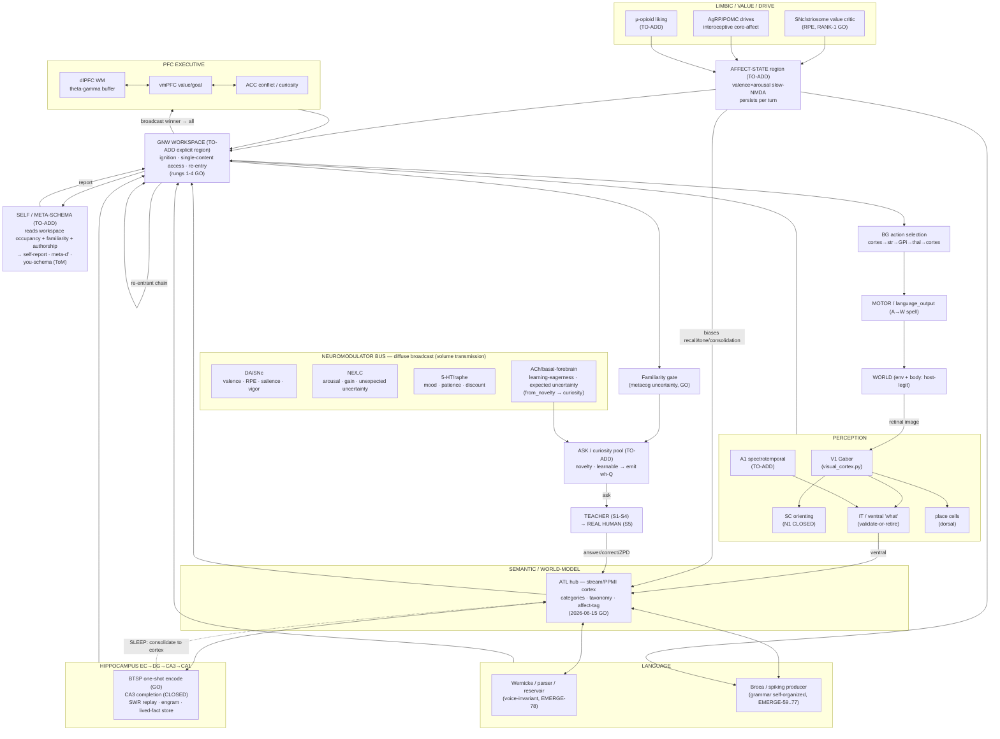

# MASTER DEVELOPMENT ROADMAP — toward a genuinely-conversing, feeling, self-aware sim-brain

**Status:** LIVING master plan. Created 2026-07-23; **last synced 2026-08-06** (current action-credit, source-monitor, replay-consolidation [v5+SFA interference wall CLOSED, order control is residual], and visual-identity boundaries are reflected in §§7-8). Update it as results/walls land.
**Supersedes-by-extension:** `docs/plans/2026-07-22-genuine-conversation-affective-self-aware-brain-plan.md` (that plan's F1–F6 are absorbed here as sub-faculties; this doc adds the full faculty map, the developmental staging spine, the theory-of-mind ladder the F-plan omitted, the walls ledger, and the parallelization map).
**Anchors:** `GAP_CLOSURE_MISSION.md` · `CLAUDE.md` · the master directive (`project_master_directive_relentless_biological_emergence`).

---

## 1. THESIS + the consciousness-completeness bet (stated honestly)

**North star (owner, settled 2026-07-23).** Build a sim-brain that **converses genuinely** — reasons to its own conclusions, has an affective world-model + emotion + self-awareness + curiosity — developed via a **temporary AI-teacher scaffold** that accelerates early growth, then **graduates to developing through real human interaction**; scaffolds are biologized away toward a **fully-biological ONE BRAIN** on a single spiking substrate, minimizing/retiring the transformer.

**The bet.** Success is defined as **genuine subjective experience / true consciousness**, pursued on the **emergentist wager**: consciousness emerges when a human brain's full capabilities + behavior are emulated *completely and faithfully enough*. Therefore the job is **completeness + faithfulness of the biological emulation** — not a benchmark score, and not a chatbot that merely sounds conscious.

**Hard rules (non-negotiable, from the owner).**
1. **DO NOT DEFER any needed functionality.** Every wall is to be **surpassed with a mechanism rooted in real biology** — no "characterized limit" as a stopping point, no permanent shortcut. A wall is a verdict on a *method*, never a license to abandon a *capability*.
2. **Speed is secondary.** It will not run at small-LLM speed. Optimize opportunistically, **never trade faithfulness for speed.** Slow-but-faithful biological mechanisms (deep dendritic credit assignment, seconds-long BTSP plateaus, sleep-replay consolidation) are explicitly **in scope**.
3. **One spiking substrate.** Everything between sensation and action is neurons/synapses on one `SimulationBridge`; host code is legitimate only for the **environment** and the **body** (and the **teacher**, which is the *social environment*, not the brain's cognition).

**The honesty boundary (a deliverable, not a caveat — carry it into every console and self-report).** The faculties below deliver, on the spiking substrate, the standard **functional correlates** of access-consciousness, self-modeling, metacognitive report, and functional affect. These establish *access* consciousness and a reportable workspace — they do **NOT** establish phenomenal "what-it-is-like" experience or felt emotion (Chalmers' hard problem; the meta-problem; arguably untestable from outside).
The disciplined posture: **build and measure every functional correlate exhaustively; design every self-report as an honest functional read-out** ("my value system tags this positively," "my familiarity monitor reads this as novel, so I'm uncertain") — **never an unlicensed claim of inner experience.** The emergentist bet is the *reason to pursue completeness*; it is not a license to *assert* the experience has arrived. That honest boundary is what distinguishes a rigorous emulation from a confabulating chatbot.

**The single load-bearing dependency (the crux the whole roadmap pivots on).** Across all seven faculty reads, one dependency recurs: a **learned predictive forward model `s,a→s′`** and *learned WM/appraisal selectivity* both bottleneck on **gap#4 — biological deep credit assignment.** As of 2026-07-23 gap#4 has **split**: one-shot episodic credit (BTSP) is **6-seed GO on-bridge**; deep multi-layer *directed* credit for accuracy is the one open wall — but the credit **rule now beats a frozen reservoir 6-seed on MNIST** (the old negative was a task artifact), and the residual is a **named op-point + learned-instructive-signal build**, not a dead end.
The **teacher-scaffold bridges gap#4** (supplies the corrective error a corpus can't) *while* the biological deep-credit rule matures in parallel — and is retired as it does. Everything else in the roadmap is HAVE, BUILDABLE-NOW, or a composition of GO pieces.

**⭐ UPDATE (2026-08-02) — gap#4 reframed on BOTH halves (owner-prompted deep-research arc).** *RATE:* the earlier "fundamental transport-free ceiling / different-paradigm question" verdict is **FALSIFIED** — a transport-free local rule (chained multi-hop feedback-alignment + the σ′ activation-derivative + graded credit) clears the depth-2 ceiling (6-seed 0.935 vs the banked 0.63), and KP-learned transport-free feedback **rescues** MNIST depth-4 (0.53→0.88, 6/6), matching WF-Act-PC. The rate half is UNBLOCKED.
*SPIKES:* the wall is now precisely **LOCATED at the read regime** — even a perfect-transport W⊤ oracle gives NO directed credit through the finite-spike σ′(v−θ) read (6-seed, both an easy task and a hard one the reservoir fails while a rate-MLP solves), so it is neither the task nor the feedback. Surpass (biology-grounded) = a **lower-CV read**: more spikes / ensemble averaging / longer temporal integration (e-prop long-sequence eligibility; DECOLLE membrane-window local readouts). Also this session: `gates/boundary_verdict_external_check` (blocks a boundary-verdict banked without reading the field — it caught the very overturn above) + an E-lane di-synaptic dual-route morphology GO candidate.
*SPIKES — ROOT CAUSE NAMED (2026-08-02, direct measurement).* The read-regime wall now has its mechanism: **feedback alignment does NOT converge on the production Izhikevich bridge** (cos(W,B⊤) rise −0.23..+0.09, 0/6 seeds) while it DOES on LIF (+0.29..+0.44, 6/6) — held identical across task, codon density, feedback direction, surrogate magnitude, and operating point (the 7-elimination chain). Non-convergence is the single upstream fact predicting BOTH the reservoir-tie on inheritance AND chance-level e-prop on representable XOR.
The credit-factor probe (6 seeds, same-cycle) then REFUTED the first-guess "credit-factor VARIANCE" cause: within-seed cos(credit,oracle) STD is TINY (0.002–0.047, SNR 0.4–40) — the per-example credit is CONSISTENT not noisy, the surrogate σ′ is exonerated (credit without σ′ is also misaligned), and W MOVES but the WRONG way (4/6 seeds anti-rotate). So the corrected residual is a **structurally mis-directed FA weight-update on the Izhikevich forward** (it anti-rotates W toward the fixed feedback B), not noise/surrogate/weak-learning — and plateau-averaging (variance reduction) does NOT address it.
Tested next mechanisms, BOTH now negative: the settle-steps (temporal-averaging) sweep is 0/12 (averaging does not help), and LEARNED feedback (Kolen-Pollack) is 0/6 (does not restore convergence either). ⚠️ I initially named "a two-compartment dendritic credit" as the remaining surpass — RETRACTED (owner-caught): dendritic/two-compartment/BDSP credit is already tested-and-NEGATIVE (`2026-07-22-gap4-real-issue-NOT-dendrites`, `2026-05-17-dendritic-credit-assignment-NEGATIVE`, `2026-08-01-...coincidence-gated-BDSP...NEGATIVE`; the frozen fixed-random feedback SIGNAL is the cause, which is exactly the non-aligning B measured here — not a fresh candidate).
The genuinely-untested directions the record names are BurstCCN's STP-demux (mechanism #2) or a dense-redundant (MNIST-like) task probe; and per the record this whole deep-credit-beats-reservoir question is a DEPRIORITIZED, thoroughly-mapped side-frontier (the emergence engine needs no deep-credit rule). Now gated by `gates/refuted_mechanism_reproposal`.
Findings: `2026-08-01-gap4-transport-free-ceiling-FALSIFIED-...`, `2026-08-02-gap4-crux-wall-LOCATED-at-the-spiking-read-regime-...`, `2026-08-02-gap4-FA-convergence-is-the-onbridge-credit-root-cause-6of6-LIF-converge-0of6-izhikevich.md`.

**Legend used throughout.** **HAVE** (validated in-repo, cited) · **BUILDABLE-NOW** (compose GO pieces, ≤1 new region, little/no `sim/` edit) · **FRONTIER** (real research, biology known, substrate in hand, mechanism named) · **OPEN** (genuinely open science — build/measure functional correlates only, never claim the experience).

---

## 2. THE COMPLETE FACULTY MAP

Each faculty: **biology → HAVE/MISSING (cited) → the wall + the named biological surpass → developmental stage + dependencies.** Nothing is deferred; every wall carries its surpass mechanism.

### 2.1 PERCEPTION / SENSORY FRONT END

| Faculty | Tag | Biology | HAVE (cite) | MISSING | WALL → biological SURPASS |
|---|---|---|---|---|---|
| **Retina + V1 (Gabor)** | HAVE | Hubel-Wiesel oriented RFs; Olshausen-Field sparse coding | `sim/visual_cortex.py` (retina, `build_v1_simple_weights`, phase-pool complex cells); `tests/test_visual_cortex.py` | V1 is a *rate reference* in validated uses; Gabor formula host-designed | structure host-designed → **retinal-wave developmental self-org** (L.05) via on-bridge rate-Hebbian + homeostasis on the already-`plastic=True` `retina→v1` pathway; ceiling = SAILnet spiking-Gabor emergence. B1 GO in numpy (`2026-06-21-B1-v1-gabor-selforg-derisk.md`, OSI 1.0, RSA-to-host 0.988); on-bridge lift undone |
| **Dorsal "where" / SC orienting** | HAVE | retinotopic saliency map, Mexican-hat WTA, reflexive orienting | spiking SC `sc_retina→sc_map` **N1 CLOSED 6-seed** (`2026-06-10-N1-spiking-superior-colliculus-CLOSED.md`, 12% > host reflex, scrambled-retinotopy anti-cheat 2.4×) | — | (none — most-complete perception path) |
| **Ventral "what" (V2/IT)** | FRONTIER | untangling toward position-invariant identity (DiCarlo; Tanaka IT columns) | `cortex_it`/`cortex_v2` STDP regions exist + feed value-critic + grounding; validated grounding via V1→pooler codon (EMERGE-34/36/53) | V2/IT possibly **inert/unvalidated** (`2026-07-23-perception-closure-scoping.md` #3); no learned invariance | **Földiák trace / temporal-continuity rule** (the rule that closed EMERGE-50) + competitive pooling; validate with DiCarlo position-invariance test; else retire STDP V2/IT and standardize on the validated V1→pooler codon |
| **Rich object recognition** | FRONTIER | HMAX S/C hierarchy; natural-image invariance | pooler codon separates well-posed categories | no clutter/occlusion/multi-object/natural-image | **natural-image-patch training of V1→V2→IT with trace-rule + sparse coding** — requires on-bridge STDP feature-learning at scale (the piece never validated); slow-but-faithful, in scope |
| **Audition (A1) + other modalities** | FRONTIER (construction present) | cochlea→A1 tonotopic **spectrotemporal RFs** (the auditory Gabor analog); S1 somatotopy; insula interoception | A streaming gammatone/hair-cell approximation emits tonotopic auditory-nerve spikes; channel-aligned auditory-nerve, excitatory A1, and inhibitory A1 regions/pathways initialize on the shared bridge (`2026-08-04-auditory-cochlea-tonotopic-a1-frontend-v1-CONSTRUCTION.md`) | A1 responses are uncalibrated; cochlear nucleus, superior olive, inferior colliculus, and medial geniculate are absent; no speech perception or learned auditory objects | First calibrate shared-bridge tone place, silence, level, timing, auditory-nerve lesion, and inhibitory sharpening over real room audio; then add ascending stages and learn spectrotemporal auditory objects before cross-modal ATL convergence |

### 2.2 ATTENTION

| Faculty | Tag | Biology | HAVE (cite) | MISSING | WALL → SURPASS |
|---|---|---|---|---|---|
| **Bottom-up salience/orienting** | HAVE | SC/pulvinar exogenous capture | SC WTA (N1); **DA salience gate** (`2026-06-18-DA-salience-gate-production-wireup-GO.md`, attention-as-neuromodulatory-gain) | — | — |
| **Selective (biased competition)** | HAVE (spiking) | Desimone-Duncan lateral inhibition; Reynolds-Heeger normalization | spiking Wong-Wang `sel_X` biased-competition read (`2026-06-19-multireferent-biased-competition-derisk.md`, GO; wired into `MultiTurnAgent`); advantage grows with correlation | — | — |
| **Attentional routing (thalamic)** | HAVE (primitive) | Logiaco-Abbott-Escola thalamocortical gating; Crick TRN searchlight | `transmission_gate` / `set_transmission_gate` (`sim/regions.py`; `2026-06-03-thalamocortical-gating-solves-compose-binding-SHIPPED.md`) | learned TRN *controller* | **TRN inhibitory region gating relays, learned/controlled by frontoparietal + salience** (Wimmer 2015); substrate present, learned-control loop is the research |
| **Access / global broadcast (GNW)** | **HAVE (workspace region + deliberation GO)** | Dehaene ignition/broadcast | 4 rungs **now consolidated into one persistent GNW workspace region + deliberation loop, 6-seed GO** (`2026-07-24-P1.2-GNW-workspace-deliberation-6seed-GO-adversarially-verified.md`, commits d699cd06 + b30981b5); **affect-directed deliberation** wires the REAL spiking P0.3 affect state into the workspace (biases WHICH conclusion, not WHETHER), replacing the host salience scalar | Rung-2 winner phase-erratic (limit-cycle degeneracy) | → **async attractor via heterogeneity+noise**; see §2.6 |
| **Top-down spatial/feature bias** | MISSING → BUILDABLE-NOW | FEF/IPS→V1/SC bias; Moran-Desimone RF-shrink | — | frontoparietal goal-driven bias | **a frontoparietal region projecting a goal-derived bias onto `sc_map`/`cortex_it` via biased-competition + transmission-gate** (Reynolds-Heeger normalization form) |
| **Sustained attention / vigilance** | MISSING → BUILDABLE-NOW | Aston-Jones-Cohen tonic-LC-NE adaptive gain; Yu-Dayan ACh expected-uncertainty | — | tonic arousal state | **slow-decay NE-analog `NeuromodulatorConfig`** setting a global gain that drifts with engagement (the F3 arousal channel pointed at vigilance) |

### 2.3 WORKING MEMORY

| Faculty | Tag | Biology | HAVE (cite) | MISSING | WALL → SURPASS |
|---|---|---|---|---|---|
| **Maintenance (persistent activity)** | HAVE | Wang-2002 NMDA attractor | dlPFC bistable latch full 3000ms (`2026-05-26-DIRECTION-Q-NMDA-AMPA-ratio-PASS.md`, nmda_ratio≥0.6) | — | ignited state = synchronous period-3 limit cycle → **async attractor via heterogeneity + OU noise** (both plumbed) |
| **Activity-silent WM** | BUILDABLE-NOW | Mongillo facilitation-based (residual Ca²⁺) | STP machinery (`stp_tau_f`) in `CoreSimConfig` | not built as WM | config-reachable STP regime + nonspecific reactivating ping |
| **Capacity + serial order** | HAVE (7-span) | Lisman-Idiart theta-gamma multiplexing | `OrderedPositionWM` full 7-slot span at D=256 (`2026-06-17-scale-ordered-wm-to-7-slot-span.md`); spiking WM buffer + stack-match recursion d\*=3 (`2026-07-03-emerge86-*GO.md`) | — | recursion boundaries at 8-slot capacity = **the faithful bounded human ~2–3-embedding limit**, not a failure |
| **WM manipulation (gating)** | partial HAVE → BUILDABLE-NOW | PBWM BG input/output gating (O'Reilly-Frank) | D3 two-gate push/pop event register (`_d3_event_gated_copy_derisk.py`) | general update/select/reorder | **generalize the D3 two-gate to arbitrary WM slots** via BG-gated `transmission_gate` |
| **Learned WM selectivity** | FRONTIER (gap#4) | which role binds which slot, learned | — | global scalar credit can't (`2026-05-19-integrated-loop-iter3-...global-scalar-credit-cannot-carry-WM-selectivity.md`) | **dendritic two-compartment credit** (Urbanczik-Senn/burstprop; `sim/dendritic_*`) — the gap#4 keystone; teacher-bridged |

### 2.4 MEMORY SYSTEMS (episodic · semantic · consolidation · reconsolidation · forgetting · autobiographical)

The cross-cutting truth (`2026-07-17-banked-capabilities-audit-two-buckets.md`): **the memory-structure frontier and the learning-engine frontier are the same frontier** — the host-shortcut residuals (pre-assigned engrams gap#5, host bind-write gap#2) exist because there is no working local-credit rule to *grow* that structure (gap#4). Every "grow the structure" item routes through the unsupervised path (stream cortex + competitive HTM pooler + committed BDSP `fused_htm_permanence_update` + BTSP).

| Faculty | Tag | HAVE (cite) | WALL → SURPASS |
|---|---|---|---|
| **WM / episodic buffer** | HAVE | Wang latch, `SpikingLoopContextBuffer`, D3 register | WM→hippocampus hand-off host-orchestrated → **theta-gated episodic-buffer region** (Hasselmo encode/retrieve theta separation) |
| **Episodic ENCODING (DG separation, BTSP one-shot, engram tag)** | HAVE (partial) | trisynaptic loop (`2026-05-11-P1-trisynaptic-loop-validation.md`, D.12 sep 0.218, D.13 completion 0.748); engram API (`sim/bridge.py`); **BTSP one-shot on-bridge 6-seed GO** (`2026-07-18-gap4-BTSP-onbridge-behavioral-timescale-GO-6seed.md`) | assemblies **pre-assigned, not emergently selected** (gap#5 EMERGENT-DG, `2026-07-19-gap5-emergent-DG-ROOT-CAUSE`) → **per-pathway-STP mossy-detonator** (sparse facilitating high-conductance) + basket FF-inhibition + BDSP competitive selection; **neurogenesis** = periodic GC turnover (develop-loop GROWTH hook) |
| **Episodic STORAGE / retrieval (CA3 completion)** | HAVE (CLOSED) | **CA3 functional completion CLOSED 6-seed** via intrinsic dendritic bistability (`2026-07-18-gap5-ca3-functional-completion-CLOSED-6seed-GO.md`; point-neuron boundary surpassed by two-compartment dАP + self-regen + KIR) | completion magnitude ~0.18 (uniform-store residual) → **weight-dependent BTSP** (Milstein-2021 weak-potentiate/strong-depress → structured fixed point) — same rule gap#4 converges on |
| **Familiarity / recognition (metacog uncertainty)** | HAVE | Bogacz-Brown gate = the no-confab moat (`2026-06-11-familiarity-gate-v320-GO.md`, 168/168, 0 breaches) | used as gate not report → **expose graded introspectable confidence** + couple to curiosity (novelty→drive) |
| **SWR replay + temporal context** (ORDER now GO) | HAVE (drive + **ordered traveling replay 6-seed GO**) / FRONTIER (merge+neural-reader) | `run_swr_replay_phase`, `run_concept_replay_phase`, RANK-1 reactivation GO, RANK-2 forward-chain; **ORDERED traveling replay GO** (`_gap5_ecker_recurrent_replay.py`, d6e140bf) — Ecker-2022 Gaussian-band CA3+AdEx, cue→localized Bayesian-decodable DIRECTIONAL traveling bump, DECODE_r=1.000 6/6, band-required + asymmetry-required + shuffle-null; mechanism = band + AdEx refractoriness (neg-a adapt INERT, honest correction) | the **(c) ORDER** piece is now solved by the Ecker moving-bump build (theta-gamma phase-precession NOT needed for travel); remaining: **merge onto one-brain** + a **neural reader** (Bayesian decode is a measurement instrument) + a **learned place-field band** (grow, don't hand-wire); (b) specificity — learn CA3→CA1 during encoding (Schaffer LTP); reverse replay → symmetric CA3 + reward-gated |
| **Constructive/imaginative replay (mental time travel)** | HAVE (propositional) → BUILDABLE-NOW | generative-replay proposer 17× over random (`2026-06-23-genfrontier-b2-generative-replay-derisk.md`); RANK-3 scoped (`2026-07-22-gap5-RANK3-imagination-recombinative-replay-research-gate.md`) | on-substrate spiking recombination → **compose RANK-1 bistable + RANK-2 BTSP-chain on a shared-branch-node topology** (A→B→C, X→B→Y → novel A→B→Y under rest noise); coherent scenes via FHRR bind/bundle |
| **Semantic memory (world-model cortex)** | HAVE (core) | stream/PPMI cortex on-substrate (`2026-06-15-on-bridge-hebbian-co-occurrence-learning-mechanism-GO.md`, corr 0.686, pop-read 94%); EMERGE category/taxonomy/inheritance/cancellation/transitive/grammar arcs | scale + richness → **competitive self-org pooler** (EMERGE-38..41, `fused_htm_winner_inactive_depression`) + **fronto-striatal reservoir for relational/causal structure** + more corpus/tail/morphology |
| **Systems consolidation (CLS)** — the load-bearing wall for a *lasting* world-model | HAVE (direct) / FRONTIER (compositional) | Phase 1.3 CONFIRMED (hippo-OFF retention 94%, 3/3 strict, `2026-05-08-Phase1.3-Tier2.1-strict-anti-cheat-3seed-CONFIRMED.md`); develop-loop WAKE/SLEEP/GROWTH/PERSIST; self-replay prevents forgetting (0.884 vs 0.392) | **compositional consolidation stranded in hippocampus** — **⛔ RETRACTED 2026-07-26 — the dense-CA1 re-attribution below is VOID** (it was an artifact of a 333× `comp_apical_R` miscalibration; the real CA1 code is sparse and fact-specific — see `2026-07-25-CRITICAL-apical-R-333x-miscalibration-invalidates-consolidation-operating-point.md`). Superseded source: (`2026-07-25-consolidation-boundary-REATTRIBUTED-dense-CA1-code-not-the-write.md`, ~20 probes / ~10 methods falsified): the `ca1→concept/slot` pathway EXISTS and a clean selective write WORKS — the wall is **NOT a missing pathway** (the old 05-21 "TERMINAL missing-substrate" framing is superseded). The write's selectivity is a bilinear form of the CA1 rate code with itself (Σfire²/Σfire·fire), and the **dense CA1 fire-count code caps ANY write at own/other 1.45** (< the 2.5 gate). The separable **sparse >25%-spike-count core exists (ceiling 8.0)** but is NOT operative: both write (graded eligibility) + recall (dense pattern) read the dense code. ~10 point-neuron sparsifiers falsified (feedback-FFI, sparse-commit, drive, phenotype, elig-nonlinearity). **⇒ surpass = a DENDRITIC per-cell spike-count-THRESHOLD read** gating both write + recall to the core (D2 substrate; the nonlinear READ, not decorrelation) — the single highest-value memory build, now precisely scoped; bounded write-side threshold de-risk in flight; schema-fast consolidation via familiarity-gated replay (Tse); trace-transformation via interleaved replay |
| **Synaptic consolidation (molecular fixation)** | FRONTIER (additive `sim/` edit) | none (audit item #12, `2026-06-08-sim-biological-accuracy-shortcuts-audit.md`) | single-timescale weights → **two-timescale per-synapse weight** (`w_fast` + tag-gated `w_slow` + neuromodulatory PRP) = Frey-Morris synaptic tagging & capture → **behavioral tagging** (salient events stabilize weak co-encoded memories); Fusi cascade model |
| **Reconsolidation (PE-gated labile update)** | HAVE | `update_on_mismatch` 6/6 (`2026-06-17-reconsolidation-update-derisk-GO.md`, PE-gated in-place) | on composer not episodic → **move onto CA3 assembly** (plateau = labile window); time-limited labile gate |
| **Forgetting (active/adaptive)** | FRONTIER (additive) | partial (`BridgeMemory.forget`, homeostasis) | no capacity mgmt → **SHY synaptic downscaling** (Tononi-Cirelli, global multiplicative down-normalize in SLEEP) + **allocation competition** (Josselyn CREB-excitability) + DG-index decay (trace transformation) |
| **Autobiographical / self memory** | BUILDABLE-NOW (index) / OPEN (self-abstraction) | BridgeLineage persistence; lived-fact store 6/6 (`_tier3_live_and_remember_derisk.py`); D3 who-did-what | no self-indexed structure → **self-tag on episodic engrams** (conjoin with self-model referent) + hierarchical org via taxonomy machinery + CLS interleaving over self-episodes → self-schema |

### 2.5 EMOTION / MOTIVATION / REWARD-VALUE

The reward/value + homeostatic-drive halves are essentially **DONE**; the affect-STATE / mood / arousal-neuromodulator / amygdala-tag / appraisal / epistemic-emotion halves are **MISSING but BUILDABLE-NOW** (the neuromodulator subsystem was designed to be this engine's home). The **affect-state region is the keystone new build.**

| Faculty | Tag | HAVE (cite) | WALL → SURPASS |
|---|---|---|---|
| **Reward / value / RPE (actor-critic)** | HAVE | spiking SNc RPE 6/6 (`2026-06-18-limbic-core-rpe-battery-GO.md`, GABA_B/GIRK membrane subtraction); neural reward source N5 CLOSED; TD critic (`sim/td_value_critic.py`); **value-driven CHOICE RANK-1 GO 6/6 today** (`2026-07-23-value-critic-closure-RANK1-GO.md`, untrained-critic anti-cheat) | value is cue-value only; no forward model → gap#4 (bridge with teacher) |
| **"Liking" (hedonic)** | MISSING → BUILDABLE-NOW | wanting exists (incentive-salience drift) | Berridge wanting≠liking → **µ-opioid `liking` modulator** fired by *consummation* only, read separately from predictive DA |
| **Neuromodulator affect axes (4-basis)** | MISSING → BUILDABLE-NOW | declarative subsystem (`sim/neuromodulators.py`): `from_reward`/`from_surprise`/`pause_on_reward`/`from_region_firing_signed`; DA instantiated | **no 5-HT/mood, no NE/arousal, `from_novelty` empty stub** → instantiate **`mood`(5-HT, long-tau, avg-δ = Eldar-Niv mood), `arousal`(NA, from_surprise+tonic), `learning_eagerness`(ACh, fill from_novelty)**; 5-HT sets TD discount (Doya) |
| **Amygdala valence tagging** | MISSING → BUILDABLE-NOW | tagging *engine* (DA-gated 3-factor, engram tags) | no BLA/CeA region → **opponent V+/V− populations** per code (Namburi-Tye opposite-sign; Redondo-Tonegawa re-writable tag on fixed identity); VAD-seed ~1k words + 2-hop spread over co-occurrence graph (Bestgen-Vincze); arousal→consolidation gain (McGaugh) via Route-B |
| **Core affect + standing affect-STATE region** | **QUALIFIED-GO / BOUNDARY** (P0.3, the keystone) | **6-seed on-bridge (`2026-07-24-P0.3-affect-state-region-6seed-GO.md`, commit e402a732):** slow-NMDA opponent attractor holds persistent state that causally biases recall/speak; the spiking `quench_fs` pathway clears and restarts it. A fresh two-seed recurrent-weight ladder retained persistence and clearing but selected no graded operating point (`2026-08-04-laneA-graded-affect-quench-v1-DIAGNOSTIC-RESULT.md`). | The state remains a **bistable good/bad latch, not a graded circumplex**: every tested weight had poor sign accuracy, no sign crossings, insufficient magnitude range, and excessive residual state near neutral. Replace the mechanism under a fresh preregistration; do not tune or promote the consumed diagnostic seeds. |
| **Appraisal (OCC/Scherer) + discrete emotion** | shallow BUILDABLE-NOW / deep FRONTIER | shallow worth-appraisal (`_value_salience_appraisal_derisk.py`) | no structured map → **OCC rule-checks over parsed SVO** (goal-conducive? agency? liked?) + Barrett conceptual-act discrete-emotion read-out over (V,A,context) with **learned emotion concepts**; deep learned appraisal = gap#4 (teacher evaluative-conditioning) |
| **Emotion biases cognition** | BUILDABLE-NOW (once affect region exists) | Route B/C (encoding-gain, recall-vigor); speak-worth accumulator | not driven by an affect state → **couple affect→recall-vigor (mood-congruent), affect→encoding (McGaugh), affect→salience-gate (relevance), affect→speak-rate + hedge + excitability_drive on valence-congruent pools (Bower)** |
| **Epistemic emotions + curiosity** | **GO** (DR-1, the reframe) | **6-seed (`2026-07-23-DR1-curiosity-inversion-6seed-GO.md` + `-ONBRIDGE-spiking`, commit 27edcf08):** the moat's uncertainty INVERTED into an honest curiosity drive — `corr(gap,want)+0.99`, high-gap asks, **ELP/noisy-concept veto STOPS it chasing un-learnable things** (the confab honesty test), controls collapse; on-bridge adds ONE additive default-off `from_novelty` edit | follow-ons: wire into the develop-loop teacher hook; learning-progress `g_before−g_after` reward as the standing driver (Oudeyer/Schmidhuber) |
| **Felt emotion / affective consciousness** | OPEN | homeostatic drive core; `sim/predictive_coding.py` | research direction (not deferred): **interoceptive predictive-coding loop** (Seth/Barrett anterior-insula comparator) × **brainstem-grounded generation** (Panksepp/Solms) × **workspace broadcast + self-attribution** (LeDoux-Brown) × **learned emotion concepts** (Barrett). Build + measure correlates; never claim the experience |

### 2.6 LANGUAGE + REASONING

**Language side is HAVE/BUILDABLE-NOW and emergent** (comprehension role-map, production grammar, lexicon all self-organized from corpus stream, NO `sim/` edit). **Reasoning splits sharply:** deductive + inductive + analogical inference run on the brain's own learned codes (GO); **causal, counterfactual, and free deliberation** bottleneck on the same missing organ — the learned forward model `s,a→s′` (gap#4).

| Faculty | Tag | HAVE (cite) | WALL → SURPASS |
|---|---|---|---|
| **Comprehension (Wernicke, thematic roles)** | HAVE | voice-invariant `BridgeParser`; multi-cue Competition-Model parser (`case_aware_role_parser.py`, `attributed_parser.py`); **reservoir form→role** (`2026-07-03-emerge78-reservoir-form-to-role-GO.md`, non-local rel-clause 1.000; spiking `OnBridgeLSM` emerge80/82); wh-questions; nested clauses; D3 discourse | deep recursion (reservoir d\*=2) → **theta-gamma WM buffer+stack-match** (emerge85, d\*=3, faithful human bound); no abstain → **route parser through familiarity gate** ("didn't follow that") |
| **Production (Broca, grammar, lexicon)** | HAVE (fully emergent, on spikes) | spiking competitive-queuing serial order (EMERGE-59); **entire grammar self-organized** (function words/order/inventory EMERGE-62..65); fully spiking render content+function words one process (EMERGE-67..71); 7 constructions incl. ditransitive (EMERGE-72..77) | open prose (R4, ~4-orders scale gap) → **scale spiking HTM Temporal-Memory generator** (`fused_htm_permanence_update`) + gap#4, retire transformer; productive morphology → **learned affixation construction** (EMERGE-62c invariance cue is the hook) |
| **Mental lexicon** | HAVE (core) | PPMI concept codes; grounded Gabor/V1 codes; verb frames (`argstructure_composer.FRAME_LEXICON`); bidirectional word↔concept (v14/v16) | depth vs breadth → **multi-modal convergence (ATL hub-and-spoke)** for deep meaning; on-demand tail fast-mapping (EMERGE-76 one-shot) |
| **Deductive inference** | HAVE (emergent, spiking) | inheritance/taxonomy/cancellation (EMERGE-26/27); **transitive over EMERGENT codes 6-seed** (`2026-07-08-emerge28-...GO.md`); multi-hop `query_chain` moat/hop | caller-supplied query plan → **workspace-routed re-entrant chaining** (P1.2, GNW global broadcast) |
| **Inductive inference** | HAVE | generalization capstone (`2026-06-16-generalization-capstone-verbalize.md` 0.92); **hedged open-world completion 12-seed** (`2026-07-13-EMERGE-spreading-activation-completion-12seed-GO.md`) | nearest-neighbour not premise-integrating → **population-vector coverage** (Osherson; Rogers-McClelland convergence) |
| **Analogical inference** | HAVE (clean codes) / FRONTIER (real codes) | parallelogram on learned codes 1.000, beats retrieval baseline (`2026-07-08-analogical-transfer-parallelogram-learned-codes-GO.md`); honest NEGATIVE on entangled codes (`2026-06-27-tier2.1-analogy-NEGATIVE.md`) | needs factored relational codes → **learn explicit relation phasors `R_k`** (LISA role-filler) + richer corpus for relational geometry |
| **Causal inference** | FRONTIER (gap#4) | RPE/covariation substrate | no forward model/directed graph → **learned predictive HTM forward model** + **DA-RPE-directed edges** (Schultz — has temporal order STDP needs) + teacher-corrected interventions |
| **Counterfactual reasoning** | OPEN (gap#4) | episodic mem, affect, workspace | no re-simulation engine → **forward model + SWR offline simulation (imagination) + reality/authorship tag (source monitoring) + affective outcome eval** (Roese) |
| **Free deliberation (train-of-thought)** | BUILDABLE-NOW | 4-rung GNW; report==reasoning; `elaborate` content selection | no re-entrant loop → **feed ignited conclusion back as input** (Dehaene recurrent ignition) biased by affect (Damasio) + curiosity/metacog (directed, not random) |

### 2.7 SELF / METACOGNITION / CONSCIOUSNESS / SOCIAL COGNITION

**The unifying thesis (Fleming-Daw 2017):** self-confidence = inferring the competence of *another actor* — the same computation. Build **ONE reusable "meta-schema" region class** (small slow-NMDA population + learned read-out) instantiated three ways by *which first-order stream it reads*: own decision/workspace → **metacognition + self-model**; a simulated/observed agent → **theory-of-mind**; and the GNW is the shared stage all broadcast onto for **report**.

| Faculty | Tag | HAVE (cite) | WALL → SURPASS |
|---|---|---|---|
| **GNW ignition/broadcast/access** | **HAVE (P1.2 workspace region DONE)** | `_gnw_rung1..4` + **P1.2: one persistent GNW workspace region + deliberation loop, 6-seed GO** (`2026-07-24-P1.2-GNW-workspace-deliberation-6seed-GO-adversarially-verified.md`); affect-directed (real P0.3 affect drives directedness, b30981b5) | limit-cycle degeneracy → **heterogeneity+noise async attractor**; no eviction → **salience-weighted mutual inhibition** (Rung-2b) |
| **Higher-order representation** | FRONTIER | = the meta-schema region (satisfied as a property once S1/M2 built) | HOT-vs-GNW = a lesion dissociation (an in-silico adjudication deliverable) |
| **Self-schema (attention/agency, AST)** | **GO** (DR-3) | **6-seed on spikes (`2026-07-23-DR3-self-schema-region-6seed-GO.md`, commit d3d482ba):** the brain reads+reports its own attention/confidence/authorship — attn 0.974, conf Spearman +0.98, **self-lesion collapses**, schema ⟂ content (Graziano/Wilterson AST); adversarially verified SOLID | the reusable meta-schema region class → instantiate for M2 (meta-d′) + W3 (ToM) |
| **Narrative/autobiographical self (DMN)** | BUILDABLE-NOW / FRONTIER | BridgeLineage self-code; lived-fact store | no self-reference tag → **SELF/OTHER encoding tag + prospection via SWR self-projection**; interpreter confabulation gated by the moat |
| **Agency/authorship** | BUILDABLE-NOW | efference copy (which pool fired); producer-vs-parser source | no comparator → **1-bit source tag** (producer=self/parser=other); full comparator = FRONTIER upgrade |
| **First-order uncertainty monitor** | HAVE | familiarity gate; graded confidence bands (`2026-07-13-...12seed-GO.md`) | first-order only → M2 |
| **Second-order metacognition (meta-d′)** | FRONTIER (named, un-closed) | — (the project's own `2026-05-20` triple-convergent ceiling localized it) | single uniform threshold can't serve direct + compositional recall → **Fleming-Daw second-order monitor** reading decision-variable, trained on outcome (ERN analog); **per-regime monitors** (Miyamoto) via `plasticity_gate` routing |
| **Metacognitive control** | BUILDABLE-NOW | hedge (console), `from_novelty` stub, speak-worth gain | compose → confidence → {commit / hedge / ask} routing (couples to curiosity) |
| **Joint attention (ToM root)** | BUILDABLE-NOW | SC/orienting; AST self=social insight | other-attention-schema (S1 class turned outward) |
| **Common ground / audience design** | HAVE | `common_ground_composer.py` (`2026-06-27-tier2.4-common-ground-GO.md`, 1.000 vs 0.500 tag-blind) | host-set tag → **learned ledger** updated per grounding act (reconsolidation) |
| **Belief attribution / false belief** | **GO** (W3, flagship social build) | **6-seed (`2026-07-24-W3-false-belief-register-6seed-GO-adversarially-verified-immunity-claim-corrected.md`, commit b5804d09):** agent-keyed belief store (D3 register keyed by agent, witnessing-gated writes) predicts where the other *believes* not reality; witnessed-move→follows reality, lesion→predicts reality, self-belief stays correct (self-other dissociation); adversarially verified (immunity over-claim corrected) | recursive/2nd-order ToM (W4) is the next depth rung |
| **Recursive mentalizing + RSA implicature** | FRONTIER → OPEN at high depth | 1-bit ground (depth-0), false-belief (depth-1) | recursion depth → **bounded theta-gamma WM-buffer stack** (nested belief frames = nested clauses); RSA = iterated speaker-listener best-response; unbounded = OPEN (humans ~2-3 too) |
| **Affective ToM / empathy** | FRONTIER | affect substrate (F3) | run F3 appraisal on other-schema situation, OTHER-tagged; self-other affect ⟂ |
| **Phenomenal consciousness** | OPEN | all correlates enumerable | **build+measure every correlate** (ignition, global-availability, report, meta-d′, HOT-lesion dissociation, **PCI/perturbational complexity**, self-schema report); report the phenomenal question as a stated wager, never a result |

### 2.8 LEARNING / CREDIT / CURIOSITY ENGINE (the must-solve core)

| Faculty | Tag | HAVE (cite) | WALL → SURPASS |
|---|---|---|---|
| **Deep two-compartment dendritic credit (gap#4)** | FRONTIER (rule VALIDATED; op-point + learned-signal open) | topology faithful+committed (`sim/dendritic_neuron.py`, `dendritic_plasticity.py`, `dendritic_mlp.py`, `fused_bdsp_update`); **rule beats reservoir 6-seed on MNIST + at spiking sparsity** (`2026-07-23-gap4-faithful-bdsp-credit-beats-reservoir-6seed-GO.md`); credit-assignment sub-Q confirmed on spikes (D1 probe 0.92) | (A) op-point → **population-coded credit channel + η matched to sigmoid-baseline credit at bridge firing rate + bistable apical hold** (`2026-07-22-gap4-FAITHFUL-on-bridge-op-point.md`); (B) frozen scalar error (`dendritic_mlp.py:81`, never zeroes when correct — causes both accuracy-stall AND moat-leak) → §L2 |
| **Learned instructive signal (the true crux)** | FRONTIER (2 surpasses never built) | `enable_bdsp_microcircuit` plumbing (`config.py`, `bridge.py` `cp_bdsp_int_drive`) but cancellation runner-supplied not learned | RANK-1 = **learned self-predicting microcircuit** (Sacramento Eq.9: `Δw^PI ∝ −v_apical·rᴵ` = dendritic Vogels — apical silent when correct → fixes accuracy AND moat); RANK-2 = **learned feedback (PAL / weight-mirror / KP)** where FA degrades at depth. Nature-2026 "Vectorized instructive signals in cortical dendrites" (652:1254) confirms cortex uses exactly a per-neuron *vector* apical teaching signal — optogenetic perturbation disrupts learning |
| **Three-factor neuromodulated plasticity + reward** | HAVE | full subsystem + eligibility traces + TD critic + spiking SNc RPE + striosome critic (value-choice 6-seed GO today) | shallow single-layer → **compose DA as third factor gating BDSP burst credit** (neuromodulated deep rule) |
| **One-shot BTSP** | HAVE (kernel) / one-shot-behavior open | `fused_btsp_update` committed; on-bridge behavioral-timescale GO | one-shot place-field TASK NO-GO (mechanism-forms-no-reliable-behavior) → **pair BTSP-stored assembly with CA3 completion + gamma-WTA read** (gap4-gap5 unification) |
| **Consolidation as offline credit** | HAVE (spine) | develop-loop WAKE/SLEEP/GROWTH/PERSIST; concept/SWR replay; self-replay prevents forgetting | GROWTH tier-rebuild stubbed; replay-as-deep-credit unused → **replay episodes through the credit rule during SWR** (D3 finding: replay replaces BPTT, 109% at one-step local credit) |
| **Curiosity / intrinsic motivation** | **GO** (DR-1) | **6-seed (`2026-07-23-DR1-curiosity-inversion-6seed-GO.md`, commit 27edcf08):** moat inverted → curiosity drive, `corr(gap,want)+0.99`, ELP/noisy-concept veto (the noisy-TV cure) holds by construction; on-bridge `from_novelty` realization done | standing follow-on: learning-progress `g_before−g_after` as the reward + develop-loop teacher hook |
| **Teacher as external credit oracle (the CRUX)** | BUILDABLE-NOW (scaffold) → internalize (frontier) | offline precedent (`2026-06-23-grounded-lang-P2-GO.md`); `_p2_teacher_to_brain_derisk.py`, `distill_teacher.py`, develop-loop hook | corpus lacks error + ordering → **teacher supplies ZPD ordering + correction on brain's own outputs + answers to curiosity Qs + soft targets**; internalize as the L2 microcircuit learns to self-generate the clean error; **run both, fade teacher as substrate matures** |

---

## 3. THE ARCHITECTURE — one brain, one substrate

Everything between sensation and action is disjoint neuron-index slices (`BrainRegion`) on ONE `SimulationBridge`, wired by declared `RegionPathway`s, with the neuromodulator bus as the diffuse limbic→everything broadcast. The merged nav+conv brain already proves parser + dlPFC + RF composer + nav cascade + limbic co-reside and interact in one process (EMERGE-70/71). This is the **target full architecture** — HAVE regions plus four to-add integrators (**affect-state**, **self/meta-schema**, **ASK/curiosity pool**, an explicit **GNW workspace region**).

**Three invariants:** (1) the workspace is the **single integrator** — one coalition ignites/broadcasts at a time (enables one train of thought); (2) limbic→everything is **diffuse volume transmission** (`scope="all"`/`scope="region:X"`), not point-to-point; (3) hippocampus↔cortex is **bidirectional + time-separated** (fast WAKE encode vs slow SLEEP consolidation = CLS).

> **Diagram source + HAVE/TO-ADD legend + per-integrator status:** [`docs/diagrams/brain_architecture_target.md`](../diagrams/brain_architecture_target.md) — the maintained diagrams-folder mirror of the figure below, with a colour-coded legend (the four to-add integrators dashed-purple) and each integrator's Phase-0 status. Its *as-implemented* companions are [`brain_architecture_current.md`](../diagrams/brain_architecture_current.md) (plain overview) and [`brain_architecture_detailed.md`](../diagrams/brain_architecture_detailed.md) (exhaustive per-region).

---

## 4. THE STAGED TIMELINE

Ordering follows the **caudo-rostral maturation gradient** (sensory→association→PFC-last) and the biological milestone sequence (semantic-before-episodic = childhood amnesia; self→ToM→metacognition; core-affect→differentiated-emotion). A stage is expressed concretely as: `RegionPathway.plasticity_gate` open/close (critical period) + `sim/auto_growth.py` TierPromoter grow (maturational capacity) + a `measure_development` GO on that stage's faculties. **Kuhl social-gating** is the through-line: the teacher must be **interactive + contingent** (turn-by-turn develop-loop hook), never a passive corpus — and this is the biological warrant for eventual graduation to real humans.

Compute-lane legend: **[3090]** local GPU · **[CPU]** local CPU (default for numpy de-risks) · **[POOL]** 3-node mini-PC pool (36 cores, CPU overflow) · **[AWS]** AWS-G GPU while 3090 busy.

### STAGE 0 — PROTO-BRAIN (fetal→neonate)
**Comes online:** sensory transduction (Gabor/V1, SC orienting), interoceptive core-affect drives (AgRP/POMC), neuromodulator baselines (= **temperament seed**), three-factor reward/DA + eligibility traces, SWR-replay machinery, unsupervised Hebbian stream cortex, spontaneous + evoked spiking.
**Prerequisites:** none — this is the seed substrate. **Teacher:** absent / minimal caregiver contingency.
**Tasks:** wire the full region graph (§3); verify substrate seeds correctly (`cfg.seed`, `test_determinism.py::TestSubstrateActuallySeeded`); reflexes fire; drives modulate.
**Stage-exit GO:** substrate runs stably; SC/N1 reflex fires; drive modulates DA; region graph co-resident in one process (EMERGE-70/71 pattern). **Lane:** [CPU]/[3090].

### STAGE 1 — INFANT (0–2, sensorimotor)
**Comes online:** unsupervised **category discovery** (perception + co-occurrence); **episodic fast-encode** (hippocampal BTSP one-shot); first **word↔concept** bindings; **core-affect valence tagging** from reward context; **familiarity/novelty** monitor; **agency/authorship** precursor; **joint attention** + affective contagion (earliest social).
**Prerequisites:** S0 substrate; sensory critical period OPEN.
**Teacher:** **contingent** child-directed input + joint attention (Kuhl: live/interactive REQUIRED — audio/video insufficient).
**Tasks / de-risks:**
- **DR-2 `_affect_distributional_tag_derisk.py`** (opponent V+/V− valence tag). *GO:* inherited VAD vs held-out Warriner **r≥0.55** (valence), 6-seed. *Anti-cheats:* permuted co-occurrence graph→chance (EMERGE-30 verbatim); opponent-sign (aversive drives V− AND suppresses V+); lesion affect pools→no inheritance; untrained-critic→flat. **[CPU]**
- **`_agency_authorship_tag_derisk.py`** (1-bit producer-vs-parser source). *GO:* answers "did you say that or did I?" tracking ground truth, 6-seed. *Anti-cheats:* lesion→chance; swap wiring→tag flips; tag ⟂ content. **[CPU]**
- **`_joint_attention_derisk.py`** (other-attention-schema aligns to inferred partner target). *GO:* attention target tracks partner's inferred target above chance. *Anti-cheats:* lesion other-schema→no alignment; scramble gaze→chance. **[CPU]**
- **B1 on-bridge V1 self-org** (retinal-wave rate-Hebbian). *GO:* on-bridge OSI/RSA-to-host ≥ B1 numpy (0.988). *Anti-cheats:* per-frame scramble collapses; no-learning frozen flat. **[3090]**
- **Emergent DG assembly selection** (mossy-detonator per-pathway STP + basket FF-inhibition + BDSP). *GO:* sparse (<5% active) + reproducible (within-scene cos>0.8) + separated (between-similar<0.3), 6-seed. *Anti-cheats:* permuted-scene collapses; no-BDSP lesion→no assembly; permuted-cue specificity. **[3090]**
**Stage-exit GO:** category held-out inheritance; word→concept recall; lived-fact recall; valence-inheritance r≥0.55.

### STAGE 2 — CHILD (2–7, preoperational→concrete)
**Comes online:** **grammar self-organizes**; fluent bounded **production** (spiking Broca) + **comprehension**; genuine **inference** (inheritance, taxonomy, transitive, induction); **curiosity→ask** (crave, don't refuse); **differentiated emotion** read-out; **private→inner speech** (Vygotsky, self-cued chain); **common ground**; **affect biases cognition**.
**Prerequisites:** S1 world-model + word bindings; language critical period OPEN.
**Teacher:** **Socratic MKO** — ZPD-select material, **correct the brain's own outputs**, **answer its curiosity questions**.
**Tasks / de-risks:**
- **DR-1 `_curiosity_seek_learn_cheap_first_probe.py`** (the reframe centerpiece — clone the homeostatic probe; deficit→epistemic gap; fill `from_novelty`→ASK pool). *GO:* corr(gap,modulator)≥0.9; high-gap ask ≥2×; **LOAD-BEARING** post-answer confidence rises above abstain floor; converges on learnable gaps, 6-seed. *Anti-cheats:* **NOISY-CONCEPT** (unlearnable→zero learning-progress→STOPS asking — the honesty test); lesion→no asking/learning; yoked-random gap; permuted teacher answers→collapse; ask-only-on-NOVEL (moat by construction). **[CPU]**
- **P0.3 `_affect_state_region_derisk.py`** (the keystone — persistent V×A slow-NMDA). *GO:* tracks SNc-δ valence + DA-salience arousal; persists across a turn; biases recall/speak, 6-seed. *Anti-cheats:* affect-lesion→flat conversation; value⟂plausibility (corr≈0); shuffled-history→mood collapses. **[CPU]**
- **`_neuromodulator_affect_axes_derisk.py`** (mood/arousal/ACh). *GO:* mood tracks slow avg-δ lagging phasic DA; good/bad runs raise/lower forthcomingness (Eldar-Niv), 6-seed. *Anti-cheats:* shuffled-outcome-history→mood→baseline; DA-phasic separable from mood; independent lesions. **[CPU]**
- **`_affect_biases_cognition_derisk.py`** (mood-congruent recall + arousal-encoding + speak-rate + hedge). *GO:* all four biases present, 6-seed. *Anti-cheats:* affect-lesion→all vanish; yoked-random affect→wrong direction; moat intact. **[CPU]**
- **`_inductive_coverage_derisk.py`** (premise-integrating induction). *GO:* 2-premise diverse > 1-premise > within-subcat, 6-seed. *Anti-cheats:* permuted codes→chance; premise-lesion collapses. **[CPU]**
- **`_learned_common_ground_ledger_derisk.py`** (ledger updated per grounding act). *GO:* audience design follows updated ledger. *Anti-cheats:* permuted history→wrong; lesion update→static. **[CPU]**
- **P2.1 `_teacher_develop_loop_derisk.py`** (teacher at the hook: ZPD from `measure_development`, corrects + answers curiosity Qs). *GO:* teacher-selected/corrected/asked arm closes ZPD gaps + generalizes faster than static-frequency + replay-only baseline, retained, 6-seed. *Anti-cheats:* **teacher-lesion** (remove correction+answers→slower, held-out drops — load-bearing); frozen-brain→learns nothing; permuted curriculum→different brain; retention 1.0. **[3090]**
- **`_productive_morphology_construction_derisk.py`** (learned affixation). *GO:* novel-stem regular inflection ≥0.90; irregulars→stored path, 6-seed. *Anti-cheats:* permuted morph-tagging collapses; unseen stem inflects (rule not lookup); lesion→over-regularization. **[CPU]**
**Stage-exit GO:** grammatical grounded conversation; inference on held-out; curiosity ask-rate ≥2× on gaps + learning-progress; discrete-emotion read-out; private→inner-speech chain.

### STAGE 3 — ADOLESCENT (11–18+, formal-operational)
**Comes online:** **workspace-routed deliberation** (multi-hop chains that re-enter); **self-model / metacognitive report**; **reasoning to own conclusions** beyond told facts; **deep world-model** (teacher-bridged credit); **forward/predictive model** `s,a→s′`; **false-belief ToM**; **personality accretes**.
**Prerequisites:** S2 language+inference+affect+curiosity; PFC "maturing" (TierPromoter grow + dlPFC/vmPFC/ACC slices active).
**Teacher:** **fading** — corrector → interlocutor/peer; debates, challenges, corrects less.
**Tasks / de-risks:**
- **P1.2 workspace-region + deliberation loop** (consolidate rungs 1-4 into one persistent GNW region; feed ignited conclusion back). *GO:* 3-hop never-told conclusion via re-entrant chaining ≥ one-shot `query_chain` baseline, moat each hop, 6-seed. *Anti-cheats:* workspace-silence lesion collapses; broken-chain/permuted-premises collapse; affect-lesion→loses directedness (biases WHICH not WHETHER). **[CPU→3090]**
- **DR-3/P1.1 `_self_schema_region_derisk.py`** (attention/agency self-region over GNW-occupancy + familiarity + authorship). *GO:* answers "what are you thinking / how sure?" tracking ground-truth, 6-seed. *Anti-cheats:* self-lesion→self-report chance; schema ⟂ content; authorship flips heard-vs-generated. **[CPU]**
- **M2 `_second_order_metacog_monitor_derisk.py`** (Fleming-Daw monitor reading {cleanup-score, accumulator margin, #competitors}, trained on correctness). *GO:* **meta-d′>0 AND meta-d′ dissociates from d′**; per-regime version answers compositional queries the single threshold wrongly abstained, 6-seed. *Anti-cheats:* lesion→confidence flat (meta-d′→0) while accuracy intact; shuffled outcomes→miscalibration; second-order ⟂ raw difficulty. **[CPU]**
- **W3 `_false_belief_register_derisk.py`** (agent-keyed belief store = D3 register keyed by agent, witnessing-gated writes; Sally-Anne). *GO:* predicts other looks where other *believes*, not reality; passes change-of-location + unexpected-contents, 6-seed. *Anti-cheats:* **witnessed-move → prediction follows reality** (belief tracks witnessing); lesion other-store→predicts reality; scramble witnessing→wrong belief; self-belief stays correct (self-other dissociation). **[CPU]**
- **P3.3 `_causal_forward_model_derisk.py`** (learned `s,a→s′` + DA-RPE-directed edges — the gateway that unlocks causal + counterfactual + complete deliberation). *GO:* predicts held-out transitions above co-occurrence baseline AND recovers cause-vs-correlation asymmetry, 6-seed. *Anti-cheats:* shuffled-transition collapse; lesion collapse; correlational pair gets no spurious causal edge. **[3090]**
- **P3.1 `_teacher_credit_bridge_derisk.py`** (teacher supplies supervised-on-demand error → deeper predictor). *GO:* held-out inference unanswerable by corpus alone becomes answerable after teacher-corrected episodes, retained, 6-seed. *Anti-cheats:* teacher-lesion collapse; permuted-correction collapse; frozen-brain→no learning. **[3090]**
- **P3.2 gap#4 deep-credit seeded re-run** (`_gap4_learned_microcircuit_selfpredict_derisk.py` — Sacramento Eq.9 plastic W^PI self-predicting state). *GO:* apical→~0 on correct outputs; held-out accuracy ≥ reservoir ≥ frozen-B FA; credit-when-correct→P0 floor, 6-seed. *Anti-cheats:* freeze W^PI→noisy apical + accuracy drops; permuted target→no self-prediction; assert no weight transport. **[3090]** + parallel `_gap4_PAL_learned_feedback_derisk.py` **[3090/AWS]**
**Stage-exit GO:** 3-hop novel conclusion via workspace; self-report tracks ground-truth confidence; false-belief passes; deep held-out inference after teacher-corrected episodes ≥ replay-only.

### STAGE 4 — CONVERSANT (young adult)
**Comes online:** **full fluent grounded conversation within reason**; genuine reasoning; **affect colors tone/content**; self-aware hedging + curiosity; multi-turn discourse; **recursive ToM + affective empathy**; stable **autobiographical continuity + personality**; counterfactual reasoning.
**Prerequisites:** S3 deliberation + self-model + deep-model + false-belief.
**Teacher:** occasional — supplies novel domains, answers volunteered curiosity.
**Tasks / de-risks:**
- **W4 `_recursive_tom_rsa_derisk.py`** (nested belief frames on WM-buffer stack + iterated speaker-listener). *GO:* 2nd-order false belief + scalar implicature to depth 2, moat intact. *Anti-cheats:* buffer-scramble collapses; depth-3+ graceful degrade (honest bound); permuted premises→chance. **[CPU]**
- **W5 `_affective_tom_derisk.py`** (F3 appraisal on other-schema, OTHER-tagged). *GO:* infers other's emotion + adjusts speech tone, 6-seed. *Anti-cheats:* self/other affect ⟂; lesion other-schema→no attribution; scramble→wrong emotion. **[CPU]**
- **`_counterfactual_simulation_derisk.py`** (forward model re-run on source-tagged hypothetical, affect-evaluated, belief unchanged). *GO:* counterfactual differs from factual; stored belief byte-unchanged; affect tracks upward/downward. *Anti-cheats:* reality-tag lesion→belief corrupts; forward-model lesion→collapses to factual; shuffled premise→wrong sim. **[3090]**
- **`_self_reference_encoding_derisk.py`** + **`_interoceptive_core_self_derisk.py`** (autobiographical self-tag; insula-analog core-self). *GO:* self-tagged facts recalled better + bind to stable self-index; core-self biases report tone. *Anti-cheats:* shuffle tags→boost vanishes; lesion→de-coheres; frozen-brain→no self accretes. **[CPU]**
- **Flagship console assembly** — one gate-first conversant that composes all GO faculties; measure the **consciousness dashboard** (ignition, global-availability, report, meta-d′, HOT-lesion dissociation, PCI, self-schema report).
**Stage-exit GO (the not-a-RAG / not-an-LLM bar):** draws its own insights, seeks what it lacks, feels contextually, reports its own state honestly; passes a held-out multi-turn dialogue with genuine reasoning + affect + self-report.

### STAGE 5 — HUMAN-READY (adult, lifelong)
**Comes online:** **develops through REAL human conversation** (teacher retired); scaffolds **biologized**; continuous lifelong learning from real social contingency.
**Prerequisites:** S4 conversant + scaffold-retirement milestones (see Walls Ledger).
**Teacher:** retired → occasional real humans (real live contingency = the biology Kuhl says tunes the deepest learning).
**Tasks:** retire scaffolds in dependency order (§7); confirm the brain retains + grows from unstructured real human dialogue WITHOUT the teacher; run the develop-loop over real transcripts.
**Stage-exit GO:** retains + grows from real human dialogue without the teacher; scaffold-retirement GOs met (spiking WTA default, acquired premises, learned binder, unified generalizing codes, internalized deep-credit, spiking open generation).

---

## 5. CROSS-CUTTING ENGINES (span all stages)

1. **The deep-credit learning engine (gap#4).** One-shot episodic credit HAVE (BTSP GO); deep-directed cortical credit is the one open wall — rule beats reservoir 6-seed, residual = op-point + learned self-predicting microcircuit (Sacramento Eq.9) + learned feedback (PAL/KP), teacher-bridged now, internalized by S5. It is the upstream dependency for the forward model (causal/counterfactual/free deliberation), learned WM selectivity, deep appraisal, and invariant perception-at-scale. **Runs every stage; matures across development** (biologically faithful — the self-predicting microcircuit is *learned*, which is why a scaffold-teacher is developmentally appropriate then retired).
2. **The develop-loop (the staging spine).** `_longitudinal_develop_loop_gpu.py` + `develop_run.py` + `_corpus_develop_curriculum.py` (Bengio easy→hard) + `sim/lineage.py` (persistence) + `sim/auto_growth.py` (TierPromoter = maturation). WAKE(perceive/converse)→SLEEP(SWR replay)→GROWTH(tier bump)→PERSIST→resume, GPU-validated, no catastrophic forgetting, reboot-resilient. It *is* the mechanism that expresses "developmental stage." The teacher plugs into its turn-by-turn hook (Kuhl contingency).
3. **The Global Neuronal Workspace (the integrator).** 4 rungs GO; consolidate into one persistent region (P1.2). The single stage onto which every faculty (perception, affect, self-schema, metacognition, ToM) broadcasts — enables one train of thought, report==reasoning, and the access-consciousness correlates. Deliberation, self-report, and the consciousness dashboard all route through it.
4. **Persistence + autobiographical continuity.** BridgeLineage durable self-code + lived-fact store carry the developing brain (and its remembered history + personality) across sessions and through the teacher→human graduation. The memory of "who taught me" is itself an autobiographical trace.

---

## 6. THE PARALLELIZATION MAP (always fill compute)

Perception/attention/WM, affect, curiosity, self/workspace/ToM, and language are a **largely disjoint region subsystem** — cleanly concurrent (they share only the bridge + the stream-cortex codes). Bottleneck = GPU (training); CPU de-risks run **local by default** (free + faster than pool). Keep a queue of ready-to-launch GPU de-risks (`feedback_build_derisks_ahead_for_idle_compute`).

| Track | Faculty | Lane | Concurrency notes |
|---|---|---|---|
| **A · Affect** | DR-2 tag, P0.3 affect region, axes, biasing, liking | **[CPU]** | independent; shares only stream codes |
| **B · Curiosity** | DR-1 curiosity, question-gen, learning-progress | **[CPU]** | independent; one `from_novelty` additive edit |
| **C · Self / Workspace / ToM** | DR-3 self-schema, M2 meta-d′, W3 false-belief, P1.2 workspace | **[CPU]** + **[3090]** confirm | share the meta-schema region class |
| **D · Perception** | B1 V1 self-org, validate-or-retire V2/IT, A1 build, nav heuristic-off | **[CPU]**/**[3090]** | disjoint region subsystem |
| **E · Language** | comprehension confidence gate, morphology, construction breadth | **[CPU]** | disjoint from A/B/C |
| **F · Deep-credit (gap#4)** | op-point sweep, learned microcircuit, PAL, replay-as-credit | **[3090]** primary, **[AWS]** overflow | GPU-bound; the must-solve core |
| **G · Teacher-loop** | P2.1 develop-hook, P3.1 credit-bridge | **[3090]** | GPU (develop-loop); couples B+F |
| **H · Memory** | compositional consolidation, learned-Schaffer readout, RANK-3 recombination | **[3090]**/**[CPU]** | H shares hippocampus with D |

**Rule:** when CPU-bound tracks are running and the GPU is busy, **build the next GPU de-risks ahead** (runner + config + GO-gate + anti-cheats + deps) so a freed lane launches instantly. Never offload just because a lane exists (`project_free_gpu_tiers_compute_lanes`).

---

## 7. WALLS LEDGER (every known wall + its planned biological surpass)

| # | Wall | Status | Biological surpass mechanism (named — NOT deferred) | Retire/close at |
|---|---|---|---|---|
| **gap#4** [mechanism: dendritic-plateau-coincidence-burst] [mechanism: deep-credit-on-spikes] | deep multi-layer directed credit for accuracy | **⭐ 2026-08-01 — ON-BRIDGE SPIKING: FORWARD-LEARNING SURPASSED, DEEP-CREDIT ATTRIBUTION NOT YET (corrected 2026-08-01 PM). Transport-free e-prop + population coding trains the FORWARD task on the PRODUCTION bridge — `inherit` rises with K (0.685 K=8 → 0.852 K=16), teacher signal load-bearing (permuted control clean). BUT the 6-seed bar RAN and BOTH deep-credit controls fail (SIGNAL 1/6 K=8, 0/6 K=16): shuffle-DFA leaks 4/6 at each K, and the runner's OWN frozen-hidden reservoir_control reports **deep_credit_share mean 0.066 (K=8) / 0.005 (K=16)** — at K=16 e-prop 0.852 vs a FROZEN random reservoir 0.852, i.e. training the hidden layers adds NOTHING (`2026-08-01-gap4-6seed-bar-RUN-deep-credit-control-shuffleDFA-leaks-forward-learning-real-attribution-not.md`; registry `deep-credit-on-spikes` corrected). ⛔ RETRACTED here: 'K=16 0.926 ABOVE ceiling / reproduced-with-provenance / residual only the 6-seed bar' — it read `eprop_inherit` (0.85) and never read the `deep_credit_share` (0.005) the same runner computed (silent-failure rules #1 + #7). REAL RESIDUAL = a MECHANISM that makes hidden-layer credit matter (the frozen-hidden control already EXISTS + ran; not more seeds): the learned instructive signal (arc B / §2.8), the φ′-vanishing fix, or the representable-forward expander. The LEARNED instructive signal (§2.8 "the true crux") is arc B, IN PROGRESS. The BDSP-path history below is retained for context. ⬇️** **CPU-rate learned self-predicting microcircuit 6-seed GO** (`2026-07-24-gap4-learned-selfpredicting-microcircuit-CPUrate-GO.md`, commit 56c90d67; advantage = **DATA EFFICIENCY** — wash at full data, +0.24–0.28 at scarce data, 21487ee6). **On-bridge SPIKING port = NEW WALL** (`2026-07-24-gap4-onbridge-spiking-6seed-nothing-learns-LAUNCH-BOUND-compute-wall.md`, 936bce6e): **0/6, nothing learns incl. the idealized ceiling** — the diagnostic exposed a **LAUNCH-BOUND compute wall** (99.9% CPU / 3% GPU, ~hours/arm) + severe under-powering, NOT a mechanism failure — ⛔ **THIS ROW IS STALE (flagged 2026-07-31).** The launch-bound framing was SUPERSEDED the same day by `2026-07-24-gap4-surpass-POWERED-NO-GO-tonic-pinned-frozen-representation-root-cause.md` (28741cc2): the compute confound was REMOVED and the ceiling still does not learn ⇒ **POWERED NO-GO**, root cause = φ′-vanishing credit (~1600× over depth at E≈0.04) + a **TONIC-PINNED FROZEN** hidden representation, tested **to 40 epochs**. ⚠️ **AND the forward half was then SURPASSED** (`2026-07-25-...-coincidence-plateau-reliable-expander-6seed-GO.md`: ho-linear 0.611, reproducibility 1.000, 6 seeds) — but **that expander has NEVER been combined with the credit runner** (`PlateauExpander` is imported only by its own probe). ⇒ **the highest-value gap#4 experiment — credit ON TOP OF the representable forward — has not been run** | (a) **surpass IN PROGRESS = shrunk-task** (fit a trainable-scale spiking net inside the compute budget); then confirm learned-vs-fixed feedback on spikes. (b) fix the **±5 BDSP weight-clamp** (`fused_bdsp_update` clips even at lr=0, 6a9a44c3 — may also cap accuracy). Rate-level: (b') learned microcircuit (Sacramento Eq.9) / (c) learned feedback (PAL/KP). Teacher-bridged interim | S3 (bridged) → S5 (internalized) |
| **gap#5** [mechanism: btsp-place-field-formation] [mechanism: swr-sequence-replay] | SWR-replay recall READOUT (ordered replay) | CA3 completion CLOSED; **ENCODE-WIN** (`2026-07-24-gap5-moving-bump-replay-decode-encode-WIN-replay-BOUNDARY.md`, fe12ce2c): the theta-adjacent-pair **sharp-band encode is 6/6 robust with NO dendrites** (resolves the §5 band-sharpness fragility); **REPLAY-BOUNDARY** — point-neuron spike-frequency-adaptation SUPPRESSES the moving-bump replay, and the AdEx encode ports but replay needs a full model-build. **The old "learn CA3→CA1 Schaffer / theta-gamma phase-precession" surpass is SUPERSEDED** (5cf4a205): replay is a **MOVING BUMP on a near-diagonal BANDED weight matrix (Ecker 2022, point neurons)**, not a phase-precession dual-oscillator | **next arc = build the exact Ecker-2022 CA3 model** (banded recurrent matrix + the E/I-transient SWR state + adaptation regime that permits the moving bump); reverse replay via symmetric CA3 + reward-gate | S3–S4 |
| **executed-action credit** [mechanism: vocal-action-credit] | delayed dopamine reinforces arbitrary actions under unrelated reward | Gate A neural selection is 4-seed GO. The V14 single-compartment packet is a structural engineering NO-GO. Its fast-channel successor failed 7/18 independent Ding endpoints, and four unmodified source-backed sodium/Kv3 comparators also produced no transferable candidate despite CPU/GPU parity. Source graphs now accept exact parameter documents, and the adaptive propose-seal-run-ingest-version lifecycle is resumable. Primary research found no defensible continuous microscopic biological bounds and no population mean current-time waveforms; official full-resolution population command-response figures are hash-bound. | Prospectively digitize population activation, inactivation, recovery, and deactivation curves with pixel-error custody; preserve representative traces as single-cell context only. Then run a discrete source-vector screen and identifiability-gated fitting before soma/proximal-dendrite integration. Keep candidates 284/404, unsupported cohorts, Stage 2, and held-out/learning seeds closed. | S1-S2 |
| **source monitoring** [mechanism: source-monitor-coresidency] | stable learned source attribution on the shared bridge | V1 dev repeated on only 2/3 seeds. V2 FS competition cleared margins but violated no-harm. V3 threshold homeostasis failed. V4 UNDEFINED (evaluator sig bug). v5 leaked 4 spikes (learning-off). v6 closed the leak (silent-by-construction recall), calibration GO, but dev NO-GO on `weakest_source_margin_strictly_improved` (fixed symmetric GABA-A lifts the 2nd-strongest, not the weakest; seed 654 tie). v7 tried the named surpass (shipped region-scoped threshold homeostasis on the pools) → WORSE dev NO-GO: masking switches pools to sub-threshold detection, incompatible with the fixed GABA-A competition (competition-ON collapses margins ~0.03 vs ~0.41 OFF); structural, re-diagnoses v3. | v8 = Turrigiano SYNAPTIC SCALING on the weakest source's recall synapses (keep peak detection so competition still works), fresh seeds; do NOT retry threshold homeostasis on the competing pools. No criterion loosened. | S2-S3 |
| **compositional consolidation** (A1) [mechanism: systems-consolidation] | replay does not yet produce reliable hippocampus-independent cortical memory | V1 shared-bridge transfer is NO-GO. V2 local opponent inhibition remained seed-fragile. V3's learned index relay was UNDEFINED. V4's target plateau suppressed intact target firing. V5 (learned CA1→cortex reinstatement) made consolidation causal + hippocampus-independent on both seeds but was NO-GO on seed-413 false recall + order control. **V5+SFA (2026-08-06) CLOSED the interference wall: intrinsic spike-frequency-adaptation one-of-N eviction on the target attractor drives retest false recall under 0.15 on BOTH seeds (load-bearing vs its lesion); the sole residual is the replay-ORDER control** (`2026-08-06-replay-cortical-consolidation-v5-sfa-eviction-closes-interference-wall-order-control-is-next.md`). | Next: order-SENSITIVE (spike-timing-dependent) consolidation plasticity so ordered replay potentiates a directional cue→target trace shuffled does not — the order-blind rate-window Hebbian rule is the residual root cause. | S3 |
| **visual identity learning** [mechanism: visual-identity-spike-latency] | invariant identity still depends on weak representations after host top-k removal | Spike-latency selection removed host top-k. Temporal binding failed both fresh seeds. A hierarchical V2-part to trace-bound-IT successor also failed valid formal `503/509`: intact V2/IT were silent and chance-level; V2-FS lesion activated learning without identity and saturated one IT population. | Preregister a different mechanism only after smoke shows nonzero, non-saturated V2/IT learning and inhibition that improves selectivity; retain learning-off, pixel, RF, temporal, trace, and all-fired controls. | S2-S3 |
| **open-ended non-fact generation (R4)** | production can't exceed bounded corpus-attested inventory (~4 orders too small) | biggest categorical gap | **scale spiking HTM Temporal-Memory generator** (`fused_htm_permanence_update`) + gap#4 deep credit + teacher-distilled soft targets + developmental domain growth; retire the RA-21M transformer | S5 |
| **learned binder over structured codes (gap#2 depth)** [mechanism: coincidence-binding] | FHRR exact-inverse algebra is a host idealization; multi-attr bundling not learnable-from-scratch on point neurons | single-attr on-spikes GO | **dendritic multiplicative binding** (two-compartment: apical=role, basal=filler, Mikulasch-Priesemann analog pre-spike) + local PPMI normalization for generalization | S3 (frontier) |
| **flat-distinct vs generalizing codes** (A2) | two code tracks disjoint / stranded-unwired | deferral-audit queued | **unify perception codes with generalizing PPMI/stream codes under the learned binder** (cross-modal Hebbian convergence, already GO for vision→concept — wire the GO pieces) | S3 |
| **analogy on real corpus codes** | parallelogram fails on entangled codes | GO on clean factored codes | **learn explicit relation phasors** (LISA role-filler) + richer corpus relational geometry | S4 |
| **causal + counterfactual reasoning** | no learned forward model | ingredients exist | **learned predictive HTM forward model + DA-RPE-directed edges + SWR offline simulation + reality/authorship tag** (gap#4-dependent, teacher-bridged) | S3–S4 |
| **rich object recognition / IT invariance-at-scale** (A4b) [mechanism: invariance-from-temporal-continuity] | vision-only, no clutter/occlusion; V2/IT possibly inert | pooler codon works on well-posed sets; deferral-audit **validate-or-retire V2/IT** queued | **DiCarlo position-invariance test + Földiák trace-rule + competitive pooling**; else retire STDP V2/IT and standardize on the validated V1→pooler codon; scale via **natural-image-patch training of V1→V2→IT** (on-bridge STDP at scale) | S2–S3 |
| **audition is construction-only; other modalities absent** | microphone/WAV transduction and shared A1 anatomy exist, but no calibrated A1 function or learned auditory meaning | partial A1 gap; full S1/interoception gap | calibrate tone place, level, timing, nerve lesion, and inhibitory sharpening on the shared bridge; then learn spectrotemporal objects and add cross-modal ATL convergence; S1 somatosensory and insula interoception remain | S2 (A1) |
| **memory saturation (lifelong)** | no adaptive forgetting | partial | **SHY synaptic downscaling** + allocation competition + DG-index decay (the other half of the sleep dialogue) | S4 (nightly) |
| **no molecular fixation tier** (A3b) | single-timescale weights | audit item #12; deferral-audit queued | **two-timescale per-synapse weight (tag + PRP) = synaptic tagging & capture → behavioral tagging** | S2+ |
| **no per-pathway conduction delays** (A3a) | axonal delay uniform/absent | deferral-audit queued (`2026-07-24-accidental-deferral-audit.md`) | **additive per-`RegionPathway` conduction-delay ring-buffer** (default-off/byte-identical) — the substrate for gap#5 ordered replay + Lisman-Idiart timing at biological latencies | S3 |
| **buildable-now faculties parked** (A5) | vigilance / top-down bias / liking / WM-manipulation / activity-silent WM stopped being the frontier | deferral-audit queued | slow-decay **NE gain** (vigilance); frontoparietal **top-down bias** region→`sc_map`/`cortex_it`; **µ-opioid liking** modulator (consummation-only); BG-gated `transmission_gate` over WM slots (**manipulation**); config-reachable **STP activity-silent WM** — each a compose-GO-pieces build (§2) | S1–S3 |
| **felt emotion** | affective consciousness | OPEN | research direction: **interoceptive predictive-coding loop + brainstem-grounded generation + workspace broadcast + self-attribution + learned emotion concepts**; build + measure correlates, never claim | OPEN (measure only) |
| **subjective experience (phenomenal consciousness)** | the emergentist target itself | OPEN | **build + measure every functional correlate** (ignition, global-availability, report, meta-d′, HOT-lesion dissociation, PCI, self-schema report); pursue completeness+faithfulness; report the phenomenal question as a stated wager, never a result | OPEN (the bet) |

---

## 8. IMMEDIATE NEXT ACTIONS

**2026-08-08 UPDATE — OPEN-ENDED CONVERSATION arc (ultracode, owner-directed): the faculty-de-risk waves toward
human-like fluency.** The TRUE-ONE-BRAIN loop (honesty + affect + curiosity + no-confab moat on one bridge) is
**12/12 GO** (hardened). Wave-1 de-risked 5 fluency faculties (only the forward-model survived); Wave-2a's
research-gated mechanism searches then recovered two of the three Wave-1 negatives. Faculties GAINED (each 6-seed
GO, adversarially verified, brain-based, no `sim/` edit):
- **world-model / forward model (§2.4/§2.6)** — a spiking-reservoir LOCAL-rule read-out SIMULATES novel (s,a)->s'
  (held-out 0.873 vs retrieval 0.000, compositional every seed, GO at n_pool 400/600/800). The "missing cognitive
  organ." `2026-08-08-forward-model-reservoir-simulates-not-retrieves-smoke-GO.md`.
- **graded affect (§2.5)** — a staggered bistable LADDER holds a graded quantized value (6/6, monotonic rho=1.00,
  unstaggered control collapses) — SURPASSES the P0.3 bistable-latch boundary. `2026-08-08-graded-affect-staggered-
  bistable-ladder-6seed-GO.md`.
- **pragmatic communicative-success signal (§2.7)** — a real two-input neural coincidence AND (Leg-1, 6/6 GO;
  scaffold flag: host-assigned labeled-line, convert to learned before integration). `2026-08-08-pragmatics-
  communicative-success-neural-coincidence-detector-leg1-6seed-GO.md`.

Honest-negatives (each launches a next-mechanism search per the law, added to §7): **episodic cortical recall** —
silent CA3->cortex readout (host argmax over an all-zero rate vector); surpass = an igniting spiking WTA readout
(NMDA-plateau) + BTSP one-shot CA3 storage + ACh/theta recall-mode gating + DG pattern-separation
(`2026-08-08-B-episodic-cortical-CA3-WTA-readout-NEGATIVE-*`). **reading the success signal back to TRAIN speaking**
(pragmatics Leg-2) — WTA-readback no-go; surpass = success-as-neuromodulator three-factor DA-gated plasticity on the
utterance pathway (`2026-08-08-pragmatics-readback-leg2-WTA-speaker-NEGATIVE-*`). A conditioned **path-T
articulation generator** (spiking-LLM as the Broca-like mouth) is CONFIRMED sound with faculties LOAD-BEARING under
lesion (owner acceptance test); held off-main pending finding hygiene. **NEXT = Wave 2b: serial bridge-integration
of the world-model + graded-affect seams onto the one loop (12/12 regression after each edit, roll back on drop),
then path-T (Wave 2c), then the faculty-load-bearing lesion battery; in parallel, the B + Leg-2 next-mechanism
searches (off critical path).**

**2026-08-06 UPDATE — Gate B executed-action credit (continuous BG selector lineage).** Stage 1 (continuous
center-surround selector) is a CONSTRUCTION GO. Stage 2 (global-DA three-factor reward credit on the D1 routes)
is `STAGE2_NO_GO`: a single global dopamine scalar cannot do action-specific credit (D_contingent == D_yoked on
all 6 dev seeds — cross-trial eligibility bleed). Stage 2b (per-action compartmentalised DA, Cluster C v2) is
`STAGE2B_NO_GO` but SURPASSES the Stage-2 method wall at the weight level: reward for action A now potentiates
ONLY A's D1 route (action-local credit, all 6 seeds + lesions pass Δ0.45/0.50, byte-identical to Stage-1 with
reward off, both backends). The behavioural gate still fails — D_contingent == D_yoked == 1.0, reversal P(B)=0.0
— because appetitive-only per-action DA under the winner-take-all selector self-reinforces the executed action
(rich-get-richer). **Next = Stage 2c:** opponent/bidirectional credit via a NEURAL reward-expectation baseline
(negative RPE / DA dip → D1-LTD on unrewarded executions; substrate ships `reward_aversive_scale` + D1/D2 sign,
off) + sustained tonic-DA exploration. See `research/findings/2026-08-06-gateB-stage2b-per-action-da-NO-GO.md`.

**2026-08-04 UPDATE — current work is a bounded parallel portfolio around the smallest integrated communication loop.**
- **GPU performance boundary:** the immutable V14 replacement matrix timed out
  in its first active worker after 1,800 seconds; that worker used 500 warmup
  plus 2,000 measured steps. A hidden repeated CuPy cold-compile failure caused
  the timeout, so it was not a steady-state timing result. Strict benchmark
  errors, explicit toolkit discovery, and host-only fusion-key construction
  now pass bounded timing; the next complete matrix must remain source-sealed.
  The sealed 12-worker rerun at `7cfc2607e` completed: default-off (`0.982x`)
  and active overhead (`1.171x`) passed, while direct output reached `0.937x`
  of unfused and missed its `0.85x` requirement. Bank the performance NO-GO
  and profile the exact launch sequence before expanding fusion.
  A subsequent exact HH state/spike fusion reached `0.916x` in its own sealed
  matrix, still NO-GO. Two combined SNr-to-HH graphs then failed byte
  equivalence and were rejected. Exact CuPy executor caching passed active
  speed but initially failed the default-off ceiling. Restoring the historical
  default control flow and replacing fresh-process timing with a preregistered,
  paired V3 protocol under controlled CPU/GPU clocks resolved the measurement
  blocker. The final sealed matrix passed all engineering thresholds and
  dispersion limits. V14's performance gate is GO; physiology and behavior
  remain separate, untested decisions.
- **Research and cost-control infrastructure:** RAG-first scholarly discovery
  now retrieves and hash-binds full text while keeping extracted locators
  pending review. The local Qwen fallback has also completed an isolated
  edit/commit/resume/cleanup validation and remains subordinate to frontier
  review and the shared GPU lease.
- **Stage B experiment engine:** source-bound packets, independent verification,
  four intrinsic-current lesion arms, compact authenticated 101-spike or
  timeout traces, digest-bound scoring, and five-arm receipts are implemented.
  The filed screen contains exactly 512 deterministic Sobol candidates across
  24 dimensions. A batched GPU path performs engineering screening with a
  separate authority policy per candidate, while a strict aggregator evaluates
  only the five resolved subgates; NumPy/CPU remains the scientific authority.
  The first complete campaign materialized all 512 candidates and executed
  all 2,560 candidate-arm traces; its two engineering passes were later closed
  or left unavailable by V3 directions. The fresh V3-bound successor partition
  at global Sobol indices 512-1023 then completed all 2,560 GPU arm traces and
  strict triage returned 421 failures, 91 inconclusive candidates, and 0
  engineering passes. Batch-width benchmarking selected 512. This is not yet
  a fully autonomous closed loop. A digest-bound supervisor now validates
  existing receipts, resumes valid partial progress, advances one exact GPU
  batch per invocation, and performs strict final triage. It does not yet
  provide a persistent scheduler, automatic CPU confirmation, or repeated
  remote queue reconciliation. The generic adaptive lifecycle now has a
  create-only design-version updater and a one-transition resumable supervisor
  that reauthenticates proposals, seals, materializations, manifests, and
  receipts without opening held-out data. Sodium and Kv3 source models accept
  strict published-constant documents. The unmodified four-family transfer
  returned no candidate. Continuous microscopic biological bounds are not
  supported by the sources, and raw population current-time waveforms are not
  published. Full-resolution official population command-response assets are
  hash-bound; prospective digitization and an error model are the active
  prerequisite to source-vector screening and identifiable fitting.
  Candidates 284 and 404 remain closed, and the heterogeneous 12-cell SK cohort
  remains fail-closed.
- **CPU/GPU, primary:** V13 deterministic compatibility earned GO, but calibration seed `1013` violated its locked CPU-first order. It and dependent replication seed `1019` are consumed and procedurally undefined; held-out seed `1021` and Stage-1 seed `1031` remain sealed.
  The backend-origin diagnostic traced the large response split to initialization, and the correction passed byte-exact NumPy/RTX parity across all 15 checked arrays at step zero. Replay v1 localized the remaining difference to GPU flush-to-zero at a subnormal recovery update on step 1,114. The corrected strict path then passed replay v2 with all 1,200 voltage, recovery, and spike rows byte-exact. This is engineering validation, not a new brain capability. Derive replacement calibration and replication seeds through the controller next.
- **CPU pool, memory:** replay v3 was UNDEFINED because its required sleep relay and inhibitory loops never activated. V4's target-plateau correction then suppressed the intact target on smoke seed `216` and was retired. A different mechanism needs a new preregistration and fresh seeds.
- **CPU pool, self-monitoring:** source v4 formal `601/607` are UNDEFINED because a bound-method guard incorrectly expected `self`. The recorded intact and learning-lesion margins were identical and rival burden was zero in both arms, so consume the seeds and retire the candidate rather than rerunning it.
- **CPU/GPU, perception:** hierarchical V2-part to trace-bound-IT is a valid two-seed NO-GO. Intact inhibition silenced V2/IT learning; its lesion created activity without identity. Retire the candidate and require active selective representations before another formal partition.

**2026-08-01 CONTEXT — the must-solve core moved to integration plus parallel faculty arcs.**
- **gap#4 on-bridge — FORWARD-LEARNING surpassed, DEEP-CREDIT attribution NOT (corrected 2026-08-01 PM):** e-prop + population coding trains the FORWARD task on the production bridge, but the 6-seed bar RAN and the shuffle-DFA deep-credit control LEAKS on 4/6 seeds at each K → the √K gain is confounded with reservoir capacity (see §7 gap#4 row + `2026-08-01-gap4-6seed-bar-RUN-deep-credit-control-shuffleDFA-leaks-forward-learning-real-attribution-not.md`). ⛔ The earlier "K=16 0.926 > ceiling / SURPASSED" over-read `inherit` past the run's HONEST-NEGATIVE verdict; clean deep-CREDIT needs a reservoir-defeating control. **The learned-instructive-signal (§2.8) is the live gap#4 frontier = arc B.**
- **Affect evictor CLOSED brain-based** (§2.5): the mood ratchet is a saturated bistable attractor; brakes (GABA_B/STP/SFA) all fail; a spiking **`quench_fs` GABA_A active-clear gate** evicts it (6-seed run_battery GO, anti-cheat clean, no `sim/` edit; `research/biology/affect-active-clear.md`).
- **5 PARALLEL ARCS dispatched 2026-08-01** (compute across 3090 + 36 pool cores + AWS): **A** = integration → teacher-driven develop-loop (Phase-0 GOs co-resident + e-prop learning + gap#5 sleep-replay); **B** = learned instructive signal (Sacramento self-predicting microcircuit replacing e-prop's fixed DFA); **C1** = A1 compositional consolidation via the sparse-distributed re-route; **C2** = A4a on-bridge V1 self-organization. Plus workflow hardening: dispatcher self-tests + interpreter guard, `finding_lint`, and this `summary_doc_freshness` gate.

**LANDED (2026-07-23 → 07-24) — the whole Phase-0 keystone set + the ToM flagship are DONE (6-seed, committed, adversarially verified):**
- **DR-1 curiosity** (27edcf08) **GO** · **DR-3 self-schema** (d3d482ba) **GO / SOLID** · **P0.3 affect-state** (e402a732) **QUALIFIED-GO/BOUNDARY** (bistable good/bad latch, not a graded circumplex) · **P1.2 GNW workspace + deliberation** (d699cd06) **GO**, and **affect-directed deliberation** (b30981b5) wired the REAL spiking P0.3 affect into the workspace, replacing the host salience scalar · **W3 false-belief register** (b5804d09) **GO**. value-critic RANK-1 (value-driven choice) 6-seed GO. `build→verify` is DEFAULT (each above adversarially verified; over-claims corrected in-place).
- **gap#4 SPLIT:** CPU-rate learned self-predicting microcircuit **6-seed GO** (56c90d67), advantage = **data efficiency** (21487ee6); the on-bridge SPIKING port hit a **NEW launch-bound compute wall** (0/6, 936bce6e) — a surpass (shrunk-task) is IN PROGRESS.
- **gap#5 SPLIT:** sharp-band **ENCODE-WIN** 6/6 no-dendrites (fe12ce2c, resolves §5 fragility); **REPLAY-BOUNDARY now SURPASSED — 6-seed GO** (d6e140bf): the **Ecker-2022 CA3 model-build** is DONE (`_gap5_ecker_recurrent_replay.py` — Gaussian-band CA3+AdEx, cue→localized Bayesian-decodable DIRECTIONAL traveling replay, DECODE_r=1.000 6/6, band+asymmetry required, shuffle-null; mechanism = band+refractoriness, neg-a adapt INERT). Remaining for full closure = merge onto one-brain + neural reader + **learned band** (emergence).

**The real frontier now:**
1. **Close V13 Stage 0, then executed-action credit** **[CPU + 3090]** — initialization matches at step zero and the corrected 1,200-step replay is exact for voltage, recovery, and spikes. Derive replacement calibration and replication seeds under the controller; only after Stage 0 earns GO return to contingent learning, yoked neutrality, and causal lesion collapse.
2. **Restore the replay-ORDER control on the consolidation gate** **[pool CPU → 3090 integration]** — v5+SFA already clears interference/false-recall + learned-target + lesion controls on both seeds; the residual is the replay-order margin. Build order-SENSITIVE (spike-timing-dependent / sequence-replay) consolidation plasticity so ordered replay potentiates a directional cue→target trace shuffled does not, keeping the SFA eviction and low false recall. Runner: `_replay_cortical_consolidation_gate_v5_sfa.py`.
3. **Stabilize source attribution without hidden tradeoffs** **[pool CPU]** — choose the functional constraint before the fresh gate, then keep the held-out seeds locked.
4. **Learn invariant visual identity locally** **[CPU → 3090]** — representation learning is upstream of another selector change.
5. **Integrate only cleared mechanisms into one persistent develop-loop** **[3090]** — co-residency is the test of a faculty, not a reward for passing an isolated runner.

**Deferral-audit queue (`2026-07-24-accidental-deferral-audit.md`, each with its named surpass in §7):** A2 unify the two code tracks · A4b validate-or-retire V2/IT · A3a per-pathway conduction delays · A3b synaptic-tagging/late-LTP tier · A5 buildable-now cluster (NE vigilance / top-down bias / µ-opioid liking / WM-manipulation gating / activity-silent WM).

**Queue to a free GPU lane so idle compute is never wasted:** P3.3 causal forward-model probe **[3090]** (unlocks causal + counterfactual + complete deliberation); P2.1 teacher-develop-loop **[3090]**. **The AWS LM width-ladder lane is CLOSED (2026-07-29)** — the 267M run plateaued at best `val_ppl` 45.66 and the instance was terminated; `best.pt` is pulled and md5-verified to `bridges/lmtrain/run4_d2048/ckpt/`. Nothing is billing.

**Discipline on every de-risk (project non-negotiables):** 6-seed before any generalization claim; **the anti-cheats ARE the result** (lesion-collapse + permuted-control + the domain-specific dissociation — self-other for ToM, meta-d′≠d′ for metacognition, schema⟂content for self, noisy-concept for curiosity, teacher-lesion for the scaffold, no-weight-transport for credit); adversarially verify before believing any "surpass"; `cfg.seed` (never `actual_seed_used`); reuse-by-import, no `sim/` edit unless flagged; gate-first no-confab moat preserved (extended: the moat becomes the clarification/curiosity trigger, not a refusal); push both remotes; parallelize.

---

*This is a living document. When a de-risk returns GO, mark the faculty HAVE and cite the finding; when it hits a wall, add the wall to §7 with its named biological surpass and keep going — closure cannot be deferred.*
