# Webapp Frontend Architecture Guide

How to add features, tabs, and visualizations to the research dashboard
without breaking what's already there.

**Last updated:** 2026-06-22. This is a **contributor** guide — the
architectural patterns (tab registry, endpoint conventions, theming) are
current and stable. The screenshot tour and the per-tab counts below predate
later UI growth (the dashboard now has 12 tabs, including **Bridges** and
**Lineages**, and surfaces 1000+ findings); treat the tour as illustrative
of the *patterns*, not an exact inventory of the live UI.

---

## Screenshot tour

A quick visual tour of the tabs, the theme system, and the mobile
breakpoints. Screenshots live in `docs/images/webapp/` and are
captured against the running webapp at `localhost:8765`. (The live UI has
since grown more tabs than shown here — see the note above.)

### Home (default landing tab)

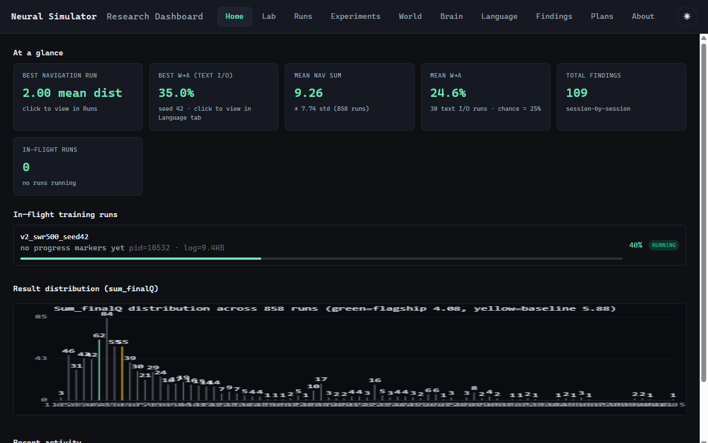

KPI cards across the top show the best navigation run, best W→A
text-I/O accuracy, mean nav sum, mean W→A, total findings, and
in-flight run count. Each card is click-through to the relevant tab.
The in-flight panel below shows live progress for any detached runs.

### Brain (live monitor + 3D viz placeholder)

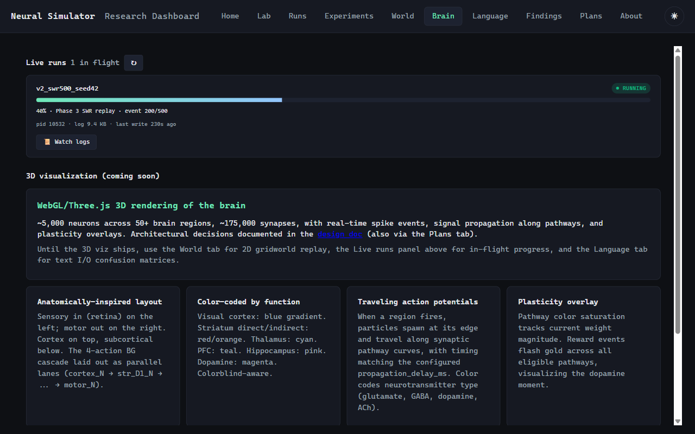

The Brain tab is the "watch the simulator working" surface. The Live
runs panel polls `/api/inflight` every 2 seconds; each card shows
state badge, progress bar, current phase, and per-kind detail
(episode N/M for embodied training, event N/M for SWR replay, step
N/M for navigation). Below the live monitor, the planned features for
the upcoming Three.js 3D rendering are documented in card grid.

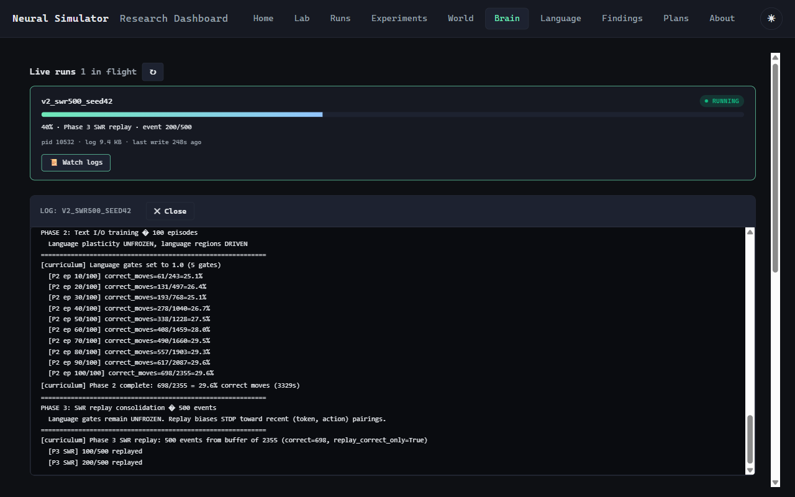

Clicking **Watch logs** on a run card slides open a log pane that
fetches the last 32 KB of the run's `.log` file via
`/api/runs/launch/log/{name}`. Useful for watching curriculum phase
transitions and SWR replay progress in real time.

### Language (text I/O results)

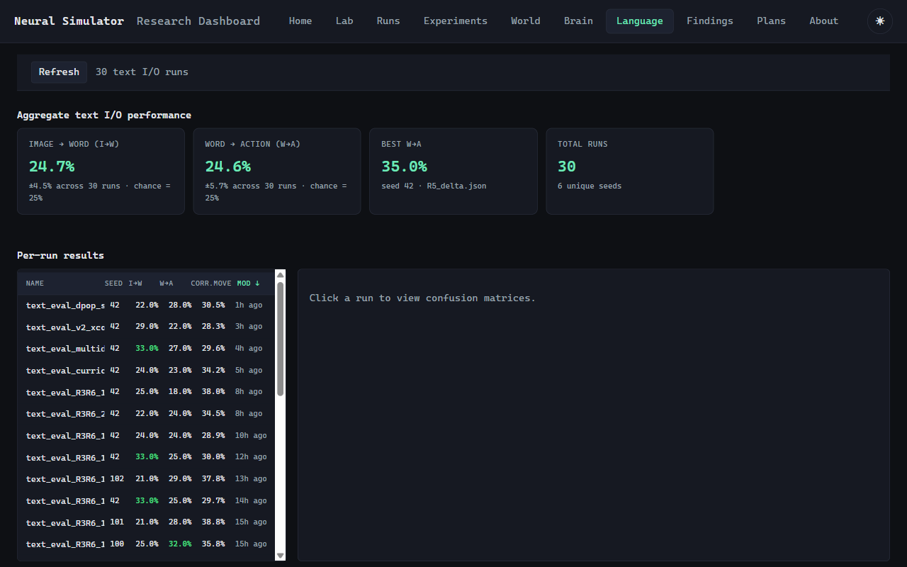

Aggregate I→W and W→A KPIs across all `text_eval_*.json` runs, with
chance baseline (25%) and best-run highlights. Per-run table is
sortable on every column; above-chance values (>30%) are highlighted
green.

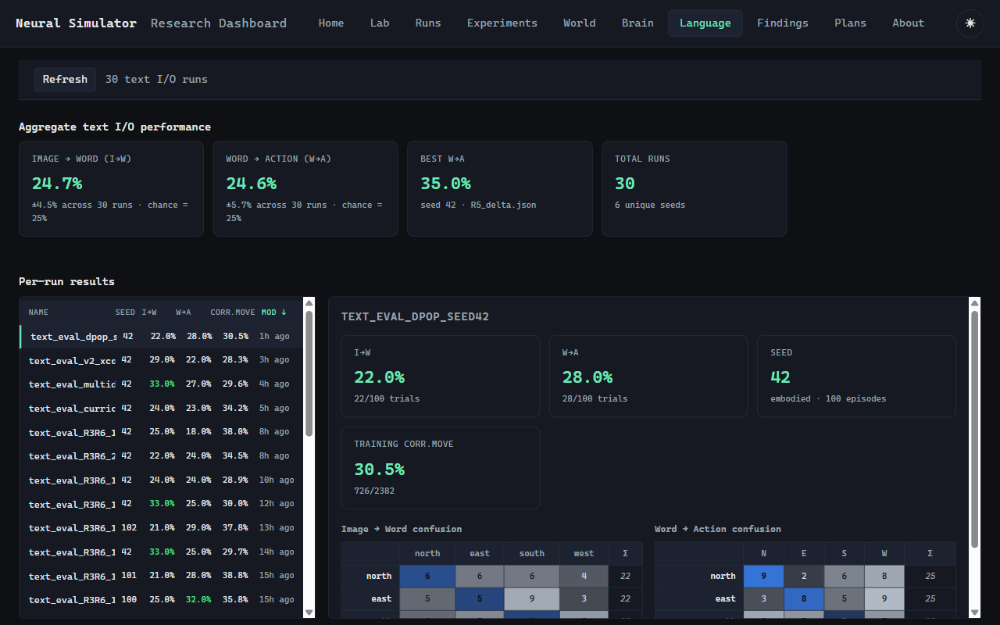

Clicking a row reveals the run's I→W and W→A confusion matrices side
by side, with intensity-scaled blue cells (diagonal bolded). Headline
KPIs and training-phase corr-move rate appear above.

### Plans

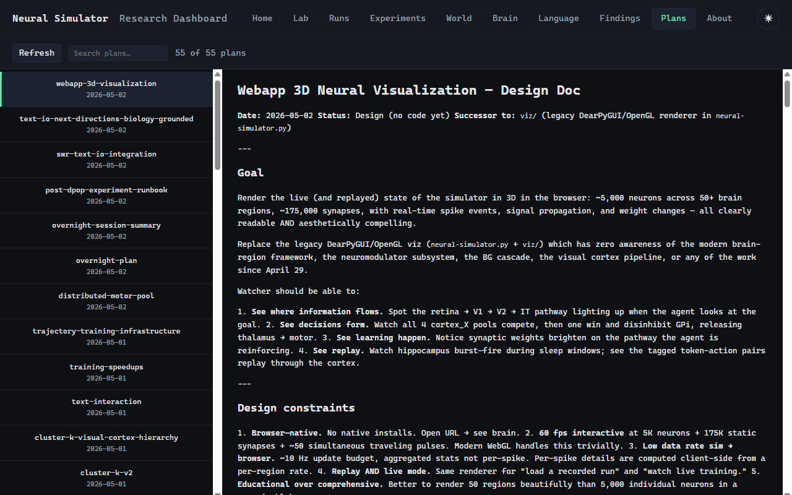

Browses all 55+ architecture decision records and design docs in
`docs/plans/`. Search box, click-through markdown rendering. Same
shape as the Findings tab but for forward-looking plans rather than
backward-looking experimental results.

### Findings (chronological with chip filtering)

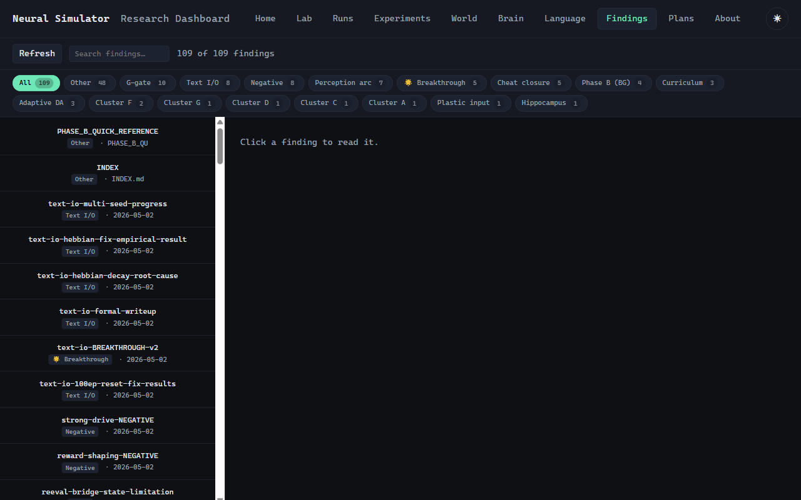

109+ research findings are auto-categorized into 18 chips
(Cluster A/B/.../K, Text I/O, Perception arc, Cheat closure,
Breakthrough, Negative, etc.). Click a chip to filter; combined with
the search box. Each row shows its primary tag pill + date prefix.

### About

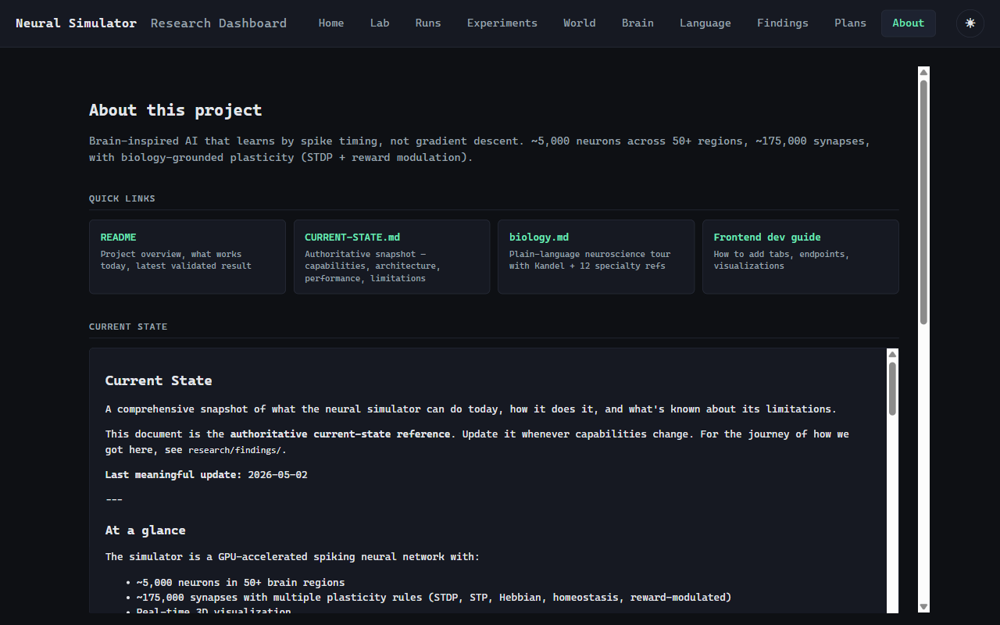

Quick-link cards to README, CURRENT-STATE.md, biology.md, and the
frontend dev guide. Below them, the full CURRENT-STATE.md content is
auto-loaded as rendered markdown — anyone visiting can see exactly
what the simulator does today without digging through `docs/`.

### Lab (launcher)

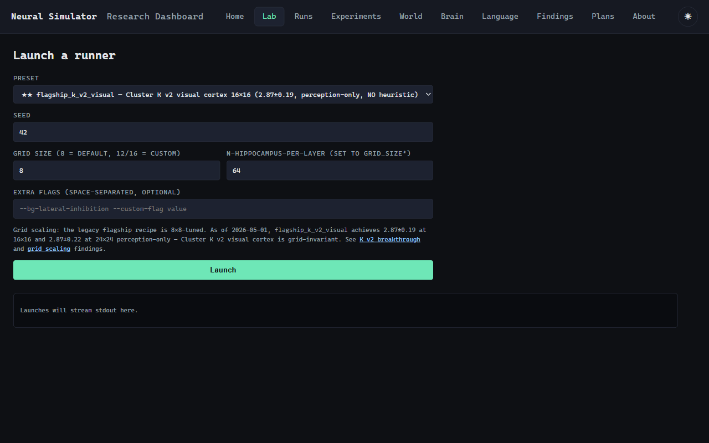

Preset selector now grouped by experiment type (Navigation /
Text I/O). Seed input, grid-size override, hippocampus-per-layer,
extra flags. Below the form, launch stdout streams via the WebSocket
endpoint.

### Runs

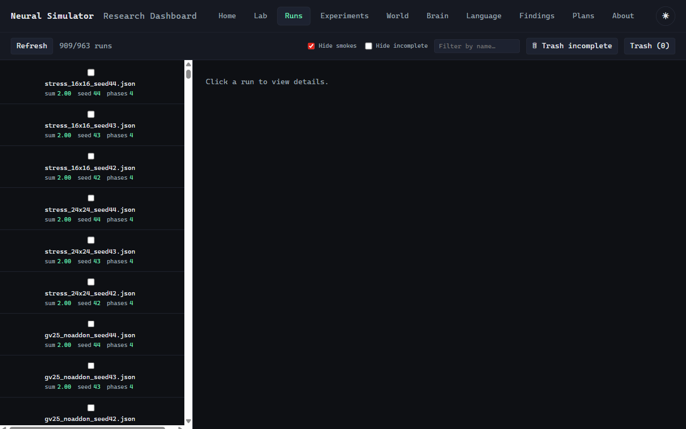

Generic list of all completed runs (combination of navigation
gridworld and text I/O). Hide-smoke / hide-incomplete toggles, name
filter, bulk select for compare, trash drawer. The text I/O runs are
also surfaced cleanly via the Language tab.

### World (2D gridworld replay)

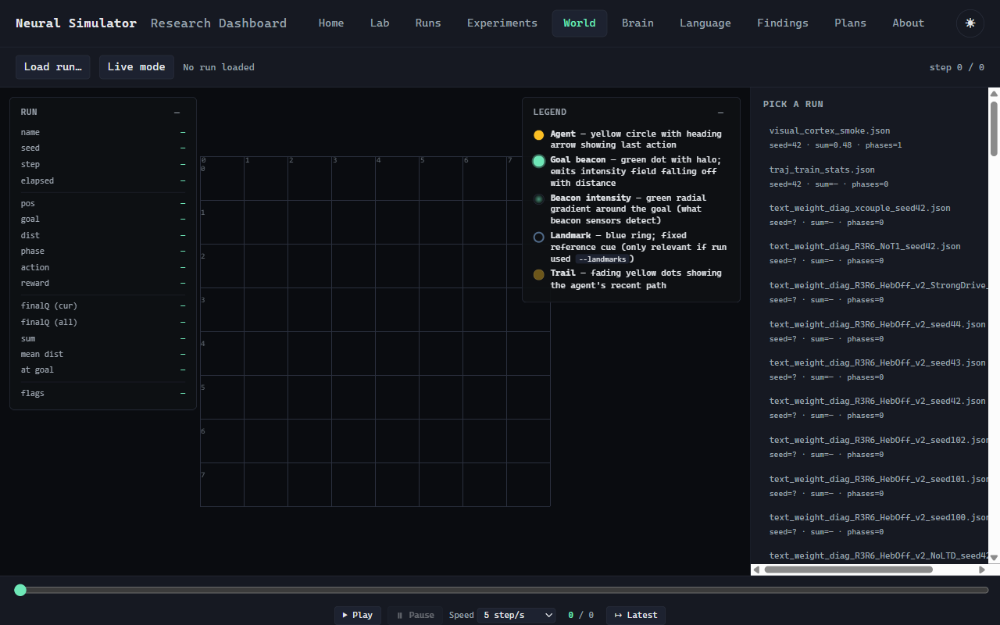

Replay mode for navigation runs: load a run, scrub through steps,
watch the agent move. Live mode connects to a currently-running
detached run and animates per-step. Click anywhere in the grid (with
an interactive_* preset) to teleport the goal.

### Light theme

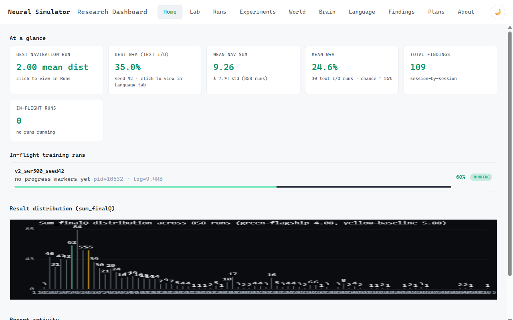

The theme toggle button (sun/moon icon, header right edge) cycles
between dark and light themes. Choice persisted to `localStorage`.
`prefers-color-scheme` is honored before any JS runs to avoid the
dark-flash problem.

### Mobile (≤768px viewport)

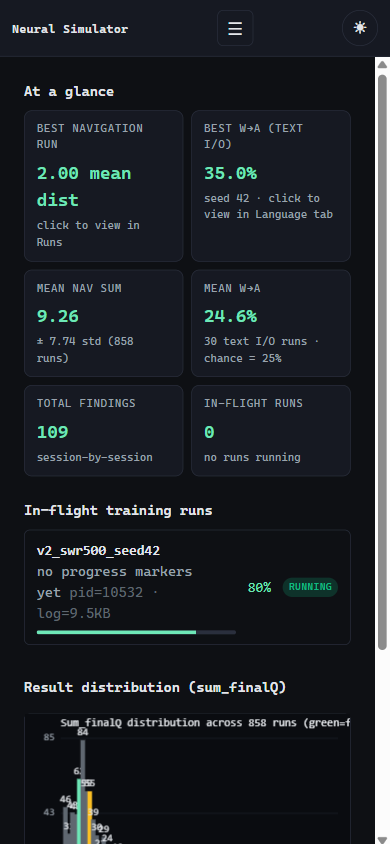

KPI grid collapses to 2 columns. Header collapses (subtitle hidden).
Splits stack vertically. Toolbars wrap.

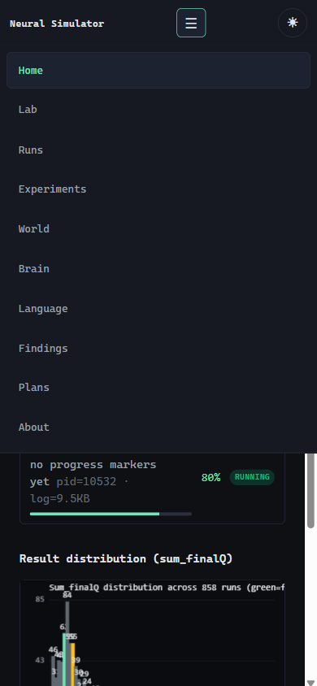

The hamburger button reveals all tabs as a vertical drawer. Tapping
a tab auto-collapses the menu. Same nav as desktop, just a different
layout.

---

## TL;DR

The frontend is a vanilla-JS dashboard at `webapp/static/`. To add a
new feature you typically touch three things:

1. **Tab registration** — append to `TAB_REGISTRY` in
   `webapp/static/app.js`.
2. **HTML section** — add `<section id="tab-{id}" class="tab">` in
   `webapp/static/index.html`.
3. **Backend endpoint(s)** — add `@app.get(...)` routes to
   `webapp/server.py` if you need new data.

For client-side rendering primitives, reuse the existing helpers:
`el()`, `kpiCard()`, `makeKpiCard()`, `renderConfusionMatrix()`,
`renderMarkdown()`. They handle DOM creation, escaping, and layout.

---

## Stack

- **No build step.** ES modules served directly from `webapp/static/`.
- **Backend:** FastAPI (`webapp/server.py`).
- **State persistence:** `localStorage` via `loadState()` / `saveState()`
  helpers in `ui.js`.
- **Theme:** CSS variables on `:root`, switched via
  `document.documentElement.dataset.theme`.
- **No external JS deps** beyond Three.js (planned for the Brain tab).
  Charts use plain Canvas2D; no D3.

---

## File layout

```
webapp/
├── server.py                    # FastAPI app, all endpoints
├── static/
│   ├── index.html               # tab structure
│   ├── app.js                   # main logic, tab registry, all loaders
│   ├── world.js                 # 2D gridworld replay/live (1869 lines)
│   ├── charts.js                # Canvas2D line/bar charts + palette
│   ├── ui.js                    # loadState, saveState, toast, fmtRelTime
│   └── style.css                # all styling, CSS-variable theming
└── runtime/                     # process control files (PID, control, log)
```

---

## Tab registry

The `TAB_REGISTRY` array at the top of `app.js` is the single source of
truth for tab metadata:

```javascript
const TAB_REGISTRY = [
  { id: "overview",    label: "Home",     order: 10, onActivate: () => { if (!window._overviewLoaded) loadOverview(); } },
  { id: "launcher",    label: "Lab",      order: 20, onActivate: null },
  // ...
];
```

Each entry:

- `id` — must match BOTH the `<section id="tab-{id}">` in HTML AND the
  `<button data-tab="{id}">` in the nav.
- `label` — displayed in the nav button.
- `order` — sort order for documentation purposes (HTML order is what
  actually controls render — keep them in sync).
- `onActivate` — called every time the tab is clicked. Use the
  `if (!window._XXXLoaded) loadXXX();` pattern to fetch only on first
  activation.

### Adding a new tab in 4 steps

1. **Append to `TAB_REGISTRY`** in `app.js`:

   ```javascript
   { id: "neural-3d", label: "Brain (Live)", order: 65,
     onActivate: () => { if (!window._neural3dLoaded) loadNeural3D(); } },
   ```

2. **Add the HTML section** in `index.html`:

   ```html
   <section id="tab-neural-3d" class="tab">
     <div class="toolbar">…</div>
     <div id="neural-3d-canvas-host">…</div>
   </section>
   ```

3. **Add the nav button** in `index.html` (next to the existing ones):

   ```html
   <button data-tab="neural-3d">Brain (Live)</button>
   ```

4. **Implement `loadNeural3D()`** somewhere in `app.js` (or in its own
   ES module imported at the top of `app.js`).

That's it. No reload, no router, no framework. The tab dispatcher in
`setupTabs()` reads `data-tab` and looks up `TAB_BY_ID[id].onActivate`.

---

## Backend endpoint conventions

All endpoints live in `webapp/server.py`. Conventions:

- Path prefix: `/api/{resource}` for collections, `/api/{resource}/{id}`
  for items.
- All responses are JSON via `JSONResponse(...)`.
- Path-traversal guard on any name-based route: reject `/`, `\`, `..`.
- File scans use `RAW_RUNS_DIR.glob(...)` and skip `.cmd.json` (sidecars).
- Errors via `HTTPException(status, msg)`.

Example: see `/api/text_io_runs` (added 2026-05-02) for a clean
collection endpoint that filters by filename pattern, parses each JSON,
and returns a flat array + cross-run aggregate.

### Live data: WebSockets

For live training stream data, use the WebSocket pattern at
`/ws/runs/{run_id}` (see `_drain_log` in `server.py`). The pattern:

1. Subprocess writes stdout to a per-run log file.
2. Background `asyncio.create_task(_drain_log(run))` tails the file.
3. WebSocket upgrades from a client `EventSource`-like endpoint.
4. Each new line is broadcast to all connected clients.

For the planned 3D Brain visualization we'll add `/ws/sim_stream` that
subscribes to the bridge's `data_bus` channels (see `sim/data_bus.py`)
and forwards `region_rates` / `pathway_pulses` / etc. at 10 Hz.

---

## Styling and theming

### CSS variables

All colors come from CSS variables defined in `:root` (dark default)
and `[data-theme="light"]` (light theme). Never hardcode colors in
component CSS — use `var(--bg)`, `var(--accent)`, etc.

```css
.my-component {
  background: var(--bg-2);
  color: var(--fg);
  border: 1px solid var(--border);
}
```

If you need a new variable, add it to BOTH `:root` and the light theme
block. Keep the contrast ratio above 4.5:1 on both.

### Component reuse

Common patterns are already implemented:

| Helper | Where | Purpose |
|---|---|---|
| `el(tag, attrs, children)` | app.js | Create DOM elements safely (no innerHTML) |
| `escapeHTML(s)` | app.js | Always escape user/server text before insertion |
| `kpiCard(label, value, sub, cls, onClick)` | app.js | KPI grid card |
| `makeKpiCard(title, value, sub)` | app.js | Newer KPI card variant (kpi-grid) |
| `renderConfusionMatrix(title, m, rowL, colL)` | app.js | NxN matrix with color scale |
| `renderMarkdown(src)` | app.js | Tiny markdown renderer (escapes first) |
| `toast(msg, opts)` | ui.js | Temporary notification |
| `loadState() / saveState({key: val})` | ui.js | localStorage wrapper |

### Mobile

Three breakpoints:

- `>=900px` (desktop) — full horizontal nav, side-by-side splits
- `768–899px` (tablet) — nav becomes scrollable, splits stay
- `<768px` (mobile) — hamburger menu, splits stack vertically

Test mobile layouts with browser devtools' device emulation. Specific
breakpoints in `style.css` near the bottom.

---

## Data flow patterns

### Pull-based (Phase 1 dashboard)

The standard pattern for any tab that reads from JSON files on disk:

```javascript
async function loadMyTab() {
  window._myTabLoaded = true;
  const list = $("#my-tab-list");
  list.replaceChildren(document.createTextNode("Loading…"));
  try {
    const res = await fetch("/api/my_resource");
    if (!res.ok) throw new Error(`${res.status}`);
    const data = await res.json();
    renderMyTab(data);
  } catch (e) {
    list.replaceChildren(el("p", { class: "error" }, e.message));
  }
}
```

Always set the `_loaded` flag first to avoid double-fetches when the
tab is re-clicked.

### Push-based (live mode)

For tabs showing in-flight runs, set up a polling interval in the
tab's onActivate hook:

```javascript
function setupMyLivePoll() {
  if (window._myLivePollInterval) return; // already polling
  refreshMyPanel();  // immediate first call
  window._myLivePollInterval = setInterval(refreshMyPanel, 5000);
}
```

For a true push stream (like the 3D viz), use WebSockets — see the
`/ws/runs/{run_id}` pattern in `setupLauncher()`.

---

## Patterns to avoid

- **Don't use `innerHTML` with user/server content.** Always `el()` or
  `textContent`. The one place we do use innerHTML (renderMarkdown)
  escapes first.
- **Don't hardcode colors.** Use CSS variables. Hardcoded colors won't
  work with the theme toggle.
- **Don't add a JS framework dependency without strong justification.**
  The vanilla-JS approach has been deliberately maintained for a
  one-developer project — adding React/Vue/Svelte would mean a build
  step and learning curve.
- **Don't put all logic in one giant file forever.** When `app.js`
  exceeds ~2K lines, split a tab's logic into its own ES module like
  `world.js` already is. Import at the top of `app.js`.
- **Don't bypass `setupTabs()`'s onActivate dispatch.** Adding tab-
  specific logic inline in `setupTabs()` makes the function grow
  unbounded. Use the registry.

---

## Examples (real diffs)

### Adding the Language tab (2026-05-02)

The Language tab took ~250 lines of JS + ~80 lines of CSS:

1. Backend endpoint `/api/text_io_runs` in `server.py` (~80 lines)
   — filters JSON files by filename pattern, parses, returns flat
   array + cross-run aggregate.
2. `<section id="tab-language">` in `index.html` (~20 lines).
3. `loadLanguage()` + `renderLanguageList()` + `loadLanguageDetail()`
   + `renderConfusionMatrix()` in `app.js` (~250 lines).
4. CSS for `.lang-row`, `.confusion-matrix`, `.confusion-cell`,
   `.lang-cell.above-chance` in `style.css` (~80 lines).
5. Registry entry: one line in `TAB_REGISTRY`.

### Adding theme toggle (2026-05-02)

Theme toggle is ~30 lines of JS + ~50 lines of CSS:

1. `[data-theme="light"]` block in `style.css` overrides every CSS var.
2. `setupThemeToggle()` in `app.js` reads localStorage, applies to
   `document.documentElement.dataset.theme`, updates icon.
3. `<button id="theme-toggle">` in HTML header.

---

## Future work / extensibility hooks

The current architecture supports adding:

- **More tabs:** trivial via `TAB_REGISTRY`.
- **More backend endpoints:** standard FastAPI patterns.
- **Three.js 3D viz:** see `docs/plans/2026-05-02-webapp-3d-visualization-design.md`.
- **Plugin-style external feature modules:** every tab's loader is a
  free function — could be loaded dynamically via `import()` if we ever
  ship community plugins.
- **Multi-user:** would need session/auth wrapping all endpoints. Out
  of scope today.
- **Auto-update notifications:** WebSocket from server pushing "new
  run completed" events. Would integrate with the existing toast
  system.

When in doubt, look at how `loadLanguage()` is wired — it's the most
recent end-to-end example of adding a tab from scratch.
